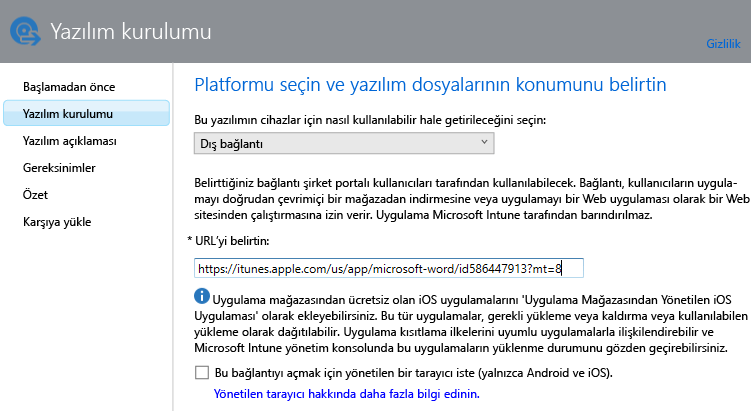
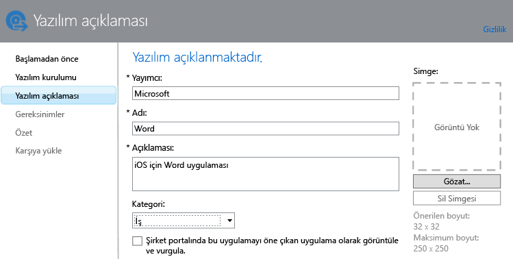

# Kaydolmuş cihazlar için Intune’a uygulamalar ekleme

Bir uygulamayı dağıtabilmeniz veya yönetebilmeniz için, onu önce Microsoft Intune’a eklemeniz gerekir. Bu konuda, kayıtlı cihazlar için nasıl uygulama ekleyeceğiniz gösterilir.

> [!IMPORTANT]
> Bu konu başlığı altında verilen bilgiler, kayıtlı cihazlara ve kayıtlı Windows bilgisayarlarına dağıtmak istediğiniz uygulamaları eklemenize yardımcı olur. Uygulamaları, Intune istemci yazılımını kullanarak yönettiğiniz Windows bilgisayarlarına eklemek istiyorsanız, bkz. [Microsoft Intune’da Windows bilgisayarları için uygulama ekleme](add-apps-for-windows-pcs-in-microsoft-intune.md).

## Uygulama ekleme
Aşağıdaki yordamı izleyerek uygulamanın özelliklerini yapılandırmak ve uygulamayı bulut depolama alanınıza yüklemek için (uygunsa) Intune Yazılım Yayımcısı’nı kullanacaksınız.

1.  Intune yazılım yayımcısını başlatmak için [Microsoft Intune yönetim konsolu](https://manage.microsoft.com)’nda **Uygulamalar** &gt; **Uygulama Ekle**‘yi seçin.

    > [!TIP]
    > Yayımcının başlatılması için önce Intune kullanıcı adınızı ve parolanızı girmeniz gerekebilir.

2.  Yazılım yayımcısının **Yazılım kurulumu** sayfasında, **Bu yazılımın cihazlar için kullanılabilir duruma nasıl getirileceğini seçin** alanında aşağıdaki seçeneklerden birini belirtin:
    - **Yazılım yükleyicisi**; uzantısı **.msi** veya **.exe** olan uygulamalar için aşağıdakileri belirtin:
        - **Yazılım yükleyicisi dosya türünü seçin** - Bu, dağıtmak istediğiniz yazılımın türünü gösterir. Örneğin bir iOS uygulamasını yüklemek istiyorsanız, **iOS için Uygulama Paketi (&#42;.ipa dosyası)** öğesini seçin.
        - **Yazılım kurulum dosyalarının konumunu belirtin** - Yükleme dosyalarının konumu girin veya konumu bir listeden seçmek için **Gözat**’ı seçin.
        - **Aynı klasörden başka dosya veya alt klasör ekle** - Yalnızca **Windows Installer** dosya türü için. Windows Installer’ı kullanan bazı yazılımlar için, normalde yükleme dosyalarıyla aynı klasörde yer alan destek dosyaları gerekir. Bu dosyaları dağıtmak istiyorsanız bu seçeneği belirtin. Bu yükleme türünde, bulut depolama alanınızın bir bölümü kullanılır.

  -   **Dış bağlantı**; uygulama mağazasının bağlantısını belirterek oluşturmak istediğiniz uygulamalar için aşağıdakileri belirtin:

        - **URL belirt** - Aşağıdakilerden birinin URL’sini belirtin:
            - Dağıtmak istediğiniz uygulamanın uygulama mağazası URL’si. Örneğin, Android için Microsoft Uzak Masaüstü uygulamasını dağıtmak istiyorsanız **https://play.google.com/store/apps/details?id=com.microsoft.rdc.android** belirtin. Uygulamanın URL’sini bulmak için, bir arama motoru kullanarak uygulamayı içeren mağaza sayfasını bulun. Örneğin, Uzak Masaüstü uygulamasını bulmak için **Microsoft Uzak Masaüstü Android** araması yapabilirsiniz.
            - Bir web sitesi. Intune, cihaza sitenin bir kısayol simgesini (web klibi olarak bilinir) dağıtır.
            - Web üzerinde bir uygulama. Intune, cihaza uygulamanın bir kısayol simgesini dağıtır.
        - **Bu bağlantının açılması için Managed Browser uygulamasını zorunlu kıl (yalnızca Android ve iOS)** - Kullanıcılara bir web sitesi veya web uygulamasının bağlantısını dağıttığınızda bunu yalnızca cihazlarında yüklü olması gereken Intune yönetilen tarayıcısında açabilirler. Yönetilen tarayıcı hakkında daha fazla bilgi için bkz. [Microsoft Intune'la yönetilen tarayıcı ilkelerini kullanarak İnternet erişimini yönetme](manage-internet-access-using-managed-browser-policies.md). Bu yükleme türünde, bulut depolama alanınızın hiçbir bölümü kullanılmaz.

  -   **Uygulama mağazasından yönetilen iOS uygulaması**; iTunes mağazasından ücretsiz sağlanan ve MAM ilkeleriyle yönetmek istediğiniz uygulamalar için aşağıdakileri belirtin:

        - **URL belirt** - Dağıtmak istediğiniz uygulamanın uygulama mağazası URL’sini girin. Örneğin, iOS için Microsoft Çalışma Klasörleri uygulamasını dağıtmak istiyorsanız **https://itunes.apple.com/us/app/work-folders/id950878067?mt=8** belirtin. Bu yükleme türünde, bulut depolama alanınızın hiçbir bölümü kullanılmaz.

        Örneğin, cihazlara iTunes mağazasından Microsoft Word uygulamasını dağıtmak istiyorsanız, sayfa şuna benzer görünür:
        
        

3.  **Yazılım açıklaması** sayfasında aşağıdakileri yapılandırın:

    > [!TIP]
    > Kullanmakta olduğunuz yükleyici türüne bağlı olarak, bu değerlerden bazıları otomatik olarak girilmiş olabilir.

    - **Yayımcı** - Uygulamanın yayımcısının adını girin.
    - **Ad** - Uygulamanın şirket portalında görüntülenecek olan adını girin. Kullandığınız tüm uygulama adlarının benzersiz olmasına dikkat edin. Aynı uygulama adı iki kez kullanılmışsa, uygulamalardan yalnızca biri şirket portalında kullanıcılara görüntülenir.
    - **Açıklama** - Uygulama için bir açıklama girin. Bu, şirket portalında kullanıcılara görüntülenir.
    - **Yazılım bilgileri URL’si** - Yalnızca **Yazılım yükleyicisi**’ni seçtiğinizde kullanılabilir. İsteğe bağlı olarak, bu uygulama hakkında bilgi içeren bir web sitesinin URL’sini girin. URL, şirket portalında kullanıcılara görüntülenir.
    - **Gizlilik URL’si** - Yalnızca **Yazılım yükleyicisi**’ni seçtiğinizde kullanılabilir. İsteğe bağlı olarak, bu uygulamayla ilgili gizlilik bilgilerini içeren bir web sitesinin URL’sini girin. URL, şirket portalında kullanıcılara görüntülenir.
    - **Kategori** - (isteğe bağlı) Yerleşik uygulama kategorilerinden birini seçin. Bu, kullanıcıların şirket portalına göz atarken uygulamaları daha kolay bulabilmesini sağlar.
    - **Bunu özel bir uygulama olarak görüntüle ve şirket portalında vurgula** - Kullanıcılar uygulamalara göz attığında bu uygulamayı şirket portalının ana sayfasında göze çarpacak şekilde görüntüleyin.
    - **Simge** - (isteğe bağlı) Uygulamayla ilişkilendirilecek bir simgeyi karşıya yükleyin. Bu, kullanıcılar şirket portalına göz atarken uygulamayla birlikte görüntülenecek olan simgedir.

        Bu örnekte, iOS için Microsoft Word uygulamasının açıklamasını yapılandırdınız:

        

4.  **Gereksinimler** sayfasında uygulamanın cihaza yüklenmesini başlatabilmek için karşılanması gereken gereksinimleri belirtin. Örneğin iOS için bir uygulama paketinde, gereken en düşük iOS sürümünü, bunun çalıştırıldığı cihaz türünü (iPhone veya iPad gibi) seçebilirsiniz.

    > [!TIP]
    > **Gereksinimler** sayfası tüm uygulama türleri için görüntülenmez.

5.  **Windows Installer** dosya türünü seçtiğinizde başka sihirbaz sayfaları da görüntülenir. Windows 10 veya sonrasını çalıştıran ve Intune’a kayıtlı bilgisayarlara yazılım dağıttığınızda bu dosya türü kullanılır.

6.  **Özet** sayfasında, belirttiğiniz bilgileri gözden geçirin. Hazır olduğunuzda **Karşıya Yükle**’yi seçin.

7.  Bitirmek için **Kapat**’a tıklayın.

Uygulama, **Uygulamalar** çalışma alanının **Uygulamalar** düğümünde görüntülenir.

## Örnekler

### Windows 10 cihazlarına MSI uygulamalarını dağıtma
Bu dört dakikalık videoda, Windows 10 çalıştıran kayıtlı cihazlara Microsoft Installer (msi) uygulamalarının nasıl dağıtıldığını öğreneceksiniz.  

<iframe src="https://channel9.msdn.com/Series/How-to-Control-the-Uncontrolled/6--How-to-Deploy-MSI-Applications-to-Windows-10-Using-Intune-and-Mobile-Device-Management-MDM/player" width="640" height="360" allowFullScreen frameBorder="0"></iframe>

## Sonraki adımlar

Uygulamayı oluşturmayı tamamladığınızda, bir sonraki adım dağıtmaktır. Daha fazla bilgi bulmak için bkz. [Microsoft Intune’da uygulamaları dağıtma](deploy-apps.md).

<!--HONumber=Jul16_HO2-->

