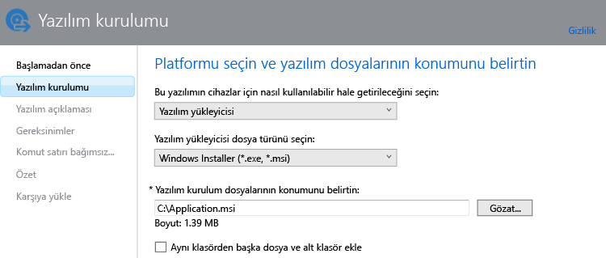

# Microsoft Intune’da Windows bilgisayarları için uygulamaları ekleme

Uygulamaları dağıtmadan önce Intune’a eklemeyi öğrenmek için bu konu başlığı altında verilen bilgileri kullanın.

> [!IMPORTANT]
> Bu konu başlığı altında sağlanan bilgiler, Intel bilgisayar istemci yazılımını kullanarak yönettiğiniz Windows bilgisayarları için uygulamaları eklemenize yardımcı olur. Kayıtlı Windows bilgisayarları ve diğer mobil cihazlar için uygulama eklemek istiyorsanız, bkz. [Microsoft Intune’da mobil cihazlar için uygulama ekleme](add-apps-for-mobile-devices-in-microsoft-intune.md).

## Uygulama ekleme
Aşağıdaki yordamı izleyerek uygulamanın özelliklerini yapılandırmak ve uygulamayı bulut depolama alanınıza yüklemek için Intune Yazılım Yayımcısı’nı kullanacaksınız.

1.  Intune yazılım yayımcısını başlatmak için [Microsoft Intune yönetim konsolu](https://manage.microsoft.com)’nda **Uygulamalar** &gt; **Uygulama Ekle**‘yi seçin.

    > [!TIP]
    > Yayımcının başlatılması için önce Intune kullanıcı adınızı ve parolanızı girmeniz gerekebilir.

2.  Yazılım yayımcısının **Yazılım kurulumu** sayfasında aşağıdakileri yapılandırın:

    **Bu yazılımın cihazlar için nasıl kullanılabilir hale getirileceğini seçin** - **Yazılım yükleyicisi**'ni seçin, sonra da aşağıdakileri belirtin:

    - **Yazılım yükleyicisi dosya türünü seçin** - Bu, dağıtmak istediğiniz yazılımın türünü gösterir. Windows bilgisayarları için, **Windows Installer**’ı seçin.
    - **Yazılım kurulum dosyalarının konumunu belirtin** - Yükleme dosyalarının konumu girin veya konumu bir listeden seçmek için **Gözat**’ı seçin.
    - **Aynı klasörden başka dosya ve alt klasör ekle** - Windows Installer’ı kullanan bazı yazılımlar için, normalde yükleme dosyalarıyla aynı klasörde yer alan destek dosyaları gerekir. Bu destek dosyalarını dağıtmak istiyorsanız bu seçeneği belirtin.

    Örneğin, Application.msi adlı bir uygulamayı Intune’a yayımlamak isterseniz, sayfa şöyle görünebilir: 

   Bu yükleme türünde, bulut depolama alanınızın bir bölümü kullanılır.

3.  **Yazılım açıklaması** sayfasında aşağıdakileri yapılandırın:

    Kullanmakta olduğunuz yükleyici dosyasına bağlı olarak, bu değerlerden bazıları otomatik olarak girilmiş olabilir veya gösterilmeyebilir.

    - **Yayımcı** - Uygulamanın yayımcısının adını girin.
    - **Ad** - Uygulamanın şirket portalında görüntülenecek olan adını girin.  Kullandığınız tüm uygulama adlarının benzersiz olmasına dikkat edin. Aynı uygulama adı iki kez kullanılmışsa, uygulamalardan yalnızca biri şirket portalında kullanıcılara görüntülenir.
    - **Açıklama** - Uygulama için bir açıklama girin. Bu, şirket portalında kullanıcılara görüntülenir.
    - **Yazılım bilgileri URL’si** - (isteğe bağlı) Bu uygulama hakkında bilgi içeren bir web sitesinin URL’sini girin. URL, şirket portalında kullanıcılara görüntülenir.
    - **Gizlilik URL’si**- (isteğe bağlı) Bu uygulamayla ilgili gizlilik bilgilerini içeren bir web sitesinin URL’sini girin. URL, şirket portalında kullanıcılara görüntülenir.
    - **Kategori** - (isteğe bağlı) Yerleşik uygulama kategorilerinden birini seçin. Bu, kullanıcıların şirket portalına göz atarken uygulamaları daha kolay bulabilmesini sağlar.
    - **Simge** - (isteğe bağlı) Uygulamayla ilişkilendirilecek bir simgeyi karşıya yükleyin. Bu, kullanıcılar şirket portalına göz atarken uygulamayla birlikte görüntülenecek olan simgedir.

4.  **Gereksinimler** sayfasında, uygulamanın cihaza yüklenmesini başlatmak için önce karşılanması gereken gereksinimleri belirtin: **Mimari** arasından seçim yapın - Bu uygulamanın 32 bit, 64 bit veya her iki işletim sistemine de yüklenebileceğini seçin, **İşletim Sistemi** - Bu uygulamanın yüklenebileceği en düşük işletim sistemini seçin.

5.  **Algılama kuralları** sayfasında, yapılandırmakta olduğunuz uygulamanın zaten bir bilgisayara yüklü olup olmadığını algılamak için kurallar yapılandırabilir veya otomatik olarak uygulamanın daha önce yüklenmiş sürümlerinin üzerine yazmak için varsayılan algılama kurallarını kullanabilirsiniz. Bu seçenek Windows Installer içindir (yalnızca .exe dosyaları).
6.  
    Yapılandırabileceğiniz kurallar:
    - **Dosya var** - Algılanmasını istediğiniz dosyanın yolunu belirtin. Bilgisayarda **%ProgramFiles%** altında arayabileceğiniz gibi (**Program Files**\*&lt;yol&gt;* ve **Program Files (x86)**\*&lt;yol&gt;* altında arar), **%SystemDrive%** altında da arayabilirsiniz (bilgisayarın kök sürücüsünde, yani normal olarak C: altında arar)
    - **MSI ürün kodu mevcut** - Algılanmasını istediğiniz Windows Installer (msi) dosyasını seçmek için **Gözat**’ı seçin. 
    - **Kayıt defteri anahtarı mevcut** - **HKEY_LOCAL_MACHINE\** ile başlayan bir kayıt defteri anahtarı belirtin. Hem 32 bit hem de 64 bit kayıt defteri yollarında arama yapılır. Belirttiğiniz anahtar iki konumdan birinde varsa, algılama kuralına uyulmuş olur.

    Uygulama yapılandırdığınız kurallardan herhangi birine uyuyorsa, yüklenmez.

7.  Yalnızca **Windows Installer** dosya türü için (msi ve exe): **Komut satırı bağımsız değişkenleri** sayfasında, yükleyici için isteğe bağlı komut satırı bağımsız değişkenleri eklemek isteyip istemediğinizi seçin. Örneğin, bazı yükleyiciler kullanıcı etkileşimine gerek kalmadan sessiz yükleme yapmak için **/q** bağımsız değişkenini destekleyebilir.

8.  Yalnızca **Windows Installer** dosya türü için (yalnızca exe): **Dönüş kodları** sayfasında, uygulama yönetilen bir Windows bilgisayarına yüklenirken Intune tarafından yorumlanacak yeni hata kodları ekleyebilirsiniz.
    Varsayılan olarak, Intune bir uygulama paketi yüklemesinin başarılı veya başarısız olduğunu raporlamak için sektör standardı dönüş kodlarını kullanır: **0** - Başarılı veya **3010** - Yeniden başlatma ile başarılı. Listeye kendi dönüş kodlarınızı da ekleyebilirsiniz. Dönüş kodları listesini belirtirseniz ve uygulama yüklemesi listede olmayan bir kod döndürürse, bu kod hata olarak yorumlanır.

9.  **Özet** sayfasında, belirttiğiniz bilgileri gözden geçirin. Hazır olduğunuzda **Karşıya Yükle**’yi seçin.

10. Bitirmek için **Kapat**’a tıklayın.

Uygulama, **Uygulamalar** çalışma alanının **Uygulamalar** düğümünde görüntülenir.

## Sonraki adımlar

Uygulamayı oluşturmayı tamamladığınızda, bir sonraki adım dağıtmaktır. Daha fazla bilgi bulmak için bkz. [Microsoft Intune’da uygulamaları dağıtma](deploy-apps.md).

<!--HONumber=Jun16_HO4-->

