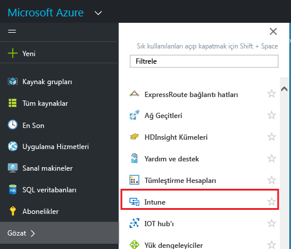

---
# required metadata

title: MAM ilkeleri için Azure portalı | Microsoft Intune
description:
keywords:
author: karthikaraman
manager: jeffgilb
ms.date: 04/28/2016
ms.topic: article
ms.prod:
ms.service: microsoft-intune
ms.technology:
ms.assetid: 7d6dae94-a833-40b7-9016-14ea234bb33c

# optional metadata

#ROBOTS:
#audience:
#ms.devlang:
ms.reviewer: joglocke
ms.suite: ems
#ms.tgt_pltfrm:
#ms.custom:

---

# Microsoft Intune MAM ilkeleri için Azure portalı
## Azure portalına erişim
**Azure portalı**, mobil uygulama yönetimi ilkeleri oluşturmanıza ve bunları yönetmenize olanak tanır.

Azure portalı, aşağıdakiler için MAM ilkeleri oluşturmayı destekler:
- **Intune’a kaydedilmiş ve Intune tarafından yönetilen** cihazlarda çalıştırılan uygulamalar.
- Herhangi bir MDM çözümüne **kaydedilmemiş** cihazlarda çalıştırılan uygulamalar.
- **Üçüncü taraf bir MDM çözümüne kaydedilmiş** cihazlarda çalıştırılan uygulamalar.

Şu anda, cihazlarınızı yönetmek için **Intune yönetici konsolunu** kullanıyorsanız, [Intune yönetici konsolu](configure-and-deploy-mobile-application-management-policies-in-the-microsoft-intune-console.md) kullanılarak Intune’a kaydedilen cihazlar için uygulamaları destekleyen bir MAM ilkesi oluşturabilirsiniz.
>[!IMPORTANT]
> Intune yönetici konsolunda tüm MAM ilkesi ayarlarını göremeyebilirsiniz. Azure portalı, MAM ilkeleri oluşturmak için yeni yönetim konsoludur. Hem Intune yönetim konsolunda hem de Azure portalında MAM ilkeleri oluşturursanız, uygulamalara Azure portalındaki ilke uygulanır ve kullanıcılara bu ilke dağıtılır.

## Azure portalında oturum açma ve başlangıç sayfanızı özelleştirme

1.  [Azure portalı](https://portal.azure.com)’na gidin ve [!INCLUDE[wit_nextref](../includes/wit_nextref_md.md)] kimlik bilgilerinizle oturum açın.

    

2.  Oturumunuz başarıyla açıldıktan sonra **Pano**’yu görürsünüz. **Pano** sayfası, sayfayı özelleştirmek için kaldırabileceğiniz ve yenilerini ekleyebileceğiniz bir dizi varsayılan kutucukla birlikte gelir.

    

3.  **Gözat** menüsünde **Intune**’u bulun.

4.  **Intune > Intune mobil uygulama yönetimi > Ayarlar**‘a tıklayın.

    

    > [!TIP]
    >  **Başlat** sayfasına bir dikey pencere sabitlemek için dikey penceredeki **sabitle** seçeneğini kullanabilirsiniz.   **Intune mobil uygulama yönetimi dikey penceresi**üzerindeki sabitleme simgesine tıklayarak dikey pencereyi **Başlat** sayfasına sabitleyin.

    

    
## Sonraki adımlar
[Mobil uygulama yönetimi ilkelerini yapılandırmak için hazırlanma](get-ready-to-configure-mobile-app-management-policies-with-microsoft-intune.md)

<!--HONumber=Jun16_HO2-->

