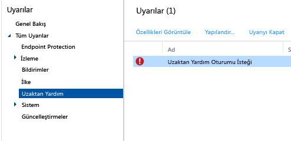

# Microsoft Intune bilgisayar istemcisi ile genel Windows bilgisayarı yönetim görevleri
Intune istemcisi çalıştıran bilgisayarlarınızı nasıl yöneteceğinizi öğrenmek için bu konu başlığı altındaki görevleri gözden geçirin. İstemciyi bilgisayarlarınıza henüz yüklemediyseniz, bkz. [Microsoft Intune ile Windows bilgisayarı istemcisini yükleme](install-the-windows-pc-client-with-microsoft-intune.md).

## PC yönetimi basitleştirmek için ilkeleri kullanma
### Windows Güvenlik Duvarı'nı yönetme
İlkeler, yönetilen bilgisayarlarda Windows Güvenlik Duvarı ayarlarını yönetmeyi kolay hale getirir. Ayrıntılar için bkz. [Microsoft Intune’da Windows Güvenlik Duvarı ilkelerini kullanarak Windows bilgisayarlarının korunmasına yardımcı olma](help-protect-windows-pcs-using-windows-firewall-policies-in-microsoft-intune.md).

### Microsoft Intune Center’ı yönetme
Microsoft Intune Center kullanıcıların şunları yapmasını sağlar:

-   Şirket portalı üzerinden uygulamaları alma.

-   Güncelleştirmeleri denetleme.

-   Microsoft Intune Endpoint Protection’ı yönetme

<!--- -   Request remote assistance.--->

Microsoft Intune Center, tüm yönetilen bilgisayarlarda yüklüdür. Intune ilkesinde aşağıdaki ayarları yapılandırabilirsiniz ve bunlar Microsoft Intune Center’da kullanıcılara gösterilir:

|İlke ayarı|Ayrıntılar|
|------------------|--------------------|
|**Ad**|Bilgisayarı yöneten yöneticinin adı.  En fazla uzunluk: 40 karakter|
|**Telefon numarası**|Bilgisayarı yöneten yöneticinin telefon numarası.  En fazla uzunluk: 20 karakter|
|**E-posta adresi**|Bilgisayarı yöneten yöneticinin e-posta adresi.  En fazla uzunluk: 40 karakter|
|**Web sitesinin adı**|Kullanıcılar için destek web sitenizin adı.  En fazla uzunluk: 40 karakter|
|**Web sitesi URL'si**|Destek web sitenizin URL'si.  En fazla uzunluk: 150 karakter|
|**Notlar**|Kullanıcılara gösterilen bir not.  En fazla uzunluk: 120 karakter|

### Yazılım güncelleştirmeleri ayarlarını yönetme
Yönetilen bilgisayarların Microsoft ve üçüncü taraflardan yazılım güncelleştirmelerini denetlemek ve indirmek için kullandığı ayarları yapılandırmak için ilkeleri kullanın. Daha fazla bilgi için bkz. [Microsoft Intune'da yazılım güncelleştirmeleri ile Windows bilgisayarlarını güncel tutun](keep-windows-pcs-up-to-date-with-software-updates-in-microsoft-intune.md).

### Endpoint Protection ayarlarını yönetme
Endpoint Protection ayarlarını yapılandırmak için ilkeleri kullanın ve bunları yönetilen bilgisayarlara dağıtın. Bu tarama zamanlama, kötü amaçlı yazılım algıladığında yapılacak işlemler ve daha fazlasını içerir. Daha fazla bilgi için bkz. [Microsoft Intune için Endpoint Protection ile Windows bilgisayarların korunmasına yardımcı olma](help-secure-windows-pcs-with-endpoint-protection-for-microsoft-intune.md).

## Donanım ve yazılım envanterini görüntüleme
Intune yönetilen bilgisayarların donanım ve yazılımı hakkında ayrıntılı bilgiler toplar. Şunları oluşturmak için aşağıdaki yordamlardaki bilgileri kullanın:

-   Bilgisayarlarınızın donanım özellikleri hakkında bilgileri listeleyen bir rapor.

-   Her bir bilgisayarda yüklü olan yazılımı listeleyen bir rapor.

-   Rapordaki verilerin güncel olduğundan emin olmak için bilgisayar envanterini yenileme.

### Bilgisayarlarınız hakkındaki bilgileri görüntülemek için

1.  [Microsoft Intune yönetim konsolunda](https://manage.microsoft.com/) **Raporlar** &gt; **Bilgisayar Envanteri Raporları**’nı seçin.

2.   **Yeni Rapor Oluştur** sayfasında, varsayılan değerleri kabul edin veya raporun döndüreceği sonuçlara filtre uygulamak için değerleri özelleştirin. Örneğin, raporda yalnızca Windows 8.1 çalıştıran bilgisayarların görüntülenmesini seçebilirsiniz.

3.  **Bilgisayar Envanteri Raporu**'nu yeni bir pencerede açmak için **Raporu Görüntüle**'yi seçin.

    Her sütunun başlığını seçerek raporu **Ad**, **Kasa Türü** veya **Üretici** gibi sütunlara göre sıralayabilirsiniz.

### Bilgisayarlarda yüklü yazılımı görüntülemek için

1.  [Microsoft Intune yönetim konsolunda](https://manage.microsoft.com/) **Raporlar** &gt; **Algılanan Yazılım Raporları**’nı seçin.

2.   **Yeni Rapor Oluştur** sayfasında, varsayılan değerleri kabul edin veya raporun döndüreceği sonuçlara filtre uygulamak için değerleri özelleştirin. Örneğin, raporda yalnızca Microsoft tarafından yayınlanan yazılımı görüntülemeyi seçebilirsiniz.

3.  **Algılanan Yazılım Raporu**'nu yeni bir pencerede açmak için **Raporu Görüntüle**'yi seçin.

    Her sütunun başlığını seçerek raporu **Ad**, **Yayımcı** veya **Kategori** gibi sütunlara göre sıralayabilirsiniz. Liste öğesinin yanındaki yön okunu seçerek daha fazla ayrıntı (örneğin yüklü olduğu bilgisayarlar) göstermek için listedeki güncelleştirmeleri genişletebilirsiniz.

### Bilgisayar envanterinin güncel olduğundan emin olmak üzere yenilemek için

1.  [Microsoft Intune yönetim konsolunda](https://manage.microsoft.com/) **Gruplar** &gt; **Tüm Cihazlar**’ı (veya envanterini yenilemek istediğiniz bilgisayarı içeren başka bir grubu) seçin.

2.  Bir bilgisayar seçin veya **Ctrl** tuşunu basılı tutarak birden çok bilgisayarı seçin.

3.  Görev çubuğunda **Uzak Görevler** &gt; **Envanteri Yenile**’yi seçin.

4.  Görev durumunu görüntülemek için, sayfanın sağ alt köşesinde **Uzak Görevler**'i seçin.

     **Görev Durumu** iletişim kutusu geçerli uzak görevler, görev durumu, cihaz adı ve bildirilen hataları gösterir ve sorun giderme bilgilerine bir bağlantı sağlar.

## Windows bilgisayarını uzaktan yeniden başlatma

1.  [Microsoft Intune yönetim konsolunda](https://manage.microsoft.com/) **Gruplar** &gt; **Tüm Cihazlar**’ı (veya yeniden başlatmak istediğiniz bilgisayarı içeren başka bir grubu) seçin.

2.  Bir veya birden çok bilgisayar seçin ve ardından **Uzak Görevler** &gt; **Bilgisayarı Yeniden Başlat**’ı seçin.

3.  Görev durumunu görüntülemek için, sayfanın sağ alt köşesinde **Uzak Görevler**'i seçin.

4.   **Görev Durumu** iletişim kutusunda, geçerli uzak görevler, görev durumu, cihaz adı ve bildirilen hataları gözden geçirin.

## Bilgisayarı devre dışı bırakma

1.  [Microsoft Intune yönetim konsolunda](https://manage.microsoft.com/) **Gruplar** &gt; **Tüm Cihazlar**’ı (veya devre dışı bırakmak istediğiniz bilgisayarı içeren başka bir grubu) seçin.

2.  Devre dışı bırakmak istediğiniz cihazları seçin ve ardından **Devre Dışı Bırak/Temizle**'yi seçin.

Bir bilgisayarı Intune’a yeniden kaydetmek için, [Microsoft Intune ile Windows bilgisayarı istemcisini yükleme](install-the-windows-pc-client-with-microsoft-intune.md) konusundaki bilgileri kullanarak istemci yazılımı bilgisayara yeniden yükleyin.

Bilgisayar Intune’a bağlanamıyorsa, **Pano** çalışma alanında bir ileti görüntülenir.

Bir bilgisayarı kullanımdan çıkardığınızda:

-   Intune envanterinden kaldırılır ve bilgisayarla ilişkili lisans yeniden kullanılabilir hale gelir.

-   Intune bilgisayarın durumunu artık görüntülemez.

-   Intune istemci yazılımı bilgisayardan kaldırır. Bilgisayar Intune hizmetine bağlı değilse, istemci yazılımı bir sonraki bağlanışında kaldırılır.

-   Microsoft Intune Endpoint Protection bilgisayardan kaldırılır. Bilgisayarda başka bir uç nokta uygulaması yüklüyse ve devre dışı bırakıldıysa, bilgisayarlarınızın korunduğundan emin olmak için Microsoft Intune Endpoint Protection kaldırıldıktan sonra bu uygulama yeniden etkinleştirilebilir.

-   Bilgisayardaki tüm ilkeler kaldırılır ve ilke tarafından ayarlanan değerler değiştirilir.

-   Bilgisayar artık Intune hizmetinden yazılım güncelleştirmeleri veya kötü amaçlı yazılım tanımı güncelleştirmeleri almaz.

-   Yapılandırmaya bağlı olarak, kullanımdan çıkarılan bilgisayarlar Windows Server Update Services, Windows Update veya Microsoft Update'i kullanarak güncelleştirmeleri almaya devam edebilir.

    > [!IMPORTANT]
    > İstemci yazılımı bir Grup İlkesi Nesnesi (GPO) kullanılarak yüklendiyse, yazılımın yeniden yüklenmesini önlemek için istemci yazılımı kaldırmadan önce Grup İlkesi Nesnesi'ni (GPO) kaldırmanız gerekir.

    İstemciyi kaldırma işlemi başarısız olursa daha fazla yardım için [Endpoint Protection’da sorun giderme](/intune/troubleshoot/troubleshoot-endpoint-protection-in-microsoft-intune) konusunu okuyun.

## Kullanıcı-cihaz bağlantısını yönetme
Bir kullanıcı için yazılım dağıtmadan önce kullanıcıyı bir bilgisayara bağlamanız gerekir. Bir kullanıcıyı birden çok bilgisayara bağlayabilirsiniz, ancak her bilgisayara yalnızca bir kullanıcı bağlanabilir. Kullanıcılar şirket portalını kullanarak Intune kaydını yaptıkları bilgisayarlara otomatik olarak bağlanır.

### Bir kullanıcıyı bir bilgisayara bağlamak için

1.  [Microsoft Intune yönetim konsolunda](https://manage.microsoft.com/) **Gruplar** &gt; **Tüm Cihazlar**’ı (veya bir kullanıcıya bağlamak istediğiniz bilgisayarı içeren başka bir grubu) seçin.

2.  Kullanıcıya bağlamak istediğiniz bilgisayarı seçin ve ardından **Kullanıcı Bağla**'yı seçin.

     **Kullanıcı Bağla** iletişim kutusu mevcut kullanıcıların görünen adı, kullanıcı kimliği ve her kullanıcının bağlı olduğu bilgisayar sayısını içeren bir liste görüntüler. Bir kullanıcı seçili bilgisayara zaten bağlıysa, kullanıcının adı ve kullanıcı kimliği **Geçerli kullanıcı**altında gösterilir. Bilgisayar hiçbir kullanıcıya bağlanmamışsa, **Geçerli Kullanıcı** altında **Kullanıcı Yok**görüntülenir.

3.  Aşağıdakilerden birini yapın:

    -   Bilgisayarın bağlı olduğu bir kullanıcı varsa, bilgisayarı bu kullanıcıya bağlı olarak bırakmak için **İptal**'i seçin.

    -   Geçerli kullanıcının (varsa) bağlantısını kaldırmak için **Bağlantıyı Kaldır** &gt; **Tamam**'ı seçin.

    -   Bilgisayarı yeni bir kullanıcıya bağlamak için, **Tüm kullanıcılar** listesinde bir kullanıcı seçin. Kullanıcı verilerinin doğru olduğundan emin olun ve ardından **Tamam**'ı seçin.

> [!TIP]
> Son kullanıcıların bilgisayarlara bağlanma yeteneğini kısıtlamak istiyorsanız, **Microsoft Intune Aracı Ayarları** ilkesinde **Kullanıcıların bilgisayarlara bağlanma yeteneğini kısıtla** seçeneğini etkinleştirin.

<!--- ## Request and provide remote assistance to Windows PCs that use the Intune client software

> [!IMPORTANT]
> You might not see the options to configure TeamViewer integration for remote assistance in the Intune admin console. This capability is not currently available to all customers, but will be rolling our more widely soon.
     

Microsoft Intune can use the [TeamViewer](https://www.teamviewer.com) software to let users of PCs that run the Intune client software get remote assistance help from you. When a user requests help from the Microsoft Intune Center, you are informed by an alert, can accept the request, and then provide assistance.
This functionality replaces the existing Windows Remote Assistance functionality in Intune.

### Before you start

Before you can begin to establish and respond to remote assistance requests, you must ensure the following prerequisites are in place:

- You must have [signed up for a TeamViewer account](https://login.teamviewer.com/LogOn#register) to log into the TeamViewer website.
- Windows PCs that you want to administer must be [managed by the Windows PC client](manage-windows-pcs-with-microsoft-intune.md)
- All Windows PC operating systems supported by Intune can be administered.

### Configure the TeamViewer Connector

1. In the [Microsoft Intune administration console](https://manage.microsoft.com), choose **Admin**.
2. In the **Admin** workspace, choose **TeamViewer**.
3. On the **TeamViewer** page, under **TeamViewer Connector**, choose **Enable**.
4. In the **Enable TeamViewer** dialog box, view, then **Accept** the license terms. If you don't already own a TeamViewer license, choose **Purchase a TeamViewer license**.
5. After the TeamViewer browser window opens, sign into the site with your TeamViewer credentials.
6. On the TeamViewer site, read, then accept the options to allow Intune to connect with TeamViewer.
7. In the Intune console, verify that the **TeamViewer Connector** item shows as **Enabled**.

### Open a remote assistance request (end user)

1. On a client Windows PC, open the **Microsoft Intune Center**.
2. Under **Remote Assistance**, choose **Request Remote Assistance**.
3. After you approve the request (see below), TeamViewer opens on the client. The user must accept any messages indicating that the web browser is trying to open the TeamViewer application.
4. The user sees a message asking if you can control their PC. They must accept this message to continue.
5. During the remote assistance session, the user sees a window that shows them you are connected. If they close this window, the remote session ends.

### Respond to a remote assistance request

1. When a user submits a remote assistance request, you can view it in the **Alerts** workspace, under **Monitoring** > **Remote Assistance**. For example:
> 

 If a request goes unanswered for more than 4 hours, it is removed.
2. To accept the request, choose **Approve request and launch Remote Assistance**.
3. In the **A New Remote Assistance Request is Pending** dialog box, choose **Accept the remote assistance request**. If it's not already installed, TeamViewer will install any necessary apps on your computer.
4. TeamViewer then notifies the end user that you want to take control of their PC. After the user has accepted the request, the TeamViewer windows opens, and you can control the PC. 
 
While in a remote assistance session, you can use all available TeamViewer commands to control the remote PC. For help with these commands, download the [Manual for remote control](http://www.teamviewer.com/en/support/documents/) from the TeamViewer website.

### Close the remote assistance session

From the **Actions** menu of the **TeamViewer** window, choose **End Session**.--->

<!--HONumber=Jun16_HO4-->

