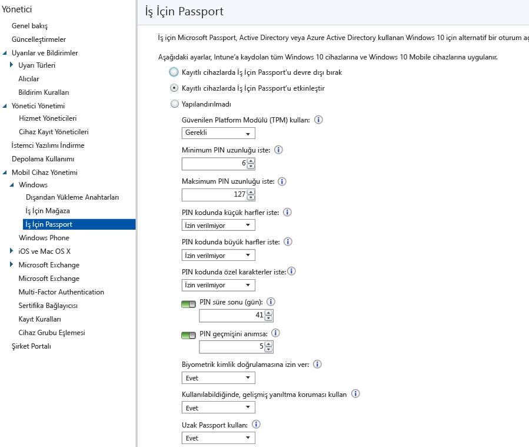

# Microsoft Intune ile cihazlarda İş İçin Windows Hello ayarlarını denetleme
Microsoft Intune bir parolayı, akıllı kartı ya da sanal akıllı kartı değiştirmek için Active Directory veya bir Azure Active Directory hesabını kullanıldığı alternatif bir oturum açma yöntemi olan İş İçin Windows Hello (eskiden İş için Microsoft Passport) ile tümleşir.

İş İçin Hello, oturum açmak için parola yerine bir *kullanıcı hareketi* kullanmanıza izin verir. Kullanıcı hareketi basit bir PIN, Windows Hello gibi bir biyometrik kimlik doğrulaması ya da parmak izi okuyucu gibi harici bir cihaz olabilir.

Intune, İş İçin Hello ile iki şekilde tümleşir:

-   Kullanıcıların oturum açarken hangi hareketleri kullanabileceğini ve kullanamayacağını denetlemek için bir Intune ilkesi kullanabilirsiniz.

-   İş İçin Windows Hello anahtar depolama sağlayıcısında (KSP) kimlik doğrulama sertifikaları depolayabilirsiniz. Daha fazla bilgi için bkz. [Microsoft Intune’da sertifika profilleriyle güvenli kaynak erişimi](secure-resource-access-with-certificate-profiles.md).

> [!IMPORTANT]
> Yıldönümü Güncelleştirmesi’nden önceki Windows 10 masaüstü ve mobil sürümlerinde, kaynaklarda kimlik doğrulama için kullanılabilen iki farklı PIN ayarlayabilirsiniz:
- **Cihaz PIN’i** cihazın kilidini açmak ve bulut kaynaklarına bağlanmak için kullanılabilir.
- **İş PIN’i** kullanıcının kişisel cihazlarından (KCG) Azure AD kaynaklarına erişmek için kullanılır.

>Yıldönümü Güncelleştirmesi’nde bu iki PIN, tek bir cihaz PIN’inde birleştirilmiştir.
Cihaz PIN’ini denetlemek için ayarladığınız Intune yapılandırma ilkelerinin yanı sıra, yapılandırmış olduğunuz İş İçin Windows Hello ilkeleri de bu yeni PIN değerine ayarlanmıştır.
PIN’i denetlemek için iki ilke türünü de ayarladıysanız, İş İçin Windows Hello ilkesi hem Windows 10 masaüstü cihazlarına hem de Windows 10 mobil cihazlara uygulanır.
İlke çakışmalarının çözümlendiğinden ve PIN ilkesinin düzgün şekilde uygulandığından emin olmak için, İş İçin Windows Hello İlkenizi yapılandırma ilkenizdeki ayarlarla eşleşecek şekilde güncelleştirin ve kullanıcılarınızdan cihazlarını Şifket Portalı uygulamasında eşitlemelerini isteyin.

## İş İçin Windows Hello ilkesi oluşturma

1.  [Microsoft Intune yönetim konsolunda](https://manage.microsoft.com), İş İçin Windows Hello sayfasını açmak için **Yönetim** &gt; **Mobil Cihaz Yönetimi** &gt; **Windows** &gt; **İş İçin Windows Hello for Business**’ı seçin.

    

2.  Aşağıdaki ayarlardan birini seçin:
    - **Kayıtlı cihazlarda İş İçin Windows Hello’yu devre dışı bırak**. İş İçin Windows Hello’yu kullanmak istemiyorsanız, bu ayarı seçin. Bu durumda, ekrandaki tüm diğer ayarlar kullanılamaz hale gelir.
    - **Kayıtlı cihazlarda İş İçin Windows Hello’yu etkinleştir**. İş İçin Windows Hello ayarlarını yapılandırmak istiyorsanız bu ayarı seçin.
    - **Yapılandırılmadı**. Intune’un İş İçin Windows Hello ayarlarını denetlemesini istemiyorsanız bu ayarı seçin. Windows 10 cihazlarında bulunan İş İçin Windows Hello ayarları değiştirilmez. Ekrandaki diğer hiçbir ayarlar kullanılamaz.
3.  **Kayıtlı cihazlarda İş İçin Windows Hello’yu etkinleştir**’i seçtiyseniz, kayıtlı tüm Windows 10 ve Windows 10 Mobile cihazlarına uygulanacak olan gerekli ayarları yapılandırın.
4.  İşiniz bittiğinde **Kaydet**’i seçin.

## İş İçin Windows Hello ilkesi ayarları

- **Güvenilen Platform Modülü (TPM) kullan**. TPM yongası ek bir veri güvenliği katmanı sağlar. Aşağıdaki değerlerden birini seçin:
    - **Gerekli** (varsayılan). Yalnızca erişilebilir bir TPM’si olan cihazlar İş İçin Windows Hello sağlayabilir.
    - **Tercih edilen**. Cihazlar ilk olarak bir TPM kullanmayı dener. Bu seçenek mevcut değilse yazılım şifreleme kullanabilirler.
- **Minimum PIN uzunluğunu gerekli kıl**/**Maksimum PIN uzunluğunu gerekli kıl**. Cihazları, güvenli oturum açma için sizin belirttiğiniz minimum ve maksimum PIN uzunluklarını kullanacak şekilde yapılandırır. Varsayılan PIN uzunluğu 6 karakterdir, ancak minimum 4 karakterlik bir uzunluğu zorunlu tutabilirsiniz. Maksimum PIN uzunluğu 127 karakterdir.
- **PIN’de küçük harf kullanımını gerekli kıl**/**PIN’de büyük harf kullanımını gerekli kıl**/**PIN’de özel karakter kullanımını gerekli kıl**. PIN’de büyük harf, küçük harf ve özel karakter kullanımını gerekli kılarak daha güçlü PIN zorunluluğu getirebilirsiniz. Aşağıdakilerden birini seçin:
    - **İzin Verildi**. Kullanıcılar PIN kodlarında karakter türü kullanabilir ancak bu zorunlu değildir.
    - **Gerekli**. Kullanıcılar PIN kodlarında karakter türlerinden en az birini bulundurmalıdır. Örneğin, en az bir büyük harfin ve bir özel karakterin zorunlu kılınması yaygın bir uygulamadır.
    - **İzin verilmiyor** (varsayılan). Kullanıcılar PIN’de bu karakter türlerini kullanmamalıdır. (Ayar yapılandırılmamışsa gerçekleşen davranış da budur.) Özel karakterler şunlardır: **! " # $ % &amp; ' ( ) &#42; + , - . / : ; &lt; = &gt; ? @ [ \ ] ^ _ &#96; { &#124; } ~**.
- **PIN süre sonu (gün)**. Son kullanıcıların belirli bir süre sonunda PIN’i değiştirmesini zorunlu tutmak için bir PIN kullanım süresi belirtmek iyi bir uygulamadır. Varsayılan değer 41 gündür.
- **PIN geçmişini anımsa**. Daha önce kullanılan PIN'lerin yeniden kullanılmasını kısıtlar. Varsayılan olarak, son 5 PIN yeniden kullanılamaz.
- **Biyometrik kimlik doğrulamasına izin ver**. İş İçin Windows Hello için bir PIN koduna alternatif olarak yüz tanıma veya parmak izi gibi biyometrik kimlik doğrulamasını etkinleştirir. Biyometrik kimlik doğrulaması başarısız olsa bile kullanıcılar bir iş PIN kodu yapılandırmalıdır. Aşağıdakilerden birini seçin:
    - **Evet**. İş İçin Windows Hello biyometrik kimlik doğrulamasına izin verir.
    - **Hayır**. İş İçin Windows Hello, (tüm hesap türleri için) biyometrik kimlik doğrulamasını engeller.
- **Varsa, gelişmiş kimlik sahtekarlığına karşı koruma kullan**. Windows Hello’nun yanıltmaya karşı koruma özelliklerinin bunu destekleyen cihazlarda kullanılıp kullanılmayacağını yapılandırır (örneğin, gerçek yüz yerine yüzün fotoğrafı olduğunu algılama). Bu **Evet** olarak ayarlanırsa Windows, desteklenen durumlarda yüz özellikleri için tüm kullanıcıların yanıltma koruması kullanmasını gerektirir.
- **Telefonla oturum açma kullanın**. Bu seçenek **Evet** olarak ayarlanırsa, kullanıcılar masaüstü bilgisayar kimlik doğrulaması için bir taşınabilir özel cihaz olarak hizmet verecek bir uzak passport kullanabilir. Masaüstü bilgisayarının Azure Active Directory’ye katılmış ve eşlik eden cihazın bir İş İçin Windows Hello PIN’i ile yapılandırılmış olması gerekir.

## Daha fazla bilgi
Microsoft Passport hakkında daha fazla bilgi için, Windows 10 belgelerinde [kılavuza](https://technet.microsoft.com/library/mt589441.aspx) bakın.

<!--HONumber=Sep16_HO3-->

