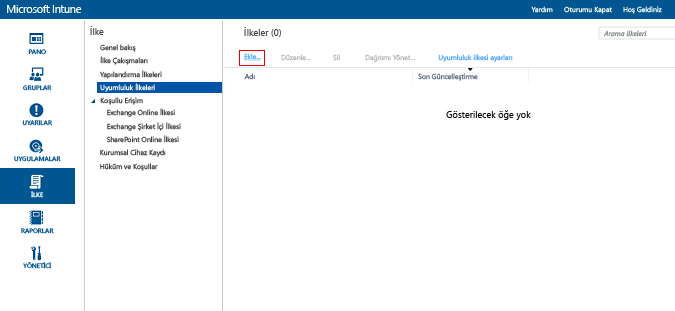

# Microsoft Intune’da cihaz uyumluluk ilkesi oluşturma
Bu konu başlığı altında, bir cihazın uyumlu olarak kabul edilmek için uyması gereken bir uyumluluk ilkesi oluştururken kullanabileceğiniz adımlar açıklanır.

##  1. Adım: Yeni bir ilke ekleme
  [Microsoft Intune yönetim konsolu](https://manage.microsoft.com)’nda, **İlke** &gt; **Uyumluluk İlkeleri** &gt; **Ekle**’yi seçin.

  

##  2. Adım: Ayarlarını yapılandırma
**İlke Oluştur** sayfasında gereken ayarları etkinleştirin:
  -   Parola ve şifreleme gibi Sistem güvenlik ayarları
  -   Cihazın yazılım kilidinin kırılmış olup olmadığı veya Windows cihaz durumu kanıtlama hizmeti tarafından sağlıklı olarak raporlanıp raporlanmadığı gibi cihaz durumu ayarları.
  -   Gerekli en düşük işletim sistemi sürümü veya izin verilen en yüksek işletim sistemi sürümü gibi cihaz özelliği ayarları.

##  3. Adım: İlkeyi kaydetme
İşiniz bittiğinde **İlkeyi Kaydet**'e tıklayın.

İlkeyi kaydettikten hemen sonra dağıtma seçeneği sağlanır veya daha sonra dağıtmayı seçebilirsiniz. Yeni ilke, **İlke** çalışma alanının **Uyumluluk İlkeleri** düğümünde görüntülenir.

## Desteklenen ilke ayarları
Aşağıdaki tabloda uyumluluk ilkesi ayarları ve bunların desteklendiği platformlar listelenir.

-------------
|Ayar|iOS|Android|Windows|
|-----|----|-----|-----|
|Mobil cihazların kilidini açmak için bir parola gerektir|iOS 6 ve üzeri|Android 4.0 ve üzeri  Samsung KNOX Standard 4.0 ve üzeri|Windows Phone 8 ve üzeri|
|Basit parolalara izin ver|iOS 6 ve üzeri|Desteklenmez|Windows Phone 8 ve üzeri|
|Minimum parola uzunluğu|iOS 6 ve üzeri| Android 4.0 ve üzeri Samsung KNOX Standard 4.0 ve üzeri| Windows Phone 8 ve üzeri Windows 8.1|
|Gerekli parola türü|iOS 6 ve üzeri|Yok|Windows Phone 8 ve üzeri  Windows RT  Windows RT 8.1  Windows 8.1|
|Minimum karakter kümesi sayısı|iOS 6 ve üzeri|Yok|Windows Phone 8 ve üzeri  Windows RT  Windows RT 8.1  Windows 8.1|
|Parola kalitesi|Yok|Android 4.0 ve üzeri  Samsung KNOX Standard 4.0 ve üzeri|Yok|
|Parola gerekmeden önce etkin olmama süresi (dakika)|iOS 6 ve üzeri|Android 4.0 ve üzeri Samsung KNOX Standard 4.0 ve üzeri|Windows Phone 8 ve üzeri Windows RT ve Windows RT 8.1 Windows 8.1|
|Parola geçerlilik süresi (gün)|iOS 6 ve üzeri|Android 4.0 ve üzeri Samsung KNOX Standard 4.0 ve üzeri|Windows Phone 8 ve üzeri Windows RT ve Windows RT 8.1 Windows 8.1|
|Parola geçmişini anımsa|iOS 6 ve üzeri|Android 4.0 ve üzeri Samsung KNOX Standard 4.0 ve üzeri|Windows Phone 8 ve üzeri Windows RT ve Windows RT 8.1 Windows 8.1|
|Önceki parolaların yeniden kullanılmasını engelleme|iOS 6 ve üzeri|Android 4.0 ve üzeri Samsung KNOX Standard 4.0 ve üzeri|Windows Phone 8 ve üzeri Windows RT ve Windows RT 8.1 Windows 8.1|
|Cihaz boş bir durumdan döndürüldüğünde parola iste| Yok| Yok|Windows 10 Mobile|
|Cihazda şifrelemeyi gerektir|Uygulanamaz|Android 4.0 ve üzeri Samsung KNOX Standard 4.0 ve üzeri|Windows Phone 8 ve üzeri  Windows 8.1|
|Cihazların sağlıklı olarak bildirilmesini gerektirme| Yok| Yok|Windows  Windows 10 Mobile|
|Cihazın Güvenliğinin kırılmamış olması veya yolda kök belirtilmemesi gerekir|iOS 6 ve üzeri|Android 4.0 ve üzeri Samsung KNOX Standard 4.0 ve üzeri|Yok|
|E-posta hesabı, Intune tarafından yönetilmelidir|iOS 6 ve üzeri|Yok| Yok|
|Intune tarafından yönetilmesi gereken e-posta profilini seçme|iOS 6 ve üzeri|Yok| Yok|
|Gereken en düşük işletim sistemi|iOS 6 ve üzeri|Android 4.0 ve üzeri Samsung KNOX Standard 4.0 ve üzeri| Windows Phone 8 ve üzeri Windows 8.1|
|İzin verilen en yüksek işletim sistemi sürümü|iOS 6 ve üzeri|Android 4.0 ve üzeri Samsung KNOX Standard 4.0 ve üzeri|Windows Phone 8 ve üzeri Windows 8.1|

Her platformda desteklenen uyumluluk ayarları hakkında daha fazla bilgi edinmek için aşağıdakilerden birini seçin:
> [!div class="op_single_selector"]
- [iOS cihazları için uyumluluk ilkesi ayarları](ios-compliance-policy-settings-in-microsoft-intune.md)
- [Android cihazları için uyumluluk ilkesi ayarları](android-compliance-policy-settings-in-microsoft-intune.md)
- [Windows ve Windows Phone’lar için uyumluluk ilkesi ayarları ](windows-compliance-policy-settings-in-microsoft-intune.md)

## Sonraki adımlar
[Uyumluluk ilkesini dağıtma ve izleme](deploy-and-monitor-a-device-compliance-policy-in-microsoft-intune.md)

### Ayrıca bkz.
[Cihaz uyumluluk ilkelerine giriş](introduction-to-device-compliance-policies-in-microsoft-intune.md)

<!--HONumber=Jun16_HO4-->

