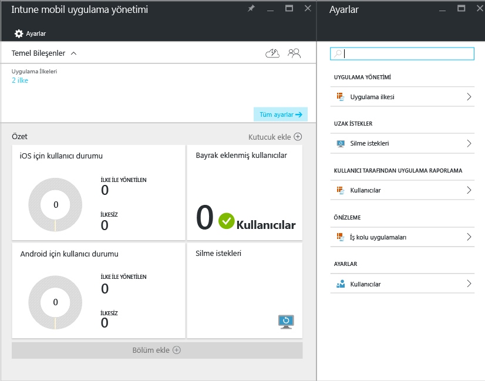
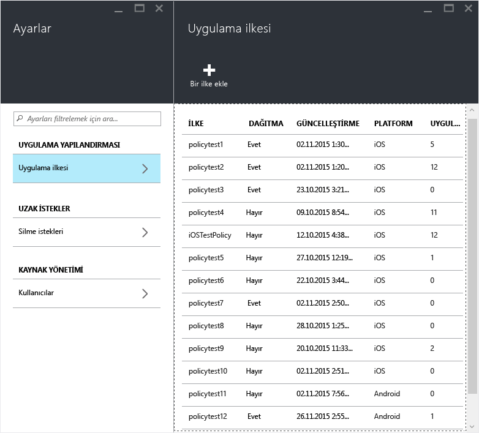
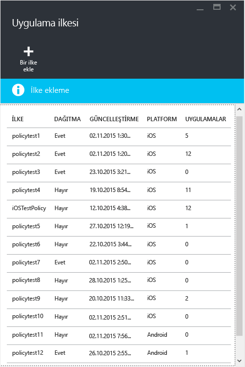

# Microsoft Intune ile mobil uygulama yönetimi ilkeleri oluşturma ve dağıtma
Mobil uygulama yönetimi (MAM) ilkeleri, Intune tarafından yönetilen veya yönetilmeyen cihazlarda çalışan uygulamalara uygulanabilir. MAM ilkelerinin çalışmasıyla ve Intune MAM ilkeleri tarafından desteklenen senaryolarla ilgili daha ayrıntılı bir açıklama için, [Mobil uygulama yönetimi ilkelerini kullanarak uygulama verilerini koruma](protect-app-data-using-mobile-app-management-policies-with-microsoft-intune.md) konusunu okuyun.

Bu konu başlığı altında, **Azure portalında** MAM ilkesi oluşturma işlemi açıklanır. Azure portalı, MAM ilkelerinin oluşturulacağı yeni yönetim konsoludur ve MAM ilkelerini oluşturmak için bu portalı kullanmanızı öneririz. Azure portalı, aşağıdaki MAM senaryolarını destekler:
- Intune'a kayıtlı cihazlar
- Üçüncü taraf MDM çözümleri tarafından yönetilen cihazlar
- Hiçbir MDM çözümü tarafından yönetilmeyen cihazlar (KGC).

>[!IMPORTANT]

> Şu anda, cihazlarınızı yönetmek için **Intune yönetici konsolunu** kullanıyorsanız, [Intune yönetici konsolu](configure-and-deploy-mobile-application-management-policies-in-the-microsoft-intune-console.md) kullanılarak Intune’a kaydedilen cihazlar için olan uygulamaları destekleyen bir MAM ilkesi oluşturabilirsiniz.
Intune yönetici konsolunda oluşturulan MAM ilkeleri, Azure portalına aktarılamaz.  MAM ilkeleri, Azure portalında yeniden oluşturulmalıdır.

> Intune yönetici konsolunda tüm MAM ilkesi ayarlarını göremeyebilirsiniz. Azure portalı, MAM ilkeleri oluşturmak için yeni yönetim konsoludur. Hem Intune yönetim konsolunda hem de Azure portalında MAM ilkeleri oluşturursanız, uygulamalara Azure portalındaki ilke uygulanır ve kullanıcılara bu ilke dağıtılır.

Android ve iOS platformlarında desteklenen ilke ayarları listesini görmek için, aşağıdakilerden birini seçin:

> [!div class="op_single_selector"]
- [iOS ilkeleri](ios-mam-policy-settings.md)
- [Android ilkeleri](android-mam-policy-settings.md)

##  MAM ilkesi oluşturma
MAM ilkesi oluşturmadan önce, [önkoşullar ve destek](get-ready-to-configure-mobile-app-management-policies-with-microsoft-intune.md) bilgilerini gözden geçirin.
1.  **Intune mobil uygulama yönetimi &gt; Ayarlar**’ı seçerek **Ayarlar** dikey penceresini açın.

    

    > [!TIP]
    > Azure portalını ilk kez kullanıyorsanız, portalı tanımak için öncelikle [Microsoft Intune MAM ilkeleri için Azure portalı](azure-portal-for-microsoft-intune-mam-policies.md) konusunu okuyun.

2.  **Ayarlar** dikey penceresinde **Uygulama ilkesi**’ni seçin.  Yeni ilkeler oluşturacağınız ve mevcut ilkeleri düzenleyeceğiniz **Uygulama ilkesi** dikey penceresi açılır.

    

3.  **İlke ekle**‘yi seçin.

    

4.  İlke için bir ad yazın, kısa bir açıklama ekleyin ve iOS veya Android için ilke oluşturmak üzere platform türünü seçin.  Her platform için birden çok ilke oluşturabilirsiniz.

    

5.  Kullanılabilir uygulamaların listesini görüntüleyen **Uygulamalar dikey penceresini** açmak için **Uygulamalar**’ı seçin. Oluşturmakta olduğunuz ilke ile ilişkilendirmek istediğiniz bir veya daha fazla uygulamayı listeden seçebilirsiniz. Uygulamaları seçtikten sonra, seçiminizi kaydetmek için **Uygulamalar** dikey penceresinin altındaki **Seç** düğmesini kullanın.

    > [!IMPORTANT]
    > Bir ilke oluşturmak için en az bir uygulama seçmeniz gerekir.

6.  **İlke ekle dikey penceresinde** **Gerekli ayarları yapılandır**’ı seçerek ilke ayarları dikey penceresini açın.

    İlke ayarlarının iki kategorisi vardır: **Veri konumu değiştirme** ve **Erişim**.  Veri konumu değiştirme ilkeleri, uygulama içindeki ve dışındaki veri hareketleri için geçerlidir. Erişim ilkeleri ise son kullanıcının uygulamalara iş bağlamında nasıl eriştiğini belirler.
    Başlamanıza yardımcı olması için ilke ayarlarına varsayılan değerler atanmıştır.  Varsayılan değerler gereksinimlerinizi karşılıyorsa değişiklik yapmanız gerekmez.

    > [!TIP]
    > Bu ilke ayarları, yalnızca uygulamalar iş bağlamında kullanılırken uygulanır.  Son kullanıcı, uygulamayı kişisel bir görev için kullanırken bu ilkelerden etkilenmez.

    

7.  Bu yapılandırmayı kaydetmek için **Tamam**’ı seçin.   **İlke ekle** dikey penceresine geri dönersiniz. İlkeyi oluşturmak ve ayarlarınızı kaydetmek için **Oluştur**’u seçin.

    

    

İlke oluşturmayı önceki yordamda açıklandığı şekilde tamamladığınızda, ilke kullanıcılara dağıtılmaz.  İlkeyi dağıtmak için aşağıda açıklanan adımları izleyin.

> [!IMPORTANT]
> Uygulama için Intune yönetici konsolunu kullanarak bir MAM ilkesi ve Azure portalını kullanarak başka bir MAM ilkesi oluşturursanız, Azure portalını kullanarak oluşturduğunuz ilke önceliklidir. Ancak, Intune veya Configuration Manager konsolunda yapılan raporlamada, Azure Portal’da oluşturulan ilke ayarları belirtilir. Örneğin:
>
> -   Intune yönetici konsolunda, uygulamadan kopyalama yapılmasını engelleyen bir mobil uygulama yönetimi ilkesi oluşturdunuz.
> -   Azure konsolunda, uygulamadan kopyalama yapılmasına izin veren bir mobil uygulama yönetimi ilkesi oluşturdunuz.
> -   Bu ilkelerin ikisini de aynı uygulamayla ilişkilendirdiniz.
> -   Sonuç olarak Azure konsolunda oluşturduğunuz ilke öncelik kazanır ve kopyalamaya izin verilir.
> -   Ancak, Intune konsolundaki durum ve raporlar, hatalı bir şekilde kopyalamanın engellendiğini belirtir.

## Bir ilkeyi kullanıcılara dağıtma

1.  **İlke** dikey penceresinde  **Kullanıcı grupları**‘nı seçerek **Kullanıcı grupları** dikey penceresini açın. **Kullanıcı grupları** dikey penceresinde **Kullanıcı grubu ekle**’yi seçerek **Kullanıcı grubu ekle** dikey penceresini açın.

    

2.   **Kullanıcı grubu ekle** dikey penceresinde kullanıcı gruplarının listesi gösterilir. Bu liste **Azure Active Directory**’deki tüm güvenlik gruplarını içerir.  Bu ilkenin geçerli olmasını istediğiniz kullanıcı gruplarını seçin ve sonra da **Seç**öğesini seçin. **Seç** öğesi seçildiğinde, ilke kullanıcılara dağıtılır.

    

    Bir ilke oluşturdunuz ve kullanıcılara dağıttınız.

Yalnızca [!INCLUDE[wit_nextref](../includes/wit_nextref_md.md)] lisansları atanmış kullanıcılar ilkeden etkilenir.  Seçtiğiniz güvenlik grubunda olan ve atanmış [!INCLUDE[wit_nextref](../includes/wit_nextref_md.md)] lisansı bulunmayan kullanıcılar etkilenmez.

>[!IMPORTANT]
> iOS ve Android cihazlarınızı yönetmek için Configuration Manager ile Intune kullanıyorsanız ilke yalnızca doğrudan seçtiğiniz grupta bulunan kullanıcılara uygulanır.  Seçtiğiniz grubun içindeki alt grupların üyeleri etkilenmez.

Son kullanıcılar uygulamaları App store veya Google Play’den indirebilir. MAM’nin cihazdaki şirket verilerini nasıl koruduğu konusunda ayrıntılı yönergeler için, [MAM etkin uygulamalar için son kullanıcı deneyimi](end-user-experience-for-mam-enabled-apps-with-microsoft-intune.md) konusuna bakın.

##  Mevcut ilkeleri değiştirme
Mevcut ilkeyi düzenleyebilir ve bunu hedeflenen kullanıcılara uygulayabilirsiniz. Bununla birlikte, mevcut ilkeleri değiştirdiğinizde, uygulamalarda oturum açmış olan kullanıcılar bu değişiklikleri 8 saat boyunca görmez.

Değişikliklerin etkisini hemen görmek için, son kullanıcının uygulama oturumunu kapatması ve yeniden oturum açması gerekecektir.

### İlkeyle ilişkili uygulamalar listesini değiştirmek için

1.  **Uygulama ilkesi** dikey penceresinde değiştirmek istediğiniz ilkeyi seçin. Seçtiğiniz ilkeye özel bir dikey pencere açılır.

    

2.  İlke dikey penceresinde **Hedeflenen uygulamalar**’ı seçerek uygulama listesini açın.

3.  Uygulamaları listeden kaldırın veya listeye ekleyin ve değişikliklerinizi kaydetmek için **Kaydet simgesini** seçin.

### Kullanıcı grupları listesini değiştirmek için

1.  **Uygulama ilkesi** dikey penceresinde değiştirmek istediğiniz ilkeyi seçin. Seçtiğiniz ilkeye özel bir dikey pencere açılır.

2.  İlke dikey penceresinde **Kullanıcı grupları**’nı seçerek, bu ilkeye sahip geçerli kullanıcı gruplarının listesini gösteren **Kullanıcı grubu** dikey penceresini açın.

3.  İlkeye **yeni kullanıcı grubu eklemek** için **Kullanıcı grubu ekle**‘yi seçin ve sonra da kullanıcı grubunu seçin. İlkeyi seçtiğiniz gruba dağıtmak için **Seç**öğesini seçin.

    

4.  **Kullanıcı grubunu silmek** için, kaldırmak istediğiniz kullanıcı grubunu vurgulayın, üç noktayı (…) seçin ve ardından **Sil**’i seçerek kullanıcı grubunu kaldırın.

    

### İlke ayarlarını değiştirmek için

1.  **Uygulama ilkesi** dikey penceresinde değiştirmek istediğiniz ilkeyi seçin. Seçtiğiniz ilkeye özel bir dikey pencere açılır.

    

2.  **İlke ayarları**’nı seçerek **İlke ayarları** dikey penceresini açın.

3.  Ayarları değiştirin ve **Kaydet simgesini** seçerek yaptığınız değişiklikleri kaydedin.

    

## İlke ayarları
iOS ve Android ilke ayarlarının tam listesini görmek için, aşağıdakilerden birini seçin:

> [!div class="op_single_selector"]
- [iOS ilkeleri](ios-mam-policy-settings.md)
- [Android ilkeleri](android-mam-policy-settings.md)

## Sonraki adımlar
[Uyumluluğu ve kullanıcı durumunu izleme](monitor-mobile-app-management-policies-with-microsoft-intune.md)

### Ayrıca bkz.
[MAM etkin uygulamalar için son kullanıcı deneyimi](end-user-experience-for-mam-enabled-apps-with-microsoft-intune.md)

<!--HONumber=Jul16_HO3-->

