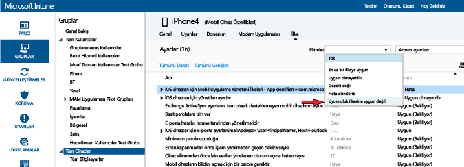

# Microsoft Intune’da cihaz uyumluluk ilkesini dağıtma ve izleme
## Uyumluluk ilkesini dağıtma
[Oluşturduğunuz](create-a-device-compliance-policy-in-microsoft-intune.md) uyumluluk ilkesini kuruluşunuzdaki bir veya daha fazla kullanıcı ya da cihaz grubuna dağıtın.

1.  **İlke** çalışma alanında, dağıtmak istediğiniz ilkeyi ve ardından **Dağıtımı Yönet**’i seçin.

2.  **Dağıtımı Yönet** iletişim kutusunda ilkeyi dağıtmak istediğiniz bir veya daha fazla grup seçin, sonra **Ekle > Tamam**’ı seçin.
 Kullanıcılara ve/veya cihazlara bir uyumluluk ilkesi dağıtabilirsiniz. Daha önce oluşturduğunuz ve Intune ile eşitlenen Active Directory gruplarını kullanın ya da Intune konsolunda bu grupları el ile oluşturun. İlke dağıtma hakkında daha fazla bilgi için, bkz. [yapılandırma ilkesi dağıtma](manage-settings-and-features-on-your-devices-with-microsoft-intune-policies.md).

Dikkat etmeniz gereken ilkeyle ilgili sorunları belirlemek için **İlke** çalışma alanının **Genel Bakış** sayfasında durum özeti ve uyarılarını kullanın. Ayrıca, **Pano** çalışma alanında bir durum özeti görüntülenir.

> [!IMPORTANT]
> Bir uyumluluk ilkesi dağıtmadıysanız ve sonra bir Exchange koşullu erişim ilkesini etkinleştirirseniz, tüm hedeflenen cihazların erişimine izin verilir.

## Intune ilke çakışmalarını çözümleme
Bir cihaza birden çok Intune ilkesi uygulandığında ilke çakışmaları olabilir. İlke ayarları çakışırsa, Intune tüm çakışmaları aşağıdaki kuralları kullanarak çözer:

-   Çakışan ayarlar bir Intune yapılandırma ilkesine ve bir uyumluluk ilkesine aitse, yapılandırma ilkesindeki ayarlar daha güvenli olsa bile uyumluluk ilkesindeki ayarlar yapılandırma ilkesindeki ayarlara göre önceliklidir.

-   Birden çok uyumluluk ilkesi dağıttıysanız bu ilkelerin en güvenli olanı kullanılır.

## Uyumluluk ilkesini izleme

#### Uyumluluk ilkesine uymayan cihazları görüntülemek için

1.  [Microsoft Intune yönetim konsolunda](https://manage.microsoft.com) **Gruplar > Tüm Cihazlar** öğesini seçin.

2.  Cihazlar listesinde bir cihazın adına çift tıklayın.

3.  İlgili cihaza ilişkin ilkelerin listesini görmek için **İlke** sekmesini seçin.

4.  **Filtreler** açılır listesinden **Uyumluluk ilkesine uygun değil** öğesini seçin.

#### Durum Kanıtlama Raporlarını görüntülemek için

1.  [Microsoft Intune yönetim konsolunda](https://manage.microsoft.com) **Raporlar**’ı seçin.

2.  **Durum Kanıtlama Raporu - Yeni rapor oluştur** sayfasında Intune tarafından toplanan tüm Windows 10 durum kanıtlama verileriyle birlikte bir raporu görüntüleyebilirsiniz. Ayrıca filtreleri kullanarak verilerin bir alt kümesi ile rapor oluşturabilirsiniz. Filtreler cihaz türüne, işletim sistemine veya yalnızca bir veri noktaları alt kümesine göre uygulanabilir.

## Sonraki adımlar
Kuruluşunuzdaki hizmetlere erişimi denetlemek için artık koşullu erişim ilkeleriyle birlikte uyumluluk ilkesini kullanabilirsiniz.

[E-posta ve O365 hizmetlerine erişimi kısıtlama](restrict-access-to-email-and-o365-services-with-microsoft-intune.md)

### Ayrıca bkz.
[Intune’da cihaz uyumluluk ilkelerine giriş](introduction-to-device-compliance-policies-in-microsoft-intune.md)

<!--HONumber=Jul16_HO3-->

