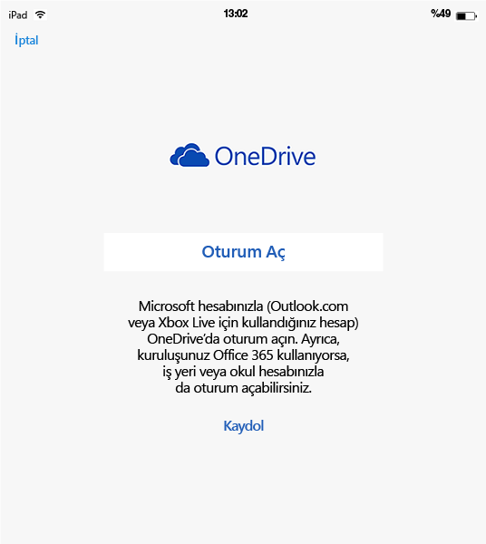
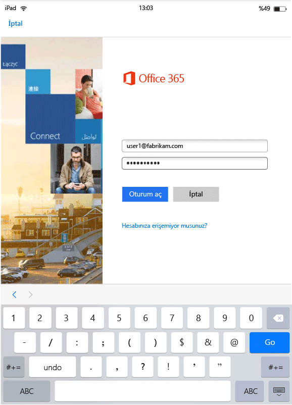
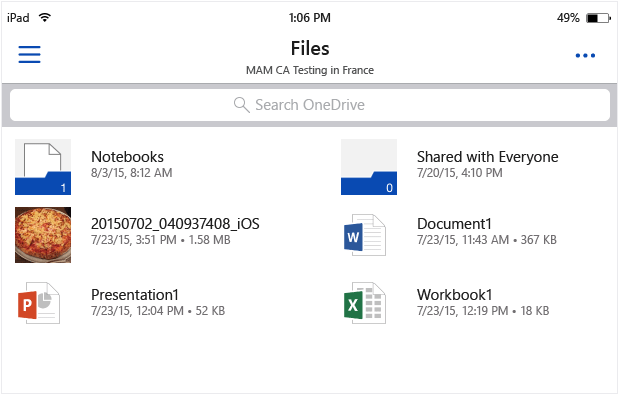
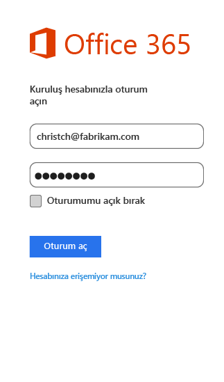
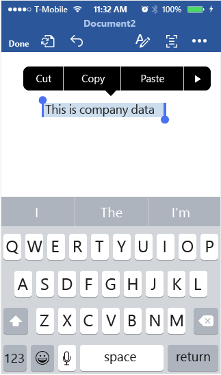
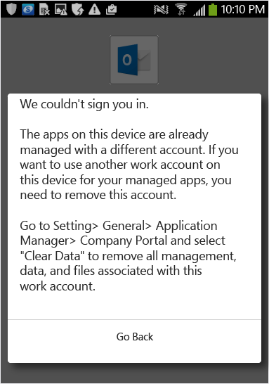

---
# required metadata

title: MAM etkin uygulamalar için son kullanıcı deneyimi | Microsoft Intune
description:
keywords:
author: karthikaraman
manager: jeffgilb
ms.date: 04/28/2016
ms.topic: article
ms.prod:
ms.service: microsoft-intune
ms.technology:
ms.assetid: b57e6525-b57c-4cb4-a84c-9f70ba1e8e19

# optional metadata

#ROBOTS:
#audience:
#ms.devlang:
ms.reviewer: jeffgilb
ms.suite: ems
#ms.tgt_pltfrm:
#ms.custom:

---

# MAM etkin uygulamalar için Microsoft Intune ile son kullanıcı deneyimi
Mobil uygulama yönetimi (MAM) ilkeleri, yalnızca uygulamalar çalışma bağlamında kullanıldığında uygulanır.  Yönetilen uygulamaların nasıl işlediğini anlamak için aşağıdaki senaryoları okuyun.
##  Bir iOS cihazında OneDrive’a erişme

1.  Oturum açma sayfasını açmak için **OneDrive** uygulamasını başlatın.

    

    > [!NOTE]
    > Kişisel bir cihazda, uygulama genellikle son kullanıcı tarafından indirilir.  Cihaz bir MDM çözümü tarafından yönetiliyorsa uygulamayı cihaza dağıtabilirsiniz.

2.  İş hesabı kullanıcı adınızı yazın. İş kimlik bilgilerinizi girmeniz için **O365 kimlik doğrulaması** sayfasına yönlendirilirsiniz.

    

3.  Kimlik bilgileriniz Azure AD tarafından başarıyla doğrulandıktan sonra MAM ilkeleri uygulanır ve **OneDrive** uygulamasını yeniden başlatmanız istenir.

    

4.  **OneDrive** uygulamasını yeniden başlattığınızda, uygulama MAM ilkeleri açık olarak başlatılır. Bu durumda uygulama için bir **PIN** ayarlamanız istenir. (ilkeyi bunun için yapılandırdıysanız)

    

5.  PIN’i ayarlayıp onayladıktan sonra **OneDrive for Business**üzerindeki dosyalara erişebilirsiniz.

    

    > [!NOTE] Dağıtılan bir ilkeyi değiştirirseniz, değişiklikler uygulamayı bir sonraki açışınızda uygulanır.

##  OneDrive’a Android cihazında erişme

1.  Oturum açma sayfasını açmak için OneDrive uygulamasını başlatın.

    > [!NOTE]
    > Kişisel bir cihazda, uygulama genellikle son kullanıcı tarafından indirilir.  Cihaz bir MDM çözümü tarafından yönetiliyorsa uygulamayı cihaza dağıtabilirsiniz.

2.  İş hesabı kullanıcı adınızı yazın. İş kimlik bilgilerinizi girmeniz için **O365 kimlik doğrulaması** sayfasına yönlendirilirsiniz.

    

3.  Kimlik bilgileriniz **Azure AD**tarafından başarıyla doğrulandıktan sonra, şirket portalı uygulaması cihaza henüz yüklenmediyse, uygulamayı yüklemeye yönelik yönergeleri içeren bir ileti görürsünüz.  Devam etmek için **Uygulamayı al** seçeneğine dokunun.

>[!NOTE]
>Şirket Portalı uygulaması, Android cihazlarda MAM ilkeleriyle ilişkili tüm uygulamalar için gereklidir. Intune'a kaydolmamış cihazlar için, uygulama cihaza yüklenmelidir ancak uygulamanın başlatılması veya uygulamaya oturum açılması gerekmez.  

  

4.  Şu anda **Şirket Portalı** uygulamasını indirip yükleyebileceğiniz **Google Play** mağazasındasınız.

    Şirket Portalı uygulaması, verilerinizi güvende tutmaya ve korumaya yardımcı olur.

    

5.  Yüklemeyi tamamladıktan sonra koşulları kabul etmek için **Kabul Et** ’e tıklayın.

6.  **OneDrive** uygulaması otomatik olarak başlatılır.

7.  OneDrive’ı sonraki açışınızda, ilke ayarları **OneDrive**uygulamasına erişmek için PIN gerektirecek şekilde belirlendiyse, **PIN** ayarlamanız gerektiğini bildiren istemi görürsünüz.

    

8.  PIN’i ayarlanıp onaylandıktan sonra, uygulama ilkelerine göre yönetilen **OneDrive**’ı kullanmaya devam edebilirsiniz.

##  Birden çok kimlik destekli uygulamaları kullanma
Microsoft Word, bu senaryo için örnek olarak kullanılır.

1.  Cihazınızda **Word** uygulamasını açın. Adımları göstermek için bir iOS cihazı kullanılmıştır.

2.  Yeni bir Word belgesi oluşturmak için **Yeni** ‘ye dokunun.

    

3.  Tercih ettiğiniz bir cümle yazın.  Bu belgeyi kaydetmeyi denediğinizde, yeni oluşturduğunuz belgeyi kaydetme seçeneği olarak hem kişisel konumlar hem de iş konumları gösterilir.  Bu adımda, bu iş bağlamı/kişisel bağlam henüz belirlenmediği için uygulama ilkeleri uygulanmaz.

4.  Belgeyi OneDrive iş konumunuza kaydedin. Bu belge, şirket verileri olarak etiketlenir ve ilke kısıtlamaları belgeye uygulanır.

    

5.  İş konumunuza kaydettiğiniz belgeyi açın.  Metni kopyalayın, kişisel**Facebook** hesabınızı açın ve kopyalanan metni yapıştırmayı deneyin.  İçeriği yeni Facebook gönderisine yapıştıramıyor olmalısınız. Yapıştır seçeneği devre dışı değildir, ancak **Yapıştır**’a bastığınızda hiçbir şey olmaz.

    

    

6.  Şimdi, 2. ve 3. adımları yineleyerek başka bir yeni belge oluşturun, istediğiniz bir tümceyi yazın ve bunu çalışmanıza kaydetmek yerine **OneDrive - kişisel** gibi kişisel bir konumunuza kaydedin.

    

7.  Kaydedilen kişisel belgeyi açın.  Metni kopyalayın, **Facebook** uygulamasını açın ve kopyalanan metni yapıştırmayı deneyin. İçeriği bir Facebook gönderisine yapıştırabildiğinizi görürsünüz.

    

##  Kullanıcı hesaplarını yönetme

Intune yalnızca, MAM ilkelerinin cihaz başına yalnızca bir kullanıcı hesabına dağıtılmasını destekler. Bir cihazda birden fazla iş hesabı varsa, yalnızca bir iş hesabı MAM ilkeleri tarafından yönetilir.

Kullanmakta olduğunuz uygulamaya bağlı olarak, ikinci kullanıcı cihazda engellenebilir veya engellenmeyebilir. Ancak her durumda, yalnızca MAM ilkelerini alan ilk kullanıcı, ilkeden etkilenir.

Bir cihazda, MAM ilkeleri dağıtılmadan önce birden çok kullanıcı hesabı varsa, MAM ilkelerinin dağıtıldığı hedef hesap, Intune MAM ilkeleri tarafından yönetilir.

**Microsoft Word**, **Excel**, ve **PowerPoint**, ikinci bir kullanıcı hesabını engellemez, ancak ikinci kullanıcı, MAM ilkelerinden etkilenmez.  

**OneDrive ve Outlook uygulamaları** için, yalnızca bir iş hesabı kullanabilirsiniz.  Birden çok iş hesabının eklenmesi bu uygulamalarda engellenmiştir.  Ancak, bir kullanıcıyı kaldırabilir ve cihaza farklı bir kullanıcı ekleyebilirsiniz.

Birden çok kullanıcı hesabının nasıl ele alındığını daha iyi anlamak için aşağıdaki örnek senaryoyu okuyun.

Kullanıcı A, iki şirkette çalışıyor - **Şirket X** ve **Şirket Y**. Kullanıcı A’nın, her şirket için bir iş hesabı var ve ikisi de MAM ilkelerini dağıtmak için Intune kullanıyor. **Şirket X**, MAM ilkelerini **Şirket Y**’den **önce** dağıtıyor. **Şirket X** ile ilişkili hesap MAM ilkesini alır, ancak Şirket Y ile ilişkili hesap almaz. Şirket Y ile ilişkili kullanıcı hesabının MAM ilkeleri tarafından yönetilmesini istiyorsanız, Şirket X ile ilişkili kullanıcı hesabını kaldırmanız gerekir.
### İkinci hesap ekleme
#### IOS
iOS cihazı kullanıyorsanız, aynı cihaza ikinci bir iş hesabı eklemeye çalıştığınızda engelleme iletisi görebilirsiniz.  Ayrıca, mevcut hesabı kaldırıp yenisini ekleme seçeneğini görürsünüz. **Evet**’e tıklayarak bu işlemi yapabilirsiniz.

####  Android
Android cihaz kullanıyorsanız, mevcut hesabı kaldırıp yenisini eklemeye ilişkin yönergeler bulunan bir engelleme iletisi görebilirsiniz.  Android cihazlarda, mevcut hesabı kaldırın, **Ayarlar &gt;Genel &gt;Uygulama Yöneticisi &gt;Şirket Portalı’na gidin ve "Verileri Temizle"’yi seçin**.

##  Rights Management paylaşım uygulamasıyla medya dosyalarını görüntüleme
Şirket AV, PDF ve resim dosyalarını Android cihazlarda görüntülemek için, [Microsoft Rights Management (RMS) paylaşım uygulamasını](https://play.google.com/store/apps/details?id=com.microsoft.ipviewer) kullanın.

Bu uygulamayı Google Play mağazasından indirin.  Uygulama cihazınıza yüklendikten sonra, uygulamayı başlatın ve şirket kimlik bilgilerinizle kimlik doğrulayın. Şimdi, ilke ile yönetilen diğer uygulamalardan korumasız ve korumalı dosyaları görüntüleyebiliyor olmalısınız.

**Intune’a kaydedilmeyen Android cihazları**

Intune tarafından yönetilen diğer uygulamalardan dosyaları görüntülemek amacıyla RMS paylaşım uygulamasını kullanabilmeniz için, önce RMS uygulamasını başlatın ve iş hesabınızla kimliğinizi doğrulayın.  Oturum açtığınızda, **yalnızca bir RMS lisansınız olmadığı durumlarda** aşağıdaki iletiyi görürsünüz:

**Kimlik Doğrulaması Başarılı – Şimdi şirket dosyalarını görüntüleyebilirsiniz, ancak kuruluşunuz dosyaları korumanıza izin verecek şekilde ayarlanmamıştır. Diğer ayrıntılar için BT yöneticinize başvurun.**

Bu, şirket dosyalarını görüntülemek için RMS paylaşım uygulamasını kullanmanızı engellemez. Intune tarafından yönetilen diğer uygulamalardan şirket dosyalarını yine açabilir ve görüntüleyebilirsiniz, ayrıca MAM ilkeleri de yine uygulanır.  Bu ileti, RMS paylaşım uygulamasının sağladığı ek koruma özelliklerini ekleyemeyeceğinizi bildirir.  Dosyalarınıza koruma eklemek için RMS lisansınız olmalıdır. RMS dosya koruma özellikleri hakkında daha fazla bilgi edinmek için bkz. [Cihazdaki dosyayı koruma](https://docs.microsoft.com/en-us/rights-management/rms-client/sharing-app-protect-in-place) ve [E-postayla paylaştığınız dosyayı koruma](https://docs.microsoft.com/en-us/rights-management/rms-client/sharing-app-protect-by-email).

### Ayrıca bkz.
[Microsoft Intune ile mobil uygulama yönetimi ilkeleri oluşturma ve dağıtma](create-and-deploy-mobile-app-management-policies-with-microsoft-intune.md)

<!--HONumber=May16_HO3-->

