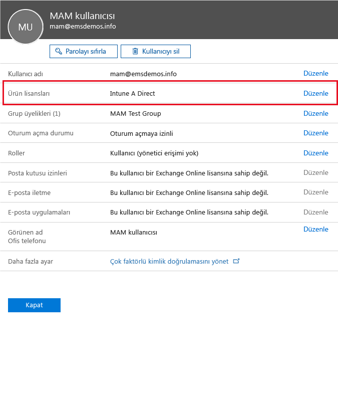

# Microsoft Intune ile mobil uygulama yönetimi ilkelerinizi yapılandırmak için hazırlama
Bu konuda, Azure portalında mobil uygulama yönetimi (MAM) ilkeleri oluşturabilmek için yapmanız gerekenler açıklanmaktadır.

Azure portalı, MAM ilkeleri oluşturmak için yeni yönetim konsoludur. MAM ilkelerini oluşturmak için bu portalı kullanmanızı öneririz. Azure portalı, aşağıdaki MAM senaryolarını destekler:
- Intune’a kayıtlı cihazlar
- Üçüncü taraf MDM çözümleri tarafından yönetilen cihazlar
- Hiçbir MDM çözümü tarafından yönetilmeyen cihazlar (KGC)

Azure portalını yeni kullanmaya başladıysanız, hızlı genel bakış bilgileri almak için [Microsoft Intune MAM ilkeleri için Azure portalı](azure-portal-for-microsoft-intune-mam-policies.md) konusunu okuyun.

>[!IMPORTANT]

> Şu anda cihazlarınızı yönetmek için Intune yönetici konsolunu kullanıyorsanız, Intune yönetici konsolu kullanılarak Intune’a kaydedilen cihazlara yönelik uygulamaları destekleyen MAM ilkeleri oluşturabilirsiniz. Bununla birlikte, Intune’a kayıtlı cihazlar için bile Azure portalını kullanmanızı öneririz. Intune yönetici konsolunu kullanarak MAM ilkesi oluşturma yönergeleri için bkz. [Microsoft Intune konsolunda mobil uygulama yönetimi ilkelerini yapılandırma ve dağıtma](configure-and-deploy-mobile-application-management-policies-in-the-microsoft-intune-console.md).

> Intune yönetici konsolunda tüm MAM ilkesi ayarlarını göremeyebilirsiniz. Hem Intune yönetici konsolunda hem de Azure portalında MAM ilkeleri oluşturursanız, uygulamalara Azure portalındaki ilke uygulanır ve kullanıcılara bu ilke dağıtılır.
> Intune yönetici konsolunda oluşturulan MAM ilkeleri, Azure portalına aktarılamaz.  MAM ilkeleri, Azure portalında yeniden oluşturulmalıdır.

##  Desteklenen platformlar
- iOS 8.1 veya üzeri

- Android 4 veya üzeri

Windows cihazları şu anda desteklenmez.
##  Desteklenen uygulamalar
* **Microsoft uygulamaları:** Bu uygulamalarda Intune App SDK’sı yerleşik olarak bulunur ve MAM ilkelerini uygulamadan önce başka işlem yapmanız gerekmez.
Desteklenen Microsoft uygulamalarının tam listesi görmek için, Microsoft Intune uygulama iş ortakları sayfasında [Microsoft Intune mobil uygulama galerisine](https://www.microsoft.com/en-us/server-cloud/products/microsoft-intune/partners.aspx) gidin. Desteklenen senaryoları ve platformları görmek, ayrıca uygulamanın birden çok kimliği destekleyip desteklemediğini anlamak için, uygulamaya tıklayın.
* **Kuruluşunuzun iş kolu uygulamaları:** Bunlar, MAM ilkelerini uygulamadan önce Intune Uygulama SDK’sını içerecek şekilde uygulamaların hazırlanmasını gerektirir.

  * Intune tarafından yönetilen cihazlar için, bkz. [MAM için uygulamaların nasıl hazırlanacağına karar verme](decide-how-to-prepare-apps-for-mobile-application-management-with-microsoft-intune.md).
  * Çalışana ait cihazlar gibi yönetilmeyen cihazlar veya üçüncü taraf bir mobil cihaz yönetim çözümü tarafından yönetilen cihazlar için, bkz. [Intune’a kayıtlı olmayan cihazlardaki iş kolu uygulamalarını ve verilerini koruma](protect-line-of-business-apps-and-data-on-devices-not-enrolled-in-microsoft-intune.md).

MAM ilkelerini yapılandırabilmeniz için *önceden* gerekenler:

-   Microsoft Intune için bir abonelik.    Kullanıcıların, MAM ilkeleri olan uygulamaları alabilmesi için [!INCLUDE[wit_nextref](../includes/wit_nextref_md.md)] lisanslarına sahip olmaları gerekir.

-   Aşağıdakiler için gereken bir Office 365 aboneliği:
  - Birden çok kimliği destekleyen uygulamalara MAM ilkeleri uygulamak için.
  - SharePoint Online ve Exchange Online iş hesaplarını oluşturmak için. Exchange şirket içi ve SharePoint şirket içi desteklenmez.
-   Modern kimlik doğrulaması için Skype Kurumsal Çevrimiçi Sürüm. Daha fazla bilgi için bkz. [Modern kimlik doğrulamasını etkinleştirme](http://social.technet.microsoft.com/wiki/contents/articles/34339.skype-for-business-online-enable-your-tenant-for-modern-authentication.aspx.md).

- Kullanıcıları oluşturmak için Azure Active Directory (Azure AD). Azure AD, uygulamayı açan ve iş kimlik bilgilerini giren kullanıcıların kimliğini doğrular.

    > [!NOTE]
    > Kullanıcıları ayarlamak için [!INCLUDE[wit_nextref](../includes/wit_nextref_md.md)] konsolunu kullanıyorsanız, MAM ilke yapılandırmasının Azure portalına taşındığını unutmayın. Bu portalı kullanmak için, Office 365 portalını kullanarak Azure AD kullanıcı gruplarını ayarlamanız gerekir.

## Kullanıcılar oluşturma ve Microsoft Intune lisansları atama

1. Intune aboneliğinizin olduğundan emin olun. Şu anda cihazlarınızı yönetmek için [!INCLUDE[wit_nextref](../includes/wit_nextref_md.md)] kullanıyorsanız [!INCLUDE[wit_nextref](../includes/wit_nextref_md.md)] aboneliğiniz zaten vardır.  Ayrıca, bir Enterprise Mobility Suite (EMS) lisansı satın aldıysanız da [!INCLUDE[wit_nextref](../includes/wit_nextref_md.md)] aboneliğiniz vardır. MAM özelliklerini kullanıma almak için [!INCLUDE[wit_nextref](../includes/wit_nextref_md.md)] uygulamasını deniyorsanız [Microsoft Intune web sayfasında](http://www.microsoft.com/en-us/server-cloud/products/microsoft-intune/) bir deneme hesabı alabilirsiniz.

    [!INCLUDE[wit_nextref](../includes/wit_nextref_md.md)] aboneliğinizin olup olmadığını denetlemek için **Faturalama** sayfasına gidin.  [!INCLUDE[wit_nextref](../includes/wit_nextref_md.md)] seçeneğini aboneliklerde **Etkin** olarak görmeniz gerekir.

2.  Yönetici kimlik bilgilerinizle [Office portalında](http://portal.office.com) oturum açın.

3.  **Etkin Kullanıcılar** sayfasına giderek kullanıcıları ekleyin ve [!INCLUDE[wit_nextref](../includes/wit_nextref_md.md)] lisansları atayın.

    

    

4.  Bir kullanıcıya Office portalı, Azure AD portalı ve Azure önizleme portalı erişimi vermek için, kullanıcıya **Genel yönetici rolü** atayın.

    

5.  MAM ilkeleri Azure Active Directory'deki kullanıcı gruplarına dağıtılır. MAM ilkelerinizden kullanıcı grupları oluşturmak için, Office portalındaki **Gruplar** sayfasına gidin ve yeni bir güvenlik grubu oluşturmak için en üst menüdeki **Grup seçeneği ekle**’yi seçin.  Bir ad ve açıklama yazıp **Oluştur**’a tıklayın. Grup oluşturulduğunda, **Üyeleri düzenle** ‘ye tıklayarak kullanıcıyı gruba ekleyebilirsiniz. Azure Active Directory’de güvenlik grubu oluşturulur.

    

Aşağıdaki tabloda yönetici kullanıcılara atayabileceğiniz rol ve izinler listelenir.

|||
|--|----|
|**Rol**|**İzinler**|
|Genel yönetici (Office 365 portalı)|Office 365 portalına ve Azure AD portalına erişim.  Azure portalına erişim (hem rol yönetimi hem de mobil uygulama yönetimi görevlerini gerçekleştirebilir).|
|Sahip (Azure portalı)|Azure portalına erişim (hem rol yönetimi hem de mobil uygulama yönetimi görevlerini gerçekleştirebilir).|
|Katkıda bulunan (Azure portalı)|Azure portalına erişim (yalnızca mobil uygulama yönetimi görevlerini gerçekleştirebilir).|

## Bir kullanıcıya katkıda bulunan rolü atama

Genel yöneticiler [Azure portalına](https://portal.azure.com) erişebilir.  Diğer yönetici kullanıcıların ilkeleri yapılandırabilmesini ve diğer mobil uygulama yönetim görevlerini yapabilmesini istiyorsanız, kullanıcılara katkıda bulunan rolünü atayabilirsiniz:

1.  **Ayarlar** dikey penceresindeki **Kaynak yönetimi** bölümünde **Kullanıcılar**’a tıklayın.

    

2.   **Erişim ekle** dikey penceresini açmak için **Ekle** ‘ye tıklayın.

3.  **Rol seçin** öğesine ve **Katkıda bulunan**’a tıklayın.

    

4.  **Kullanıcı ekle**’ye tıklayın ve adına veya e-posta adresine göre kullanıcıyı arayın. Bu listede, daha önce Azure AD'de Office portalını kullanarak oluşturduğunuz ilk 1.000 kullanıcıyı görürsünüz. Rolü kaydetmek ve kullanıcıya atamak için **Erişim ekle** dikey penceresinde **Tamam**’a tıklayın.

    

    > [!IMPORTANT]
    > [!INCLUDE[wit_nextref](../includes/wit_nextref_md.md)] lisansı atanmamış bir kullanıcı seçerseniz, kullanıcı bu portala erişemez.

## Sonraki adımlar
[Microsoft Intune ile mobil uygulama yönetimi ilkeleri oluşturma ve dağıtma](create-and-deploy-mobile-app-management-policies-with-microsoft-intune.md)

<!--HONumber=Jul16_HO4-->

