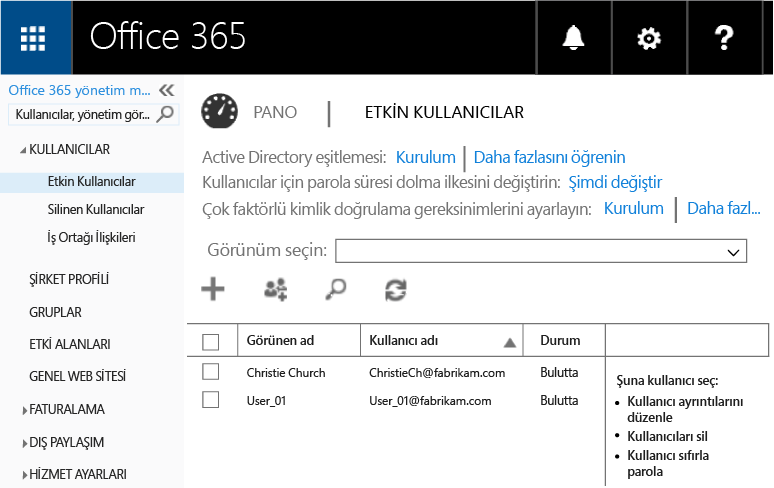
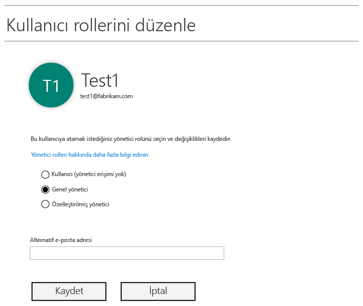
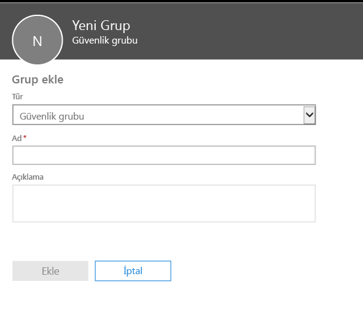
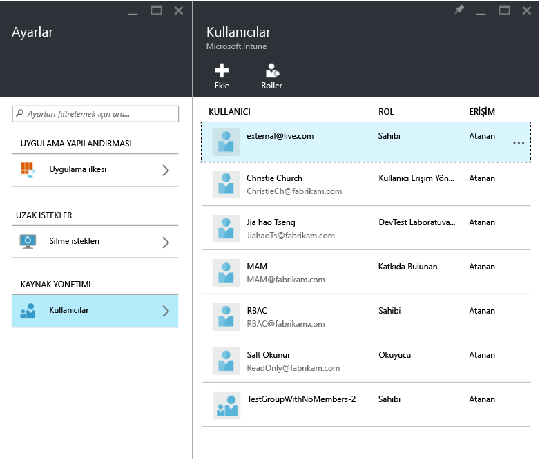
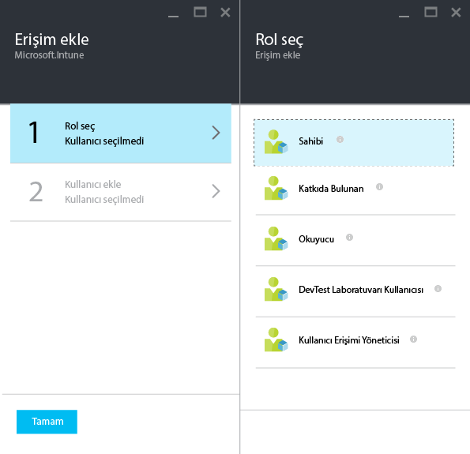
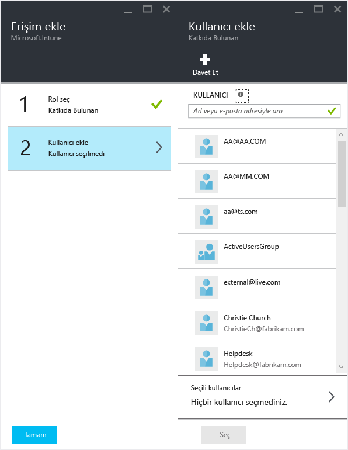

# Microsoft Intune ile mobil uygulama yönetimi ilkelerinizi yapılandırmak için hazırlama
Bu konuda, Azure portalında mobil uygulama yönetimi ilkeleri (MAM) oluşturabilmek için yapmanız gerekenler açıklanmaktadır

Azure portalı, MAM ilkelerinin oluşturulacağı yeni yönetim konsoludur ve MAM ilkelerini oluşturmak için bu portalı kullanmanızı öneririz. Azure portalı, aşağıdaki MAM senaryolarını destekler:
- Intune'a kayıtlı cihazlar
- Üçüncü taraf MDM çözümleri tarafından yönetilen cihazlar
- Hiçbir MDM çözümü tarafından yönetilmeyen cihazlar (KGC).

Azure portalını yeni kullanmaya başladıysanız, hızlı genel bakış bilgileri almak için [Microsoft Intune MAM ilkeleri için Azure portalı](azure-portal-for-microsoft-intune-mam-policies.md) konusunu okuyun.

Şu anda, cihazlarınızı yönetmek için **Intune yönetici konsolunu** kullanıyorsanız, **Intune yönetici konsolu** kullanılarak Intune’a kaydedilen cihazlar için uygulamaları destekleyen bir MAM ilkeleri oluşturabilirsiniz. Ancak, Intune’a kaydedilen cihazlar için bile Azure portalını kullanmanızı öneririz. Intune yönetim konsolunu kullanarak MAM ilkesi oluşturma yönergeleri için, [buraya](configure-and-deploy-mobile-application-management-policies-in-the-microsoft-intune-console.md) bakın.

Intune yönetici konsolunda oluşturulan MAM ilkeleri, Azure portalına aktarılamaz.  MAM ilkeleri, Azure portalında yeniden oluşturulmalıdır.

>[!IMPORTANT]
> Intune yönetici konsolunda tüm MAM ilkesi ayarlarını göremeyebilirsiniz. Hem Intune yönetim konsolunda hem de Azure portalında MAM ilkeleri oluşturursanız, uygulamalara Azure portalındaki ilke uygulanır ve kullanıcılara bu ilke dağıtılır.

##  Desteklenen platformlar
- iOS 8.1 veya üzeri

- Android 4 veya üzeri

Windows cihazları şu anda desteklenmez.
##  Desteklenen uygulamalar
* **Microsoft uygulamaları:** Bu uygulamalarda Intune App SDK’sı yerleşik olarak bulunur ve MAM ilkeleri uygulanmadan önce başka işlem yapmak gerekmez.
Desteklenen Microsoft uygulamalarının tam listesi görmek için, Microsoft Intune uygulama iş ortakları sayfasında [Microsoft Intune mobil uygulama galerisine](https://www.microsoft.com/en-us/server-cloud/products/microsoft-intune/partners.aspx) gidin. Desteklenen senaryoları, platformları ve uygulamanın çoklu kimliği destekleyip desteklemediğini görmek için, uygulamaya tıklayın.
* Şirket içi yerleşik **İş kolu uygulamalarınız:** Bunlar, MAM ilkelerini uygulamadan önce Intune Uygulama SDK’sını içerecek şekilde uygulamayı hazırlamanızı gerektirir.

  * Intune tarafından yönetilen cihazlar için, bkz. [MAM için uygulamaların nasıl hazırlanacağına karar verme](decide-how-to-prepare-apps-for-mobile-application-management-with-microsoft-intune.md).
  * Çalışana ait cihazlar gibi yönetilmeyen cihazlar veya üçüncü taraf bir mobil cihaz yönetim çözümü tarafından yönetilen cihazlar için, bkz. [Intune’a kayıtlı olmayan cihazlardaki iş kolu uygulamalarını ve verilerini koruma](protect-line-of-business-apps-and-data-on-devices-not-enrolled-in-microsoft-intune.md).

MAM ilkelerini yapılandırmadan **önce** aşağıdakilere ihtiyacınız olacak:

-   **Microsoft Intune için bir abonelik**.    Son kullanıcıların uygulamaları MAM ilkesiyle edinebilmesi için [!INCLUDE[wit_nextref](../includes/wit_nextref_md.md)] lisanslarına sahip olması gerekir.

-   Aşağıdakiler için gerekli bir **Office 365 (O365)** aboneliği:
  - Çoklu kimliği desteği olan uygulamalara MAM ilkeleri uygulamak için.
  - SharePoint Online ve Exchange Online iş hesaplarını oluşturmak için. Exchange Şirket İçi ve SharePoint şirket içi desteklenmez.
-    **Skype Kurumsal Çevrimiçi Sürüm** için [modern kimlik doğrulamasını etkinleştirin](http://social.technet.microsoft.com/wiki/contents/articles/34339.skype-for-business-online-enable-your-tenant-for-modern-authentication.aspx.md).

- Kullanıcılar oluşturmak için **Azure Active Directory (Azure AD)**. Son kullanıcı uygulamayı başlatıp iş kimlik bilgilerini girdiğinde Azure AD, kullanıcının kimliğini doğrular.

    > [!NOTE] [!INCLUDE[wit_nextref](../includes/wit_nextref_md.md)] konsolunu kullanarak kullanıcıları ayarlıyorsanız, MAM ilke yapılandırmasının ileride Azure portalına taşınacağını ve bu portalı kullanmak için Office 365 portalı aracılığıyla Azure AD kullanıcı grupları ayarlamanız gerektiğini unutmayın.

## Kullanıcılar oluşturma ve Microsoft Intune lisansları atama

1. Intune aboneliğine ihtiyacınız vardır: Şu anda cihazlarınızı yönetmek için [!INCLUDE[wit_nextref](../includes/wit_nextref_md.md)] kullanıyorsanız [!INCLUDE[wit_nextref](../includes/wit_nextref_md.md)] aboneliğiniz zaten var demektir.  Ayrıca, bir EMS lisansı satın aldıysanız da [!INCLUDE[wit_nextref](../includes/wit_nextref_md.md)] aboneliğiniz vardır. MAM özelliklerini kullanıma almak için [!INCLUDE[wit_nextref](../includes/wit_nextref_md.md)] uygulamasını deniyorsanız [buradan](http://www.microsoft.com/en-us/server-cloud/products/microsoft-intune/) bir deneme hesabı alabilirsiniz.

    [!INCLUDE[wit_nextref](../includes/wit_nextref_md.md)] aboneliğinizin olup olmadığını denetlemek için Faturalama sayfasına gidin.  [!INCLUDE[wit_nextref](../includes/wit_nextref_md.md)] seçeneğini abonelikler altında **Etkin** olarak görmeniz gerekir.

2.  Yönetici kimlik bilgilerinizle [Office portalında](http://portal.office.com) oturum açın.

3.  **Etkin Kullanıcılar** sayfasına giderek kullanıcı ekleyin ve [!INCLUDE[wit_nextref](../includes/wit_nextref_md.md)] lisansları atayın.

    

4.  Bir kullanıcıya Office portalı, Azure AD portalı ve Azure önizleme portalı erişimi vermek için kullanıcıya **Genel yönetici rolü** atayın.

    

5.  MAM ilkeleri Azure Active Directory'deki kullanıcı gruplarına dağıtılır. MAM ilkeleriniz için kullanmak istediğiniz kullanıcı grupları oluşturmak için, **Office portalı**’ndaki **Gruplar** sayfasına gidin ve **+** simgesine tıklayarak yeni bir güvenlik grubu oluşturun.  Bir ad ve açıklama yazıp **Oluştur**’a tıklayın. Grup oluşturulduğunda, yeni oluşturulan grupta **Üyeleri düzenle** ‘ye tıklayarak kullanıcıyı gruba ekleyebilirsiniz. Azure Active Directory’de güvenlik grubu oluşturulur.

    

Aşağıdaki tabloda yönetici kullanıcılara atayabileceğiniz rol ve izinler listelenmektedir.

|||
|--|----|
|**Rol**|**İzinler**|
|Genel yönetici (O365 portalı)|O365 portalına ve Azure AD portalına erişim  Azure portalına erişim (hem rol yönetimi hem de mobil uygulama yönetimi görevlerini gerçekleştirebilir).|
|Sahip rolü (Azure portalı)|Azure portalına erişim (hem rol yönetimi hem de mobil uygulama yönetimi görevlerini gerçekleştirebilir).|
|Katkıda bulunan rolü (Azure portalı)|Azure portalına erişim (yalnızca mobil uygulama yönetimi görevlerini gerçekleştirebilir).|

## Bir kullanıcıya katkıda bulunan rolü atama

**Genel yöneticiler** [Azure portalına](https://portal.azure.com) erişebilir.  Diğer yönetici kullanıcıların ilkeleri yapılandırabilmesini ve diğer mobil uygulama yönetim görevlerini yapabilmesini istiyorsanız **katkıda bulunan rolü** ’nü kullanıcıya aşağıda açıklandığı gibi atayabilirsiniz:

1.  **Ayarlar** dikey penceresindeki **Kaynak yönetimi** bölümünde **Kullanıcılar**’a tıklayın.

    

2.   **Erişim ekle** dikey penceresini açmak için **Ekle** ‘ye tıklayın.

3.   **Bir rol seçin**ve **Katkıda bulunan rolü**’ne tıklayın.

    

4.  Rolü seçtikten sonra **Kullanıcı Ekle**’ye tıklayın ve kullanıcıyı, kullanıcı adına veya e-posta adresine göre arayın. Bu listede, Azure AD'de daha önce Office portalını kullanarak oluşturduğunuz ilk 1000 kullanıcıyı görürsünüz. Rolü kaydetmek ve kullanıcıya atamak için **Erişim ekle** dikey penceresinde **Tamam** ’a tıklayın.

    

    > [!IMPORTANT] [!INCLUDE[wit_nextref](../includes/wit_nextref_md.md)] lisansı atanmamış bir kullanıcı seçerseniz, kullanıcı bu portala erişemez.

## Sonraki adımlar
[Microsoft Intune ile mobil uygulama yönetimi ilkeleri oluşturma ve dağıtma](create-and-deploy-mobile-app-management-policies-with-microsoft-intune.md)

<!--HONumber=Jun16_HO4-->

