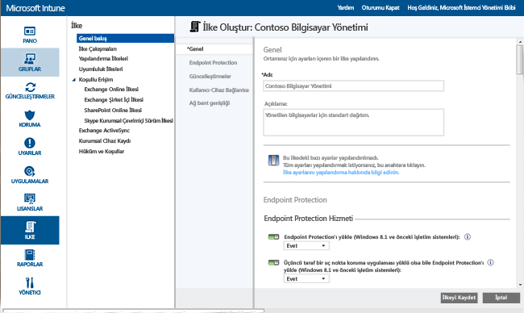
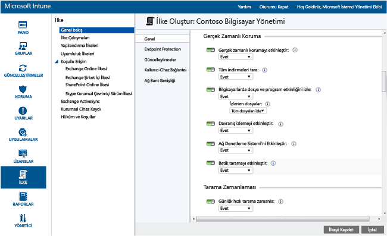
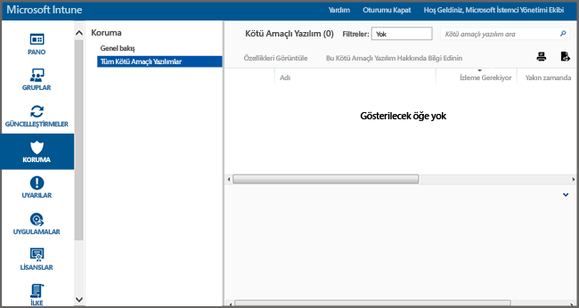

# Microsoft Intune için Endpoint Protection ile Windows bilgisayarların korunmasına yardımcı olma
Microsoft Intune, kötü amaçlı yazılım tehditlerine karşı gerçek zamanlı koruma sağlayan, kötü amaçlı yazılım tanımlarını güncel tutan ve bilgisayarları otomatik olarak tarayan Endpoint Protection da dahil olmak üzere yönetilen bilgisayarlarınızın korunmasına çeşitli şekillerde yardımcı olabilir. Endpoint Protection, kötü amaçlı yazılım saldırılarını yönetmek ve izlemek için yardımcı araçlar da sağlar.

Intune istemcisini bilgisayarlarınıza henüz yüklemediyseniz, bkz. [Microsoft Intune ile Windows bilgisayarı istemcisini yükleme](install-the-windows-pc-client-with-microsoft-intune.md).

Aşağıdaki bölümlerdeki bilgiler, Endpoint Protection’ı yapılandırmanıza, dağıtmanıza ve izlemenize yardımcı olur.

## Endpoint Protection’ın ne zaman kullanılacağını seçme
Bir BT yöneticisi olarak en önemli önceliklerinizden biri, yönettiğiniz bilgisayarlara kötü amaçlı yazılım ve virüs bulaşmasını engellemektir. Windows bilgisayarlara Intune’u dağıtmadan önce, aşağıdaki seçeneklerden birini seçerek ve ilişkili ilke ayarlarını yapılandırarak bilgisayarların güvenliğini nasıl koruyacağınıza karar vermeniz gerekir:

|Şunu yapmak istiyorum:|Endpoint Protection ilke ayarları|Daha fazla bilgi|
|--------------|---------------------------------------|--------------------|
|Ancak bir üçüncü taraf uç noktası koruma uygulaması yüklenmediyse, Microsoft Intune Endpoint Protection’ı kullanma  Microsoft Intune Endpoint Protection’ı, bir üçüncü taraf uç nokta koruma uygulaması yüklü olmayan tüm bilgisayarlarda kullanabilirsiniz.|Endpoint Protection Yükle = **Evet**  Endpoint Protection'ı Etkinleştir = **Evet**  Bir üçüncü taraf uç nokta koruma uygulaması yüklü olsa bile Endpoint Protection yükle = **Hayır**|Bir üçüncü taraf uç nokta koruma uygulaması algılanırsa Microsoft Intune Endpoint Protection yüklenmez veya zaten yüklüyse kaldırılır.|
|Bir üçüncü taraf uç noktası koruma uygulaması yüklenmiş olsa bile, Microsoft Intune Endpoint Protection’ı kullanma  Bu yaklaşımda, Microsoft Intune Endpoint Protection’ı ve üçüncü taraf uç nokta koruma uygulamasını aynı anda çalıştırırsınız. Bu, olası performans sorunları nedeniyle önerilen bir yapılandırma değildir.|Endpoint Protection Yükle = **Evet**  Endpoint Protection'ı Etkinleştir = **Evet**  Bir üçüncü taraf uç nokta koruma uygulaması yüklü olsa bile Endpoint Protection yükle = **Evet**|Şu durumlarda kullanın:  -   Microsoft Intune Endpoint Protection’ı kullanmaya geçmek istiyorsunuz. -   Microsoft Intune Endpoint Protection’ı kullanacak yeni bir istemci dağıttınız. -   Tüm istemcileri Microsoft Intune Endpoint Protection’ı kullanacak şekilde yükseltiyorsunuz.|
|Intune’u Microsoft Intune Endpoint Protection olmadan kullanma. Bunun yerine, bir üçüncü taraf uç nokta koruma uygulamasına güvenirsiniz.|Endpoint Protection Yükle = **Hayır**|Bir üçüncü taraf uç nokta koruma uygulaması kullanmıyorsanız, bu yapılandırma kuruluşunuzdaki bilgisayarları kötü amaçlı yazılım veya diğer saldırılara maruz bırakabileceğinden, bu yapılandırma önerilmez.  Microsoft Intune Endpoint Protection yüklenmez ve daha önce yüklenmişse kaldırılır.|
Geçerli uç nokta koruma uygulamanızdan Microsoft Intune Endpoint Protection’a geçmek için aşağıdakileri yapın:

1.  Intune istemci yazılımını bu bilgisayarlara dağıtırken geçerli uç nokta koruma uygulamasını çalışır durumda bırakın.

2.  Microsoft Intune Endpoint Protection’ın yüklendiğini ve istemci bilgisayarların güvenliğini sağlamaya yardımcı olduğunu doğrulayın.

3.  Üçüncü taraf uç nokta koruma yazılımını şu yolla kaldırın:

    -   Intune yazılım dağıtım özelliğini kullanarak, üçüncü taraf uç nokta koruma uygulaması üreticisi tarafından sağlanan yazılım kaldırma aracını dağıtın. Daha fazla bilgi için bkz. [Microsoft Intune ile uygulamaları dağıtma](deploy-apps.md).

    -   Üçüncü taraf uç nokta koruma uygulamasını el ile kaldırma.

> [!NOTE]
> Intune, üçüncü taraf uç nokta koruma uygulamalarını otomatik olarak kaldırmaz.

## Microsoft Intune Endpoint Protection nasıl yapılandırılır
Aşağıdaki adımlar, Microsoft Intune için Endpoint Protection’ı yapılandırmada size yardımcı olacaktır.

1.  [Microsoft Intune yönetim konsolunda](https://manage.microsoft.com/) **İlke** > **İlke Ekle**’ye tıklayın.

2.  **Bilgisayar Yönetimi**’ni genişletin ve **Microsoft Intune Aracı Ayarları**’nı seçin. Endpoint Protection ayarlarına yönelik ilke belirtmek için **Özel İlke Oluştur ve Dağıt**’ı seçin ve ardından **İlke Oluştur** düğmesine tıklayın. Önerilen ayarları kullanabilir veya ayarları özelleştirebilirsiniz. İlke oluşturma ve dağıtma hakkında daha fazla bilgiye ihtiyacınız olursa, [Microsoft Intune bilgisayar istemcisi ile genel Windows bilgisayarı yönetim görevleri](common-windows-pc-management-tasks-with-the-microsoft-intune-computer-client.md) konusuna bakın.

  

Dağıtılan Endpoint Protection ilkesini, **İlke** çalışma alanının **Tüm İlkeler** sayfasında görüntüleyebilirsiniz.

## Endpoint Protection hizmet ayarları

|İlke ayarı|Ayrıntılar|
|------------------|--------------------|
|**Endpoint Protection'ı yükleme**|Endpoint Protection’ı yönetilen bilgisayarlarda yüklemek için **Evet** olarak ayarlayın. Yükleme sırasında bir üçüncü taraf uç nokta koruma uygulaması algılanırsa, **Bir üçüncü taraf uç nokta koruma uygulaması yüklü olsa bile Endpoint Protection yükle** seçeneği **Evet** olarak ayarlanmadığı sürece Endpoint Protection yüklenmez. **Not:** Intune Endpoint Protection, yönetilen bilgisayarlara varsayılan olarak yüklenir. Endpoint Protection’ın yönetilen bilgisayarlara yüklenmesini istemiyorsanız, bu ilkeyi açıkça **Hayır** olarak ayarlamalısınız. Endpoint Protection önceden yüklenmişse ve ilke **Hayır** olarak güncelleştirilirse, Endpoint Protection istemcisi kaldırılır. Önerilen değer: **Evet**|
|**Üçüncü taraf uç nokta koruma uygulaması yüklü olsa bile Endpoint Protection’ı yükle**|Üçüncü taraf uç nokta uygulaması algılansa bile Microsoft Intune Endpoint Protection’ı yüklemek için **Evet** olarak ayarlayın.  Önerilen değer: **Evet**|
|**Endpoint Protection'ı etkinleştir**|Endpoint Protection istemcisinin bulunduğu bilgisayarlarda Microsoft Intune Endpoint Protection’ı etkinleştirmek için **Evet** olarak ayarlayın.  **Hayır** olarak ayarlanırsa ve Microsoft Intune Endpoint Protection yüklüyse, Endpoint Protection istemcisi kullanıcı arabirimi kullanıcılara gösterilmez ve tüm koruma özellikleri devre dışı kalır.  Önerilen değer: **Evet**|
|**İstemci Kullanıcı Arabirimi'ni devre dışı bırak**|Microsoft Intune Endpoint Protection istemcisinin kullanıcı arabirimini kullanıcılardan gizlemek için **Evet** olarak ayarlayın (geçerlilik kazanması için istemci bilgisayarın yeniden başlatılması gerekir).  Önerilen değer: **Hayır**|
|**Bir üçüncü taraf uç nokta koruma uygulaması yüklü olsa bile Endpoint Protection yükle**|Üçüncü taraf uç nokta uygulaması algılansa bile Microsoft Intune Endpoint Protection’ın yüklenmesini zorunlu tutmak için **Evet** olarak ayarlayın.  Önerilen değer: **Hayır**|
|**Kötü amaçlı yazılım düzeltme işleminden önce sistem geri yükleme noktası oluştur**|Herhangi bir kötü amaçlı yazılım düzeltme işlemi başlamadan önce Windows Sistem Geri Yükleme Noktası oluşturmak için **Evet** olarak ayarlayın.  Önerilen değer: **Evet**|
|**Çözümlenen kötü amaçlı yazılımları izle (gün)**|Daha önce etkilenen bilgisayarları el ile denetleyebilmeniz için Endpoint Protection’ın çözümlenen kötü amaçlı yazılımları belirli bir süre izlemesine olanak sağlar.  0 ile 30 gün arasında bir değer belirtebilirsiniz.  Önerilen değer: **7 gün**|
**Endpoint Protection'ı Yükle** ve **Endpoint Protection'ı Etkinleştir** için ilke değerlerini **Evet** olarak, **Üçüncü taraf uç nokta koruma uygulaması yüklü olsa bile Endpoint Protection’ı yükle** ilke değerini **Hayır** olarak ayarladıysanız; Microsoft Intune Endpoint Protection başka bir uç nokta koruma uygulamasının yüklü olduğunu algılar ve yüklenmez ya da zaten yüklüyse kaldırılır. Öte yandan, Microsoft Intune Endpoint Protection diğer uç nokta koruma uygulamasının sistem durumu hakkında Intune’da bildirimde bulunmaz.

  Gerçek zamanlı koruma, virüsler ve casus yazılımlar gibi olası tehditler kendilerini bilgisayarınıza yüklemeyi veya çalıştırmayı denediklerinde Microsoft Security Essentials’ın size nasıl uyaracağını gösterir. Böyle bir durum olduğu anda, görev çubuğunun sağ ucunda bir ileti görürsünüz.

### Gerçek zamanlı koruma ayarları

|İlke ayarı|Ayrıntılar|
|------------------|--------------------|
|**Gerçek zamanlı korumayı etkinleştir**|Erişilen tüm dosya ve uygulamaların izlenmesini ve taranmasını sağlar. Ayrıca, herhangi bir kötü amaçlı dosya ve uygulamayı da bilgisayarlarda çalıştırılmadan önce engeller.  Önerilen değer: **Evet**|
|**Tüm indirmeleri tara**|İnternet'ten bilgisayarlara indirilen tüm dosya ve eklerin taranmasını sağlar.  Önerilen değer: **Evet**|
|**Bilgisayarlarda dosya ve program etkinliğini izle**|Bilgisayarlarda gelen ve giden dosyaların yanı sıra program etkinliğinin izlenmesini sağlar. Bu ayarla, dosyalar ve programlar çalışmaya başladığında Endpoint Protection bunları izleyebilir ve gerçekleştirdikleri herhangi bir eylem veya bunlar üzerinde gerçekleştirilen eylemler hakkında sizi uyarır.  Önerilen değer: **Evet**|
|**İzlenen dosyalar**| **Bilgisayarlarda dosya ve program etkinliğini izle** etkinse, bu ayar yalnızca gelen, yalnızca giden veya tüm dosyaları izlemenize olanak sağlar.  Önerilen değer: **Tüm dosyaları izle**|
|**Davranış izlemeyi etkinleştir**|Microsoft Intune Endpoint Protection’ın istemci bilgisayarlarda belirli şüpheli etkinlik düzenlerini denetlemesine olanak sağlar.  Önerilen değer: **Evet**|
|**Ağ Denetleme Sistemi'ni Etkinleştir**|İstemci bilgisayarlarda Ağ Denetleme Sistemi'ni (NIS) etkinleştirir. NIS, kötü amaçlı ağ trafiğin algılanmasına ve engellenmesine yardımcı olmak üzere, [Microsoft Kötü Amaçlı Yazılımdan Koruma Merkezi](http://go.microsoft.com/fwlink/?LinkId=234249) 'nden edinilen bilinen açıklara yönelik imzaları kullanır.  Önerilen değer: **Evet**|

  

### Tarama zamanlaması ayarları

|İlke ayarı|Daha fazla bilgi|
|------------------|--------------------|
|**Günlük hızlı tarama zamanla**|Bilgisayarlarda hem sık kullanılan dosyalara hem de önemli sistem dosyalarına yönelik bir günlük hızlı tarama zamanlar. Bu hızlı taramanın performans üzerindeki etkisi çok azdır.  Önerilen değer: **Evet**|
|**Arka arkaya iki tarama kaçırıldığında bir hızlı tarama çalıştır**|Endpoint Protection’ı, arka arkaya iki zamanlanmış hızlı taramanın kaçırılması durumunda bilgisayarlarda otomatik olarak bir hızlı tarama çalıştıracak biçimde yapılandırır.  Önerilen değer: **Evet**|
|**Tam tarama zamanla**|Bilgisayarların yerel sabit disklerindeki tüm dosyalara ve kaynaklara yönelik tam bir tarama yapılandırır. Bu tarama biraz zaman alabilir ve bilgisayar performansını etkileyebilir (taranan dosya ve kaynakların sayısına bağlı olarak).  Önerilen değer: **Hayır**|
|**Arka arkaya iki tam tarama kaçırıldığında bir tam tarama çalıştır**|Endpoint Protection’ı, arka arkaya iki zamanlanmış tam taramanın kaçırılması durumunda bilgisayarlarda otomatik olarak bir tam tarama çalıştıracak biçimde yapılandırır.  Önerilen değer: Yapılandırılmamış|

### Tarama seçenekleri ayarları

|İlke ayarı|Ayrıntılar|
|------------------|--------------------|
|**Endpoint Protection yüklendikten sonra bir tam tarama çalıştır**|Endpoint Protection’ı, bilgisayarlara yüklendikten sonra otomatik olarak tam sistem taraması çalıştıracak biçimde yapılandırır. Bu tarama, kullanıcı üretkenliğine olan etkiyi en aza indirmek için yalnızca bilgisayarlar boştayken çalıştırılır.  Önerilen değer: **Evet**|
|**Gerektiğinde, kötü amaçlı yazılım kaldırma işleminin ardından otomatik olarak bir tam tarama çalıştır**|Endpoint Protection’ın kötü amaçlı yazılım kaldırıldıktan sonra diğer dosyaların etkilenmediğini doğrulamak için bilgisayarlarda otomatik olarak tam tarama çalıştırmasına izin vermek için **Evet** olarak ayarlayın.  Önerilen değer: **Evet**|
|**Zamanlanmış bir taramayı yalnızca bilgisayar boşta olduğunda başlat**|Herhangi bir kullanıcı üretkenlik kaybını önlemek amacıyla, zamanlanmış taramaların bilgisayarlar kullanımdayken başlatılmasını önlemek için **Evet** olarak ayarlayın.  Önerilen değer: **Evet**|
|**Bir tarama başlatmadan önce en son kötü amaçlı yazılım tanımlarını denetle**|Endpoint Protection’ın bilgisayarlarda bir tarama başlatmadan önce otomatik olarak en son kötü amaçlı yazılım tanımlarını denetlemesine izin vermek için **Evet** olarak ayarlayın.  Önerilen değer: **Evet**|
|**Arşiv dosyalarını tara**|Endpoint Protection’ı, bilgisayarlardaki arşiv dosyalarında (.zip veya .cab dosyaları gibi) kötü amaçlı yazılım taraması gerçekleştirecek biçimde yapılandırmak için **Evet** olarak ayarlayın.  Önerilen değer: **Hayır**|
|**E-posta iletilerini tara**|Endpoint Protection’ı, bilgisayarlara gelen e-posta iletilerini tarayacak biçimde yapılandırmak için **Evet** olarak ayarlayın.  Önerilen değer: **Evet**|
|**Paylaşılan ağ klasörlerinden açılan dosyaları tara**|Endpoint Protection’ı, ağda paylaşılan klasörlerden açılan dosyaları tarayacak biçimde yapılandırmak için **Evet** olarak ayarlayın. Bunlar genellikle bir UNC yolu kullanılarak erişilen dosyalarıdır. Bu özelliği etkinleştirmek, salt okunur erişime sahip olduğundan kötü amaçlı yazılımları kaldıramayan kullanıcılar için sorunlara neden olabilir.  Önerilen değer: **Hayır**|
|**Eşlenen ağ sürücülerini tara**|Endpoint Protection’ı, eşlenen ağ sürücülerindeki dosyaları tarayacak biçimde yapılandırmak için **Evet** olarak ayarlayın. Bu özelliği etkinleştirmek, salt okunur erişime sahip olduğundan kötü amaçlı yazılımları kaldıramayan kullanıcılar için sorunlara neden olabilir.  Önerilen değer: **Hayır**|
|**Çıkarılabilir sürücüleri tara**|Bilgisayarlarda tam tarama çalıştırdığınızda, Endpoint Protection’ı USB flash sürücü gibi çıkarılabilir sürücülerde kötü amaçlı yazılım ve istenmeyen yazılım taraması gerçekleştirecek biçimde yapılandırmak için **Evet** olarak ayarlayın.  Önerilen değer: **Evet**|
|**Tarama sırasında CPU kullanımını sınırla**|Bilgisayarlarda gerçekleştirilen zamanlanmış taramalar sırasında kullanılacak en fazla CPU kullanım yüzdesini yapılandırır. Bunu, %1 ile %100 arasında bir değer olarak ayarlayabilirsiniz.  Önerilen değer: **%50**|

### Varsayılan eylemler ayarları

**Endpoint Protection’ın şu uyarı düzeylerindeki kötü amaçlı yazılımları nasıl ele alacağını seçin** ayarı, çeşitli uyarı düzeylerinde kötü amaçlı yazılım algılandığında Endpoint Protection’ın gerçekleştireceği varsayılan eylemi belirtir. Her uyarı düzeyi için kötü amaçlı yazılımı kaldırma, karantinaya alma veya Microsoft'un önerdiği eylemi gerçekleştirme seçeneğiniz vardır. Önerilen eylem: Endpoint Protection’ın eylem önermesine olanak sağlayan **önerilen eylem**.   

### Dışlanan dosya ve klasörler ayarları

**Tarama çalışırken veya gerçek zamanlı koruma kullanılırken hariç tutulacak dosyalar ve klasörler** ayarı, bilgisayarlarda tarama çalıştırıldığında veya gerçek zamanlı koruma kullanıldığında belirli dosyaları veya klasörleri işlemin dışında tutar.

### Dışlanan işlemler ayarları

**Tarama yaparken veya gerçek zamanlı korumayı kullanırken dışarıda bırakılacak işlemler** ayarı, tarama çalıştırıldığında veya gerçek zamanlı koruma kullanıldığında belirli işlemleri dışlamanızı sağlar. Yalnızca şu uzantılara sahip dosyaları dışlayabilirsiniz: **.exe**, **.com** veya **.scr**.

### Dışlanan dosya türleri ayarları

**Tarama yaparken veya gerçek zamanlı koruma kullanırken dışarıda bırakılacak dosya uzantıları**, bilgisayarlarda tarama çalıştırıldığında veya gerçek zamanlı koruma kullanıldığında belirli dosya adı uzantılarını dışlamanızı sağlar.

### Microsoft Etkin Koruma Hizmeti Ayarları
Microsoft Etkin Koruma Hizmeti, olası risklere nasıl yanıt vereceğinize karar vermenize yardımcı olan çevrimiçi bir topluluktur. Topluluk, yeni kötü amaçlı yazılımların yayılmasını engellemeye de yardımcı olur. **Evet**’i seçerek ve ardından **Üyelik Düzeyinizi** belirterek **Microsoft Etkin Koruma Hizmeti’ne katılabilirsiniz**:
  - **Temel** - Algılanan kötü amaçlı yazılımla ilgili temel bilgileri Microsoft'a gönderir. Bu bilgiler yazılımın nereden geldiği, uyguladığınız eylemler veya Endpoint Protection tarafından otomatik olarak uygulanan eylemler ve bunların başarılı olup olmadığını içerir.
  - **Gelişmiş** - Kötü amaçlı yazılım, casus yazılım ve olası istenmeyen yazılım hakkında Microsoft'a daha fazla bilgi gönderir. Bu yazılımın konumunu, dosya adlarını, yazılımın nasıl çalıştığını ve bilgisayarınızı nasıl etkilediğini içerir.

Ayrıca, **Microsoft Etkin Koruma Hizmeti raporlarına dayalı olarak dinamik tanımlar alabilirsiniz**.

## Endpoint Protection için yönetim görevleri
Aşağıdaki görevler, Endpoint Protection’ın çalıştırıldığı yönetilen bilgisayarlarda çeşitli yönetim görevlerini gerçekleştirmenize yardımcı olur:
 - Kötü amaçlı yazılım tanımlarını güncelleştirme
  - Intune konsolu - **Gruplar** çalışma alanından, güncelleştirmek istediğiniz bilgisayarları seçin. **Uzak Görevler** &gt; **Kötü Amaçlı Yazılım Tanımlarını Güncelleştir**’e tıklayın.
  - Yönetilen bilgisayar - Windows bildirim alanından Endpoint Protection istemci yazılımını başlatın.  **Güncelleştir** sekmesine ve ardından **Güncelleştir**'e tıklayın.
 - Kötü amaçlı yazılım taraması çalıştırma:
  - Intune konsolu - **Gruplar** çalışma alanından, taramak istediğiniz bilgisayarları seçin.  **Tam Kötü Amaçlı Yazılım Taraması Çalıştır** veya **Hızlı Kötü Amaçlı Yazılım Tarama Çalıştır**'a tıklayın.
  - Yönetilen bilgisayar - Windows bildirim alanından Endpoint Protection istemci yazılımını başlatın.  **Hızlı**, **Tam**veya **Özel**'i seçin ve ardından **Şimdi tara**'ya tıklayın.

Bir uzak görevin durumunu, Intune konsolunun sağ alt köşesindeki **Uzak Görevler** bağlantısına tıklayarak görüntüleyebilirsiniz.  **Uzak Görev Durumu** iletişim kutusu, geçerli uzak görevleri, görev durumunu, cihaz adını, bildirilen hataları listeler ve uygun durumlarda sorun giderme bilgilerinin bir bağlantısını sağlar.

## Endpoint Protection’ı izleme
 **Microsoft Intune yönetim konsolunun**  [Koruma](https://manage.microsoft.com/)çalışma alanını kullanarak bilgisayarlarınızda kötü amaçlı yazılımların durumunu izlersiniz. Bu çalışma alanı iki sayfa içerir:
 - **Endpoint Protection’a Genel Bakış** - Önemli sorunları, daha fazla bilgi edinmek için tıklayabileceğiniz bağlantılar halinde görüntüler. Görüntülenebilecek sorunlardan bazıları şunlardır:
  - **Fazladan işlem gerektiren kötü amaçlı yazılımlar**– Sorunu çözmek için yapılması gereken ek eylemler dahil olmak üzere kötü amaçlı yazılım sorunları listesini görmek için bağlantıya tıklayın. Hangi bilgisayarların etkilendiğini görmek için bu listenin ayrıntılarına gidebilirsiniz.
  - **Kötü amaçlı yazılımdan etkilenen ve ek işlem gerektiren bilgisayarlar**– Çözümlenmemiş kötü amaçlı yazılım sorunları olan bilgisayarları ve sorunu çözmek için yapılması gereken eylemleri görmek için bağlantıya tıklayın.
  - **Korumalı olmayan cihazlar** – Herhangi bir yazılım yüklü olmadığından veya bir hata olduğundan hiçbir uç nokta koruma yazılımı tarafından korunmayan bilgisayarları görmek için bağlantıya tıklayın. Daha fazla ayrıntı görüntülemek için bir bilgisayarı seçin.
  - **Başka bir uç nokta koruma uygulaması çalışan cihazlar** – Üçüncü taraf bir uç nokta koruma uygulaması çalıştıran bilgisayarları görmek için bağlantıya tıklayın.
 - **Tüm Zararlı Yazılımlar** - Bilgisayarlarınızda bulunan tüm etkin kötü amaçlı yazılımların listesini görüntüler. Belirli bir kötü amaçlı yazılımdan etkilenen tüm bilgisayarları görmek için bu listenin ayrıntılarına geçebilir veya aşağıdaki görevlerden birini seçebilirsiniz:
  - **Özellikleri Görüntüle** – Seçili kötü amaçlı yazılım hakkında daha fazla bilgi içeren bir sayfa açar.
  - **Bu Kötü Amaçlı Yazılım Hakkında Bilgi Edin** – Microsoft Kötü Amaçlı Yazılımdan Koruma Merkezi'nden kötü amaçlı yazılım hakkında daha fazla bilgi içeren bir konuyu açar.

> [!IMPORTANT]
> **Endpoint Protection** çalışma alanı, istemciyi yükleyene ve en az bir bilgisayar istemcisini yönetene kadar yönetici konsolunda görüntülenmez.

  

### Bilgisayarlarda kötü amaçlı yazılımların En Son Algılama Yollarını görüntüleme
Intune, cihazdaki en son algılanan en fazla 10 kötü amaçlı yazılımın yolunu görüntüleyebilir.  **En Son Algılama Yolu** varsayılan olarak devre dışı bırakılır. Bu görünümü etkinleştirmek için:

1.  [Microsoft Intune yönetim konsolunda](https://manage.microsoft.com/) **Gruplar** > **Tüm Cihazlar**’a gidin. **Kötü Amaçlı Yazılımlar**.

2.  Bir sütun başlığına sağ tıklayın. Kullanılabilir sütunlar listesi görüntülenir.

3.  Listede **En Son Algılama Yolları** onay kutusunu işaretleyin.  **En Son Algılama Yolları** sütunu görüntülenir ve cihazda izlenen en fazla 10 en son kötü amaçlı yazılım örneğini gösterir.

## Bilgisayarda kötü amaçlı yazılım taraması çalıştırma veya kötü amaçlı yazılım tanımlarını güncelleştirme
Intune, Intune istemcisiyle yüklenmiş uzaktan yönetilen bir bilgisayarda Endpoint Protection’ı veya Windows Defender’ı kullanarak tam veya hızlı kötü amaçlı yazılım taraması çalıştırabilir.

1. [Microsoft Intune yönetim konsolunda](https://manage.microsoft.com/) **Gruplar** > **Genel Bakış** > **Tüm Cihazlar** > **Tüm Bilgisayarlar**’a gidin ve hedeflemek istediğiniz bilgisayarı seçin.

2. **Uzak Görevler** açılan listesine tıklayın ve görevi seçin. Uzak bilgisayarda çalıştırılacak görev.

## Daha fazla yardıma mı ihtiyacınız var?
Daha fazla yardım ve destek için bkz. [Microsoft Intune Endpoint Protection’da sorun giderme](/intune/troubleshoot/troubleshoot-endpoint-protection-in-microsoft-intune).

### Ayrıca Bkz.
[Windows bilgisayarları koruma ilkeleri](policies-to-protect-windows-pcs-in-microsoft-intune.md)

<!--HONumber=Jul16_HO4-->

