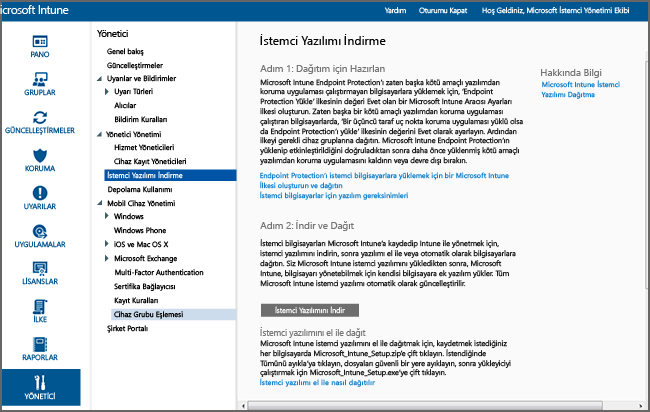

# Microsoft Intune ile Windows bilgisayarı istemcisini yükleme
Windows bilgisayarlarınızın Microsoft Intune istemci yazılımıyla yönetilmesini sağlamanıza yardımcı olması için bu kılavuzu kullanın.

## Başlamadan önce
Intune istemci yazılımını yüklemeye başlamadan önce, istemcinin doğru bir biçimde yüklenmesi için yapılması gerekenleri anlamak üzere [GPO ve Microsoft Intune ilkesi çakışmalarını çözme](resolve-gpo-and-microsoft-intune-policy-conflicts.md) konusunu okuyun ve ardından bu yönergelere geri dönün.

## İstemciyi yükleme
İstemcinin yüklenmesi için bu adımları kullanın:

-   [İstemci yazılımını indirmek için](#to-download-the-client-software)

Ardından, istemcinin yüklenmesini sağlamak için aşağıdaki yöntemlerden birini veya daha fazlasını kullanın:

-   [İstemci yazılımını el ile dağıtmak için](#to-manually-deploy-the-client-software)

-   [İstemci yazılımını Grup İlkesi kullanarak otomatik olarak dağıtmak için](#to-automatically-deploy-the-client-software-by-using-group-policy)

-   [Kullanıcılar kendi bilgisayarlarını kendileri nasıl kaydedebilir](#how-users-can-self-enroll-their-computers)

-   [Microsoft Intune istemci yazılımını bir görüntünün parçası olarak yükleme](#install-the-microsoft-intune-client-software-as-part-of-an-image)

Bir bilgisayarı artık Intune’la yönetmeniz gerekmiyorsa, bilgisayarı devre dışı bırakabilirsiniz; bu durumda, istemci yazılımı da bilgisayardan kaldırılır. Daha fazla bilgi için bkz. [Microsoft Intune bilgisayar istemcisi ile genel Windows bilgisayarı yönetim görevleri](common-windows-pc-management-tasks-with-the-microsoft-intune-computer-client.md).

### İstemci yazılımını indirmek için

1.  [Microsoft Intune yönetim konsolunda](https://manage.microsoft.com/), **Yönetici** &gt; **İstemci Yazılımını İndir**’e tıklayın

  

2.  **İstemci Yazılımını İndir** sayfasında, **İstemci Yazılımını İndir**'e tıklayın ve yazılımı içeren **Microsoft_Intune_Setup.zip** paketini ağınızda güvenli bir konuma kaydedin.

    > [!NOTE]
    > Intune istemci yazılımı yükleme paketi, hesabınız hakkında bilgiler içerir. Yetkisiz kullanıcılar yükleme paketini erişirse, bu kişiler, katıştırılmış sertifikası tarafından temsil edilen hesaba kendi bilgisayarını kaydedebilir.

3.  Yükleme paketinin içeriğini ağınızda güvenli bir konuma ayıklayın.

    > [!IMPORTANT]
    > Ayıklanan **ACCOUNTCERT** dosyasını yeniden adlandırmayın veya kaldırmayın, aksi takdirde istemci yazılımının yüklenmesi başarısız olur.

### İstemci yazılımını el ile dağıtmak için

1.  Bir bilgisayarda, istemci yazılımı yükleme dosyalarının bulunduğu klasöre göz atın ve ardından, istemci yazılımını yüklemek için **Microsoft_Intune_Setup.exe**'yi çalıştırın.

    > [!NOTE]
    > İstemci bilgisayarın görev çubuğundaki simgenin üzerine geldiğinizde yükleme durumu görüntülenir.

### İstemci yazılımını Grup İlkesi kullanarak otomatik olarak dağıtmak için

1.  **Microsoft_Intune_Setup.exe** ve **MicrosoftIntune.accountcert** dosyalarını içeren klasörde, 32 bit ve 64 bit bilgisayarlar için Windows Installer tabanlı yükleme programlarını ayıklamak için aşağıdaki komutu çalıştırın:

    ```
    Microsoft_Intune_Setup.exe/Extract <destination folder>
    ```

2.  **Microsoft_Intune_x86.msi** dosyasını, **Microsoft_Intune_x64.msi** dosyasını ve **MicrosoftIntune.accountcert** dosyasını, istemci yazılımın yükleneceği tüm bilgisayarlar tarafından erişilebilen bir ağ konumuna kopyalayın.

    > [!IMPORTANT]
    > Dosyaları ayırmayın veya yeniden adlandırmayın, aksi takdirde yazılım yüklemesi başarısız olur.

3.  Yazılımı ağınızdaki bilgisayarlara dağıtmak için Grup İlkesi'ni kullanın.

    Otomatik olarak yazılım dağıtmak için Grup İlkesi'ni kullanma hakkında daha fazla bilgi için Windows Server belgelerinize bakın.

### Kullanıcılar kendi bilgisayarlarını kendileri nasıl kaydedebilir
Intune Şirket Portalı üzerinden, son kullanıcılar sahip oldukları her bilgisayarı kendileri kaydedebilir. Kaydedilen her bilgisayar, istemci yazılımını yüklemek için kullanılan kullanıcı hesabına bağlıdır.

> [!NOTE]
> -   Kullanıcının istemci yazılımını yükleyebilmesi için bilgisayarda yönetici olması gerekir.
> -   Kendi kendine kayıt, istemci bilgisayarda Internet Explorer'ın yüklü olmasını gerektirir.
> -   Kullanıcı, kendi kendine kaydettiği her bilgisayar için bir Intune lisansı kullanır.
> -   Bilgisayarı kendi kendinize kaydetmeniz için bir iş veya okul hesabı kullanmanız gerekir. Bir Microsoft hesabı kullanarak bir bilgisayarı kendi kendinize kaydedemezsiniz.
> -   İstemci yazılımı bir bilgisayarda zaten yüklüyse, son kullanıcı bir hata alır.

### Bir bilgisayarı kendi kendinize kaydetmek için (son kullanıcılar için bilgilendirme)

1.  Kaydetmek istediğiniz bilgisayardan şirket portalında oturum açın.

2.   **Cihaz Ekle**'ye tıklayın.

3.   **Yazılım İndir** 'e ve ardından **Çalıştır**'a tıklayın.

4.  Microsoft Intune Kurulum Sihirbazı'nı başlatmak için **İleri**'ye tıklayın.

5.  Kurulum sihirbazı tamamlandığında, **Son**'a tıklayın.

### Microsoft Intune istemci yazılımını bir görüntünün parçası olarak yükleme
Aşağıdaki örnek yordamı temel olarak kullanabilir ve Intune istemci yazılımını bir işletim sistemi görüntüsünün parçası olarak bilgisayarlara dağıtabilirsiniz:

1.  İstemci yükleme dosyaları **Microsoft_Intune_Setup.exe** ve **MicrosoftIntune.accountcert**'i başvuru bilgisayarındaki **%Systemdrive%\Temp\Microsoft_Intune_Setup** klasörüne kopyalayın.

2.   **SetupComplete.cmd** betiğine aşağıdaki komutu ekleyerek **WindowsIntuneEnrollPending** kayıt defteri girişini oluşturun:

    ```
    %windir%\system32\reg.exe add HKEY_LOCAL_MACHINE\Software\Microsoft\Onlinemanagement\Deployment /v
    WindowsIntuneEnrollPending /t REG_DWORD /d 1
    ```

3.  /PrepareEnroll komut satırı bağımsız değişkeniyle kayıt paketini çalıştırmak için **setupcomplete.cmd**’ye aşağıdaki komutu ekleyin:

    ```
    %systemdrive%\temp\Microsoft_Intune_Setup\Microsoft_Intune_Setup.exe /PrepareEnroll
    ```
    > [!TIP]
    >  **SetupComplete.cmd** betiği, bir kullanıcı oturum açmadan önce Windows Kur'un sistemde değişiklikler yapmasını sağlar. **/PrepareEnroll** komut satırı bağımsız değişkeni, Windows Kurulumu tamamlandıktan sonra, hedeflenen bir bilgisayarı Intune hizmetine otomatik olarak kaydolmaya hazırlar.

4.  **SetupComplete.cmd**'yi başvuru bilgisayarındaki **%Windir%\Setup\Scripts** klasörüne koyun.

5.  Başvuru bilgisayarının bir görüntüsünü yakalayın ve bu görüntüyü hedef bilgisayarlara dağıtın.

Windows Kur tamamlandıktan sonra hedef bilgisayar yeniden başlatıldığında, **WindowsIntuneEnrollPending** kayıt defteri anahtarı oluşturulur. Kayıt paketi, bilgisayarın kayıtlı olup olmadığını denetler. Bilgisayar kayıtlıysa, başka eyleme gerek yoktur. Bilgisayar kayıtlı değilse, kayıt paketi bir Microsoft Intune Otomatik Kayıt Görevi oluşturur.

Otomatik kayıt görevi bir sonraki zamanlanan saatte çalıştığında, **WindowsIntuneEnrollPending** kayıt defteri değerinin var olup olmadığını denetler ve hedeflenen bilgisayarı Intune’a kaydetmeye çalışır. Kayıt herhangi bir nedenden dolayı başarısız olursa, görev bir daha çalıştığında kayıt yeniden denenir. Yeniden deneme işlemleri bir ay boyunca devam eder.

Kayıt başarılı olduğunda veya bir ay sonra, Intune Otomatik Kayıt Görevi, **WindowsIntuneEnrollPending** kayıt defteri değeri ve hesap sertifikası hedeflenen bilgisayardan silinir.

## Başarılı istemci dağıtımını izleme ve doğrulama
Başarılı istemci dağıtımını izlemenize ve doğrulamanıza yardımcı olması için aşağıdaki yordamlardan birini kullanın.

### Microsoft Intune yönetici konsolundan istemci yazılımının yüklendiğini doğrulamak için

1.  [Microsoft Intune yönetim konsolunda](https://manage.microsoft.com/), **Gruplar** &gt; **Tüm Cihazlar** &gt; **Tüm Bilgisayarlar**’a tıklayın.

2.  Intune’la iletişim kuran yönetilen bilgisayarları bulmak için bilgisayar listesini aşağı kaydırın veya **Cihazlarda ara** kutusuna bilgisayar adının tamamını ya da bir kısmını yazarak belirli bir yönetilen bilgisayarı arayın.

3.  Konsolun alt bölmesinden bilgisayarının durumunu inceleyin ve varsa hataları çözümleyin.

### Tüm kayıtlı bilgisayarları görüntülemek üzere bir bilgisayar envanteri raporu oluşturmak için

1.  [Microsoft Intune yönetim konsolunda](https://manage.microsoft.com/), **Raporlar** &gt; **Bilgisayar Envanteri Raporları**’na tıklayın.

2.   **Yeni Rapor Oluştur** sayfasında, tüm alanları varsayılan değerleriyle bırakın (filtre uygulamak istemediğiniz sürece) ve **Raporu Görüntüle**'ye tıklayın.

3.  **Bilgisayar Envanteri Raporu** sayfası, Intune’a başarılı bir şekilde kaydedilen tüm bilgisayarların görüntülendiği yeni bir pencerede açılır.

    > [!TIP]
    > Raporu herhangi bir sütunun içeriğine göre sıralamak için sütun başlığına tıklayın.


### Ayrıca Bkz.
[Microsoft Intune ile Windows bilgisayarlarını yönetme](manage-windows-pcs-with-microsoft-intune.md)


<!--HONumber=Jun16_HO4-->


