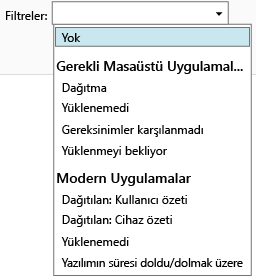

# Microsoft Intune’da uygulama dağıtımlarını izleme

## Uygulama dağıtımı izleme
Intune yönetim konsolunda, yönettiğiniz uygulamaları ve tüm dağıtımların durumunu görebilirsiniz.

### Yönettiğiniz uygulamaları ve bunların durumunu görüntülemek için
**Uygulamalar** çalışma alanında, **Uygulamalar** düğümüne ve ardından **Uygulamalar**’a tıklayın.

Yönettiğiniz uygulamaların listesi görüntülenir. Herhangi bir uygulamaya tıklayarak, yükleme durumunun konsol pencerelerinin alt bölmesinde gösterilmesini sağlayabilirsiniz. Diğer ayrıntıları görmek için bu duruma tıklayın. Örneğin, durum olarak **1 kullanıcı bu yazılımı kullanabilir** gösteriliyorsa, iletiye tıklayarak kullanıcının adını görebilirsiniz.

> [!TIP]
> Yalnızca belirttiğiniz ölçütlere uyan uygulamaları, örneğin yüklenemeyen uygulamaları veya başarılı bir şekilde dağıtılan uygulamaları görüntülemek için **Filtreler** açılan listesini kullanabilirsiniz.
> 
> 

Buna ek olarak, **Pano** çalışma alanında uygulamalarınızın durumuna bir genel bakış sağlanır. Genel bakışın herhangi bir yerine tıklarsanız, uygulamalar listesine gidersiniz.

## Uygulama hakkında ayrıntılı bilgileri görüntülemek için
Uygulamalar listesinde bir uygulama seçin ve ardından **Özellikleri Görüntüle**’ye tıklayın.

Uygulamanın **Yazılım Özellikleri** sayfasında şu sekmelerden birine tıklayın: **Genel** - Uygulama ve uygulamanın yükleme durumu hakkındaki genel bilgileri gösterir, **Cihazlar** - Uygulamanın hedeflenen dağıtımını başarıyla yüklemiş olan cihazları gösterir, **Kullanıcılar** - Cihazları uygulamanın hedeflenen dağıtımını başarıyla yüklemiş olan kullanıcıları gösterir.

Daha önce olduğu gibi, sekmelerin her birinde gösterilen değerleri yapılandırmak için yine **Filtreler** açılan listesini kullanabilirsiniz.

<!--HONumber=Jul16_HO3-->

