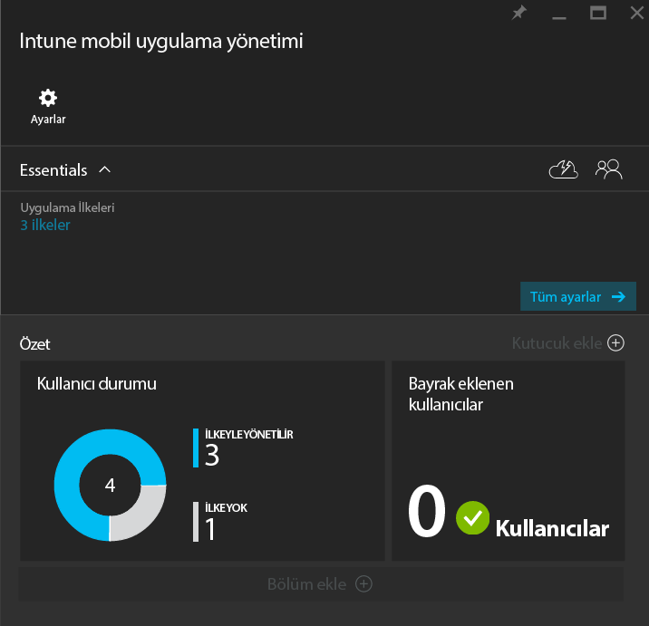
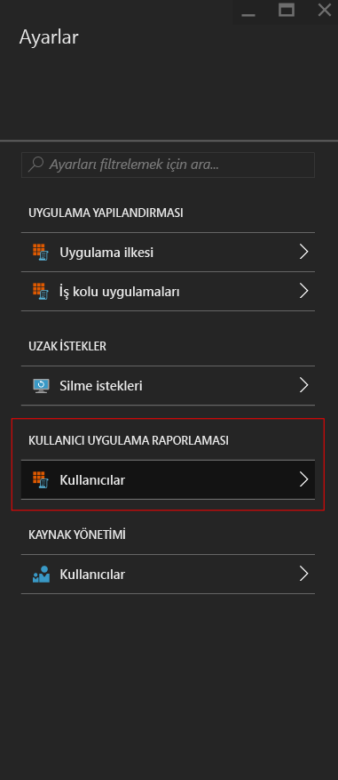
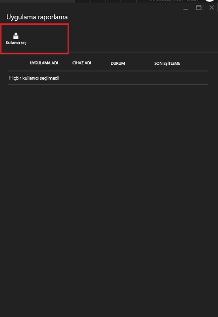
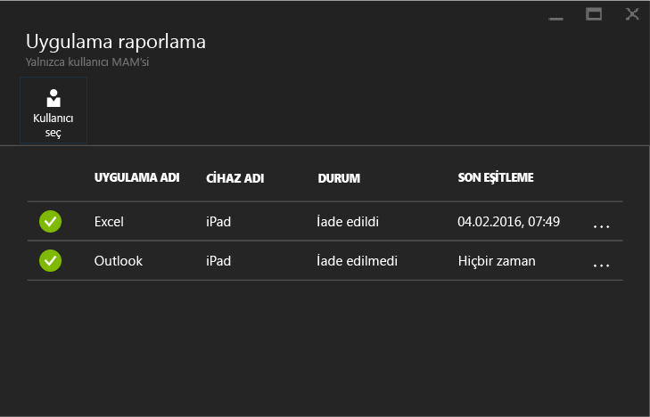

# Microsoft Intune ile mobil uygulama yönetimi ilkelerini izleme
MAM ilkesini yapılandırdıktan ve kullanıcılara uyguladıktan sonra, [Azure portalında](https://portal.azure.com) uyumluluk durumunu izleyebilirsiniz. Azure portalında, ilkeden etkilenen kullanıcılar hakkında bilgiler, uyumluluk durumu ve son kullanıcılarınızın karşılaşmış olabileceği sorunlar bulunur.
## Özet görünümü
**Intune mobil uygulama yönetimi** dikey penceresinde, aşağıda açıklandığı gibi uyumluluk durumunun özetini görebilirsiniz:

-   **KULLANICILAR:** Şirketinizde ilkeyle ilişkilendirilmiş uygulamaları kullanan kullanıcıların toplam sayısı.

-   **İLKEYLE YÖNETİLEN:**- Uygulamalardan en az birini iş bağlamında kullanmış olan kullanıcıların sayısı.

-   **İLKE YOK:** İlkeyle ilişkilendirilmiş uygulamaları kullanan ancak ilkenizin hedeflediği kullanıcılar arasında yer almayan kullanıcıların sayısı.  Bu kullanıcıları ilkenize eklemeyi göz önüne alabilirsiniz.

- **Bayrak eklenen kullanıcılar:** Sorun yaşayan kullanıcıların sayısı. Şu anda yalnızca işletim sistemi kısıtlamaları kaldırılmış cihazlara sahip kullanıcılar, **Bayrak eklenen kullanıcılar** kapsamında raporlanır.

## Ayrıntılı görünüm
**Kullanıcı durumu** kutucuğuna ve **Bayrak eklenen kullanıcılar** kutucuğuna tıklayarak özetin ayrıntılı görünümünü elde edebilirsiniz.

### Kullanıcı durumu
Tek bir kullanıcıyı arayabilir ve o kullanıcının uyumluluk durumuna bakabilirsiniz. **Uygulama raporlama** dikey penceresinde, seçilen kullanıcı için aşağıdaki bilgiler görüntülenir:
- Kullanıcı hesabıyla ilişkilendirilmiş cihaz(lar)
- Cihazda MAM ilkesine sahip uygulama(lar)
- Durum:

  **Giriş yaptı:** Bu, ilkenin kullanıcıya dağıtıldığı ve uygulamanın en az bir kez iş bağlamında kullanıldığı anlamına gelir.

  **Giriş yapmadı**: B, ilkenin kullanıcıya dağıtıldığı, ancak o zaman beri uygulamanın iş bağlamında kullanılmadığı anlamına gelir.

>[!NOTE]
> Aradığınız kullanıcıya MAM ilkesi dağıtılmamışsa, kullanıcının hiçbir uygulama ilkesinde hedeflenmediğini bildiren bir ileti görürsünüz.

Kullanıcının raporlamasını görmek için şu adımları izleyin:

**1. Adım:**  Kullanıcı seçmek için, Özet kutucuğuna tıklayın ve aşağıda gösterildiği gibi **Ayarlar** dikey penceresinde **KULLANICI TARAFINDAN UYGULAMA RAPORLAMA**’yı seçin:

**2. Adım:** Bu, **Uygulama raporlama** dikey penceresini açar. Bir Azure Active Directory kullanıcısını aramak için **Kullanıcı seç** öğesini seçin.

**3. Adım:** Listeden kullanıcıyı seçtikten sonra, o kullanıcıya ilişkin uyumluluk durumunun ayrıntılarını görürsünüz.

### Bayrak eklenen kullanıcılar
Ayrıntılı görünümde hata iletisi, hata oluştuğunda erişilmiş olan uygulama, cihazın platformu ve zaman damgası gösterilir.  

### Ayrıca bkz.
[iOS uygulamaları arasında veri aktarımını yönetme](manage-data-transfer-between-ios-apps-with-microsoft-intune.md)

* [Android uygulamanız MAM ilkeleri tarafından yönetildiğinde beklemeniz gerekenler](user-experience-for-mam-enabled-android-apps-with-microsoft-intune.md)
* [iOS uygulamanız MAM ilkeleri tarafından yönetildiğinde beklemeniz gerekenler](user-experience-for-mam-enabled-ios-apps-with-microsoft-intune.md)

<!--HONumber=Oct16_HO3-->

