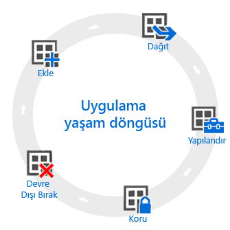

# Uygulama yaşam döngüsüne genel bakış

Intune uygulama yaşam döngüsü, bir uygulama eklendiğinde başlar, ek aşamalardan geçerek siz uygulamayı kaldırana kadar devam eder.

## Ekleme

Uygulama dağıtımında ilk adım, yönetmek ve dağıtmak istediğiniz uygulamayı Intune’a eklemektir. Çalışabileceğiniz birçok farklı uygulama türü olmasına karşın, temel yordamlar aynıdır. Intune hem [kayıtlı cihazlar](add-apps-for-mobile-devices-in-microsoft-intune.md) için, hem de [Intune istemci yazılımıyla yönettiğiniz Windows bilgisayarları](add-apps-for-windows-pcs-in-microsoft-intune.md) için uygulama eklemenize olanak tanır.

## Dağıtma

Uygulamayı Intune’a ekledikten sonra, [bunu yönettiğiniz cihazlara dağıtabilirsiniz](deploy-apps.md). Intune bu işlemi kolaylaştırır ve uygulama dağıtıldıktan sonra, Intune yönetim konsolundan dağıtımın [başarısını izleyebilirsiniz](monitor-apps-in-microsoft-intune.md). Buna ek olarak, [Apple](manage-ios-apps-you-purchased-through-a-volume-purchase-program-with-microsoft-intune.md) ve [Windows](manage-apps-you-purchased-from-the-windows-store-for-business-with-microsoft-intune.md) uygulama mağazaları gibi bazı uygulama mağazaları şirketinize toplu uygulama lisansları satın almanıza olanak tanır. Intune, bu tür uygulamalarda doğrudan Intune yönetim konsolundan lisans dağıtımı yapmanızı ve lisans kullanımını izlemenizi sağlamak için, verileri bu mağazalarla eşitleyebilir.

## Yapılandırma

Uygulama yaşam döngüsü kapsamında, uygulamaların yeni sürümleri düzenli olarak kullanıma sunulur. Intune, dağıtmış olduğunuz uygulamaları kolayca yeni sürüme [güncelleştirmeniz](update-apps-using-microsoft-intune.md) için araçlar sağlar. Buna ek olarak, bazı uygulamalar fazladan işlevsellik yapılandırmanıza da olanak tanır; örneğin:
- [iOS uygulama yapılandırma ilkeleri](configure-ios-apps-with-mobile-app-configuration-policies-in-microsoft-intune.md) ile, uyumlu iOS uygulamaları için uygulama çalıştırıldığında kullanılan ayarlar sağlayabilirsiniz. Örneğin, uygulama için belirli marka ayarları veya bağlantı kurulacak sunucunun adı gerekiyor olabilir.
- [Yönetilen tarayıcı ilkeleri](manage-internet-access-using-managed-browser-policies.md), varsayılan cihaz tarayıcısının yerini alan ve kullanıcılarınızın ziyaret edebileceği web sitelerini kısıtlayan Intune yönetilen tarayıcısı için ayarları yapılandırmanıza yardımcı olur.

## Koruma

Intune, uygulamalarınızdaki verileri korumaya yardımcı olmanın yollarını sağlar. Ana yöntemler şunlardır:
- [Koşullu erişim](restrict-access-to-email-and-o365-services-with-microsoft-intune.md), cihaz türleri gibi sizin belirttiğiniz koşullar veya dağıttığınız [cihaz uyumluluk ilkesiyle](introduction-to-device-compliance-policies-in-microsoft-intune.md) uyumluluk temelinde e-postaya ve diğer hizmetlere erişimi denetlemenize olanak tanır.
- [Mobil uygulama yönetimi (MAM)](protect-app-data-using-mobile-app-management-policies-with-microsoft-intune.md), tek tek uygulamalarla çalışarak bunların kullandığı şirket verilerinin korunmasına yardımcı olur. Örneğin, yönetilmeyen uygulamalarla sizin yönettiğiniz uygulamalar arasında veri kopyalamayı kısıtlayabilirsiniz ya da uygulamaların yazılım kilidi kırılmış veya kök erişimine izin verilmiş cihazlarda çalıştırılmasını önleyebilirsiniz.

## Devre Dışı Bırakma

Sonunda, büyük olasılıkla dağıttığınız uygulamalar eskir ve kaldırılmaları gerekir. Intune, [uygulamaları hizmette devre dışı bırakmayı](retire-apps-using-microsoft-intune.md) kolaylaştırır.

<!--HONumber=Jul16_HO4-->

