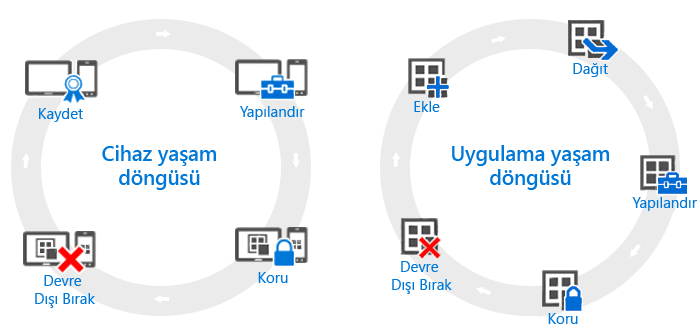

# Cihaz ve uygulama yaşam döngülerine genel bakış

Tek tek kuruluşların gereksinimleri farklılık gösterebilse de, operasyonel gereksinimleri ne olursa olsun tüm kuruluşların sürekli izlemek zorunda olacakları bazı ortak adımlar vardır. Bunlar, **yaşam döngüleri** terimiyle gösterilen iki ana kategoride gruplandırılabilir. Takip ettiğiniz dağıtım yaşam döngüsü, etkinleştirmeye çalıştığınız senaryoya bağlıdır. Örneğin, yalnızca cihaz yaşam döngüsüne, yalnızca uygulama yaşam döngüsüne veya her ikisine birden ihtiyacınız olabilir.

Yönetim amacıyla, tüm cihazların kayıttan başlayıp artık gerekmediği aşamada devre dışı bırakılmasına kadar süren bir yaşam döngüsü vardır. [Aygıt yönetimi yaşam döngüsü](overview-of-device-lifecycle-in-microsoft-intune.md) tüm kayıt seçeneklerinde, bu cihazları yapılandırmak ve korumak için izleyebileceğiniz yollarda ve cihazların yönetimden kaldırılmasında size yol gösterir.

Benzer şekilde, üzerinde çalıştığınız uygulamaların da kendi [uygulama yaşam döngüleri](overview-of-app-lifecycle-in-microsoft-intune.md) vardır. Bu, uygulamayı Intune’a eklemekle başlar ve artık gerekmedikleri aşamada kaldırılmalarına kadar sürer.

<!--HONumber=Jul16_HO3-->

