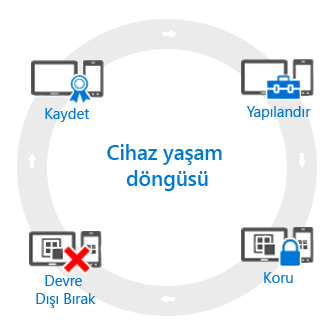

---
# required metadata

title: Cihaz yaşam döngüsüne genel bakış | Microsoft Intune
description:
keywords:
author: robstackmsft
manager: jeffgilb
ms.date: 04/28/2016
ms.topic: article
ms.prod:
ms.service: microsoft-intune
ms.technology:
ms.assetid: f6051fa7-133f-4712-86a5-e5f5bc5ab3c7

# optional metadata

#ROBOTS:
#audience:
#ms.devlang:
ms.reviewer: jeffgilb
ms.suite: ems
#ms.tgt_pltfrm:
#ms.custom:

---

# Mobil cihaz yönetimi (MDM) yaşam döngüsüne genel bakış

Intune cihaz yaşam döngüsü cihazın ilk kaydıyla başlar ve çeşitli adımlarda ilerleyerek cihazın artık gerekli olmadığı aşamada son bulur.

## Kaydetme
Günümüzün mobil cihaz yönetimi (MDM) stratejileri, çeşitli telefonlar ve tabletler ve bilgisayarlarla (iOS, Android, Windows ve Mac OS X) ilgilenir. Şirkete ait cihazlarda çoğunlukla söz konusu olduğu gibi cihazı yönetebilmeniz gerekiyorsa, ilk adım [cihaz kaydını ayarlamaktır](enroll-devices-in-microsoft-intune.md). Windows bilgisayarları da Intune’a (MDM) kaydederek veya [Intune istemci yazılımını yükleyerek](manage-windows-pcs-with-microsoft-intune.md) yönetebilirsiniz.

## Yapılandırma
Cihazlarınızın kaydını yaptırmak yalnızca ilk adımdır. Tüm bu Intune tekliflerinden yararlanmak, ayrıca cihazlarınızın güvenli ve şirket standartlarıyla uyumlu olduğundan emin olmak için, yönetilen cihazların çalışmasını neredeyse her açıdan yapılandırmanıza olanak tanıyan çok çeşitli **ilkeler** arasından seçim yapabilirsiniz. Örneğin, kullanıcılar şirket verilerini içeren cihazlarda parola kullanmalı mı? Bir parola gerektirebilirsiniz. Kurumsal Wifi bağlantınız var mı? Otomatik olarak yapılandırabilirsiniz. Aşağıdaki türlerde yapılandırma seçenekleri sağlanır:

- [**Yapılandırma ilkeleri**](manage-settings-and-features-on-your-devices-with-microsoft-intune-policies.md) - Bu ilkeler, yönettiğiniz cihazların özelliklerinin ve yeteneklerinin nasıl çalışacağını yapılandırmanızı sağlar. Örneğin, Windows Phone’larda parola kullanımını zorunlu tutabilir veya iPhone’larda kamera kullanımını devre dışı bırakabilirsiniz.
- [**Şirket kaynağına erişim ilkeleri**](enable-access-to-company-resources-with-microsoft-intune.md) - Kullanıcılarınıza kişisel cihazlarını kullanarak işlerine erişme izni verirseniz, bu size sorunlar çıkarabilir. Örneğin, şirket e-postasına erişmesi gereken tüm cihazların doğru yapılandırıldığından nasıl emin olursunuz? Kullanıcıların, çoğunlukla çok karmaşık olan gerekli ayarları bilmek zorunda kalmadan, VPN bağlantısıyla şirket ağına erişebilmelerini nasıl sağlayabilirsiniz? Intune, yönettiğiniz cihazları ortak şirket kaynaklarına erişecek şekilde otomatik olarak yapılandırarak bu yükü azaltmaya yardımcı olabilir.
- [**Windows bilgisayarı yönetim ilkeleri (Intune istemci yazılımıyla)**](common-windows-pc-management-tasks-with-the-microsoft-intune-computer-client.md) - Windows bilgisayarlarını Intune’a kaydetmek size en kapsamlı cihaz yönetim özelliklerini getirirken, Intune Windows bilgisayarlarının yönetimini desteklemeye Intune istemci yazılımıyla devam eder. Bilgisayarlarla gerçekleştirebileceğiniz görevlerden bazıları hakkında bilgi almanız gerekiyorsa, buradan başlayın.

## Koruma
Modern BT dünyasında cihazları yetkisiz erişime karşı korumak, yerine getireceğiniz en önemli görevlerden biridir. Cihaz yaşam döngüsünün **Yapılandırma** adımındaki öğelere ek olarak, Intune yönettiğiniz cihazları yetkisiz erişime veya kötü amaçlı saldırılara karşı korumaya yardımcı olmak için başka özellikler de sağlar:
- [**Çok faktörlü kimlik doğrulaması**](protect-windows-devices-with-multi-factor-authentication.md) - Kullanıcı oturum açma işlemlerine fazladan bir kimlik doğrulama katmanı daha eklemek cihazların daha da güvenli olmasına yardım edebilir. Windows, Windows Phone ve Windows Mobile cihazları çok faktörlü kimlik doğrulaması sunar. Bu, kullanıcılar erişim kazanmadan önce telefonla arama veya kısa mesaj gibi ikinci bir kimlik doğrulama düzeyini gerektirir.
- [**Microsoft Passport ayarları**](control-microsoft-passport-settings-on-devices-with-microsoft-intune.md) - Microsoft Passport, kullanıcıların parolaya gerek kalmadan parmak izi gibi bir *hareket* veya Windows Hello kullanarak oturum açmalarına olanak tanıyan alternatif bir oturum açma yöntemidir.
- [**Windows bilgisayarlarını korumaya yönelik ilkeler (Intune istemci yazılımıyla)**](policies-to-protect-windows-pcs-in-microsoft-intune.md) - Windows bilgisayarlarını Intune istemci yazılımını kullanarak yönetirken, yönettiğiniz bilgisayarlarda Endpoint Protection’ın, yazılım güncelleştirmelerinin ve Windows Güvenlik Duvarı’nın ayarlarını denetlemenize izin veren ilkeler sağlanır.

## Devre dışı bırakma
Cihaz kaybolduğunda veya çalındığında, değiştirilmesi gerektiğinde veya kullanıcılar başka bir pozisyona geçtiğinde, çoğunlukla cihazı [devre dışı bırakmanın veya temizlemenin](use-remote-wipe-to-help-protect-data-using-microsoft-intune.md) zamanı gelmiştir. Cihazı sıfırlamaktan yönetimden kaldırmaya veya üzerindeki şirket verilerini temizlemeye kadar değişen çok çeşitli yollarla bunu yapabilirsiniz.

<!--HONumber=May16_HO2-->

