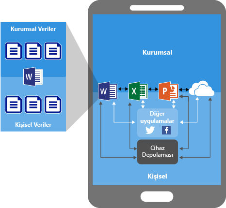
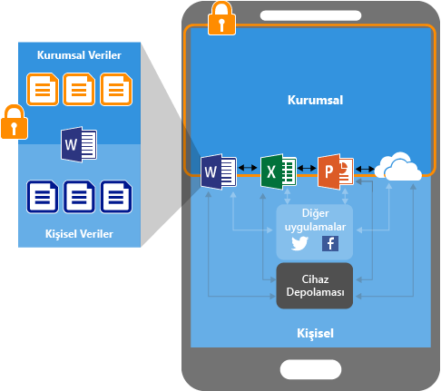
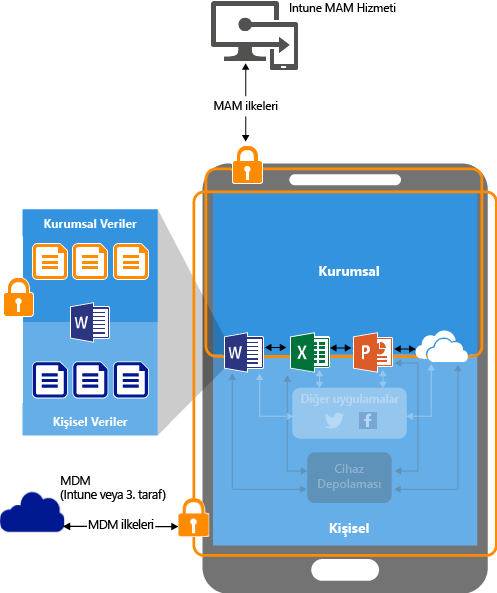
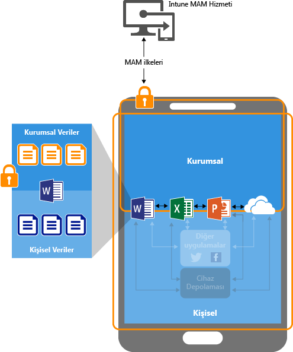

# Mobil uygulama yönetimi ilkelerini kullanarak uygulama verilerini koruma

## Uygulama verilerinizi nasıl koruyabilirsiniz?
Çalışanlarınız hem kişisel hem de iş amaçlı görevler için mobil cihazlar kullanır.  Bir yandan çalışanlarınızın üretken olmasını sağlarken diğer yandan, isteyerek ve istemeyerek yaşanabilecek veri kayıplarını önlemek isteyebilirsiniz.  Ayrıca, tarafınızdan yönetilmediği durumda dahi cihazları kullanarak erişilen şirket verilerini koruma becerisine sahip olmak istersiniz.

Şirketinizin verilerini korumaya yardımcı olmak için Intune mobil uygulama yönetimi (MAM) ilkelerini kullanabilirsiniz. Intune MAM ilkeleri, **herhangi bir mobil cihaz yönetimi (MDM) çözümünden bağımsız olarak** kullanılabildiğinden, bunu, cihazları bir cihaz yönetimi çözümüne kaydederek veya kaydetmeden, şirketinizin verilerini korumak üzere kullanabilirsiniz. **Uygulama düzeyinde ilkeler** uygulayarak, şirket kaynaklarına erişimi kısıtlayabilir ve verileri BT departmanınızın kapsamında tutabilirsiniz.

Aşağıdaki özelliklere sahip cihazlarda çalıştırılan uygulama için MAM ilkeleri yapılandırılabilir:

- **Microsoft Intune’a kayıtlı:** Bu kategorideki cihazlar normalde şirkete ait cihazlardır.

-   **Bir üçüncü taraf mobil cihaz Yönetimi (MDM) çözümde kayıtlı:**   Bu kategorideki cihazlar normalde şirkete ait cihazlardır.

  > [!NOTE]
  > mobil uygulama yönetimi ilkeleri, üçüncü taraf mobil uygulama yönetimi veya güvenli kapsayıcı çözümleri ile birlikte kullanılmamalıdır.

-   **Herhangi bir mobil cihaz yönetimi çözümünde kayıtlı değil:** Bu kategorideki cihazlar normalde Intune veya diğer MDM çözümlerinde yönetilmeyen veya kayıtlı olmayan, çalışana ait cihazlardır.

> [!IMPORTANT]
> Office 365 hizmetlerine bağlanan Office mobil uygulamaları için mobil uygulama yönetimi ilkeleri oluşturabilirsiniz. MAM ilkeleri, şirket içi Exchange, Skype Kurumsal veya SharePoint hizmetlerine bağlanan uygulamalar için desteklenmez.

**MAM ilkelerini kullanmanın önemli avantajları şunlardır:**

-   Şirket verilerinizi uygulama düzeyinde koruma.  Mobil uygulama yönetimi cihaz yönetimi gerektirmediğinden, hem yönetilen hem de yönetilmeyen cihazlardaki şirket verilerini koruyabilirsiniz. Yönetim, kullanıcı kimliğine odaklandığından cihaz yönetimine gerek kalmaz.

-   Son kullanıcının üretkenliği etkilenmez ve uygulama kişisel bağlamda kullanılırken ilkeler uygulanmaz.  İlkeler yalnızca çalışma bağlamında uygulanır; böylece kişisel verilere dokunmadan şirket verilerini koruyabilirsiniz.

MDM’yi MAM ilkeleriyle kullanmanın başka avantajları vardır ve şirketler, MDM’li ve MDM’siz MAM’yi aynı anda kullanabilir. Örneğin, bir çalışan, şirket tarafından verilen bir telefonun yanı sıra kişisel bir tablet kullanabilir.  Bu durumda, şirket telefonu MDM’ye kaydedilir ve MAM ilkeleriyle korunur. Kişisel cihaz ise yalnızca MAM ilkeleriyle korunur.

- **MDM, cihazın korunmasını sağlar**.  Örneğin, cihaza erişim için PIN’i zorunlu kılabilir veya yönetilen uygulamaları cihaza dağıtabilirsiniz. Ayrıca, uygulama yönetimi üzerinde daha fazla denetime sahip olmak için uygulamaları MDM çözümünüz aracılığıyla cihazlara dağıtabilirsiniz.

- **MAM ilkeleri, uygulama katmanı korumalarının kullanılmasını sağlar**. Örneğin, bir uygulamayı çalışma bağlamında açmak için PIN’i zorunlu kılabilir, verilerin uygulamalar arasında paylaşılıp paylaşılmayacağını belirleyebilir ya da şirket uygulama verilerinin kişisel bir depolama konumuna kaydedilmesini engelleyebilirsiniz.

### MAM ilkeleri şu anda aşağıdakilerde desteklenir:
-   iOS 8.1 veya üzeri

-   Android 4 veya üzeri

Windows cihazları şu anda desteklenmez.
##  MAM ilkeleri, uygulama verilerini nasıl korur?

####  MAM ilkeleri olmayan uygulamalar:

Uygulamalar kısıtlama olmadan kullanıldığında, şirket verileri ile kişisel veriler birbirine karışabilir.  Şirket verileri, kişisel depolama alanı gibi konumlara düşebilir veya kapsamınızın dışındaki uygulamalara aktarılarak veri kaybına neden olabilir. Şemadaki oklar, uygulamalar arasındaki (şirket ve kişisel) ve depolama konumlarına yönelik kısıtlanmamış veri hareketlerini gösterir.

### MAM ilkeleriyle veri koruma:

MAM ilkelerini, şirket verilerinin cihazın yerel depolama birimine kaydedilmesini önlemek için ve MAM ilkeleriyle korunmayan diğer uygulamalara veri hareketini kısıtlamak için kullanabilirsiniz. MAM ilkesi ayarları aşağıdakileri içerir:
- **Farklı Kaydetmeyi Engelle**, **Kesme, kopyalama ve yapıştırma işlemlerini kısıtla** gibi veri yer değiştirme ilkeleri.
- **Erişim için basit PIN gerektir**, **Jailbreak uygulanmış veya kök erişim izni verilmiş cihazlarda, yönetilen uygulamaların çalışmasını engelle** gibi erişim ilkesi ayarları.

### Bir MDM çözümüyle yönetilen cihazlarda MAM ilkeleriyle veri koruması:

**Bir MDM çözümüne kaydedilen cihazlar için**-

Yukarıdaki çizimde, MDM ve MAM ilkelerinin birlikte sunduğu koruma katmanları gösterilmektedir.

MDM çözümü:

-   Cihazı kaydeder

-   Uygulamaları cihaza dağıtır

-   Sürekli cihaz uyumluluğu ve yönetimi sağlar

**MAM ilkeleri, aşağıdakileri yaparak katkıda bulunur:**

-   Şirket verilerinin tüketici uygulamalarına ve hizmetlerini sızmasını önlemeye yardımcı olma

-   Mobil uygulamalara kısıtlamalar (farklı kaydet, pano, PIN, vs.) uygulama

-   Uygulamaları cihazdan kaldırmadan şirket verilerini uygulamalardan silme

### Kaydolmamış cihazlar için MAM ilkeleriyle veri koruması

Yukarıdaki şemada, veri koruma ilkelerinin uygulama düzeyinde MDM olmadan nasıl çalıştığı gösterilmektedir.

MAM ilkeleri, herhangi bir MDM çözümüne kayıtlı olmayan KCG cihazları için şirket verilerinin uygulama düzeyinde korunmasına yardımcı olabilir.
Ancak, dikkat edilmesi gereken bazı sınırlamalar vardır, örneğin:

-   Uygulamaları cihaza dağıtamazsınız.  Son kullanıcı, uygulamaları mağazadan almak zorundadır.

-   Bu cihazlarda sertifika profillerini sağlayamazsınız.

-   Bu cihazlarda şirket Wi-Fi ve VPN ayarlarını sağlayamazsınız.

## Çoklu kimlik

Çoklu kimliği destekleyen uygulamalar, uygulamalar iş bağlamında kullanıldığında MAM ilkelerinin uygulandığı uygulamaların aynısına erişmek için farklı hesaplar kullanma (iş ve kişisel) yeteneği sağlar.  

Örneğin, son kullanıcı kendi iş hesabını kullanarak OneDrive uygulamasını başlattığında, dosyaları bir kişisel depolama konumuna taşıyamaz. Ancak, son kullanıcı kendi kişisel hesabıyla OneDrive kullandığında, kişisel Onedrive’larından kısıtlama olmadan veri kopyalayabilir ve taşıyabilir.  

MAM ilkeleriyle ilişkili uygulamaları kullanma deneyimine dair ve Çoklu kimliği olan uygulamaların yalnızca iş bağlamında MAM ilkeleri uygulanmasını sağlamayı nasıl desteklediğine dair ayrıntılı bir açıklama için, bkz. [çoklu kimlik desteği olan uygulamaları kullanma](end-user-experience-for-mam-enabled-apps-with-microsoft-intune.md#using-apps-with-multi-identity-support)

Tüm Office mobil uygulamaları çoklu kimliği destekler.

##  Sonraki adımlar
[Mobil uygulama yönetimi ilkelerini yapılandırmak için hazırlama](get-ready-to-configure-mobile-app-management-policies-with-microsoft-intune.md)

[Microsoft Intune ile mobil uygulama yönetimi ilkeleri oluşturma ve dağıtma](create-and-deploy-mobile-app-management-policies-with-microsoft-intune.md)

<!--HONumber=Jul16_HO5-->

