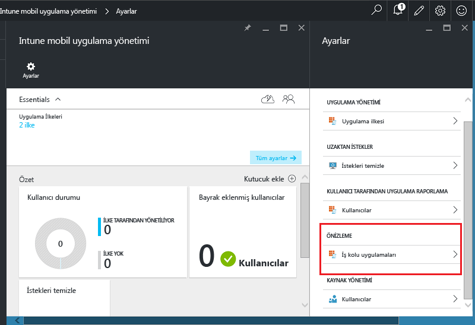
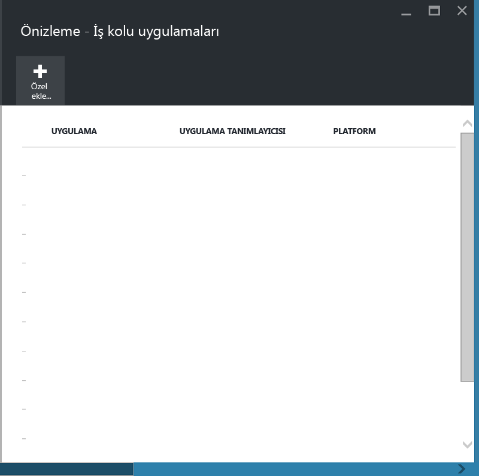
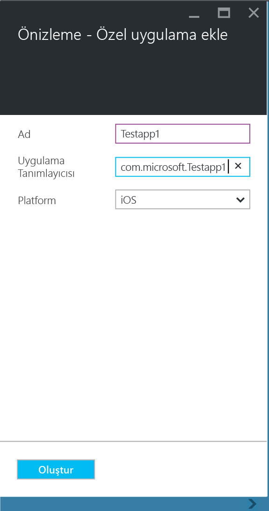
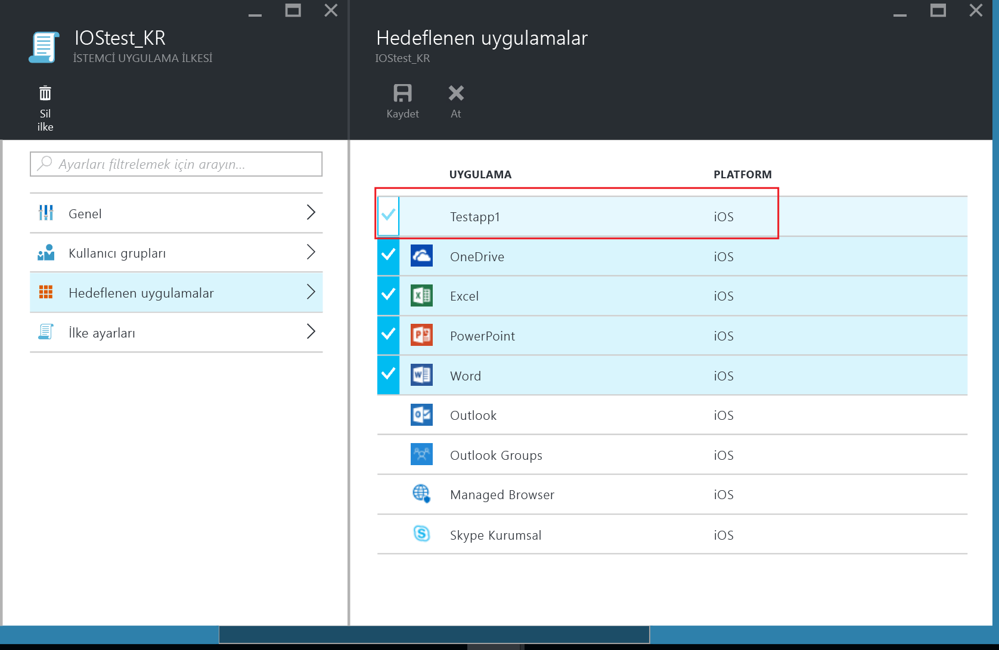
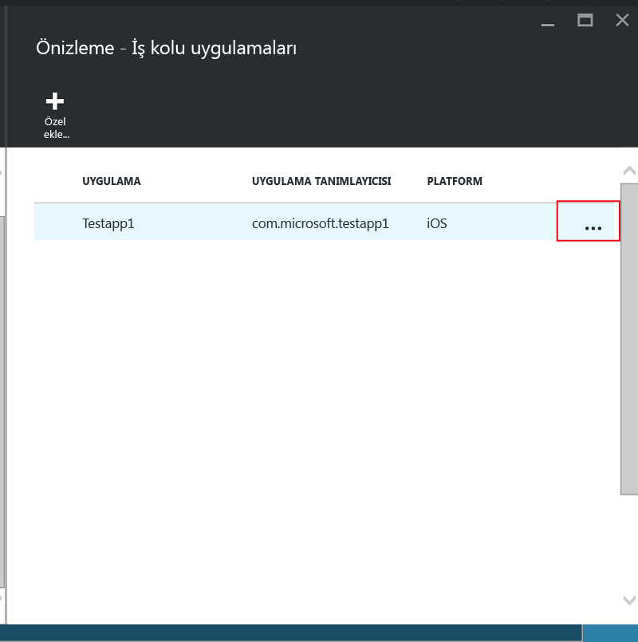
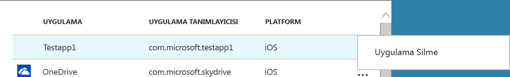

# Microsoft Intune’da kayıtlı olmayan cihazlardaki iş kolu uygulamalarını ve verilerini koruma

Mobil uygulama yönetimi (MAM) ilkeleri, şirket verilerinin dışarıya sızmasına neden olabilecek eylemleri kısıtlayarak ve uygulama PIN’i gibi veri erişim gereksinimleri uygulayarak şirket verilerinin korunmasına yardımcı olur. iOS ve Android iş kolu uygulamalarına MAM ilkelerini uygulamak için önce Microsoft Intune Uygulama Sarmalama aracıyla uygulamayı sarmalamanız gerekir.  Uygulama sarmalama, temel uygulamada hiçbir değişiklik yapılmasına gerek kalmadan mobil uygulamaya bir yönetim katmanı uygulama işlemidir.  Uygulama sarmalandıktan sonra, buna MAM ilkeleri uygulayabilir ve bunu son kullanıcılarınıza dağıtabilirsiniz.  

Bu konu başlığı altında, **çalışanın sahip olduğu yönetilmeyen cihazlarda** ve **üçüncü taraf bir mobil cihaz yönetimi (MDM) çözümü** tarafından yönetilen cihazlarda erişilen uygulamalara MAM ilkeleri uygulamak için gereken adımlar açıklanır.  **Intune MDM’e kaydedilmiş cihazlarda** çalıştırılan iş kolu uygulamalarınızı hazırlamak için bkz. [Microsoft Intune ile uygulamaların mobil uygulama yönetimi için nasıl hazırlanacağına karar verme](decide-how-to-prepare-apps-for-mobile-application-management-with-microsoft-intune.md).

##  1. Adım: Uygulamayı hazırlama
Uygulamaya MAM ilkelerini uygulayabilmek için, önce Microsoft Intune Uygulama Sarmalama aracıyla uygulamayı sarmalamanız gerekir.  Uygulama sarmalama aracını indirme ve kullanma yönergeleri için aşağıdaki sayfalara göz atın:

- [Intune Uygulama Sarmalama Aracı ile iOS uygulamalarını mobil uygulama yönetimi için hazırlama](prepare-ios-apps-for-mobile-application-management-with-the-microsoft-intune-app-wrapping-tool.md) 
- [Android uygulamalarını Intune Uygulama Sarmalama Aracı ile mobil uygulama yönetimi için hazırlama](prepare-android-apps-for-mobile-application-management-with-the-microsoft-intune-app-wrapping-tool)

>[!IMPORTANT]  
>Uygulama sarmalama aracının Intune’a kayıtlı olmayan cihazları destekleyen bu sürümü, iOS’ta desteklenir ve Android’de genel önizlemede desteklenir. Aracı iOS için [bu GitHub deposundan](https://github.com/msintuneappsdk/intune-app-wrapping-tool-ios), Android içinse [bu GitHub deposundan](https://github.com/msintuneappsdk/intune-app-wrapper-android-preview) indirebilirsiniz.

## 2. Adım: Uygulamayı ekleme

İş kolu uygulamanızı MAM ilkeleriyle ilişkilendirmek için, aşağıdaki adımları kullanarak uygulama ayrıntılarını Intune aboneliğinize/kiracılığınıza eklemelisiniz:

1. [Azure portalında](https://portal.azure.com/) **Intune mobil uygulama yönetimi > Ayarlar**’a gidin ve **İş kolu uygulamaları**’nı seçin.

  

2. **İş kolu uygulamaları** dikey penceresinde **Özel uygulama ekle**’yi seçin.

  
3.  Uygulama için bir ad, Uygulama tanımlayıcısı alanında paket tanımlayıcısını ve platformu (iOS veya Android) sağlayın.

   Bu adım benzersiz uygulama listenizi oluşturmaya yardımcı olur.  Sonraki adımda açıklandığı gibi, uygulama kiracınızın MAM ilkesine ilişkin Hedeflenen uygulamalar listesinde de görüntülenir.

## 3. Adım: MAM ilkelerini uygulama
Uygulama meta verileri hizmete yüklendikten sonra, bu uygulama uygulamalar listesinde gösterilir.  Artık [yeni ilke oluşturabilir veya var olan ilkeyi kullanabilir](create-and-deploy-mobile-app-management-policies-with-microsoft-intune.md) ve 2. adımda eklediğiniz iş kolu uygulamasına bunu uygulayabilirsiniz.

>[!IMPORTANT]
>MAM ilkesiyle, sarmalanan uygulamayı kullanacak olan kullanıcıları hedeflemelisiniz.  Kendilerine bu ilke dağıtılmayan kullanıcılar, uygulamayı kullanamaz.

  
## 4. Adım: Uygulamayı dağıtma
Uygulamaları son kullanıcılarınıza aşağıdaki yollarla dağıtabilirsiniz:
* Üçüncü taraf bir MDM çözümüne kayıtlı cihazlar için, uygulamaları MDM çözümünüz aracılığıyla dağıtabilirsiniz.
* Hiçbir MDM çözümüyle yönetilmeyen cihazlar için, özel bir çözüme ihtiyacınız vardır. Son kullanıcıların uygulamayı cihazlarına indirmeleri ve yüklemeleri gerekir.

## Meta verileri değiştirme
Uygulamanın adı veya Paket tanımlayıcısı gibi uygulama ayrıntılarını değiştirmeniz gerekiyorsa, [uygulamayı kaldırmalı](#remove-apps) ve yeni meta verilerle [eklemelisiniz](#step-2-add-the-app).

##  Uygulamaları kaldırma
Uygulama listesinden bir iş kolu uygulamasını kaldırabilirsiniz.  Bu işlem uygulamayı listeden kaldırır ve MAM ilkeleriyle ilişkisini kaldırır ama uygulamayı son kullanıcının cihazından kaldırmaz.  

1.  [Azure portalında](https://portal.azure.com/) **Intune mobil uygulama yönetimi > Ayarlar**’a gidin.  **Ayarlar** dikey penceresinde **İş kolu**’nu seçerek var olan uygulamalar listesini açın.  
2.  Kaldırmak istediğiniz uygulamayı seçin ve ardından **(…) bağlam** menüsünü seçin.

  
3.  Uygulamayı silmek için **Uygulama Sil**’i seçin.

  

  Bu işlem, uygulamaları iş kolu uygulamaları listesinden ve MAM ilkesindeki Hedeflenen uygulamalar listesinden kaldırır.

<!--HONumber=Sep16_HO4-->

