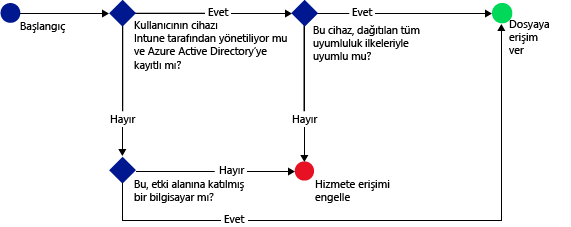

# Microsoft Intune’la SharePoint Online’a erişimi kısıtlama
SharePoint Online’da bulunan dosyalara erişimi denetlemek için [!INCLUDE[wit_firstref](../includes/wit_firstref_md.md)] koşullu erişimini kullanın.
Koşullu erişim iki bileşenden oluşur:
- Cihazın uyumlu kabul edilmesi için uyması gereken cihaz uyumluluk ilkesi.
- Cihazın hizmete erişebilmek için uyması gereken koşulları sizin belirlediğiniz koşullu erişim ilkesi.
Koşullu erişimin nasıl çalıştığıyla ilgili bilgi almak için, [e-posta, O365 hizmetleri ve diğer hizmetlere erişimi kısıtlama](restrict-access-to-email-and-o365-services-with-microsoft-intune.md) konusunu okuyun.

Uyumluluk ve koşullu erişim ilkeleri kullanıcıya dağıtılır. Kullanıcının hizmetlere erişirken kullandığı her cihaz, ilkelerle uyumluluk açısından denetlenir.

Kullanıcı cihazında OneDrive gibi desteklenen bir uygulama kullanarak bir dosyaya bağlanmaya çalıştığında, aşağıdaki değerlendirme yapılır:

>[!IMPORTANT]
>Modern kimlik doğrulamasının kullanıldığı uygulamalar bulunan bilgisayarlar ve Windows 10 Mobile cihazları için koşullu erişim özelliği, şu anda tüm Intune müşterilerine sağlanmaz. Bu özellikleri zaten kullanıyorsanız, herhangi bir işlem yapmanız gerekmez. Kullanmaya devam edebilirsiniz.

>Bilgisayarlarda veya Windows 10 Mobile cihazlarda modern kimlik doğrulamasının kullanıldığı uygulamalar için koşullu erişim ilkeleri oluşturmadıysanız ve bunu yapmak istiyorsanız, bir istek göndermeniz gerekir.  [Connect sitesinde](http://go.microsoft.com/fwlink/?LinkId=761472) bilinen sorunlar ve bu özelliğe erişim elde etme hakkında daha fazla bilgi bulabilirsiniz.

SharePoint Online için koşullu erişim ilkesini yapılandırmadan **önce**:
- **SharePoint Online aboneliğiniz** olmalıdır ve kullanıcılar SharePoint Online lisansına sahip olmalıdır.
- **Enterprise Mobility Suite** veya **Azure Active Directory Premium** aboneliğiniz olmalıdır.

  Gerekli dosyalara bağlanmak için, cihazın:
-   [!INCLUDE[wit_nextref](../includes/wit_nextref_md.md)]’a **kaydedilmesi** veya etki alanına katılmış bir bilgisayar olması gerekir.

-   Azure Active Directory’ye **cihazı kaydedin** (cihaz [!INCLUDE[wit_nextref](../includes/wit_nextref_md.md)] hizmetine kaydedildiğinde bu otomatik olarak gerçekleşir).

-   Dağıtılan tüm [!INCLUDE[wit_nextref](../includes/wit_nextref_md.md)] uyumluluk ilkelerine uyması gerekir.

Cihaz durumu, Azure Active Directory'de depolanır; bu durumda belirttiğiniz koşullara göre dosyalara erişim izni verilir veya erişim engellenir.

Bir koşul karşılanmazsa, oturum açtığında kullanıcıya şu iletilerden biri sunulur:

-   Cihaz [!INCLUDE[wit_nextref](../includes/wit_nextref_md.md)]’a kaydedilmediyse veya Azure Active Directory'ye kayıtlı değilse, Şirket Portalı uygulamasının nasıl yükleneceğine ve nasıl kayıt yapılacağına ilişkin yönergeleri içeren bir ileti görüntülenir.

-   Cihaz uyumlu değilse, kullanıcıyı sorunla ve sorunun nasıl çözüleceğiyle ilgili bilgileri bulabileceği [!INCLUDE[wit_nextref](../includes/wit_nextref_md.md)] Şirket Portalı web sitesine yönlendiren bir ileti görüntülenir.

**Koşullu erişim, tüm SharePoint siteleri genelinde zorunlu tutulur ve dış paylaşım engellenir.**

>[!NOTE]
>SharePoint Online için koşullu erişimi etkinleştirirseniz, [Remove-SPOTenantSyncClientRestriction](https://technet.microsoft.com/en-us/library/dn917451.aspx) konu başlığı altında açıklandığı gibi listede etki alanını devre dışı bırakmanızı öneririz.  
## Mobil cihaz desteği
- iOS 7.1 ve üzeri
- Android 4.0 ve üzeri ile Samsung KNOX Standard 4.0 veya üzeri
- Windows Phone 8.1 ve üzeri

**iOS** ve **Android** cihazlarda bir tarayıcıdan erişildiğinde SharePoint Online’a erişimi kısıtlayabilirsiniz.  Erişime yalnızca uyumlu cihazlarda, yalnızca desteklenen tarayıcılardan izin verilir:
* Safari (iOS)
* Chrome (Android)
* Yönetilen Tarayıcı (iOS ve Android)

**Desteklenmeyen tarayıcılar engellenir**.

## Bilgisayarlar için destek
- Windows 8.1 ve üzeri (Intune’a kaydedildiğinde)
- Windows 7.0 veya Windows 8.1 (etki alanına katıldığında)

  - Etki alanına katılmış bilgisayarlar, Azure Active Directory’ye [otomatik olarak kaydedilecek](https://azure.microsoft.com/en-us/documentation/articles/active-directory-conditional-access-automatic-device-registration/) şekilde ayarlanmalıdır.
AAD DRS, Intune ve Office 365 müşterileri için otomatik olarak etkinleştirilir. ADFS Cihaz Kayıt Hizmeti'ni zaten dağıtan müşteriler, kayıtlı cihazlarını şirket içi Active Directory'lerinde görmez.

  - İlke etki alanına katılmayı gerektirecek şekilde ayarlanmışsa ve bilgisayar etki alanına katılmamışsa, BT yöneticisine başvurulması gerektiğini belirten bir ileti görüntülenir.

  - İlke etki alanına katılmayı veya uyumluluğu gerektirecek şekilde ayarlandıysa ve bilgisayar iki gereksinimi de karşılamıyorsa, Şirket Portalı uygulamasını yükleme ve kaydetme yönergelerini içeren bir ileti görüntülenir.
-    [Office 365 modern kimlik doğrulamasının etkin olması](https://support.office.com/en-US/article/Using-Office-365-modern-authentication-with-Office-clients-776c0036-66fd-41cb-8928-5495c0f9168a) ve en son Office güncelleştirmelerine sahip olması gerekir.

    Modern kimlik doğrulama, Office 2013 Windows istemcileri için Active Directory Authentication Library (ADAL) tabanlı oturum açma özelliği sunar ve **çok faktörlü kimlik doğrulaması** ile **sertifika tabanlı kimlik doğrulaması** gibi daha üst düzey güvenlik sağlar.

## SharePoint Online için koşullu erişimi yapılandırma

### Adım 1: Active Directory güvenlik gruplarını yapılandırma
Başlamadan önce koşullu erişim ilkesi için Azure Active Directory güvenlik gruplarını yapılandırın.  **Office 365 yönetici merkezi**‘nde veya **Intune hesap portalı**‘nda bu grupları yapılandırabilirsiniz. Bu gruplar, ilkede kullanıcıları hedeflemek veya muaf tutmak için kullanılır. Bir kullanıcı bir ilke tarafından hedeflendiğinde, kaynaklara erişmek için kullandıkları her bir cihaz uyumlu olmalıdır.

Bir SharePoint Online ilkesinde iki grup türü belirtebilirsiniz:

-   **Hedeflenen gruplar** - İlkenin uygulanacağı kullanıcı gruplarını içerir.

-   **Muaf tutulan gruplar** - İlkeden muaf tutulan kullanıcı gruplarını içerir.

Bir kullanıcı her iki gruptaysa ilkeden muaf tutulur.

### Adım 2: Uyumluluk ilkesi yapılandırma ve dağıtma
Bunu zaten yapmadıysanız, bir uyumluluk ilkesi oluşturun ve bu ilkeyi SharePoint Online ilkesinde hedeflenecek olan kullanıcılara dağıtın.

> [!NOTE]
> Uyumluluk ilkeleri [!INCLUDE[wit_nextref](../includes/wit_nextref_md.md)] gruplarına dağıtılırken, koşullu erişim ilkeleri Azure Active Directory güvenlik gruplarına dağıtılır.

Uyumluluk ilkesini yapılandırma ayrıntıları için bkz. [uyumluluk ilkesi oluşturma](create-a-device-compliance-policy-in-microsoft-intune.md).

> [!IMPORTANT]
> Uyumluluk İlkesi dağıtmadıysanız, cihazlar uyumlu olarak kabul edilir.

Hazır olduğunuzda **3. Adım**’a ilerleyin.

### Adım 3: SharePoint Online ilkesini yapılandırma
İlkeyi yalnızca yönetilen ve uyumlu cihazların SharePoint Online’a erişebileceği şekilde yapılandırın. Bu ilke Azure Active Directory’de depolanır.

#### 

1.  [Microsoft Intune yönetim konsolunda](https://manage.microsoft.com) **İlke** > **Koşullu Erişim** > **SharePoint Online İlkesi**’ni seçin.

2.  **SharePoint Online için koşullu erişim ilkesini etkinleştir**’i seçin.

3.  **Uygulama erişimi** altında aşağıdakilere koşullu erişim ilkesini uygulamayı seçebilirsiniz:

    -   **Tüm platformlar**

        Bu seçenek, **SharePoint Online**’a erişmek için kullanılan tüm cihazların Intune’a kaydedilmesini ve ilkelerle uyumlu olmasını gerektirir.  **Modern kimlik doğrulaması** kullanan tüm istemci uygulamaları, koşullu erişim ilkesine bağlıdır. Platform şu anda Intune tarafından desteklenmiyorsa, **SharePoint Online**’a erişim engellenir.

        **Tüm platformlar** seçeneğinin belirlenmesi, Azure Active Directory’nin bu ilkeyi, istemci uygulaması tarafından bildirilen platformdan bağımsız olarak tüm kimlik doğrulama isteklerine uygulayacağı anlamına gelir.  Aşağıdakiler dışında tüm platformların kaydolması ve uyumlu hale gelmesi gerekir:
        *   Windows cihazlarının, kaydolması ve uyumlu hale gelmesi, şirket içi Active Directory ile etki alanı birleşik olması veya her ikisi gerekir
        * Mac gibi desteklenmeyen platformlar.  Ancak, bu platformlarından gelen, modern kimlik doğrulaması kullanan uygulamalar yine de engellenir.
        >[!TIP]
        >Bilgisayarlar için koşullu erişimi zaten kullanıyorsanız, bu seçeneği görmeyebilirsiniz.  Bunun yerine **Belirli platformlar**’ı kullanın. Bilgisayarlar için koşullu erişim şu anda tüm Intune müşterilerine sağlanmamaktadır.   [Microsoft Connect sitesinde](http://go.microsoft.com/fwlink/?LinkId=761472), bilinen sorunların yanı sıra bu özelliğe nasıl erişebileceğiniz hakkında daha fazla bilgi bulabilirsiniz.

    -   **Belirli platformlar**

         Koşullu erişim ilkesi, belirttiğiniz platformlarda modern kimlik doğrulaması kullanan tüm istemci uygulamaları için geçerlidir.

     Windows bilgisayarları için, bilgisayar etki alanına katılmış veya [!INCLUDE[wit_nextref](../includes/wit_nextref_md.md)]’a kaydedilmiş ve uyumlu olmalıdır. Aşağıdaki gereksinimleri ayarlayabilirsiniz:

     -   **Cihazlar bir etki alanına katılmış veya uyumlu olmalıdır.** Bilgisayarların etki alanına katılmış veya [!INCLUDE[wit_nextref](../includes/wit_nextref_md.md)]’da ayarlanan ilkelerle uyumlu olmasını istiyorsanız bu seçeneği belirtin. Bilgisayar bu iki gereksinimi de karşılamıyorsa, kullanıcıdan cihazı [!INCLUDE[wit_nextref](../includes/wit_nextref_md.md)] hizmetine kaydetmesi istenir.

     -   **Cihazlar bir etki alanına katılmış olmalıdır.** Bilgisayarların Exchange Online'a erişmek için etki alanına katılmış olmasını zorunlu tutmak için bu seçeneği belirtin. Bilgisayar etki alanına katılmadıysa, e-posta erişimi engellenir ve kullanıcıdan BT yöneticisine başvurması istenir.

     -   **Cihazlar uyumlu olmalıdır.** Bilgisayarların [!INCLUDE[wit_nextref](../includes/wit_nextref_md.md)] ’a kaydedilmiş ve uyumlu olmalısını zorunlu tutmak için bu seçeneği belirtin. Bilgisayar kayıtlı değilse, kaydetme yönergelerini içeren bir ileti görüntülenir.

4.   SharePoint Online ve OneDrive İş’e **Tarayıcı erişimi** altında, Exchange Online’a yalnızca desteklenen tarayıcılar üzerinden erişime izin vermeyi seçebilirsiniz: Safari (iOS) ve Chrome (Android). Diğer tarayıcılardan erişim engellenir.  OneDrive için Uygulama erişimi için seçtiğiniz platform kısıtlamaları burada da geçerli olur.

  **Android** cihazlarda, kullanıcılar tarayıcı erişimini etkinleştirmelidir.  Bunu yapmak için, son kullanıcı kaydolan cihazda "Tarayıcı Erişimini Etkinleştir" seçeneğini etkinleştirmelidir:
  1.    **Şirket Portal uygulamasını** başlatın.
  2.    Üç nokta (...) veya donanım menüsü düğmesinden **Ayarlar** sayfasına gidin.
  3.    **Tarayıcı Erişimi Etkinleştir** düğmesine basın.
  4.  Chrome tarayıcıda, Office 365 oturumunu kapatın ve Chrome’u yeniden başlatın.

  **iOS ve Android** platformlarında, Cihazın hizmete erişmek için kullanıldığını belirlemek için, Azure Active Directory, cihaza bir Aktarım katmanı güvenliği (TLS) sertifikası yayımlar.  Cihaz, sertifikayı, aşağıdaki ekran görüntülerinde görüleceği gibi son kullanıcıya sertifikayı seçmesi için bir istemle ekrana getirir. Son kullanıcı, tarayıcıyı kullanmaya devam edebilmesi için önce bu sertifikayı seçmelidir.

  **iOS**

  

  **Android**

  
5.  **Hedeflenen Gruplar**altında, ilkenin geçerli olacağı Azure Active Directory güvenlik gruplarını seçmek için **Değiştir**’i seçin. Bunu tüm kullanıcılara veya yalnızca seçilmiş bir kullanıcı grubuna hedefleyebilirsiniz.

6.  **Muaf Tutulan Gruplar**altında, bu ilkeden muaf tutulan Active Directory güvenlik gruplarını seçmek için isteğe bağlı olarak **Değiştir**’i seçin.

6.  İşiniz bittiğinde **Kaydet**’i seçin.

Koşullu erişim ilkesini dağıtmanız gerekmez, hemen geçerli olur.

### Adım 4: Uyumluluk ve koşullu erişim ilkelerini izleme
**Gruplar** çalışma alanında, cihazlarınızın durumunu görüntüleyebilirsiniz.

Herhangi bir mobil cihaz grubunu seçin ve ardından **Cihazlar** sekmesinde aşağıdaki **Filtreler**arasından birini seçin:

-   **AAD ile kayıtlı olmayan cihazlar** : Bu cihazların SharePoint Online’a erişimi engellenir.

-   **Uyumlu olmayan cihazlar** : Bu cihazların SharePoint Online’a erişimi engellenir.

-   **AAD ile kayıtlı ve uyumlu cihazlar** : Bu cihazlar SharePoint Online’a erişebilir.

### Ayrıca bkz.
[Microsoft Intune ile e-posta ve O365 hizmetlerine erişimi kısıtlama](restrict-access-to-email-and-o365-services-with-microsoft-intune.md)

<!--HONumber=Jul16_HO3-->

