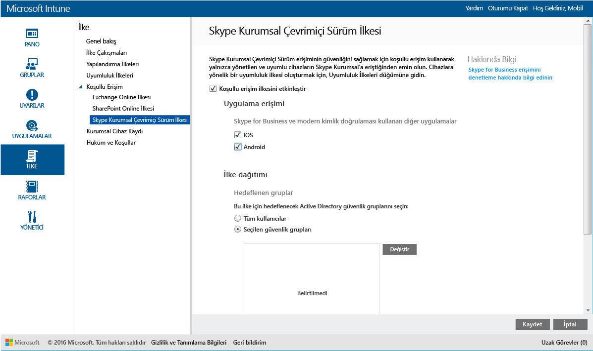

# Microsoft Intune ile Skype Kurumsal Çevrimiçi’ne erişimi kısıtlama
**Skype Kurumsal Çevrimiçi** için koşullu erişim ilkesini kullanarak, Skype Kurumsal Çevrimiçi’ne erişimi denetleyin.
Koşullu erişim iki bileşenden oluşur:
- Cihazın uyumlu kabul edilmesi için uyması gereken cihaz uyumluluk ilkesi.
- Cihazın hizmete erişebilmek için uyması gereken koşulları sizin belirlediğiniz koşullu erişim ilkesi.
Koşullu erişimin nasıl çalıştığı hakkında daha fazla bilgi edinmek için, [E-posta ve O365 hizmetlerine erişimi kısıtlama](restrict-access-to-email-and-o365-services-with-microsoft-intune.md) makalesini okuyun.

Hedeflenen bir kullanıcı kendi cihazında Skype Kurumsal Çevrimiçi’ni kullanmayı denerse, aşağıdaki değerlendirme yapılır:

Skype Kurumsal Çevrimiçi için koşullu erişim ilkesini yapılandırmadan **önce**:
- **Skype Kurumsal Çevrimiçi aboneliğiniz** olmalı ve kullanıcılara Skype Kurumsal Çevrimiçi lisansı atamalısınız.
- **Enterprise Mobility Suite** veya **Azure Active Directory Premium** için bir aboneliğiniz olmalıdır.
-   Skype Kurumsal Çevrimiçi Sürüm için [modern kimlik doğrulamasını etkinleştirin](https://docs.microsoft.com/en-us/intune/deploy-use/restrict-access-to-skype-for-business-online-with-microsoft-intune). 
-  Tüm son kullanıcılarınız **Skype Kurumsal Çevrimiçi** kullanıyor olmalıdır. Hem Skype Kurumsal Çevrimiçi hem de Skype Kurumsal şirket içi kullanılan bir dağıtımınız varsa, son kullanıcılara koşullu erişim ilkesi uygulanmaz.

    Skype Kurumsal Çevrimiçi’ne erişmesi gereken cihaz:

-   **Android** veya **iOS** cihazı olmalıdır.

-   [!INCLUDE[wit_nextref](../includes/wit_nextref_md.md)] hizmetine **kayıtlı** olmalıdır.

-   Dağıtılan tüm [!INCLUDE[wit_nextref](../includes/wit_nextref_md.md)] uyumluluk ilkelerine **uymalıdır**.

Cihaz durumu, Azure Active Directory'de depolanır; bu durumda belirttiğiniz koşullara göre erişim izni verilir veya erişim engellenir.

Bir koşul karşılanmazsa, oturum açtığında kullanıcıya şu iletilerden biri sunulur:

-   Cihaz [!INCLUDE[wit_nextref](../includes/wit_nextref_md.md)]’a kaydedilmediyse veya Azure Active Directory'ye kayıtlı değilse, şirket portalı uygulamasının nasıl yükleneceğine ve nasıl kayıt yapılacağına ilişkin yönergeleri içeren bir ileti görüntülenir.

-   Cihaz uyumlu değilse, kullanıcıyı sorunla ve sorunun nasıl çözüleceğiyle ilgili bilgileri bulabileceği [!INCLUDE[wit_nextref](../includes/wit_nextref_md.md)] Şirket Portalı web sitesine veya Şirket Portalı uygulamasına yönlendiren bir ileti görüntülenir.

## Skype Kurumsal Çevrimiçi için koşullu erişimi yapılandırma

### 1. Adım: Active Directory güvenlik gruplarını yapılandırma
Başlamadan önce koşullu erişim ilkesi için Azure Active Directory güvenlik gruplarını yapılandırın. Bu grupları **Office 365 yönetim merkezinde** yapılandırabilirsiniz. Bu gruplar, ilkede kullanıcıları hedeflemek veya muaf tutmak için kullanılır. Bir kullanıcı bir ilke tarafından hedeflendiğinde, kaynaklara erişmek için kullandıkları her bir cihaz uyumlu olmalıdır.

Skype Kurumsal ilkesinde kullanmak üzere iki grup türü belirtebilirsiniz:

-   **Hedeflenen gruplar** - İlkenin uygulanacağı kullanıcı gruplarını içerir.

-   **Muaf tutulan gruplar** - İlkeden muaf tutulan kullanıcı gruplarını içerir.

Bir kullanıcı her iki gruptaysa ilkeden muaf tutulur.

### 2. Adım: Uyumluluk ilkesi yapılandırma ve dağıtma
Bir uyumluluk ilkesi [oluşturun](create-a-device-compliance-policy-in-microsoft-intune.md) ve ilkeden etkilenecek olan tüm cihazlara [dağıtın](deploy-and-monitor-a-device-compliance-policy-in-microsoft-intune.md). Bunlar, **Hedeflenen gruplar**’daki kullanıcılar tarafından kullanılan tüm cihazlar olacaktır.

> [!NOTE] Uyumluluk ilkeleri [!INCLUDE[wit_nextref](../includes/wit_nextref_md.md)] gruplarına dağıtılırken, koşullu erişim ilkeleri Azure Active Directory güvenlik gruplarına dağıtılır.

> [!IMPORTANT] Uyumluluk İlkesi dağıtmadıysanız, cihazlar uyumlu olarak değerlendirilir.

Hazır olduğunuzda **3. Adım**’a ilerleyin.

### 3. Adım: Skype Kurumsal Çevrimiçi ilkesini yapılandırma
İlkeyi yalnızca yönetilen ve uyumlu cihazların Skype Kurumsal Çevrimiçi’ne erişebileceği şekilde yapılandırın. Bu ilke Azure Active Directory’de depolanır.

####
1.  [Microsoft Intune yönetim konsolunda](https://manage.microsoft.com) **İlke** > **Koşullu Erişim** > **Skype Kurumsal Çevrimiçi Sürüm**’e tıklayın.

2.  **Koşullu erişim ilkesini etkinleştir**’i seçin.

3.  **Uygulama erişimi** altında aşağıdakilere koşullu erişim ilkesini uygulamayı seçebilirsiniz:

    -   **iOS**

    -   **Android**

4.   **Hedeflenen Gruplar**altında, ilkenin geçerli olacağı Azure Active Directory güvenlik gruplarını seçmek için **Değiştir** ’e tıklayın. Bunu tüm kullanıcılara veya yalnızca seçilmiş bir kullanıcı grubuna hedefleyebilirsiniz.

5.   **Muaf Tutulan Gruplar**altında, bu ilkeden muaf tutulan Active Directory güvenlik gruplarını seçmek için isteğe bağlı olarak **Değiştir** ’e tıklayın.

6.  İşiniz bittiğinde **Kaydet**‘e tıklayın.

Artık Skype Kurumsal Çevrimiçi için koşullu erişimi yapılandırdınız. Koşullu erişim ilkesini dağıtmanız gerekmez, hemen geçerli olur.

## Uyumluluk ve koşullu erişim ilkeleri izleme
 **Gruplar** çalışma alanında, cihazlarınızın koşullu erişim durumunu görüntüleyebilirsiniz.

Herhangi bir mobil cihaz grubunu seçin ve ardından **Cihazlar** sekmesinde aşağıdaki **Filtreler**arasından birini seçin:

* **AAD ile kaydedilmeyen cihazlar** – Bu cihazların Skype Kurumsal Çevrimiçi’ne erişimi engellenir.

* **Uyumlu olmayan cihazlar** – Bu cihazların Skype Kurumsal Çevrimiçi’ne erişimi engellenir.

* **AAD ile kaydedilen ve uyumlu olan cihazlar** – Bu cihazlar Skype Kurumsal Çevrimiçi’ne erişebilir.

<!--HONumber=Jun16_HO3-->

