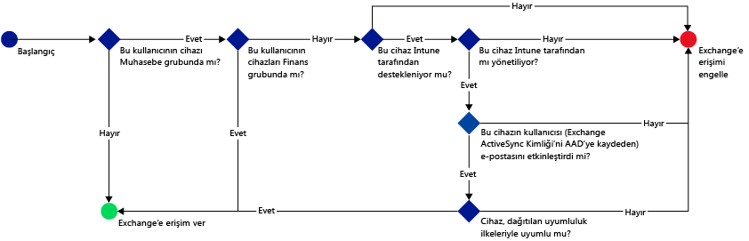
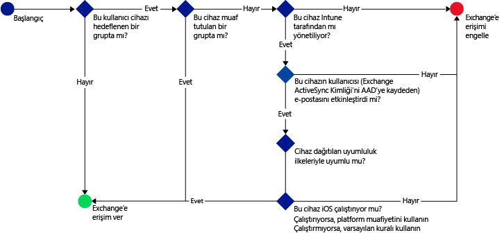
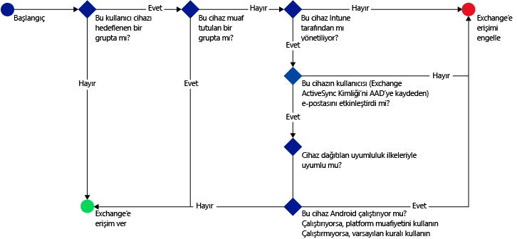

# Microsoft Intune ile e-postaya erişimi kısıtlama: Örnek senaryolar

## Kullanıcıların Exchange Online erişmek için uyumsuz cihazlar kullanmasını engelleyin.
### Senaryo gereksinimleri
- **Muhasebe** Active Directory güvenlik grubundaki tüm kullanıcıların, cihazlarının dağıttığınız bir uyumluluk ilkesiyle uyumlu olmaması durumunda Exchange Online’a erişimi engellenmelidir.
- Bu grupta cihazları [!INCLUDE[wit_nextref](../includes/wit_nextref_md.md)] tarafından desteklenmeyen kullanıcılar varsa, bu kullanıcıların da o cihazda Exchange Online’a erişimi engellenmelidir.
- **Finans** Active Directory güvenlik grubundaki tüm kullanıcılar, **Muhasebe** güvenlik grubunda da olsalar ilkeden muaf tutulmalıdır.

Bunu başarmak için, Exchange Online için aşağıdaki ayarlarla bir koşullu erişim ilkesi yapılandırın:

-   **Koşullu erişim ilkesini etkinleştir**’i seçin.

- Modern kimlik doğrulaması kullanan uygulamalardan erişime izin vermek istediğiniz platformları seçin.
- Exchange ActiveSync uygulamaları için, **Microsoft Intune tarafından desteklenmeyen platformlardaki uyumsuz cihazları engelle**’yi ve **Microsoft Intune tarafından desteklenmeyen platformlardaki tüm diğer cihazları engelle**’yi seçin.
-   **Hedeflenen grup** bölümündeki **Seçilen güvenlik grupları** altında **Muhasebe** kullanıcı grubunu seçin.

-   **Muaf tutulan grup** bölümündeki **Seçilen güvenlik grupları** altında **Finans** kullanıcı grubunu seçin.

Hangi cihazların Exchange Online’a erişebileceğine karar vermek için aşağıdaki akış kullanılır:

## Şirket İçi Exchange’e erişen tüm iOS cihazları, Intune tarafından yönetilmelidir.
### Senaryo gereksinimleri
- Yalnızca iOS çalıştıran cihazların Şirket İçi Exchange’e erişmesine izin verilmelidir.
- Cihazların Exchange’e erişim için kullanılabilmeleri için önce Intune’a kaydolmaları ve uyumluluk ilkesi kurallarına uymaları da gerekir.

Bunu başarmak için, Şirket İçi Exchange için aşağıdaki ayarlarla bir koşullu erişim ilkesi yapılandırın:

-   **Cihaz uyumsuzsa veya Microsoft Intune'a kayıtlı değilse e-posta uygulamalarının Şirket İçi Exchange'e erişimini engelleyin** seçeneğini belirtin. Bu seçenek belirtildiğinde koşullu erişim ilkesi etkinleştirilir. Bu ilke, tüm cihazların Exchange’e erişebilmeleri için önce Microsoft Intune’a kaydolmalarını ve uyumluluk ilkesi kurallarına uymalarını zorunlu tutar.

-   Gelişmiş Exchange Active Sync ayarları için şunları oluşturun:

  -   iOS çalıştıran cihazların Exchange’e erişmesine izin veren bir platform özel durumu.   

  -   Platform özel durum kuralının kapsamına girmeyen cihazın Exchange’e erişiminin engellenmesi gerektiğini belirten, varsayılan bir kural. Bu kural, iOS çalıştırmayan cihazların Exchange’e erişiminin engellenmesini sağlar.

Hangi cihazların Exchange’e erişebileceğine karar vermek için aşağıdaki akış kullanılır:

## Hiçbir Android cihazı Şirket İçi Exchange’e erişemez.
### Senaryo gereksinimleri
- Tüm Android cihazlarının Exchange’e erişimi engellenmelidir.
- Desteklenen diğer tüm cihazlar, [!INCLUDE[wit_nextref](../includes/wit_nextref_md.md)] tarafından yönetildikleri sürece Exchange’e erişebilir.

Bunu başarmak için, Şirket İçi Exchange için aşağıdaki ayarlarla bir koşullu erişim ilkesi yapılandırın:

-   **Cihaz uyumsuzsa veya Microsoft Intune'a kayıtlı değilse e-posta uygulamalarının Şirket İçi Exchange'e erişimini engelleyin** seçeneğini belirtin. Bu seçenek belirtildiğinde, tüm cihazların Intune’a kaydolması ve uyumluluk ilkesi kurallarına uyması zorunlu tutulur.

- Gelişmiş Exchange Active Sync ayarları için şunları oluşturun:
  -   Android çalıştıran cihazların Exchange’e erişmesini engelleyen bir platform özel durumu. Bu kural, Exchange erişim için Android cihazlarının kullanılamamasını sağlar.

  -   Bir cihazın diğer kuralların kapsamında olmaması durumunda Exchange’e erişmesine izin verileceğini belirten, varsayılan kural. Bu varsayılan kural, Android dışındaki platformları çalıştıran ama Microsoft Intune tarafından desteklenen cihazların Exchange’e erişmek için kullanılabilmesini sağlar. Öte yandan bunların Intune’a kaydolması ve uyumluluk ilkesi kurallarına uyması gerekir.

Hangi cihazların Exchange’e erişebileceğine karar vermek için aşağıdaki akış kullanılır:

<!--HONumber=Jul16_HO5-->

