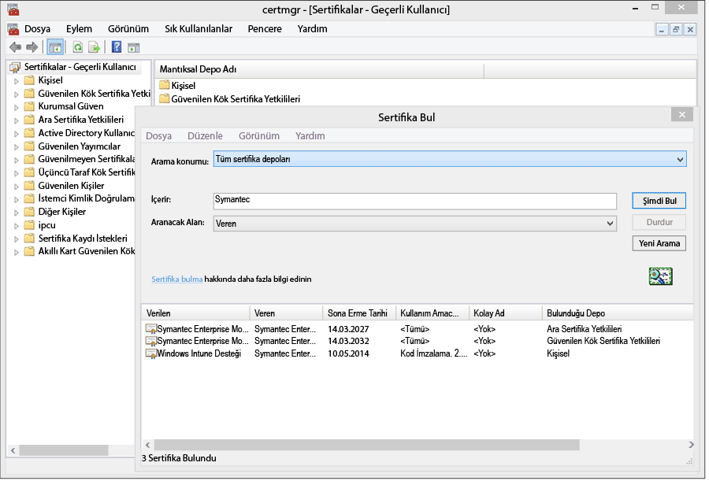
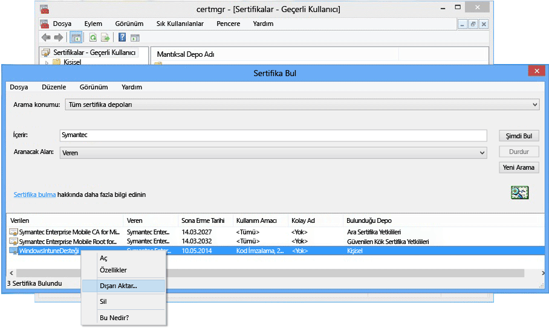

# <a name="sign-line-of-business-apps-so-they-can-be-deployed-to-windows-devices-with-intune"></a>Intune ile Windows cihazlarına dağıtmak için iş kolu uygulamalarını imzalayın

Intune yöneticisi olarak Şirket Portalı uygulaması dahil olmak üzere iş kolu uygulamalarını Windows ve Windows 10 Mobile cihazlarına dağıtabilirsiniz. Windows 10 ve Windows 10 Mobile cihazlarına .appx veya .xap uygulamalarını veya Windows 8.1 ya da Windows Phone 8.1 cihazlarına iş kolu uygulamalarını dağıtmak için **Symantec Enterprise Mobil Kod İmza Sertifikası** edinmeniz gerekir. Windows cihazlarda bu uygulamalar için yalnızca Symantec sertifikasına güvenilir. Windows 10 uygulamaları ve "evrensel" uygulamalar için kendi sertifika yetkilinizi kullanabilirsiniz. Aşağıdakileri yapmak için bu sertifika gereklidir:

-   Şirket Portalı uygulamasını Windows bilgisayarlara, Windows 10 Mobile cihazlarına ve Windows Phone cihazlarına dağıtmak üzere uygulama

-   Şirket iş kolu uygulamalarının Intune tarafından Windows Phone cihazlarına dağıtılabilmesi için şirket iş kolu uygulamalarını imzalama

Aşağıdaki adımlar, gerekli sertifikayı almanıza ve uygulamaları imzalamanıza yardımcı olur. Bir Windows Phone Geliştirici Merkezi hesabına sahip olmanız ve ardından Symantec sertifikası satın almanız gerekir.


1. **Windows Phone Geliştirici Merkezi'ne katılma**<br>
   Şirket hesabınızı satın almak için oturum açarken kurumsal hesap bilgilerini kullanarak [Windows Phone Geliştirici Merkezi](http://go.microsoft.com/fwlink/?LinkId=268442) 'ne katılın. Bu istek, kod imzalama sertifikası sizin tarafınızdan alınmadan önce bir şirket yetkilisi tarafından yetkilendirilmelidir.

2. **Şirket Symantec sertifikası alma**<br>
  Symantec ID'nizi kullanarak [Symantec web sitesinden](http://go.microsoft.com/fwlink/?LinkId=268441) bir sertifika satın alın. Sertifikayı satın aldıktan sonra, Windows Phone Geliştirici Merkezi hesabınızda belirlediğiniz şirket onaylayanı, sertifika isteğinin onaylanmasını isteyen bir e-posta alır. Symantec sertifika gereksinimi hakkında daha fazla bilgi için bkz. [Windows Phone neden Symantec sertifikası gerektiriyor?](https://technet.microsoft.com/en-us/library/dn764959.aspx#BKMK_Symantec) Windows cihaz kaydı SSS.

3.  **Sertifikaları içeri aktarma**<br>
    İstek onaylandıktan sonra sertifikaları içeri aktarmaya yönelik yönergeler içeren bir e-posta alacaksınız. Sertifikaları içeri aktarmak için e-postadaki yönergeleri izleyin.

4.  **Sertifikaların içeri aktarıldığını doğrulama**<br>
    Sertifikaların düzgün bir şekilde içeri aktarıldığını doğrulamak için **Sertifikalar** ek bileşenine gidin, **Sertifikalar**'a sağ tıklayın ve **Sertifikaları Bul**'u seçin. **İçerir** alanına "Symantec" yazın ve **Şimdi Bul**'a tıklayın. İçeri aktardığınız sertifikaların sonuçlarda görüntülenmesi gerekir.

    

5. **İmzalama sertifikasını dışarı aktarma**<br>
    Sertifikaların mevcut olduğunu doğruladıktan sonra, şirket portalını imzalamak için .pfx dosyasını dışarı aktarabilirsiniz. **Hedeflenen amaç** "kod imzalama" ifadesinin bulunduğu Symantec sertifikasını seçin. Kod imzalama sertifikasına sağ tıklayıp **Dışarı Aktar**'ı seçin.

    

    **Sertifika Dışarı Aktarma Sihirbazı**'nda **Evet, özel anahtarı dışarı aktar** 'ı seçin ve ardından **İleri**'ye tıklayın. **Personal Information Exchange –PKCS #12 (.PFX) seçeneğini belirleyin** ve **Mümkünse sertifika yolundaki tüm sertifikaları dahil et**'i işaretleyin. Sihirbazı tamamlayın. Daha fazla bilgi için bkz. [Özel Anahtara Sahip Bir Sertifikayı Dışarı Aktarma](http://go.microsoft.com/fwlink/?LinkID=203031).

6.  **Uygulamayı Intune'a yükleme**<br>
    İmzalanmış uygulama dosyasını ve kod imzalama sertifikanızı karşıya yükleyerek uygulamayı son kullanıcılarınızın kullanımına sunun.

    1.  [Intune yönetim konsolunda](http://manage.microsoft.com) **Yönetim** &gt; **Windows Phone**’a tıklayın.

    2.  **İmzalanmış Uygulama Dosyasını Karşıya Yükle** 'ye tıklayın ve Intune Yönetici Kimliğinizle oturum açın.

    3.  **Kod imzalama sertifikası** olarak dışa aktardığınız sertifika (.pfx) dosyasını ekleyin ve sertifika için bir parola oluşturun.

    4.  Sihirbazı tamamlayın.

## <a name="example-download-sign-and-deploy-the-company-portal-app-for-windows-devices"></a>Örnek: Windows cihazlar için Şirket Portalı uygulamasını indirme, imzalama ve dağıtma

Şirket Portalı uygulamasını Windows Phone ve Windows 10 Mobile cihazları dahil olmak üzere Windows cihazlarına Windows Mağazası’ndan yüklemek yerine Intune ile dağıtabilirsiniz. Şirket Portalı uygulamasını indirmeniz ve sertifikanızla imzalamanız gerekir.  Bu yalnızca, kullanıcılar Şirket Deposunu kullanmayacaksa ve Şirket Portalı’nı Windows Phone 8.1 cihazlara dağıtmak istiyorsanız gereklidir.


1.  **Şirket Portalı’nı indirme**

    Şirket Portalı uygulamasını Intune'u kullanarak dağıtmak için İndirme Merkezi’nden [Windows Phone 8.1 için Microsoft Intune Şirket Portalı Uygulaması](http://go.microsoft.com/fwlink/?LinkId=615799)'nı indirebilir ve kendiliğinden açılan (.exe) dosyayı çalıştırabilirsiniz. Bu dosya iki dosya içerir:

    -   CompanyPortal.appx– Windows Phone 8.1 için Şirket Portalı yükleme uygulaması

    -   WinPhoneCompanyPortal.ps1 – Windows Phone 8.1 cihazlarına dağıtılabilmesi amacıyla Şirket Portalı uygulama dosyasını imzalamak için kullanabileceğiniz bir PowerShell betiği.

    Alternatif olarak, Windows Phone 8.1 Şirket Portalı (çevrimdışı lisanslı paket) uygulamasını [İş İçin Windows Mağazası](http://businessstore.microsoft.com/)'ndan indirebilirsiniz. Şirket Portalı uygulamasının çevrimdışı lisansla alınması ve çevrimdışı kullanım için uygun paketin indirilmesi gerekir. Seçilen Windows 8 ve Windows Phone 8 platformu örnekleri, 8.1 yerine kullanılamaz.

2.  **Windows Phone SDK'sını indirme** [Windows Phone SDK 8.0'ı indirin] (http://go.microsoft.com/fwlink/?LinkId=615570) ve SDK'yı bilgisayarınıza yükleyin. Bu SDK, bir uygulama kaydı belirteci oluşturmak için gereklidir.

3.  **AETX dosyası oluşturma** Windows Phone SDK 8.0’ın parçası olan AETGenerator.exe dosyasını kullanarak Symantec PFX dosyasından bir uygulama kaydı belirteci (.aetx) dosyası oluşturun. AETX dosyasının nasıl oluşturulacağına ilişkin yönergeler için bkz. [Windows Phone için uygulama kaydı belirteci oluşturma](https://msdn.microsoft.com/library/windows/apps/jj735576.aspx)

4.  **Windows 8.1 için Windows SDK’sını indirme** [Windows Phone SDK’sını](http://go.microsoft.com/fwlink/?LinkId=613525) (http://go.microsoft.com/fwlink/?LinkId=613525) indirin ve yükleyin. Şirket Portalı uygulamasına dahil edilen PowerShell betiğinin varsayılan yükleme konumunu (`${env:ProgramFiles(x86)}\Windows Kits\8.1`) kullandığını unutmayın. Başka bir yere yüklerseniz, bir cmdlet parametresinde konumu eklemeniz gerekir.

5.  **PowerShell kullanarak uygulama kodunu imzalama** Yönetici olarak, Windows SDK’sı ve Symantec Kurumsal Mobil Kod İmzalama Sertifikası yüklenmiş ana bilgisayarda **Windows PowerShell**’i açın, Sign-WinPhoneCompanyPortal.ps1 dosyasına gidin ve betiği çalıştırın.

    **Örnek 1**

    ```
    .\Sign-WinPhoneCompanyPortal.ps1 -InputAppx 'C:\temp\CompanyPortal.appx' -OutputAppx 'C:\temp\CompanyPortalEnterpriseSigned.appx' -PfxFilePath 'C:\signing\cert.pfx' -PfxPassword '1234' -AetxPath 'C:\signing\cert.aetx'
    ```
    Bu örnek, C:\temp\ konumundaki CompanyPortal.appx dosyasını imzalar ve CompanyPortalEnterpriseSigned.appx dosyasını üretir. PFX parolası olarak 1234’ü kullanır ve PFX dosyasından yayımcı kimliğini okur. Cert.aetx dosyasından kuruluş kimliğini de okur.

    **Örnek 2**

    ```
    .\Sign-WinPhoneCompanyPortal.ps1 -InputAppx 'C:\temp\CompanyPortal.appx' -OutputAppx 'C:\temp\CompanyPortalEnterpriseSigned.appx' -PfxFilePath 'C:\signing\cert.pfx' -PfxPassword '1234' -PublisherId 'OID.0.9.2342.19200300.100.1.1=1000000001, CN="Test, Inc.", OU=Test 1' -EnterpriseId 1000000001
    ```
    Bu örnek, C:\temp\ konumundaki CompanyPortal.appx dosyasını imzalar ve CompanyPortalEnterpriseSigned.appx dosyasını üretir. PFX parolası olarak 1234’ü ve belirtilen yayımcı kimliğini kullanır.

    **Parametreler:**

    -   `-InputAppx` – Tek tırnak içinde CompanyPortal.appx dosyasının yerel yolu. Örneğin, 'C:\temp\CompanyPortal.appx'

    -   `-OutputAppx` – Tek tırnak içinde, imzalanan Şirket Portalı uygulamasının yerel yolu ve dosya adı. Örneğin, 'C:\temp\CompanyPortalEnterpriseSigned.appx'

    -   `-PfxFilePath` – Symantec sertifikasının dışarı aktarılan PFX dosyasının yerel yolu ve dosya adı. Örneğin, 'C:\signing\cert.pfx'

    -   `-PfxPassword` – Tek tırnak içinde, PFX dosyasını imzalamak için kullanılan parola. Örneğin, '1234'

    -   `-AetxPath` – 'EnterpriseId' bağımsız değişkeni tanımlanmamışsa, kuruluş kimliğini okumak için kullanılan .aetx dosyasının yerel yolu. Bu bağımsız değişken veya EnterpriseId sağlanmalıdır. Örneğin, 'C:\signing\cert.aetx'

    -   `-PublisherId` - Kuruluşun Yayımcı kimliği. Yoksa, Symantec Kurumsal Mobil Kod İmzalama Sertifikası’nın 'Konu' alanı kullanılır. Örneğin, 'OID.0.9.2342.19200300.100.1.1=1000000001, CN="Test, Inc.", OU=Test 1'

    -   `-SdkPath` - Windows 8.1 için Windows SDK’sı kök klasörünün yolu. Bu bağımsız değişken isteğe bağlıdır ve varsayılan olarak ${env:ProgramFiles(x86)}\Windows Kits\8.1 değerindedir.

    -   `-EnterpriseId` - Kuruluş kimliği. Bu bağımsız değişken veya ‘AetxPath’ sağlanmalıdır. Bu bağımsız değişken sağlanmazsa, AETX dosyasından kuruluş kimliği okunur. Örneğin, 1000000001

6.  Windows Phone 8.1 Şirket Portalı (SSP.appx) uygulamasını dağıtın. Talimatlar için bkz. [Microsoft Intune'da uygulamaları dağıtma](deploy-apps-in-microsoft-intune.md).

## <a name="how-to-renew-the-symantec-enterprise-code-signing-certificate"></a>Symantec kurumsal kod imzalama sertifikasını yenileme

Belirli Windows ve Windows Phone mobil uygulamalarını dağıtmak için kullanılan Symantec sertifikasının düzenli aralıklarla yenilenmesi gerekir.

1.  Sertifikanın süresi dolmadan yaklaşık 14 gün önce Symantec tarafından gönderilen yenileme e-postasını bulun. Bu e-posta, kurumsal sertifikanızı yenileme hakkında Symantec tarafından gönderilen yönergeleri içerir.

    Symantec sertifikaları hakkında ek bilgi için [www.symantec.com](http://www.symantec.com) adresini ziyaret edin veya 1-877-438-8776 ya da 1-650-426-3400 numaralı telefonları arayın.

2.  Web sitesine gidin (örnek: [https://products.websecurity.symantec.com/orders/enrollment/microsoftCert.do](https://products.websecurity.symantec.com/orders/enrollment/microsoftCert.do)) ve sertifikayla ilişkili Symantec Yayımcı Kimliği ve e-posta adresiyle oturum açın. Yenileme işlemini başlatmak için, sertifika indirmek için kullanacağınız makineyle aynı makineyi kullanmayı unutmayın.

3.  Yenileme onaylandıktan ve ücreti ödenen sonra, sertifikayı indirin.

### <a name="how-to-install-the-updated-certificate-for-line-of-business-lob-apps"></a>İş kolu (LOB) uygulamaları için güncelleştirilmiş sertifika yükleme

1.  İş kolu uygulamanızın son sürümünü imzalayın.

2.  [Intune Yönetim Konsolu'nuzu](https://admin.manage.microsoft.com) (https://admin.manage.microsoft.com) açın ve **Yönetici** &gt; **Mobil Cihaz Yönetimi** &gt; **Windows Phone** bölümüne gidip **İmzalı Uygulamayı Karşıya Yükle**’ye tıklayın.

3.  Yeni imzalanan Şirket Portalı'nı karşıya yükleyin. Yeni imzalanan SSP.xap ile Symantec'ten aldığınız yeni .PFX dosyasına ya da bu yeni .PFX dosyasıyla oluşturulmuş uygulama kayıt belirtecine ihtiyacınız olacaktır.

4.  Karşıya yükleme tamamlandığında, eski Şirket Portalı sürümünü **Yazılımlar** çalışma alanından kaldırın.

5.  Yeni sertifikayı kullanarak tüm yeni ve güncelleştirilmiş kurumsal iş kolu uygulamalarını imzalayın. Mevcut uygulamaların yeniden imzalanması ve dağıtılması gerekmez.


<!--HONumber=Nov16_HO3-->


