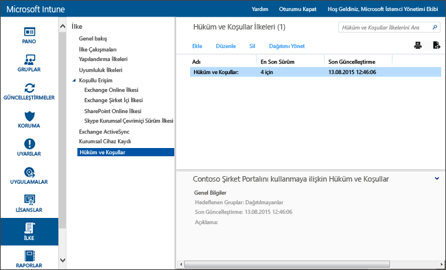

# Microsoft Intune’da hüküm ve koşullar ilkesi ayarları
Kayıt, iş kaynaklarına erişim ve Şirket Portalı uygulamasını kullanmanın cihazları ve kullanıcıları nasıl etkileyeceğini açıklamak için kullanıcı gruplarına Intune hüküm ve koşullarını dağıtabilirsiniz. Kullanıcıların çalışmalarını kaydedip bunlara erişmek üzere Şirket Portalı’nı kullanabilmeleri için önce bu hüküm ve koşulları kabul etmeleri gerekir.

Farklı hüküm ve koşullar içeren birden çok ilke oluşturup dağıtabilirsiniz. Ayrıca, aynı şart ve koşulların farklı dillerdeki sürümlerini oluşturabilir ve bunları uygun gruplara dağıtabilirsiniz.

## Hüküm ve koşullar ilkesi oluşturma

1.  [Microsoft Intune yönetim konsolunda](http://manage.microsoft.com) **İlke** &gt; **Hüküm ve Koşullar**’a tıklayın.

    

2.  Yeni hüküm ve koşullar ilkesi oluşturmak için **Ekle**’ye tıklayın.

    Ayrıca var olan bir ilkeyi **Düzenleyebilir** veya**Silebilirsiniz**.

3.  **Hüküm ve Koşullar Oluştur** sayfasında aşağıdaki bilgileri belirtin:

    -   **Ad**: Intune konsolunda görüntülenen benzersiz bir ilke adı

    -   **Açıklama**: İlkeyi Intune konsolunda tanımlamanıza yardımcı olan ayrıntılar

    -   **Başlık**: Şirket portalında kullanıcıların gördüğü başlık

    -   **Kullanıcının kabul etmesinin ne anlama geldiğini açıklayan metin**: Kullanıcıların kabul etmesine ilişkin görünen etiket. **Örnek**: "Hüküm ve koşulları kabul ediyorum."

4.  İşiniz bittiğinde **Kaydet**’e tıklayın. Yeni ilke, **İlke** çalışma alanının **Hüküm ve Koşullar** düğümünde görüntülenir.

## Hüküm ve koşullar ilkesini dağıtma

1.  [Microsoft Intune yönetim konsolunda](http://manage.microsoft.com) **İlke** &gt; **Hüküm ve Koşullar**’a tıklayın.

2.  **Hüküm ve Koşullar İlkeleri** listesinde, dağıtmak istediğiniz ilkeyi seçin ve ardından **Dağıtımı Yönet**’e tıklayın.

3.  **Dağıtımı Yönet** iletişim kutusunda ilkeyi dağıtmak istediğiniz kullanıcı grubunu seçin ve ardından **Tamam**’a tıklayın.

    Hedeflenen kullanıcılar şirket portalına eriştiğinde, Intune tarafından dağıttığınız hüküm ve koşullar görüntülenir. Kullanıcıların şirket kaynaklarına erişebilmesi için bu koşulları kabul etmesi gerekir.

## Hüküm ve koşullar ilkesini izleme

1.  [Microsoft Intune yönetim konsolunda](http://manage.microsoft.com) **İlke** &gt; **Hüküm ve Koşullar**’a tıklayın.

2.  **Yeni Rapor Oluştur** penceresinde **Raporu Görüntüle**’ye tıklayın. Dağıttığınız hüküm ve koşulları hangi kullanıcıların kabul ettiğiyle ilgili ayrıntılı bilgi içeren rapor açılır.

### Hüküm ve koşullar için güncelleştirme ve sürüm denetimi
Varolan bir hüküm ve koşullar ilkesini düzenlediğinizde, ilkeyi dağıttığınızda gerçekleşecek davranışı seçebilirsiniz. Varolan hüküm ve koşullar ilkelerini güncelleştirmenize yardımcı olması için aşağıdaki yordamı kullanın.

## Hüküm ve koşulların birden çok sürümü ile çalışma

1.  [Microsoft Intune yönetim konsolunda](http://manage.microsoft.com) **İlke** &gt; **Hüküm ve Koşullar**’a tıklayın.

2.  Düzenlemek istediğiniz hüküm ve koşullar ilkesini seçin ve ardından **Düzenle**’ye tıklayın.

3.  **Hüküm ve Koşulları Düzenle** sayfasında, gerekli tüm düzenlemeleri yapın ve bu yeni sürümün tüm kullanıcıların hüküm ve koşulları kabul etmesini mi gerektirdiğini yoksa yalnızca yeni kullanıcıların mı yeni sürümü göreceğini belirtin.

    Hüküm ve koşullar ilkenizde önemli değişiklikler yaptığınızda sürüm numarasını artırmanızı ve kabul şartı koşmanızı öneririz. Örneğin, yazım hatalarını düzeltiyor veya biçimlendirmeyi değiştiriyorsanız geçerli sürüm numarasını kullanmaya devam edin.

### Ayrıca bkz.
[Microsoft Intune ilkeleriyle cihazlarınızda ayarları ve özellikleri yönetme](manage-settings-and-features-on-your-devices-with-microsoft-intune-policies.md)

<!--HONumber=Jun16_HO4-->

