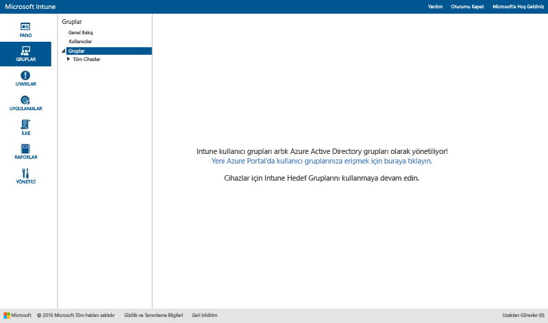
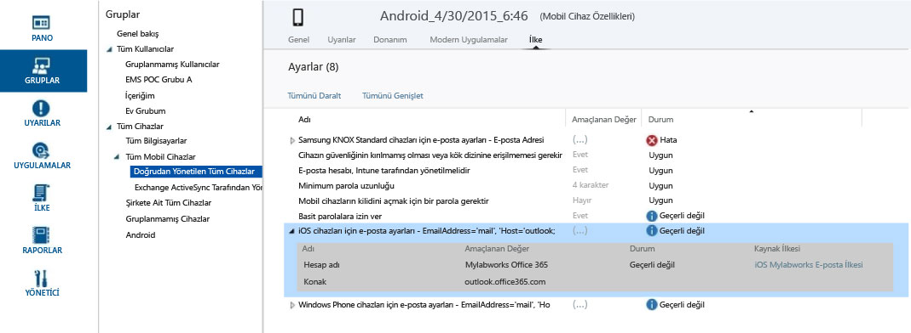

# Microsoft Intune’da kullanıcı ve cihazları yönetmek için grupları kullanma

Bu konu, Intune’da grupların nasıl oluşturulacağını açıklar. Ayrıca grupların yönetiminin önümüzdeki aylarda nasıl değişeceğine ilişkin bilgiler sağlar. 

>[!IMPORTANT]
>
>Intune portalında Gruplar çalışma alanını açar ve Azure Active Directory (Azure AD) portalına bir bağlantı görürseniz, [Gruplar için yönetici deneyiminde yapılacak geliştirmeler hakkında bildirim](#notice-of-upcoming-improvements-to-the-admin-experience-for-groups) kısmında açıklanan, Intune’daki Azure AD güvenlik gruplarına yönelik *yeni* grup yönetimi yaklaşımını zaten kullanıyorsunuz demektir. Gruplarınızı oluşturmak ve yönetmek için Azure AD portalı bağlantısına tıklayın.
>
> 
>
>Azure AD portalı bağlantısını görmüyorsanız, hâlâ bu konunun [Microsoft Intune'la kullanıcı ve cihazları yönetmek için gruplar oluşturma](#Create-groups-to-manage-users-and-devices-with-Microsoft-Intune) kısmında açıklanan *mevcut* grup yönetimi yaklaşımını kullanıyorsunuz demektir.

## Gruplar için yönetici deneyiminde yapılacak geliştirmeler hakkında bildirim

Enterprise Mobility + Security genelinde bir gruplandırma ve hedefleme deneyimi istediğinizi bize bildirdiniz. İsteğinizi dikkate alıyoruz. Geri bildiriminize dayalı olarak, yakında Intune gruplarını Azure Active Directory tabanlı güvenlik gruplarına dönüştüreceğiz. Bu değişiklik, Intune ile Azure Active Directory (Azure AD) genelinde grup yönetimini birleştirecektir. Yeni deneyim, grupları hizmetler arasında yinelemek zorunda kalmayacağınız anlamına gelir. Ayrıca, Windows PowerShell ve Microsoft Graph kullanma seçenekleri aracılığıyla genişletilebilirlik de sağlayacaktır.

### Bu şu anda beni nasıl etkiler?
Zaten Intune müşterisiyseniz, bu değişiklik sizi şu anda etkilemez. Ancak yakında şunlar olacak:

-   Yeni hesaplar Intune *kullanıcı* grupları yerine Azure AD güvenlik grupları kullanacaktır.   
-   Kasım 2016’da, aylık hizmet sürümünden sonra sağlanan yeni hesaplar, hem kullanıcı hem de cihaz tabanlı grupları Azure AD portalında yönetecektir. Mevcut müşteriler bundan etkilenmeyecektir.
-   Aralık 2016’da, Intune ürün ekibi mevcut müşterileri yeni Azure AD tabanlı grup yönetimi deneyimine geçirmeye başlayacaktır. Bugün Intune’da mevcut olan tüm kullanıcı ve cihaz grupları Azure AD güvenlik gruplarına geçirilecektir. Günlük çalışmalarınız üzerindeki etkisini en aza indirmeden ve kullanıcılarınızı hiçbir şekilde etkilemeyeceğini düşünene kadar geçiş işlemlerine başlamayacağız. Hesabınızı taşımadan önce bildirimde de bulunacağız.

### Yeni grup deneyimine nasıl ve ne zaman geçeceğim?
Mevcut Intune müşterilerini belli bir zaman dilimi boyunca geçireceğiz. Birkaç hafta içinde bu geçişin zamanlamasını son haline getirecek ve daha fazla ayrıntı vermek için bu konuyu güncelleştireceğiz. Geçişiniz yapılmadan önce size bildirim vereceğiz. Geçişle ilgili endişeleriniz varsa, lütfen [intunegrps@microsoft.com](mailto:intunegrps@microsoft.com) adresinden geçiş ekibimizle iletişim kurun. Grupların nasıl taşınacağı hakkında ayrıntılar için bkz. [Grupları Azure Active Directory’e geçirme](migrating-groups-to-azure-active-directory.md).

### Mevcut kullanıcı ve cihaz gruplarıma ne olacak?
 Intune’da oluşturduğunuz kullanıcı grupları ve cihaz grupları Azure AD güvenlik gruplarına geçirilecektir. Geçiş yapıldığı sırada Tüm Kullanıcılar grubu gibi varsayılan Intune gruplarını dağıtımlarda kullanıyorsanız, bunlar da geçirilecektir. Geçiş işlemi bazı gruplar için daha karmaşık olabilir. Kuruluşunuzdaki geçiş işlemi için gerekli ek adımlar olması durumunda size bildireceğiz.

### Hangi yeni özelliklerden yararlanabileceğim?
Intune'dan Azure Active Directory’ye yapılacak bu geçişle sunacağımız yeni işlevler şunlardır:

-    Azure AD güvenlik grupları, Intune’da tüm dağıtım türleri için desteklenecektir.
-    Azure AD güvenlik grupları, cihazların ve kullanıcıların gruplandırılmasını destekleyecektir.
-    Azure AD güvenlik grupları, Intune cihaz özniteliklerine sahip dinamik grupları destekleyecektir. Örneğin, cihazları iOS gibi bir platforma göre dinamik olarak gruplandırabileceksiniz. Kuruluşunuzda yeni bir iOS cihazı kaydedildiğinde, bu cihaz otomatik olarak iOS dinamik cihaz grubuna eklenecektir.
-    Azure AD ve Intune genelinde grup yönetimi için paylaşılan yönetici deneyimlerine sahip olacaksınız.
- Intune’daki hizmet yöneticilerinin Azure AD’de grup yönetimi görevlerini gerçekleştirebilmeleri için Azure AD’ye Intune Hizmet Yöneticisi rolü eklenecektir.

### Hangi Intune işlevleri kullanılamayacaktır?
Gruplar deneyiminin daha iyi hale gelecek olmasına rağmen, kuruluşunuz Intune gruplarından Azure AD güvenlik gruplarına geçtiğinde bazı Intune özellikleri kullanılamayacaktır.

#### Grup yönetimi işlevleri

-   Geçiş sonrası, yeni grup oluşturduğunuzda üyeleri veya grupları dışlamak mümkün olmayacak. Ancak, Azure AD dinamik grupları ile belirlediğiniz ölçütlere dayalı olarak bir gruptan üyeleri dışlamak için kullanabileceğiniz gelişmiş kurallar oluşturmaya yönelik öznitelikler kullanabilirsiniz.
-   Gruplanmamış Kullanıcılar ve Gruplanmamış Cihazlar grupları desteklenmeyecektir. Bu grupların Intune'dan Azure AD'ye geçişini gerçekleştirmeyeceğiz.

#### Gruba bağlı işlevler

-   Hizmet Yöneticisi rolünün **Grupları yönetme** izinleri olmayacaktır.
-   Exchange ActiveSync cihazlarını gruplandıramayacaksınız. Tüm EAS Yönetilen Cihazları grubunuz, gruptan rapor görünümüne dönüştürülecektir.
-  Raporlarda gruplarla özetleme kullanılamayacaktır.
-  Bildirim kurallarında özel grubu hedefleme özelliği kullanılamayacaktır.

### Bu değişikliğe hazırlanmak için ne yapmalıyım?
 Bu geçişi sizin için kolaylaştıracak önerilerimiz vardır:

- Geçiş öncesinde istemeyen veya gerekmeyen tüm Intune gruplarını temizleyin.
- Gruplarda hariç tutma kullanımınızı değerlendirin ve dışlamayı kullanmanızı gerektirmeyecek şekilde gruplarınızı yeniden tasarlamayı göz önünde bulundurun.
-  Azure AD’de grup oluşturma izinleri olmayan yöneticileriniz varsa, Azure AD yöneticinizden onları Intune Hizmet Yöneticisi Azure AD rolüne eklemesini isteyin.

## Microsoft Intune'la kullanıcı ve cihazları yönetmek için gruplar oluşturma

Bu bölümde, Intune yönetim konsolunda Intune gruplarını nasıl oluşturacağınız açıklanır.

Microsoft Intune yönetim konsolundaki **Gruplar** çalışma alanını kullanarak gruplar oluşturabilir ve yönetebilirsiniz. **Gruplara Genel Bakış** sayfası dikkat etmeniz gereken sorunları belirlemenize ve öncelik vermenize yardımcı olabilecek durum özetleri gösterir. Durum özetleri şu alanları kapsar:

-   Uyarılar
-   Yazılım güncelleştirmeleri
-   Endpoint Protection
-   İlke
-   Yazılım yönetimi

Seçili grubun üyeleri için sorunları tanımlamanıza ve çözmenize yardımcı olmak amacıyla grup hiyerarşinizde durum özetleri de gösterilir.

## Grup oluşturma

> [!TIP]
> Gruplarınızı oluştururken, ilkeleri nasıl uygulayacağınızı düşünün. Örneğin, cihaz işletim sistemine özgü ilkeleriniz veya Active Directory’de zaten tanımlamış olduğunuz kuruluşunuzdaki farklı rollere veya kuruluş birimlerine özgü ilkeleriniz olabilir. iOS, Android ve Windows için ayrı cihaz gruplarına ve her bir kurumsal rol için kullanıcı gruplarına sahip olmak yararlı olabilir.
>
> Ayrıca kuruluşunuzun temel uyumluluk gereksinimlerini belirlemek için tüm gruplara ve cihazlara uygulanan varsayılan bir ilke oluşturmak isteyebilirsiniz. Ardından, en geniş kullanıcı ve cihaz kategorileri için daha özel ilkeler oluşturabilirsiniz. Örneğin, her cihaz işletim sistemi için e-posta ilkeleri oluşturabilirsiniz.
>
> İlkelerinizi daha sonra kolayca tanıyacak şekilde adlandırmaya dikkat edin. Örneğin, iyi bir açıklayıcı ilke adı **Tüm Şirket için WP E-posta İlkesi**olabilir.
>
> Her kısıtlayıcı ilke oluşturduğunuzda, bunu kullanıcılarınıza iletmelisiniz. Daha genel gruplar ve ilkeler oluşturduktan sonra gereksiz iletişimi azaltmak için nasıl daha küçük gruplar oluşturabileceğinize dikkat edin.

### Bir cihaz grubu oluşturmak için

1.  Intune yönetim konsolunda, **Gruplar** &gt; **Genel Bakış** &gt; **Grup Oluştur**’u seçin.

2.  Grup için bir ad ve açıklama (isteğe bağlı) girin, ardından üst grup olarak bir cihaz grubunu seçin. **İleri**’yi seçin.

3.  **Üyelik Ölçütlerini Tanımla** sayfasında, grubun içereceği cihaz türünü seçin. Dahil etmeyi seçtiğiniz cihaz türlerine dayalı olarak ek grup yapılandırma seçenekleriniz vardır:

    -   **Bilgisayar**. Üst grubun tüm üyelerinin eklenip eklenmeyeceğini, dahil etmek veya dışlamak istediğiniz kuruluş birimlerini ve dahil etmek veya dışlamak istediğiniz etki alanlarını seçin. Bir bilgisayar için envanterden kuruluş birimi ve etki alanı bilgileri elde edebilirsiniz.

    -   **Mobil**. Yalnızca Intune tarafından yönetilen mobil cihazların, Exchange ActiveSync tarafından yönetilen mobil cihazların veya her ikisinin de dahil edileceğini belirtin.

    -   **Tüm cihazlar**. Bu seçenek, herhangi bir ölçüte dayalı özel durumlar olmadan tüm cihazları içerir.

4.  **Doğrudan Üyeliği Tanımla** sayfasında, **Gözat**'ı seçerek cihazları tek tek dahil edin veya dışlayın. Belirttiğiniz üst grupta olmayan cihazları seçerseniz, Intune bu cihazları otomatik olarak üst gruba ekler.

5.  **Özet** sayfasında, seçimlerinizi gözden geçirin ve **Son**’u seçin.

Yeni oluşturulan grup **Gruplar** çalışma alanının **Gruplar** listesinde, üst grubun altında gösterilir. Ayrıca, buradan grubu düzenleyebilir veya silebilirsiniz.

### Bir kullanıcı grubu oluşturmak için

1.  Intune yönetim konsolunda, **Gruplar** &gt; **Genel Bakış** &gt; **Grup Oluştur**’u seçin.

2.  Grup için bir ad ve açıklama (isteğe bağlı) girin, ardından üst grup olarak bir kullanıcı grubunu seçin. **İleri**’yi seçin.

3.  **Üyelik Ölçütlerini Tanımla** sayfasında, bir üst grubun tüm üyelerini eklemeyi veya boş bir grupla başlamayı seçin. Ardından [Office 365 yönetici merkezinde](http://go.microsoft.com/fwlink/?LinkId=698854) el ile yapılandırdığınız veya Active Directory'den eşitlediğiniz güvenlik gruplarını temel alarak üyeleri dahil edebilir veya hariç tutabilirsiniz. Bir güvenlik grubunun üyeliği değişirse, bu güvenlik grubunu temel alan kullanıcı gruplarının üyeliği de değişebilir.

    > [!IMPORTANT]
    > Şu anda, grubunuz belirli güvenlik veya yönetici gruplarından üyeler içeriyorsa ve bazı grupların üyelerini dışlıyorsanız, başlangıçta dahil ettiğiniz üyeler kaldırılır. Hem dahil edilen hem de dışlanan üyeleri olan bir grup oluşturmak için önce dahil edilen üyeleri içeren bir üst grup oluşturmanızı öneririz. Ardından, söz konusu üst grupta bir alt grup oluşturun. Yeni alt grupta dışlanan üyeleri listeleyin. Bundan sonra, Intune ilkeleri, profilleri ve uygulama dağıtımını yönetmek için bu alt grubu kullanın.

    > [!NOTE]
    > Azure portalında kullanıcıların amiri olan yöneticilere göre gruplar oluşturabilirsiniz. Bu, dinamik bir grup türüdür ve Azure Active Directory’de söz konusu yöneticinin ekibine çalışanlar eklendikçe veya ekipten çalışanlar çıkarıldıkça değişir. Yönetici adını temel alan bir Azure grubu oluşturma, [Gelişmiş kurallar oluşturmak için öznitelikleri kullanma](https://azure.microsoft.com/en-us/documentation/articles/active-directory-accessmanagement-groups-with-advanced-rules/) altındaki **Grubu bir “Yönetici” grubu olarak yapılandırma** bölümünde açıklanır.

4.  **Doğrudan Üyeliği Tanımla** sayfasında, **Gözat**'ı seçerek kullanıcıları tek tek dahil edin veya dışlayın. Belirttiğiniz üst grupta olmayan kullanıcıları seçerseniz, bu cihazlar otomatik olarak üst gruba eklenir. Kullanıcıyı el ile ekleme seçeneği **Üyeleri Seçin** iletişim kutusunun alt kısmında bulunabilir. Henüz kayıtlı cihazı olmayan bir kullanıcıyı eklemek isterseniz, bu seçenek yararlı olur.

5.  **Özet** sayfasında, seçimlerinizi gözden geçirin ve **Son**’u seçin.

Yeni oluşturulan grup **Gruplar** çalışma alanının **Gruplar** listesinde, üst grubun altında gösterilir. Ayrıca, buradan grubu düzenleyebilir veya silebilirsiniz.

> [!TIP]
> Güvenlik grupları, kullanıcı gruplarını doldururken kullanmak için iyi bir kaynaktır. Güvenlik gruplarınız kimlerin hangi kaynaklara erişiminin olacağını tanımladığından, güvenlik grupları iyi bir şekilde Intune kullanıcı gruplarına çevrilebilir. Active Directory’den Azure Active Directory’ye eşitlenen veya Office 365 yönetici merkezi ya da Azure portalı aracılığıyla doğrudan Azure Active Directory’de oluşturduğunuz güvenlik gruplarını Intune’da kullanıcı grubu oluşturmak için kullanabilirsiniz.

## Yönetici görünümleri role göre filtreleme
Filtrelenen grup görünümlerinde, bir BT yöneticisinin görebileceklerini yöneticinin rolüne bağlı olarak belirleyebilirsiniz. Ayrıca, her bir BT yöneticisinin yönetebileceği grupları kısıtlayabilirsiniz. Bu aşağıdaki durumlarda kullanışlı olabilir:

-   BT yöneticilerinizin yalnızca belirli kullanıcı ve cihazlara öğe dağıtabilmesini istiyorsunuz
-   BT yöneticilerinizin yalnızca o yönetici için uygun olan grupları görmesini istiyorsunuz

Intune yönetici konsolunda hizmet yöneticileri için filtrelenen grup görünümlerini yapılandırabilirsiniz. Ayrıntılar için bkz. [Microsoft Intune'u başlatmadan önce bilinmesi gerekenler](/intune/get-started/what-to-know-before-you-start-microsoft-intune).

Bir hizmet yöneticisi için filtrelenen grup görünümleri ayarladığınızda, yönetici yazılım veya ilkeler dağıttığında veya rapor hazırladığında, yalnızca belirttiğiniz grupları görüntüleyebilir ve seçebilir. Ayrıca yönetici konsolunun şu sayfalarındaki durum bilgilerini görmez:

-   **Sisteme Genel Bakış**
-   **Gruplara Genel Bakış**
-   **Endpoint Protection'a Genel Bakış**
-   **Uyarılara Genel Bakış**
-   **Yazılıma Genel Bakış**
-   **İlkeye Genel Bakış**

### Bir filtrelenen grup görünümü oluşturmak için

1.  Intune yönetim konsolunda, **Yönetici** &gt; **Yönetici Yönetimi** &gt; **Hizmet Yöneticileri**’ni seçin.

2.  Filtrelenen Grup görünümü oluşturmak istediğiniz hizmet yöneticisini seçin ve ardından **Grupları Yönet**’i seçin.

3.  **Bu hizmet yöneticisinin görebileceği grupları seçin** iletişim kutusunda, hizmet yöneticisinin erişebileceği grupları ekleyin ve ardından **Tamam**'ı seçin.

Filtrelenen grup görünümlerini ayarladıktan sonra, BT yöneticisi yalnızca belirttiğiniz grupları görebilir ve seçebilir.

## Gruplarınızı yönetme
Gruplarınızı oluşturduktan sonra, bunları kuruluşunuzun gereksinimlerine göre yönetmeye devam edebilirsiniz.

Adını veya açıklamasını veya gruba ait olan kişileri değiştirmek için grubunuzu düzenleyebilirsiniz.

Artık kuruluşunuzun gereksinimlerine hizmet etmeyen bir grubu silebilirsiniz. Grup silindiğinde, o gruba ait kullanıcılar silinmez.

## Sonraki adımlar
Gruplarınızı ve ilkelerinizi ayarladıktan sonra, tasarımınızın pratik çıkarımlarını denetlemek için **Amaçlanan Değer** ve **Durum** bilgilerini gözden geçirin.

### Tasarımınızı denetlemek için

1. Bir cihaz grubundan herhangi bir cihaz seçin ve sayfanın en üstündeki bilgi kategorileri arasında gezinin.
2. **İlke**’yi seçin. Android cihazının ilke ayarlarının bu ekran görüntüsüne benzer bir şey görürsünüz.

Her ilkenin bir **Amaçlanan Değer** ‘i ve bir de **Durum**‘u vardır. Amaçlanan değer, ilkeyi atadığınızda ne elde etmeyi amaçladığınızı belirtir. Durum; cihaza uygulanan tüm ilkeler, donanım ve işletim sistemi kısıtlamaları ve gereksinimleri birlikte değerlendirildiğinde elde ettiğiniz şeydir. Bu ekran görüntüsünde iki açık örnek görebilirsiniz:

-   **Amaçlanan Değer** sütununda gösterildiği gibi **Basit parolalara izin ver**, **Evet** olarak ayarlanmış, ancak **Durum** ‘u **Uygulanamaz**‘dır. Bunu nedeni, Android cihazlar için basit parolaların desteklenmemesidir.
-   Benzer şekilde, bu cihaz bir Android cihazı olduğundan **iOS cihazları için e-posta ayarları** genişletilmiş ilke öğesi bu cihaza uygulanmaz.

> [!NOTE]
> Farklı kısıtlama düzeylerine sahip iki ilke aynı cihaz veya kullanıcıya uygulanırsa, gerçekte daha kısıtlayıcı olan ilkenin uygulanacağını unutmayın.

<!--HONumber=Oct16_HO2-->

