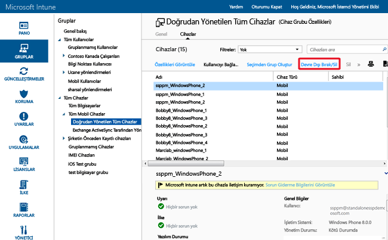

# Microsoft Intune kullanarak tam veya seçmeli temizleme ile verilerinizin korunmasına yardımcı olma
Intune ile yönetilen cihazlar artık gerekli olmadığında, başka bir kullanım amacı için ayrıldığında ya da kaybolduğunda cihazdaki uygulamaları ve verileri silebilirsiniz. Bunu yapmak için, Intune seçmeli temizleme ve tam temizleme özellikleri sağlar. Ayrıca kullanıcılar, Intune’a kayıtlı şahsi cihazlara Intune Şirket Portalı uygulamasından uzaktan cihaz temizleme komutu da verebilir.

  > [!NOTE]
  > Bu konu yalnızca, Intune mobil cihaz yönetimi tarafından yönetilen cihazların temizlenmesi ile ilgilidir. Aynı zamanda [Azure portalını](https://portal.azure.com) kullanarak da [şirket verilerini uygulamalardan silebilirsiniz](wipe-managed-company-app-data-with-microsoft-intune.md). [Intune istemci yazılımıyla yönetilen bilgisayarları devre dışı bırakma](common-windows-pc-management-tasks-with-the-microsoft-intune-computer-client#retire-a-computer.md) seçeneğine de sahipsiniz.

## Tam temizleme

**Tam temizleme**, tüm şirket ve kullanıcı verileriyle ayarlarını kaldırarak cihazı fabrika varsayılan ayarlarına geri yükler. Cihaz Intune’dan kaldırılır. Cihazı yeni bir kullanıcıya vermeden önce sıfırlamak için ya da cihazın kaybolması veya çalınması durumunda, tam temizleme yararlı olur.  **Tam temizlemeyi seçerken dikkatli olun. Cihazdaki veriler kurtarılamaz**.

> [!Warning]
> 4 GB’tan az RAM’i olan Windows 10 RTM cihazları (Windows 10 sürüm 1511’den önceki cihazlar), temizlendiğinde erişilemez duruma gelebilir. Yanıt vermemeye başlayan Windows 10 cihazına erişmek için cihazı bir USB sürücüsünden yeniden başlatabilirsiniz.

### Cihazı Intune yönetici konsolundan uzaktan silme

1.  Silinecek cihazları seçin. Bu cihazları kullanıcı veya cihaza göre bulabilirsiniz.

    -   **Kullanıcıya göre:**

        1.  [Intune yönetici konsolunda](https://manage.microsoft.com/) **Gruplar**&gt;**Tüm Kullanıcılar**’ı seçin.

        2.  Mobil cihazını silmek istediğiniz kullanıcının adını seçin. **Özellikleri Görüntüle**’yi seçin.

        3.  Kullanıcının **Özellikler** sayfasında **Cihazlar**’ı seçin ve ardından silmek istediğiniz mobil cihazın adını seçin. Birden fazla cihaz seçmek için Ctrl’ye basılı tutarak tıklayın.

    -   **Cihaza göre:**

        1.  [Intune yönetici konsolunda](https://manage.microsoft.com/) **Gruplar** &gt; **Tüm Mobil Cihazlar**’ı seçin.

         

        2.  **Cihazlar**’ı ve ardından silmek istediğiniz mobil cihazın adını seçin. Birden fazla cihaz seçmek için Ctrl’ye basılı tutarak tıklayın.

2.  **Devre Dışı Bırak/Sil**’i seçin.

3.  Cihazı devre dışı bırakmak istediğinizi onaylamanızı isteyen bir ileti görünür.

    -   Yalnızca şirket uygulamalarını ve verilerini kaldıran bir **Seçmeli temizleme** gerçekleştirmek için **Evet**'i seçin.

    -   Tüm uygulamaları ve verileri silip cihazı fabrika varsayılan ayarlarına döndüren **Tam silme** işlemini gerçekleştirmek için **Devre dışı bırakmadan önce cihazı sil**’i seçin. Bu eylem, Windows 8.1 dışında tüm platformlar için geçerlidir. **Tam silme işlemi ile kaldırılan verileri kurtaramazsınız**.

Cihaz açık ve bağlı olduğu sürece, bir temizleme komutunun tüm cihaz türlerine yayılması 15 dakikadan kısa sürer.

## Seçmeli temizleme

**Seçmeli temizleme**, cihazdan şirket verilerini (uygun durumlarda mobil uygulama yönetimi (MAM) verileri de dahil), ayarlarını ve e-posta profillerini kaldırır. Seçmeli temizleme, kullanıcının kişisel verilerini cihazda bırakır. Cihaz Intune’dan kaldırılır. Aşağıdaki tablolarda, seçmeli silme işleminden sonra, hangi verilerin kaldırıldığı ve bu işlemin cihazda kalan veriler üzerindeki etkisi açıklanmıştır. (Tablolar platforma göre düzenlenmiştir.)

**iOS**

|Veri türü|iOS|
|-------------|-------|
|Intune tarafından yüklenen şirket uygulamaları ve ilişkili veriler|Uygulamalar kaldırılır. Şirket uygulama verileri kaldırılır.  Mobil uygulama yönetimini kullanan Microsoft uygulamalarından gelen uygulama verileri kaldırılır. Uygulama kaldırılmaz.|
|Ayarlar|Intune ilkesi tarafından ayarlanan yapılandırmalar artık zorunlu tutulmaz ve kullanıcılar ayarları değiştirebilir.|
|Wi-Fi ve VPN profili ayarları|Kaldırıldı.|
|Sertifika profili ayarları|Sertifikalar kaldırılır ve iptal edilir.|
|Yönetim Aracısı|Yönetim profili kaldırılır.|
|E-posta|Intune üzerinden sağlanan e-posta profilleri kaldırılır ve cihazın önbelleğindeki e-postalar silinir.|
|Azure Active Directory (AAD) Ayrılma|AAD Kaydı kaldırılır.|
|Kişiler | Uygulamadan yerel adres defterine doğrudan eşitlenen kişiler kaldırılır.  Yerel adres defterinden başka bir dış kaynağa eşitlenen kişiler silinemez.    Şu anda yalnızca Outlook uygulaması desteklenir.

**Android**

|Veri türü|Android|Android Samsung KNOX Standard|
|-------------|-----------|------------------------|
|Web bağlantıları|Kaldırıldı.|Kaldırıldı.|
|Yönetilmeyen Google Play uygulamaları|Uygulamalar ve veriler yüklü kalır.|Uygulamalar ve veriler yüklü kalır.|
|Yönetilmeyen iş kolu uygulamaları|Uygulamalar ve veriler yüklü kalır.|Uygulamalar kaldırılır ve sonuç olarak uygulamada bulunan veriler kaldırılır. Uygulama dışındaki (örneğin, bir SD karttaki) hiçbir veri kaldırılmaz.|
|Yönetilen Google Play uygulamaları|Uygulama verileri kaldırılır. Uygulama kaldırılmaz. Uygulama dışında (ör. bir SD kart) MAM şifrelemesi ile korunan veriler şifrelenmiş ve kullanılamaz durumda kalır ancak kaldırılmaz.|Uygulama verileri kaldırılır. Uygulama kaldırılmaz. Uygulama dışında (ör. bir SD kart) MAM şifrelemesi ile korunan veriler şifrelenmiş durumda kalır ancak kaldırılmaz.|
|Yönetilen iş kolu uygulamaları|Uygulama verileri kaldırılır. Uygulama kaldırılmaz. Uygulama dışında (ör. bir SD kart) MAM şifrelemesi ile korunan veriler şifrelenmiş ve kullanılamaz durumda kalır ancak kaldırılmaz.|Uygulama verileri kaldırılır. Uygulama kaldırılmaz. Uygulama dışında (ör. bir SD kart) MAM şifrelemesi ile korunan veriler şifrelenmiş ve kullanılamaz durumda kalır ancak kaldırılmaz.|
|Ayarlar|Intune ilkesi tarafından ayarlanan yapılandırmalar artık zorunlu tutulmaz ve kullanıcılar ayarları değiştirebilir.|Intune ilkesi tarafından ayarlanan yapılandırmalar artık zorunlu tutulmaz ve kullanıcılar ayarları değiştirebilir.|
|Wi-Fi ve VPN profili ayarları|Kaldırıldı.|Kaldırıldı.|
|Sertifika profili ayarları|Sertifikaları iptal edilir, ancak kaldırılmaz.|Sertifikalar kaldırılır ve iptal edilir.|
|Yönetim Aracısı|Cihaz Yöneticisi ayrıcalığı iptal edilir.|Cihaz Yöneticisi ayrıcalığı iptal edilir.|
|E-posta|Android için Microsoft Outlook uygulaması tarafından alınan e-postalar kaldırılır.|Intune üzerinden sağlanan e-posta profilleri kaldırılır ve cihazın önbelleğindeki e-postalar silinir.|
|Azure Active Directory (AAD) Ayrılma|AAD Kaydı kaldırılır.|AAD Kaydı kaldırılır.|
|Kişiler | Uygulamadan yerel adres defterine doğrudan eşitlenen kişiler kaldırılır.  Yerel adres defterinden başka bir dış kaynağa eşitlenen kişiler silinemez.    Şu anda yalnızca Outlook uygulaması desteklenir.|Uygulamadan yerel adres defterine doğrudan eşitlenen kişiler kaldırılır.  Yerel adres defterinden başka bir dış kaynağa eşitlenen kişiler silinemez.    Şu anda yalnızca Outlook uygulaması desteklenir.

**Windows**

|Veri türü|Windows 8.1 (MDM) ve Windows RT 8.1|Windows RT|Windows Phone 8 ve Windows Phone 8.1|Windows 10|
|-------------|----------------------------------------------------------------|--------------|-----------------------------------------|--------|
|Intune tarafından yüklenen şirket uygulamaları ve ilişkili veriler|EFS tarafından korunan dosyaların anahtarı iptal edilmez ve kullanıcı dosyaları açamaz.|Şirket uygulamalarını kaldırmaz.|İlk olarak şirket portalı üzerinden yüklenen uygulamalar kaldırılır. Şirket uygulama verileri kaldırılır.|Uygulamalar ve dışarıdan yükleme anahtarları kaldırılır.|
|Ayarlar|Intune ilkesi tarafından ayarlanan yapılandırmalar artık zorunlu tutulmaz ve kullanıcılar ayarları değiştirebilir.|Intune ilkesi tarafından ayarlanan yapılandırmalar artık zorunlu tutulmaz ve kullanıcılar ayarları değiştirebilir.|Intune ilkesi tarafından ayarlanan yapılandırmalar artık zorunlu tutulmaz ve kullanıcılar ayarları değiştirebilir.|Intune ilkesi tarafından ayarlanan yapılandırmalar artık zorunlu tutulmaz ve kullanıcılar ayarları değiştirebilir.|
|Wi-Fi ve VPN profili ayarları|Kaldırıldı.|Kaldırıldı.|Desteklenmez.|Kaldırıldı.|
|Sertifika profili ayarları|Sertifikalar kaldırılır ve iptal edilir.|Sertifikalar kaldırılır ve iptal edilir.|Desteklenmez.|Sertifikalar kaldırılır ve iptal edilir.|
|E-posta|Windows e-posta ve ekleri için Posta uygulamasını da içeren EFS özellikli e-postalar kaldırılır.|Desteklenmez.|Intune üzerinden sağlanan e-posta profilleri kaldırılır ve cihazın önbelleğindeki e-postalar silinir.|Windows e-posta ve ekleri için Posta uygulamasını da içeren EFS özellikli e-postalar kaldırılır. Intune tarafından sağlanan posta hesaplarını kaldırır.|
|Azure Active Directory (AAD) Ayrılma|Hayır.|Hayır.|AAD Kaydı kaldırılır.|Yok. Windows 10, Azure Active Directory’ye katılmış cihazlarda seçmeli temizlemeyi desteklemez.|

## Şifreleme dosya sistemi (EFS) özellikli içeriği silme
EFS ile şifrelenmiş içeriklerin seçilerek silinmesi Windows 8.1 ve Windows RT 8.1 tarafından desteklenir. Aşağıdakiler, EFS özellikli içeriklere yönelik seçmeli silme işlemi için geçerlidir:

-   Yalnızca Intune hesabıyla aynı İnternet etki alanını kullanan EFS korumalı uygulamalar ve veriler seçmeli olarak temizlenir. Daha fazla bilgi için bkz. [Cihaz Veri Yönetimi için Windows Seçmeli Silme](http://technet.microsoft.com/library/dn486874.aspx).

-   EFS ile ilişkili etki alanında yapılan herhangi bir değişiklik varsa, yeni etki alanını kullanan uygulama ve verilerin seçilerek silinmesinden önce değişikliklerin uygulanması 48 saati bulabilir.

-   Intune’a kayıtlı olan her etki alanı temizlenir.

Şu anda EFS seçmeli silme tarafından desteklenen veriler ve uygulamalar şunlardır:

-   Windows için Posta uygulaması

-   Çalışma klasörleri

-   EFS tarafından şifrelenmiş dosya ve klasörler. Daha fazla bilgi için bkz. [Şifreleme Dosya Sistemi için en iyi uygulamalar](http://support.microsoft.com/kb/223316).

-   Kuruluşunuz Active Directory'de kimliğini koruyorsa, EFS seçmeli silmenin düzgün çalışması için AAD ile verileri eşitlemek için Dizin Eşitleme (DirSync) aracını kullanmalıdır.  DirSync hakkında daha fazla bilgi için Azure Active Directory belgelerindeki [Dizin Eşitleme Senaryosu](http://technet.microsoft.com/library/dn441212.aspx)'na bakın.

## Devre dışı bırakma ve silme eylemlerini izleme
Devre dışı bırakılan veya silinen cihazlara ilişkin bir rapor almak için:

1.  [Intune yönetici konsolunda](https://manage.microsoft.com/) **Raporlar** &gt; **Cihaz Geçmişi Raporları**’nı seçin.

2.  Rapor için bir başlangıç ve bitiş tarihi sağlayın, sonra **Raporu Görüntüle**'yi seçin.

Bu rapor eylemi gerçekleştiren kişiyi de gösterir.

### Ayrıca bkz.
[Cihazları devre dışı bırakma](retire-devices-from-microsoft-intune-management.md)

[Cihaz Veri Yönetimi için Windows Seçmeli Temizleme](http://technet.microsoft.com/library/dn486874.aspx)

<!--HONumber=Nov16_HO1-->

