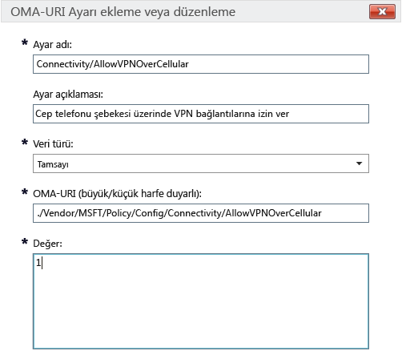

# Microsoft Intune’daki Windows 10 cihazları için Intune ilke ayarları

Bu konu, Windows 10 cihazlarını yönetmek için kullanabileceğiniz Intune ilke ayarlarını anlamanıza yardımcı olacak bilgiler içermektedir. Kaydedilmiş Windows 10 Desktop ve Windows 10 Mobile cihazlarının yerleşik ve özel ayarlarını yapılandırmak için bu konuyu [Cihazlarınızdaki ayarları ve özellikleri Microsoft Intune ilkeleriyle yönetme](manage-settings-and-features-on-your-devices-with-microsoft-intune-policies) bölümündeki yordamlarla birlikte okuyun. Bu ilkeleri [Intune bilgisayarı istemci yazılımı](/intune/get-started/windows-pc-management-capabilities-in-microsoft-intune) çalıştıran bilgisayarlarla kullanamazsınız.

İki ilke türünden birini seçebilirsiniz:

- **Özel ilke** - Cihazlardaki özellikleri denetlemek için kullanılabilecek OMA-URI (Open Mobile Alliance Uniform Resource Identifier) ayarları dağıtmak üzere Windows 10 ve Windows 10 Mobile için Microsoft Intune **özel ilkesini** kullanın. Windows 10, [İlke Yapılandırma Hizmet Sağlayıcısı (İlke CSP’si)](https://technet.microsoft.com/itpro/windows/manage/how-it-pros-can-use-configuration-service-providers) aracılığıyla pek çok ayarı kullanıma sunar.
- **Genel yapılandırma ilkesi** - Microsoft Intune ile sağlanan yerleşik listeden ayar seçmek istediğinizde bu ilke türünü kullanın.

## Özel ilke ayarları

Özel bir ilkede aşağıdaki ayarları sağlayın:

## &nbsp;&nbsp;&nbsp;Genel

Intune konsolunda tanımanıza yardımcı olması için bu ilke için bir ad ve isterseniz bir açıklama girin.

## &nbsp;&nbsp;&nbsp;OMA-URI ayarları

Eklemek istediğiniz her OMA-URI ayarı için aşağıdaki bilgileri girin. Kullanabileceğiniz ayarlar hakkında bilgi edinmek için bu konuda bulunan [Windows 10 URI ayarları başvurusunu](/intune/deploy-use/windows-10-policy-settings-in-microsoft-intune#Windows-10-URI-settings) kullanın: 

- **Ayar adı** - Ayar listesinde tanımanıza yardımcı olması için OMA-URI ayarı için benzersiz bir ad girin.
- **Ayar açıklaması** - İsterseniz ayar için bir açıklama girin.
- **Veri türü** - Aşağıdakilerden birini seçin:
    - **Dize**
    - **Dize (XML)**
    - **Tarih ve saat**
    - **Tamsayı**
    - **Kayan nokta**
    - **Boole değeri**
- **OMA-URI (büyük/küçük harfe duyarlı)** - Bir ayarını girmek istediğiniz OMA-URI’yi belirtin.
- **Değer** - Girdiğiniz OMA-URI ile ilişkilendirilecek değeri belirtin.

### Örnek
Aşağıdaki ekran görüntüsünde **Connectivity/AllowVPNOverCellular** ayarı etkinleştirilmiştir. Bu değer, bir Windows 10 cihazının hücresel bir ağdayken VPN bağlantısı açmasına izin verir.

> 

## Windows 10 URI ayarları
Bir **Windows 10 Özel İlkesi** ile yapılandırabileceğiniz OMA-URI ayarları hakkında bilgi edinmek için bu bölümü kullanın.

## &nbsp;&nbsp;&nbsp;İlke

|İlke adı ve URI|Ayrıntılar|
|---------------|------------|-----------|
|**Otomatik Güncelleştirmeye İzin Ver** ./Vendor/MSFT/Policy/Config/Update/AllowAutoUpdate|Yalnızca masaüstü **Veri türü:** Tamsayı **Değerler:** **0** - **5** (varsayılan: **1**)|
|**Yükleme Gününü Zamanlama** ./Vendor/MSFT/Policy/Config/Update/ScheduledInstallDay|Yalnızca mobil **Veri türü:** Tamsayı **Değerler:** **0** - Her gün (varsayılan) **1** - Pazar **2** - Pazartesi **3** - Salı **4** - Çarşamba **5** - Perşembe **6** - Cuma **7** - Cumartesi|
|**Yükleme Saatini Zamanlama** ./Vendor/MSFT/Policy/Config/Update/ScheduledInstallTime|Masaüstü ve mobil **Veri türü:** Tamsayı **Değerler:** **0** – **23** saat (**0** gece yarısıdır) (varsayılan: **3**)|
|**DeviceLock/AllowIdleReturnWithoutPassword** ./Vendor/MSFT/Policy/Config/DeviceLock/AllowIdleReturnWithoutPassword|Yalnızca mobil **Veri türü:** Tamsayı **Değerler:** **0** - kullanıcı parola yetkisiz kullanım süresi zamanlayıcısını ayarlayamaz; değer “her defasında” olarak ayarlanır **1** - kullanıcı, parola yetkisiz kullanım süresi zamanlayıcısını ayarlayabilir (varsayılan)|
|**WiFi/AllowWiFi** ./Vendor/MSFT/Policy/Config/WiFi/AllowWiFi|Yalnızca mobil **Veri türü:** Tamsayı **Değerler:** **0** – **Wi-Fi bağlantısı kullanılmasına** izin verme. **1** –**Wi-Fi bağlantısı kullanılmasına izin ver** (varsayılan)|
|**WiFi/AllowInternetSharing** ./Vendor/MSFT/Policy/Config/WiFi/AllowInternetSharing|Masaüstü ve mobil **Veri türü:** Tamsayı **Değerler:** **0** – İnternet Paylaşımına izin verme, **1** – İnternet Paylaşımına izin ver (varsayılan)|
|**WiFi/AllowAutoConnectToWiFiSenseHotspots** ./Vendor/MSFT/Policy/Config/WiFi/AllowAutoConnectToWiFiSenseHotspots|Masaüstü ve mobil **Veri türü:** Tamsayı **Değerler:** **0** – izin verilmez, **1** – izin verilir (varsayılan)|
|**WiFi/AllowManualWiFiConfiguration** ./Vendor/MSFT/Policy/Config/WiFi/AllowManualWiFiConfiguration|Yalnızca mobil **Veri türü:** Tamsayı **Değerler:** **0** – MDM tarafından sağlanan dışında bir Wi-Fi bağlantısına izin verilmez. **1** – Önceden MDM tarafından sağlananlar dışında yeni ağ SSID’leri eklenmesine izin verilir (varsayılan)|
|**System/AllowLocation** ./Vendor/MSFT/Policy/Config/System/AllowLocation|Masaüstü ve mobil **Veri türü:** Tamsayı **Değerler:** **0** – izin verilmez, **1** – izin verilir (varsayılan)|
|**System/AllowTelemetry** ./Vendor/MSFT/Policy/Config/System/AllowTelemetry|Masaüstü ve mobil **Veri türü:** Tamsayı **Değerler:** **0** – İzin verilmiyor (yalnızca Kurumsal) **1** – Sınırlı **2** – Tam (varsayılan) **3** - Tam ve tanılama bilgileri|
|**System/AllowExperimentation** ./Vendor/MSFT/Policy/Config/System/AllowExperimentation|Masaüstü ve mobil **Veri türü:** Tamsayı **Değerler:** **0** – İzin verilmiyor **1**- Yalnızca ayarlar (varsayılan) **2**- Ayarlar ve deneme|
|**Security/AntiTheftMode** ./Vendor/MSFT/Policy/Config/Security/AntiTheftMode|Yalnızca mobil **Veri türü:** Tamsayı **Değerler:** **0** - Hırsızlık Önleme moduna izin verme **1** Kullanıcı tercihi (varsayılan)|
|**Connectivity/AllowUSBConnection** ./Vendor/MSFT/Policy/Config/Connectivity/AllowUSBConnection|Yalnızca mobil **Veri türü:** Tamsayı **Değerler:** **0** – izin verilmez, **1** – izin verilir (varsayılan)|
|**System/AllowUserToResetPhone** ./Vendor/MSFT/Policy/Config/System/AllowUserToResetPhone|Yalnızca mobil **Veri türü:** Tamsayı **Değerler:** **0** – izin verilmez, **1** – izin verilir (varsayılan)|
|**Connectivity/AllowCellularDataRoaming** ./Vendor/MSFT/Policy/Config/Connectivity/AllowCellularDataRoaming|Masaüstü ve mobil **Veri türü:** Tamsayı **Değerler:** **0** – izin verilmez, **1** – izin verilir (varsayılan)|
|**Connectivity/AllowVPNOverCellular** ./Vendor/MSFT/Policy/Config/Connectivity/AllowVPNOverCellular|Masaüstü ve mobil **Veri türü:** Tamsayı **Değerler:** **0** - Hücresel şebeke üzerinden VPN’ye izin verilmez **1** – VPN, hücresel şebeke de dahil tüm bağlantıları kullanır (varsayılan)|
|**Connectivity/AllowVPNRoamingOverCellular** ./Vendor/MSFT/Policy/Config/Connectivity/AllowVPNRoamingOverCellular|Yalnızca mobil **Veri türü:** Tamsayı **Değerler:** **0** – izin verilmez, **1** – izin verilir (varsayılan)|
|**Connectivity/AllowVPNRoamingOverCellular** ./Vendor/MSFT/Policy/Config/Connectivity/AllowVPNRoamingOverCellular|Yalnızca mobil **Veri türü:** Tamsayı **Değerler:** **0** – izin verilmez, **1** – izin verilir (varsayılan)|
|**Connectivity/AllowBluetooth** ./Vendor/MSFT/Policy/Config/Connectivity/AllowBluetooth|Masaüstü ve mobil **Veri türü:** Tamsayı **Değerler:** **0** – Kullanıcının Bluetooth’u açmasına izin verilmez. **1** – Ayrılmış. Kullanıcı Bluetooth’u açabilir ve yapılandırabilir (MDM için Windows Phone 8.1, EAS, Windows 10 masaüstü veya Windows 10 Mobile’da desteklenmez) **2** - İzin verilir. Kullanıcı Bluetooth’u açabilir ve yapılandırabilir (varsayılan)|
|**Experience/AllowScreenCapture** ./Vendor/MSFT/Policy/Config/Experience/AllowScreenCapture|Yalnızca mobil **Veri türü:** Tamsayı **Değerler:** **0** – izin verilmez, **1** – izin verilir (varsayılan)|
|**Experience/AllowTaskSwitcher** ./Vendor/MSFT/Policy/Config/Experience/AllowTaskSwitcher|Yalnızca mobil **Veri türü:** Tamsayı **Değerler:** **0** – izin verilmez, **1** – izin verilir (varsayılan)|
|**Experience/AllowVoiceRecording** ./Vendor/MSFT/Policy/Config/Experience/AllowVoiceRecording|Yalnızca mobil **Veri türü:** Tamsayı **Değerler:** **0** – izin verilmez, **1** – izin verilir (varsayılan)|
|**Experience/AllowSyncMySettings** ./Vendor/MSFT/Policy/Config/Experience/AllowSyncMySettings|Yalnızca mobil **Veri türü:** Tamsayı **Değerler:** **0** – Dolaşıma izin verme **1** – Dolaşıma izin ver (varsayılan)|
|**Experience/AllowManualMDMUnenrollment** ./Vendor/MSFT/Policy/Config/Experience/AllowManualMDMUnenrollment|Masaüstü ve mobil **Veri türü:** Tamsayı **Değerler:** **0** – izin verilmez, **1** – izin verilir (varsayılan)|
|**Accounts/AllowMicrosoftAccountConnection** ./Vendor/MSFT/Policy/Config/Accounts/AllowMicrosoftAccountConnection|Masaüstü ve mobil **Veri türü:** Tamsayı **Değerler:** **0** – izin verilmez, **1** – izin verilir (varsayılan)|
|**Accounts/AllowAddingNonMicrosoftAccountsManually** ./Vendor/MSFT/Policy/Config/Accounts/AllowAddingNonMicrosoftAccountsManually|Masaüstü ve mobil **Veri türü:** Tamsayı **Değerler:** **0** – izin verilmez, **1** – izin verilir (varsayılan)|
|**Security/AllowManualRootCertificateInstallation** ./Vendor/MSFT/Policy/Config/Security/AllowManualRootCertificateInstallation|Yalnızca mobil **Veri türü:** Tamsayı **Değerler:** **0** – izin verilmez, **1** – izin verilir (varsayılan)|
|**Security/AllowAddProvisioningPackages** ./Vendor/MSFT/Policy/Config/Security/AllowAddProvisioningPackages|Masaüstü ve mobil **Veri türü:** Tamsayı **Değerler:** **0** – izin verilmez, **1** – izin verilir (varsayılan)|
|**Search/DisableBackoff** ./Vendor/MSFT/Policy/Config/Search/DisableBackoff|Masaüstü ve mobil **Veri türü:** Tamsayı **Değerler:** **0** (varsayılan), **1**|
|**Search/PreventRemoteQueries** ./Vendor/MSFT/Policy/Config/Search/PreventRemoteQueries|Masaüstü ve mobil **Veri türü:** Tamsayı **Değerler:** **0**, **1** (varsayılan)|
|**Search/AllowUsingDiacritics** ./Vendor/MSFT/Policy/Config/Search/AllowUsingDiacritics|Masaüstü ve mobil **Veri türü:** Tamsayı **Değerler:** **0** (varsayılan), **1**|
|**Search/AlwaysUseAutoLangDetection** ./Vendor/MSFT/Policy/Config/Search/AlwaysUseAutoLangDetection|Masaüstü ve mobil **Veri türü:** Tamsayı **Değerler:** **0** (varsayılan), **1**|
|**Search/DisableRemovableDriveIndexing** ./Vendor/MSFT/Policy/Config/Search/DisableRemovableDriveIndexing|Masaüstü ve mobil **Veri türü:** Tamsayı **Değerler:** **0** (varsayılan), **1**|
|**Search/PreventIndexingLowDiskSpaceMB** ./Vendor/MSFT/Policy/Config/Search/PreventIndexingLowDiskSpaceMB|Masaüstü ve mobil **Veri türü:** Tamsayı **Değerler:** **0**, **1** (varsayılan)|
|**Search/AllowIndexingEncryptedStoresOrItems** ./Vendor/MSFT/Policy/Config/Search/AllowIndexingEncryptedStoresOrItems|Masaüstü ve mobil **Veri türü:** Tamsayı **Değerler:** **0** (varsayılan), **1**|
|**Security/AllowRemoveProvisioningPackage** ./Vendor/MSFT/Policy/Config/Security/AllowRemoveProvisioningPackage|Masaüstü ve mobil **Veri türü:** Tamsayı **Değerler:** **0** – izin verilmez, **1** – izin verilir (varsayılan)|
|**Security/RequireProvisioningPackageSignature** ./Vendor/MSFT/Policy/Config/Security/RequireProvisioningPackageSignature|Masaüstü ve mobil **Veri türü:** Tamsayı **Değerler:** **0** (varsayılan), **1**|
|**AboveLock/AllowActionCenterNotifications** ./Vendor/MSFT/Policy/Config/AboveLock/AllowActionCenterNotifications|Masaüstü ve mobil **Veri türü:** Tamsayı **Değerler:** **0** – izin verilmez, **1** – izin verilir (varsayılan)|
|**TextInput/AllowIMENetworkAccess** ./Vendor/MSFT/Policy/Config/TextInput/AllowIMENetworkAccess|Yalnızca masaüstü **Veri türü:** Tamsayı **Değerler:** **0** – İzin verme Açık Genişletilmiş Sözlük kapalıdır. Kullanıcı şunları yapamaz: -Yeni bir Açık Genişletilmiş Sözlük ekleme -Yeni bir arama tümleştirme yapılandırma dosyası ekleme -Bulut aday özelliğini kullanma -Kullanıcı tarafından kaydedilen sözcüğü gönderme. **1** - İzin ver Açık Genişletilmiş Sözlük eklenebilir ve varsayılan olarak kullanılabilir. Ayrıca, arama tümleştirme işlevi varsayılan olarak kullanılabilir. Kullanıcı şunları yapabilir: Bulut aday özelliğini kullanma.|
|**TextInput/AllowIMELogging** ./Vendor/MSFT/Policy/Config/TextInput/AllowIMELogging|Yalnızca masaüstü **Veri türü:** Tamsayı **Değerler:** **0** - Hatalı dönüştürme günlüğü kapalıdır. **1** - Hatalı dönüştürme günlüğü açık (varsayılan)|
|**TextInput/AllowJapaneseNonPublishingStandardGlyph** ./Vendor/MSFT/Policy/Config/TextInput/AllowJapaneseNonPublishingStandardGlyph|Yalnızca masaüstü **Veri türü:** Tamsayı **Değerler:** **0** – izin verilmez, **1** – izin verilir (varsayılan)|
|**TextInput/AllowJapaneseIVSCharacters** ./Vendor/MSFT/Policy/Config/TextInput/AllowJapaneseIVSCharacters|Yalnızca masaüstü **Veri türü:** Tamsayı **Değerler:** **0** – izin verilmez, **1** – izin verilir (varsayılan)|
|**TextInput/AllowJapaneseUserDictionary** ./Vendor/MSFT/Policy/Config/TextInput/AllowJapaneseUserDictionary|Yalnızca masaüstü **Veri türü:** Tamsayı **Değerler:** **0** – izin verilmez **1** – izin verilir (varsayılan)|
|**TextInput/AllowJapaneseIMESurrogatePairCharacters** ./Vendor/MSFT/Policy/Config/TextInput/AllowJapaneseIMESurrogatePairCharacters|Yalnızca masaüstü **Veri türü:** Tamsayı **Değerler:** **0** – izin verilmez, **1** – izin verilir (varsayılan)|
|**TextInput/ExcludeJapaneseIMEExceptShiftJIS** ./Vendor/MSFT/Policy/Config/TextInput/ExcludeJapaneseIMEExceptShiftJIS|Yalnızca masaüstü **Veri türü:** Tamsayı **Değerler:** **0** - Hiçbir karakter filtrelenmez (varsayılan) **1** - Shift JIS karakterleri dışında tümü filtrelenir|
|**TextInput/ExcludeJapaneseIMEExceptJIS0208** ./Vendor/MSFT/Policy/Config/TextInput/ExcludeJapaneseIMEExceptJIS0208|Yalnızca masaüstü **Veri türü:** Tamsayı **Değerler:** **0** - Hiçbir karakter filtrelenmez (varsayılan) **1** - JIS0208 karakterleri dışında tümü filtrelenir|
|**TextInput/ExcludeJapaneseIMEExceptJIS0208andEUDC** ./Vendor/MSFT/Policy/Config/TextInput/ExcludeJapaneseIMEExceptJIS0208andEUDC|Yalnızca masaüstü **Veri türü:** Tamsayı **Değerler:** **0** - Hiçbir karakter filtrelenmez (varsayılan) **1** - JIS0208 karakterleri veya EUDC karakterleri dışında tümü filtrelenir|
|**TextInput/AllowInputPanel** ./Vendor/MSFT/Policy/Config/TextInput/AllowInputPanel|Yalnızca masaüstü **Veri türü:** Tamsayı **Değerler:** **0** – izin verilmez, **1** – izin verilir (varsayılan)|
|**Bluetooth/AllowDiscoverableMode** ./Vendor/MSFT/Policy/Config/Bluetooth/AllowDiscoverableMode|Masaüstü ve mobil **Veri türü:** Tamsayı **Değerler:** **0** – izin verilmez, **1** – izin verilir (varsayılan)|
|**Bluetooth/AllowAdvertising** ./Vendor/MSFT/Policy/Config/Bluetooth/AllowAdvertising|Masaüstü ve mobil **Veri türü:** Tamsayı **Değerler:** **0** – izin verilmez, **1** – izin verilir (varsayılan)|
|**Settings/AllowDataSense** ./Vendor/MSFT/Policy/Config/Settings/AllowDataSense|Masaüstü ve mobil **Veri türü:** Tamsayı **Değerler:** **0** – izin verilmez, **1** – izin verilir (varsayılan)|
|**Settings/AllowVPN** ./Vendor/MSFT/Policy/Config/Settings/AllowVPN|Masaüstü ve mobil **Veri türü:** Tamsayı **Değerler:** **0** – izin verilmez, **1** – izin verilir (varsayılan)|
|**Settings/AllowWorkplace** ./Vendor/MSFT/Policy/Config/Settings/AllowWorkplace|Yalnızca masaüstü **Veri türü:** Tamsayı **Değerler:** **0** – izin verilmez, **1** – izin verilir (varsayılan)|
|**Settings/AllowDateTime** ./Vendor/MSFT/Policy/Config/Settings/AllowDateTime|Masaüstü ve mobil **Veri türü:** Tamsayı **Değerler:** **0** – izin verilmez, **1** – izin verilir (varsayılan)|
|**Settings/AllowLanguage** ./Vendor/MSFT/Policy/Config/Settings/AllowLanguage|Yalnızca masaüstü **Veri türü:** Tamsayı **Değerler:** **0** – izin verilmez, **1** – izin verilir (varsayılan)|
|**Settings/AllowRegion** ./Vendor/MSFT/Policy/Config/Settings/AllowRegion|Yalnızca masaüstü **Veri türü:** Tamsayı **Değerler:** **0** – izin verilmez, **1** – izin verilir (varsayılan)|
|**Settings/AllowSignInOptions** ./Vendor/MSFT/Policy/Config/Settings/AllowSignInOptions|Yalnızca masaüstü **Veri türü:** Tamsayı **Değerler:** **0** – izin verilmez, **1** – izin verilir (varsayılan)|
|**Settings/AllowYourAccount** ./Vendor/MSFT/Policy/Config/Settings/AllowYourAccount|Masaüstü ve mobil **Veri türü:** Tamsayı **Değerler:** **0** – izin verilmez, **1** – izin verilir (varsayılan)|
|**Settings/AllowPowerSleep** ./Vendor/MSFT/Policy/Config/Settings/AllowPowerSleep|Yalnızca masaüstü **Veri türü:** Tamsayı **Değerler:** **0** – izin verilmez, **1** – izin verilir (varsayılan)|
|**Settings/AllowAutoPlay** ./Vendor/MSFT/Policy/Config/Settings/AllowAutoPlay|Yalnızca masaüstü **Veri türü:** Tamsayı **Değerler:** **0** – izin verilmez, **1** – izin verilir (varsayılan)|
|**Experience/AllowCortana** ./Vendor/MSFT/Policy/Config/Experience/AllowCortana|Masaüstü ve mobil **Veri türü:** Tamsayı **Değerler:** **0** – izin verilmez, **1** – izin verilir (varsayılan)|
|**Search/SafeSearchPermissions** ./Vendor/MSFT/Policy/Config/Search/SafeSearchPermissions|Yalnızca mobil **Veri türü:** Tamsayı **Değerler:** **0** – Katı, yetişkinlere yönelik içeriğe karşı en yüksek filtreleme **1** – Orta, yetişkinlere yönelik içeriğe karşı orta düzeyli filtreleme (geçerli arama sonuçları filtrelenmez - varsayılan)|
|**Experience/AllowCopyPaste** ./Vendor/MSFT/Policy/Config/Experience/AllowCopyPaste|Yalnızca masaüstü **Veri türü:** Tamsayı **Değerler:** **0** – izin verilmez, **1** – izin verilir (varsayılan)|
|**Başlatmaya Zorlama Boyutu** ./Vendor/MSFT/Policy/Config/Start/ForceStartSize|Yalnızca mobil **Veri türü:** Tamsayı **Değerler:** **0** - kullanıcı boyut değişikliğine izin ver (varsayılan) **1** - tam olmayan ekranı zorla **2** - tam ekranı zorla|
|**Update/RequireDeferUpgrade** ./Vendor/MSFT/Policy/Config/Update/RequireDeferUpgrade|Masaüstü ve mobil **Veri türü:** Tamsayı **Değerler:** **0**: Yükseltmeyi erteleme (geçerli dal olan CB’de kal - varsayılan) **1**: Güncelleştirme ve yükseltmelerin ertelenmesini etkinleştir (Cihaz, geçerli iş dalı olan CBB’nin kurallarına uyar) Ayrıntılar için bkz. [Windows 10 hizmetlerine giriş](https://technet.microsoft.com/library/mt598226.aspx) [Windows 10 dağıtımını planlama](https://technet.microsoft.com/library/mt574241.aspx)|
|**Update/DeferUpdatePeriod** ./Vendor/MSFT/Policy/Config/Update/DeferUpdatePeriod|Masaüstü ve mobil **Açıklama**: Yazılım güncelleştirmelerini 4 haftaya kadar erteleme ilkesi **Veri türü:** Tamsayı **Değerler:**  **0**: Güncelleştirmeleri hemen uygula (varsayılan) **1**-**4**: Yazılım güncelleştirmelerinin erteleneceği hafta sayısı. Ayrıntılar için bkz. [Windows 10 hizmetlerine giriş](https://technet.microsoft.com/library/mt598226.aspx) [Windows 10 dağıtımını planlama](https://technet.microsoft.com/library/mt574241.aspx)|
|**Update/DeferUpgradePeriod** ./Vendor/MSFT/Policy/Config/Update/DeferUpgradePeriod|Masaüstü ve mobil **Açıklama**: Özellik yükseltmelerini 8 aya kadar erteleme ilkesi **Veri türü:** Tamsayı **Değerler:** **0**: Güncelleştirmeleri hemen uygula (varsayılan) **1**-**8**: Özellik yükseltmelerinin erteleneceği ay sayısı. Ayrıntılar için bkz. [Windows 10 hizmetlerine giriş](https://technet.microsoft.com/library/mt598226.aspx) [Windows 10 dağıtımını planlama](https://technet.microsoft.com/library/mt574241.aspx)|
|**Update/PauseDeferrals** ./Vendor/MSFT/Policy/Config/Update/PauseDeferrals|Masaüstü ve mobil **Açıklama:** Bir cihazın 5 hafta boyunca güncelleştirme ve yükseltme almayı durdurmasını sağlar. **Veri türü:** Tamsayı **Değerler:** **0**: Güncelleştirmeleri hemen uygula (varsayılan) **1**: Güncelleştirmeleri ve yükseltmeleri duraklat (5 hafta sonra süresi dolar)|

## &nbsp;&nbsp;&nbsp;Windows Defender

|İlke adı ve URI|Ayrıntılar|
|---------------|-----------|
|**AllowRealtimeMonitoring** ./Vendor/MSFT/Policy/Config/Defender/AllowRealtimeMonitoring|Yalnızca masaüstü **Veri türü:** Tamsayı **Değerler:** **0** – izin verilmez, **1** – izin verilir (varsayılan)|
|**AllowBehaviorMonitoring** ./Vendor/MSFT/Policy/Config/Defender/AllowBehaviorMonitoring|Yalnızca masaüstü **Veri türü:** Tamsayı **Değerler:** **0** – izin verilmez, **1** – izin verilir (varsayılan)|
|**AllowIntrusionPreventionSystem** ./Vendor/MSFT/Policy/Config/Defender/AllowIntrusionPreventionSystem|Yalnızca masaüstü **Veri türü:** Tamsayı **Değerler:** **0** – izin verilmez, **1** – izin verilir (varsayılan)|
|**AllowIOAVProtection** ./Vendor/MSFT/Policy/Config/Defender/AllowIOAVProtection|Yalnızca masaüstü **Veri türü:** Tamsayı **Değerler:** **0** – izin verilmez, **1** – izin verilir (varsayılan)|
|**AllowScriptScanning** ./Vendor/MSFT/Policy/Config/Defender/AllowScriptScanning|Yalnızca masaüstü **Veri türü:** Tamsayı **Değerler:** **0** – izin verilmez, **1** – izin verilir (varsayılan)|
|**AllowOnAccessProtection** ./Vendor/MSFT/Policy/Config/Defender/AllowOnAccessProtection|Yalnızca masaüstü **Veri türü:** Tamsayı **Değerler:** **0** – izin verilmez, **1** – izin verilir (varsayılan)|
|**RealTimeScanDirection** ./Vendor/MSFT/Policy/Config/Defender/RealTimeScanDirection|Yalnızca masaüstü **Veri türü:** Tamsayı **Değerler:** **0** – Tüm dosyaları izle (varsayılan) **1** – Gelen dosyaları izle **2** – Giden dosyaları izle|
|**DaysToRetainCleanedMalware** ./Vendor/MSFT/Policy/Config/Defender/DaysToRetainCleanedMalware|Yalnızca masaüstü **Veri türü:** Tamsayı **Değerler:** **0** - **90** – Kötü amaçlı yazılımın ne kadar süre tutulacağını belirtir **Varsayılan:** **0** – sonsuza kadar karantina klasöründe tutar ve otomatik olarak kaldırmaz|
|**AllowUserUIAccess** ./Vendor/MSFT/Policy/Config/Defender/AllowUserUIAccess|Yalnızca masaüstü **Veri türü:** Tamsayı **Değerler:** **0** – izin verilmez, **1** – izin verilir (varsayılan)|
|**ScanParameter** ./Vendor/MSFT/Policy/Config/Defender/ScanParameter|Yalnızca masaüstü **Veri türü:** Tamsayı **Değerler:** **1** – Hızlı tarama (varsayılan) **2** - Tam tarama|
|**ScheduleScanDay** ./Vendor/MSFT/Policy/Config/Defender/ScheduleScanDay|Yalnızca masaüstü **Veri türü:** Tamsayı **Değerler:** **0** - Her gün (varsayılan) **1** - Pazartesi **2** - Salı **3** - Çarşamba **4** - Perşembe **5** - Cuma **6** - Cumartesi **7** - Pazar **8** – Zamanlanmış tarama yok|
|**ScheduleScanTime** ./Vendor/MSFT/Policy/Config/Defender/ScheduleScanTime|Yalnızca masaüstü **Veri türü:** Tamsayı **Değerler:** **0** - 00:00 **60** – 1:00 **120** – 2:00 (varsayılan) **180** – 3:00 **240** – 4:00 **300** – 5:00 **360** – 6:00 **420** – 7:00 **480** – 8:00 **540** – 9:00 **600** – 10:00 **660** – 11:00 **720** – 12:00 **780** – 13:00 **840** – 14:00 **900** – 15:00 **960** – 16:00 **1020** – 17:00 **1080** – 18:00 **1140** – 19:00 **1200** – 20:00 **1260** – 21:00 **1320** – 22:00 **1381** – Bakım penceresi|
|**ScheduleQuickScanTime** ./Vendor/MSFT/Policy/Config/Defender/ScheduleQuickScanTime|Yalnızca masaüstü **Veri türü:** Tamsayı **Değerler:** **0** - 00:00 **60** – 1:00 **120** – 2:00 (varsayılan) **180** – 3:00 **240** – 4:00 **300** – 5:00 **360** – 6:00 **420** – 7:00 **480** – 8:00 **540** – 9:00 **600** – 10:00 **660** – 11:00 **720** – 12:00 **780** – 13:00 **840** – 14:00 **900** – 15:00 **960** – 16:00 **1020** – 17:00 **1080** – 18:00 **1140** – 19:00 **1200** – 20:00 **1260** – 21:00 **1320** – 22:00 **1380** – 23:00|
|**AVGCPULoadFactor** ./Vendor/MSFT/Policy/Config/Defender/AVGCPULoadFactor|Yalnızca masaüstü **Veri türü:** Tamsayı **Değerler:** **0** - **100** (varsayılan: **50**)|
|**AllowArchiveScanning** ./Vendor/MSFT/Policy/Config/Defender/AllowArchiveScanning|Yalnızca masaüstü **Veri türü:** Tamsayı **Değerler:** **0** – izin verilmez, **1** – izin verilir (varsayılan)|
|**AllowEmailScanning** ./Vendor/MSFT/Policy/Config/Defender/AllowEmailScanning|Yalnızca masaüstü **Veri türü:** Tamsayı **Değerler:** **0** – izin verilmez (varsayılan), **1** – izin verilir|
|**AllowFullScanRemovableDriveScanning** ./Vendor/MSFT/Policy/Config/Defender/AllowFullScanRemovableDriveScanning|Yalnızca masaüstü **Veri türü:** Tamsayı **Değerler:** **0** – izin verilmez (varsayılan), **1** – izin verilir|
|**AllowFullScanOnMappedNetworkDrives** ./Vendor/MSFT/Policy/Config/Defender/AllowFullScanOnMappedNetworkDrives|Yalnızca masaüstü **Veri türü:** Tamsayı **Değerler:** **0** – izin verilmez, **1** – izin verilir (varsayılan)|
|**AllowScanningNetworkFiles** ./Vendor/MSFT/Policy/Config/Defender/AllowScanningNetworkFiles|Yalnızca masaüstü **Veri türü:** Tamsayı **Değerler:** **0** – izin verilmez, **1** – izin verilir (varsayılan) – İzin verilir olarak ayarlanırsa, RTP açık olduğunda da çalışır|
|**SignatureUpdateInterval** ./Vendor/MSFT/Policy/Config/Defender/SignatureUpdateInterval|Yalnızca masaüstü **Veri türü:** Tamsayı **Değerler:** **0** – Bir aralıkta imza denetleme **1** - Saatte bir imzaları denetle **2** – Her 2 vb. saatte bir denetle **24** - Her gün denetle **Varsayılan değer:** 8 – Her 8 saatte bir denetle|
|**AllowCloudProtection** ./Vendor/MSFT/Policy/Config/Defender/AllowCloudProtection|Yalnızca masaüstü **Veri türü:** Tamsayı **Değerler:** **0** – izin verilmez, **1** – izin verilir (varsayılan)|
|**SubmitSamplesConsent** ./Vendor/MSFT/Policy/Config/Defender/SubmitSamplesConsent|Yalnızca masaüstü **Veri türü:** Tamsayı **Değerler:** **0** – Her zaman sor (varsayılan) **1** – Güvenli örnekleri otomatik olarak gönder **2** – Hiçbir zaman gönderme **3** – Tüm örnekleri otomatik olarak gönder|
|**ExcludedExtensions** ./Vendor/MSFT/Policy/Config/Defender/ExcludedExtensions|Yalnızca masaüstü **Veri türü:** Dize **Değerler:** *&lt;noktalı virgülle ayrılmış uzantılar listesi&gt;* Örn. **obj;lib** **Varsayılan:** Hiçbir uzantı dışlanmaz|
|**ExcludedPaths** ./Vendor/MSFT/Policy/Config/Defender/ExcludedPaths|Yalnızca masaüstü **Veri türü:** Dize **Değerler:** *&lt;noktalı virgülle ayrılmış yollar listesi&gt;* Örnek: **c:\test;c:\test1.exe** **Varsayılan değer:** Hiçbir yol dışlanmaz|
|**ExcludedProcesses** ./Vendor/MSFT/Policy/Config/Defender/ExcludedProcesses|Yalnızca masaüstü **Veri türü:** Dize **Değerler:** *&lt;noktalı virgülle ayrılmış yollar listesi&gt;* Örnek: **c:\test.exe;c:\test1.exe** **Varsayılan değer:** Hiçbir işlem dışlanmaz|

## &nbsp;&nbsp;&nbsp;Edge tarayıcısı

|İlke adı ve URI|Ayrıntılar|
|---------------|------------|-----------|
|**Tarayıcıya İzin Verme** ./Vendor/MSFT/Policy/Config/Browser/AllowBrowser|Yalnızca mobil **Veri türü:** Tamsayı **Değerler:** **0**: tarama kapalı, **1**: tarama açık (varsayılan)|
|**AllowSearchSuggestionsinAddressBar** ./Vendor/MSFT/Policy/Config/Browser/AllowSearchSuggestionsinAddressBar|Masaüstü ve mobil **Veri türü:** Tamsayı **Değerler:** **0**: Önerileri gösterme, **1**: Önerileri göster (varsayılan)|
|**SendIntranetTraffictoInternetExplorer** ./Vendor/MSFT/Policy/Config/Browser/SendIntranetTraffictoInternetExplorer|Yalnızca masaüstü **Veri türü:** Tamsayı **Değerler:** **0**: Devre dışı (intranet sitelerini Microsoft Edge tarayıcısında aç - varsayılan) **1**: Etkin (intranet sitelerini Internet Explorer'da aç).|
|**Do Not Track’e İzin Verme** ./Vendor/MSFT/Policy/Config/Browser/AllowDoNotTrack|Masaüstü ve mobil **Veri türü:** Tamsayı **Değerler:** **0** – Devre Dışı (DNT gönderilmez - varsayılan), **1** – Etkin (DNT gönder)|
|**SmartScreen’i Yapılandırma** ./Vendor/MSFT/Policy/Config/Browser/AllowSmartScreen|Masaüstü ve mobil **Veri türü:** Tamsayı **Değerler:** **0** – İzin verme, **1** – İzin ver (varsayılan)|
|**Açılır Pencerelere İzin Ver** ./Vendor/MSFT/Policy/Config/Browser/AllowPopups|Yalnızca masaüstü **Veri türü:** Tamsayı **Değerler:** **0** – Açılır pencereleri engelle (varsayılan), **1** – Açılır pencerelere izin ver|
|**Tanımlama Bilgilerine İzin Verme** ./Vendor/MSFT/Policy/Config/Browser/AllowCookies|Masaüstü ve mobil **Veri türü:** Tamsayı **Değerler:** **0** – Tüm web sitelerinin tanımlama bilgilerine izin ver (varsayılan) **1** – Yalnızca üçüncü taraf tanımlama bilgilerini engelle **2** – Tüm tanımlama bilgilerini engelle|
|**Parola Kaydetmeye İzin Verme** ./Vendor/MSFT/Policy/Config/Browser/AllowPasswordManager|Masaüstü ve mobil **Veri türü:** Tamsayı **Değerler:** **0** – Parola yöneticisi devre dışı;  **1** – Parola yöneticisi etkin (varsayılan)|
|**Otomatik Doldurma’ya izin ver** ./Vendor/MSFT/Policy/Config/Browser/AllowAutofill|Yalnızca masaüstü **Veri türü:** Tamsayı **Değerler:** **0** – Devre dışı (varsayılan), **1** – Etkin|
|**Enterprise Site Listesi Yapılandırma** ./Vendor/MSFT/Policy/Config/Browser/EnterpriseModeSiteList|Yalnızca masaüstü **Veri türü:** Dize **Değerler: **0** – Yapılandırılmadı **1** – Yapılandırıldıysa, IE’nin kurumsal mod site listesini kullan (varsayılan) **2** – Kurumsal site listesinin konumunu belirt|

## Genel yapılandırma ilkesi ayarları

Kaydedilmiş Windows 10 Desktop ve Windows 10 Mobile cihazlarının yerleşik ayarlarını yapılandırmak için Microsoft Intune Windows 10 için **genel yapılandırma ilkesini** kullanın. 

## &nbsp;&nbsp;&nbsp;Parola

|Ayar adı|Ek bilgiler (gerekliyse)|
|----------------|----------------------|
|**Cihazların kilidini açmak için parola gerektir**|-|
|**Gerekli parola türü**|Parolanın yalnızca sayısal mı, yoksa alfasayısal mı olacağını belirtir|
|**Gerekli parola türü** - **Minimum karakter kümesi sayısı**|Küçük harfler, büyük harfler, rakamlar ve semboller şeklinde dört karakter kümesi vardır. Bu ayar, parolanın bu kümelerden kaçını içermesi gerektiğini belirtir.|
|**Minimum parola uzunluğu**|Yalnızca Windows 10 Mobile için geçerlidir|
|**Cihaz temizlenmeden önce izin verilen yinelenen oturum açma hatası sayısı**|Windows 10 çalıştıran cihazlar için: Cihazda BitLocker etkinse, belirttiğiniz oturum açma sayısından sonra cihaz BitLocker kurtarma moduna alınır. Cihazda BitLocker etkin değilse, bu ayar uygulanmaz. Windows 10 Mobile çalıştıran cihazlar için: Belirttiğiniz oturum açma sayısından sonra cihaz silinir.|
|**Ekran kapanmadan önce geçen işlem yapılmayan dakika sayısı**|Ekran kilitlenmeden önce cihazın boşta bekleyeceği süreyi belirtir.|
|**Parola geçerlilik süresi (gün)**|Cihaz parolasının ne kadar süre sonra değiştirilmesi gerektiğini belirtir.|
|**Parola geçmişini anımsa**|Son kullanıcının daha önce kullanılmış parolalar oluşturmasını kısıtlamak isteyip istemediğinizi belirtir.|
|**Parola geçmişini anımsa** - **Önceki parolaların yeniden kullanılmasını önle**|Cihazın hatırladığı önceden kullanılmış parola sayısını belirtir.|
|**Cihaz boş bir durumdan döndürüldüğünde parola iste**|Etkinleştirilirse, cihazın kilidini açmak için kullanıcının bir parola girmesi gerekir. (Yalnızca Windows 10 Mobile)|

## &nbsp;&nbsp;&nbsp;Şifreleme

|Ayar adı|Ek bilgiler (gerekliyse)|
|----------------|----------------------|
|**Cihazda şifrelemeyi gerektir**|Hedeflenen cihazlarda şifrelemeyi etkinleştirin. (Yalnızca Windows 10 Mobile)|

## &nbsp;&nbsp;&nbsp;Sistem

|Ayar adı|Ek bilgiler (gerekliyse)|
|----------------|----------------------|
|**Ekran yakalamaya izin ver**|Kullanıcının cihaz ekranını bir resim olarak yakalamasına olanak sağlar. (Yalnızca Windows 10 Mobile)|
|**Elle kayıt kaldırmaya izin ver**|Kullanıcının iş yeri hesabını cihazdan el ile silmesine olanak sağlar.|
|**Elle kök sertifikası yüklemeye izin ver**|Windows 10 Mobile için geçerlidir|
|**Microsoft'a tanılama ve kullanım verilerinin gönderilmesine izin ver**|Olası değerler şunlardır:  **Hayır** - Microsoft’a hiç veri gönderilmez **Temel** - Microsoft’a sınırlı bilgi gönderilir **Gelişmiş** - Microsoft’a gelişmiş tanılama bilgileri gönderilir **Tam (önerilen)** - **Gelişmiş** ayarıyla aynı veriler, artı olarak cihazın durumuyla ilgili ek veriler gönderilir|

## &nbsp;&nbsp;&nbsp;Hesap ve eşitleme

|Ayar adı|Ek bilgiler (gerekliyse)|
|----------------|----------------------|---------------------|
|**Microsoft Hesabına izin ver**|Kullanıcının bir Microsoft hesabını cihazla ilişkilendirmesine olanak sağlar.|
|**Microsoft olmayan hesapların elle eklenmesine izin ver**|Kullanıcının cihaza bir Microsoft hesabıyla ilişkilendirilmemiş e-posta hesapları eklemesine olanak sağlar.|
|**Microsoft hesapları için ayarları eşitlemeye izin ver**|Microsoft hesabıyla ilişkilendirilmiş cihaz ve uygulama ayarlarının cihazlar arasında eşitlenmesine izin verin.|

## &nbsp;&nbsp;&nbsp;Microsoft Edge

|Ayar adı|Ek bilgiler (gerekliyse)|
|----------------|----------------------|
|**Web tarayıcısına izin ver**|Cihazda Microsoft Edge web tarayıcısının kullanılmasına izin verin. (Yalnızca Windows 10 Mobile)|
|**Adres çubuğunda arama önerilerine izin ver**|Siz arama tümcecikleri yazarken arama motorunuzun site önerilerinde bulunmasına olanak sağlar.|
|**Internet Explorer'a intranet trafiği göndermeye izin ver**|Kullanıcıların Internet Explorer’da intranet web siteleri açmasına olanak sağlar. (Yalnızca Windows 10 masaüstü)|
|**İzleme özelliğine izin ver**|Microsoft Edge tarayıcısını, kullanıcıların ziyaret ettiği web sitelerine Do Not Track (İzleme) üst bilgileri gönderecek şekilde yapılandırır.|
|**SmartScreen’i etkinleştir**|-|
|**Etkin betik yazmaya izin ver**|Microsoft Edge tarayıcısında Javascript gibi betiklerin çalıştırılmasına izin verir.|
|**Açılır pencerelere izin ver**|Yalnızca Windows 10 Desktop için geçerlidir|
|**Tanımlama bilgilerine izin ver**|-|
|**Otomatik Doldurma’ya izin ver**|Kullanıcıların tarayıcıdaki otomatik tamamlama ayarlarını değiştirmesine izin verin. (Yalnızca Windows 10 masaüstü)|
|**Parola Yöneticisi’ne izin ver**|Microsoft Edge Parola Yöneticisi özelliğini etkinleştirin veya devre dışı bırakın.|
|**Kurumsal Mod site listesi konumu**|Kurumsal modda açılacak web siteleri listesinin nerede olduğunu belirtir. Kullanıcılar bu listeyi düzenleyemez. (Yalnızca Windows 10 masaüstü)|

## &nbsp;&nbsp;&nbsp;Uygulamalar

|Ayar adı|Ek bilgiler (gerekliyse)|
|----------------|----------------------|---------------------|
|**Uygulama mağazasına izin ver**|Yalnızca Windows 10 Mobile için geçerlidir|

## &nbsp;&nbsp;&nbsp;Hücresel

|Ayar adı|Ek bilgiler (gerekliyse)|
|----------------|----------------------|---------------------|
|**Veri dolaşımına izin ver**|Verilere erişirken ağlar arasında dolaşıma izin verin.|
|**Hücresel veri üzerinden VPN'ye izin ver**|Cihazın cep telefonu şebekesine bağlandığında VPN bağlantılarına erişip erişemeyeceğini denetler.|
|**Hücresel veri üzerinden VPN dolaşımına izin ver**|Cihazın cep telefonu şebekesinde dolaşımı sırasında VPN bağlantılarına erişip erişemeyeceğini denetler.|

## &nbsp;&nbsp;&nbsp;Donanım

|Ayar adı|Ek bilgiler (gerekliyse)|
|----------------|----------------------|
|**Kameraya izin ver**|-|
|**Çıkarılabilir depolama birimine izin ver**|Cihazla birlikte SD kartı gibi dış depolama cihazlarının kullanılıp kullanılamayacağını belirtir.|
|**Wi-Fi'a izin ver**|Yalnızca Windows 10 Mobile için geçerlidir|
|**İnternet paylaşımına izin ver**|Cihazda İnternet bağlantısı paylaşımının kullanımına izin verin.|
|**Elle Wi-Fi yapılandırmasına izin ver**|Kullanıcının kendi Wi-Fi bağlantılarını yapılandırıp yapılandıramayacağını veya yalnızca Wi-Fi profili tarafından yapılandırılan bağlantıları kullanıp kullanamayacağını denetleyin. (Yalnızca Windows 10 Mobile)|
|**Ücretsiz Wi-Fi etkin noktalarına otomatik olarak bağlanmaya izin ver**|Cihazın ücretsiz Wi-Fi etkin noktalarına otomatik olarak bağlanmasına ve bağlantıyla ilgili hüküm ve koşulları otomatik olarak kabul etmesine olanak sağlar.|
|**Coğrafi konuma izin ver**|Cihazın konum hizmetleri bilgilerini kullanıp kullanamayacağını belirtir.|
|**NFC'ye izin ver**|Cihazın Yakın Alan İletişimi özelliklerini kullanmasına izin verir.|
|**Bluetooth'a izin ver**|-|
|**Bluetooth bulunabilirlik moduna izin ver**|Bu cihazın diğer Bluetooth özellikli cihazlar tarafından bulunabilmesine olanak sağlar.|
|**Bluetooth reklamlarına izin ver**|Cihazların Bluetooth üzerinden reklam almasına izin verir.|
|**Telefon sıfırlamaya izin ver**|Kullanıcının cihazını fabrika ayarlarına sıfırlayıp sıfırlayamayacağını denetler.|
|**USB bağlantısına izin ver**|Cihazların USB bağlantısı aracılığıyla dış depolama cihazlarına erişip erişemeyeceğini denetler.|
|**AntiTheft modunu etkinleştir**|Windows AntiTheft modunun etkin olup olmadığını yapılandırın.|

## &nbsp;&nbsp;&nbsp;Özellikler

|Ayar adı|Ek bilgiler (gerekliyse)|
|----------------|----------------------|---------------------|
|**Kopyalama ve yapıştırmaya izin ver**|Yalnızca Windows 10 Mobile için geçerlidir|
|**Ses kaydetmeye izin ver**|Yalnızca Windows 10 Mobile için geçerlidir|
|**Cortana’ya izin ver**|Cortana sesli yardımcısını etkinleştirin veya devre dışı bırakın.|
|**İşlem merkezi bildirimlerine izin ver**|Cihaz kilit ekranında işlem merkezi bildirimlerini etkinleştirin veya devre dışı bırakın. (Yalnızca Windows 10 Mobile)|

## &nbsp;&nbsp;&nbsp;Windows Defender

Tüm ayarlar yalnızca Windows 10 masaüstüne yöneliktir.

|Ayar adı|Ek bilgiler (gerekliyse)|
|-|-|
|**Gerçek zamanlı izlemeye izin ver**|Kötü amaçlı yazılım, casus yazılım ve istenmeyen diğer yazılımlar için gerçek zamanlı taramaya izin verir.|
|**Davranış izlemeye izin ver**|Defender’ın cihazlarda bilinen şüpheli etkinlik düzenlerini denetlemesine olanak sağlar.|
|**Ağ Denetleme Sistemi'ni Etkinleştir**|Ağ İnceleme Sistemi (NIS), kötü amaçlı trafiğin algılanmasına ve engellenmesine katkıda bulunmak için Microsoft Endpoint Protection Center’dan gelen bilinen güvenlik açıklarının imzalarını kullanarak ağ tabanlı saldırılara karşı korunmaya yardımcı olur.|
|**Tüm indirmeleri tara**|Defender’ın İnternet’ten indirilen tüm dosyaları tarayıp taramayacağını denetler.|
|**Betik taramaya izin ver**|Defender’ın Internet Explorer’da kullanılan betikleri taramasına olanak sağlar.|
|**Dosya ve program etkinliğini izle**|Defender’ın cihazlarda dosya ve program etkinliğini izlemesine izin vermek için bu ayarı etkinleştirin.|
|**Çözümlenen kötü amaçlı yazılımın izleneceği gün sayısı**|Defender’ın çözümlenen kötü amaçlı yazılımı belirttiğiniz sayıda gün boyunca izlemeye devam etmesine olanak sağlar; böylece daha önce etkilenmiş olan cihazları el ile denetleyebilirsiniz. Gün sayısını **0** olarak ayarlarsanız, kötü amaçlı yazılım Karantina klasöründe kalır ve otomatik olarak kaldırılmaz. |
|**İstemci UI erişimine izin ver**|Windows Defender kullanıcı arabiriminin son kullanıcılardan gizlenip gizlenmediğini denetler. Bu ayar değiştirildiğinde, son kullanıcının bilgisayarı bir sonraki yeniden başlatmasında geçerlilik kazanır.|
|**Günlük hızlı tarama zamanla**|Her gün seçtiğiniz saatte gerçekleştirilecek olan bir hızlı tarama zamanlamanıza olanak sağlar.|
|**Sistem taraması zamanla**|Seçtiğiniz gün ve saatte düzenli olarak gerçekleştirilecek tam veya hızlı bir sistem taraması zamanlamanıza olanak sağlar.|
|**Tarama sırasında CPU kullanımını sınırla**|Taramaların kullanmasına izin verilecek CPU miktarını sınırlandırmanıza (**1** ile **100** arasında) olanak sağlar|
|**Arşiv dosyalarını tara**|Defender’ın Zip veya Cab dosyaları gibi arşivlenmiş dosyaları taramasına izin verir.|
|**E-posta iletilerini tara**|Defender’ın cihaza gelen e-posta iletilerini taramasına izin verir.|
|**Çıkarılabilir sürücüleri tara**|Defender’ın USB çubukları gibi çıkarılabilir sürücüleri taramasına olanak sağlar.|
|**Eşlenen ağ sürücülerini tara**|Defender’ın eşlenen ağ sürücüsündeki dosyaları taramasına olanak sağlar. Sürücüdeki dosyalar salt okunur olduğunda, Defender bunların içinde bulduğu kötü amaçlı yazılımları kaldıramaz.|
|**Paylaşılan ağ klasörlerinden açılan dosyaları tara**|Defender’ın paylaşılan ağ sürücülerindeki dosyaları (örneğin UNC yolundan erişilenler) taramasına olanak sağlar. Sürücüdeki dosyalar salt okunur olduğunda, Defender bunların içinde bulduğu kötü amaçlı yazılımları kaldıramaz.|
|**İmza güncelleştirme aralığı**|Defender’ın yeni imza dosyalarını denetleme aralığını belirtin.|
|**Bulut korumasına izin ver**|Microsoft Etkin Koruma Hizmeti’nin yönettiğiniz cihazlardan kötü amaçlı yazılım etkinliğiyle ilgili bilgi almasına izin verin veya bunu engelleyin. Bu bilgi gelecekte hizmeti geliştirmek için kullanılır.|
|**Kullanıcılardan örnek göndermelerini iste**|Kötü amaçlı olup olmadıklarını saptamak için Microsoft tarafından daha fazla çözümlenmesi gerekebilecek dosyaların Microsoft’a otomatik olarak gönderilip gönderilmeyeceğini denetler.|
|**Olası İstenmeyen Uygulama Algılama**|Bu ayar, kayıtlı Windows masaüstü cihazlarını, Windows Defender tarafından olası istenmeyen yazılım şeklinde sınıflandırılan yazılımları çalıştırmaya karşı korumak üzere kullanılabilir. Bu uygulamaların çalıştırılmasına karşı koruma sağlayabilir veya istenmeyebilecek bir uygulama yüklendiğinde raporlanması için denetim modunu kullanabilirsiniz.|
|**Bir tarama çalıştırılırken veya gerçek zamanlı koruma kullanılırken dışlanacak dosya ve klasörler**|Dışlama listesinde **C:\Yol** veya **%ProgramFiles%\Yol\dosyaadı.exe** gibi bir veya birden çok dosya ve klasör ekleyin. Bu dosya ve klasörler gerçek zamanlı veya zamanlanmış hiçbir taramaya katılmaz.|
|**Bir tarama çalıştırılırken veya gerçek zamanlı koruma kullanılırken dışlanacak dosya uzantıları**|Dışlama listesine **jpg** veya **txt** gibi bir veya birden çok dosya uzantısı ekleyin. Bu uzantıya sahip dosyaların hiçbiri gerçek zamanlı veya zamanlanmış hiçbir taramaya katılmaz.|
|**Bir tarama çalıştırılırken veya gerçek zamanlı koruma kullanılırken dışlanacak işlemler**|Dışlama listesine **.exe**, **.com** veya **.scr** türünde bir veya birden çok işlem ekleyin. Bu işlemler gerçek zamanlı veya zamanlanmış hiçbir taramaya katılmaz.| 

## &nbsp;&nbsp;&nbsp;Updates

|Ayar adı|Ek bilgiler (gerekliyse)|
|----------------|---------------|
|**Otomatik güncelleştirmelere izin ver**|Otomatik güncelleştirmelere izin vermek bu ayarı etkinleştirin. Ardından, güncelleştirme davranışını denetlemek için aşağıdaki ayarlardan birini yapılandırın: **İndirmeyi bildir** **Bakım sırasında otomatik olarak yükle** **Bakım sırasında otomatik olarak yükle ve yeniden başlat** **Zamanlanan tarihte otomatik yükle ve yeniden başlat** **Not:** Bu seçenek belirtildiğinde şu ayarları yapılandırabilirsiniz: **Son kullanıcıya bildirimi önle** ve **Zamanlanmış güncelleştirmeler için yükleme gününü tanımla**. (Yalnızca Windows 10 masaüstü)|
|**Yayın öncesi özelliklere izin ver**|Microsoft’un Windows 10 cihazlara sürüm öncesi ayarlar ve özellikler dağıtmasına imkan tanır. Yalnızca ayarlara izin vermeyi tercih edebilirsiniz; aksi takdirde tüm sürüm öncesi ayarlar ve özellikler yüklenir.|

### Ayrıca bkz.
[Microsoft Intune ilkeleriyle cihazlarınızda ayarları ve özellikleri yönetme](manage-settings-and-features-on-your-devices-with-microsoft-intune-policies.md)

<!--HONumber=Oct16_HO1-->

