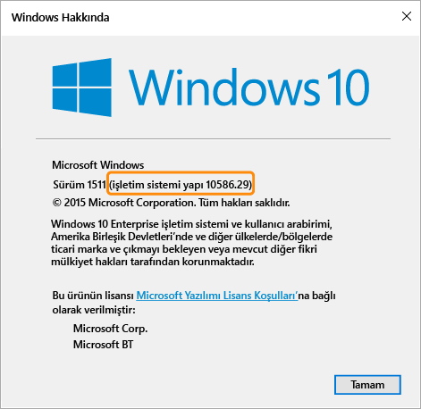

---
# required metadata

title: Windows cihazları için uyumluluk ilkesi ayarları | Microsoft Intune
description:
keywords:
author: karthikaraman
manager: jeffgilb
ms.date: 04/28/2016
ms.topic: article
ms.prod:
ms.service: microsoft-intune
ms.technology:
ms.assetid: f996842c-e9a4-4819-acb4-ee66e8fb35b8

# optional metadata

#ROBOTS:
#audience:
#ms.devlang:
ms.reviewer: jeffgilb
ms.suite: ems
#ms.tgt_pltfrm:
#ms.custom:

---

# Microsoft Intune’da Windows cihazları için uyumluluk ilkesi ayarları

Bu konu başlığı altında açıklanan ilke ayarları, Windows işletim sistemini çalıştıran cihazlar için geçerlidir. Desteklenen belirli Windows sürümleri aşağıdaki bölümlerde belirtilmiştir.

Diğer platformlar hakkında bilgi arıyorsanız, aşağıdakilerden birine bakın:
> [!div class="op_single_selector"]
- [iOS cihazları için uyumluluk ilkesi ayarları](ios-compliance-policy-settings-in-microsoft-intune.md)
- [Android cihazları için uyumluluk ilkesi ayarları](android-compliance-policy-settings-in-microsoft-intune.md)

## Windows Phone cihazları için uyumluluk ilkesi ayarları
Bu bölümde listelenen ayarlar Windows Phone 8.1 ve üstünde desteklenir.

## Sistem güvenliği ayarları
### Parola
- **Mobil cihazların kilidini açmak için parola iste:**    Kullanıcıların cihazlarına erişmeden önce parola girmelerini zorunlu tutmak için bunu **Evet**

- olarak ayarlayın.

-  **Basit parolalara izin ver:**   Kullanıcıların
- ‘**1234**’ veya

  ‘**1111**’ gibi basit parolalar oluşturmasına izin vermek için **Evet** olarak ayarlayın.

- Minimum parola uzunluğu: Kullanıcı parolasının içermesi gereken
  -   minimum rakam veya karakter sayısını belirtin.
  -   **Gerekli parola türü:** Kullanıcının
  -   **Alfasayısal** parola mı yoksa **Sayısal** parola mı oluşturması gerektiğini belirtin.
  -   Windows çalıştıran ve Microsoft Hesabı ile erişilen cihazlarda, minimum parola uzunluğu sekiz karakterden fazlaysa veya minimum karakter kümesi sayısı ikiden büyükse, uyumluluk ilkesi düzgün değerlendirme yapamaz.

  **Minimum karakter kümesi sayısı:** **Gerekli parola türü** **Alfasayısal** olarak ayarlandıysa, bu ayar
- parolanın içermesi gereken minimum karakter kümesi sayısını belirtir.

- Dört karakter kümesi şunlardır:

- Küçük harfler

- Büyük harfler
- Simgeler Sayılar

  **Bu ayar için daha yüksek bir sayı ayarlandığında, kullanıcıların daha karmaşık parolalar oluşturması zorunlu tutulur.**
### Windows çalıştıran ve Microsoft Hesabı ile erişilen cihazlarda, minimum parola uzunluğu sekiz karakterden fazlaysa veya minimum karakter kümesi sayısı ikiden büyükse, uyumluluk ilkesi düzgün değerlendirme yapamaz.
- **Parola istenmeden önceki bekleme süresi (dakika olarak:**  Kullanıcı parolasını yeniden girmeden önce boşta geçen süreyi belirtir.

## **Parola kullanım süresi (gün olarak):** Kullanıcının parolasının süresi dolmadan ve yenisini oluşturması istenmeden
- önce geçecek gün sayısını seçin.  **Parola geçmişini anımsa:** Kullanıcının önceden kullanılmış olan parolaları yeniden kullanmasını kısıtlamak için bu ayarı **Önceki parolaların yeniden kullanılmasını engelle**
  -  ayarıyla birlikte kullanın. **Önceki parolaların yeniden kullanılmasını engelle:** **Parola geçmişini anımsa** seçildiyse, önceden kullanılmış olan parolalardan kaç tanesinin yeniden kullanılamayacağını belirtin. **Cihaz boşta durumundan çıkarken parola iste:** Bu ayar, **Parola istenmeden önceki bekleme süresi (dakika olarak)** ayarıyla birlikte kullanılmalıdır. **Parola istenmeden önceki bekleme süresi (dakika olarak)** ayarında belirtilen süre boyunca etkin olmayan bir cihaza erişmek için son kullanıcılardan bir parola girmesi istenir.
  -  Bu ayar yalnızca Windows 10 Mobile cihazları için geçerlidir. Şifreleme
  - **Mobil cihazda şifreleme iste:** Cihazın kaynaklara bağlanabilmek amacıyla şifrelenmesini zorunlu tutmak için **Evet** olarak ayarlayın. Cihaz durumu ayarları **Cihazların sağlam olarak bildirilmesini gerektir:** **Windows 10 Mobile** cihazlarının yeni veya var olan Uyumluluk İlkelerinde sağlıklı olarak bildirilmesini gerektiren bir kural ayarlayabilirsiniz.

  Bu ayar etkinse, Windows 10 cihazları aşağıdaki veri noktaları için Durum Kanıtlama Hizmeti (HAS) aracılığıyla değerlendirilir:
##  **BitLocker etkin:** BitLocker açık olduğunda, sistemin kapalı olduğu veya hazırda beklemeye girdiği durumlarda cihaz sürücüye depolanmış verileri yetkisiz erişimden koruyabilir.
- Windows BitLocker Sürücü Şifrelemesi, Windows işletim sistemi birimine depolanan tüm verileri şifreler.
    BitLocker, Windows işletim sistemini ve kullanıcı verilerini korumak ve bir bilgisayarın katılımsız bırakılması, kaybolması veya çalınması durumunda bile kurcalanmadığından emin olmak üzere TPM’yi kullanır. Bilgisayarda uyumlu bir TPM varsa, BitLocker verileri koruyan şifreleme anahtarlarını kilitlemek için TPM kullanır.

- Sonuç olarak, TPM bilgisayarın durumunu doğrulayana kadar anahtarlara erişilemez. **Kod bütünlüğü etkin:** Kod bütünlüğü bir sürücünün veya sistem dosyasının belleğe yüklendiği her durumda bütünlüğünü doğrulayan bir özelliktir.

## Kod bütünlüğü, çekirdeğe imzasız bir sürücünün veya sistem dosyasının yüklenip yüklenmediğini veya bir sistem dosyasının yönetici ayrıcalıklarına sahip bir kullanıcı hesabı tarafından çalıştırılan kötü amaçlı yazılım tarafından değiştirilip değiştirilmediğini algılar.
**Güvenli Önyükleme etkin:** Güvenli Önyükleme etkinleştirildiğinde sistem güvenilen fabrika durumuna önyüklenmeye zorlanır.
## Ayrıca, Güvenli Önyükleme etkinleştirildiğinde makineyi önyüklemek için kullanılan çekirdek bileşenleri cihazı üreten kuruluş tarafından güvenilen doğru şifreleme imzalarına sahip olmalıdır.
### UEFI üretici yazılımı makinenin başlatılmasına izin vermeden önce bunu doğrular.
- Herhangi dosya ile imzalarını bozacak şekilde oynanmışsa sistem önyüklemesi gerçekleşmez.

  HAS hizmetinin nasıl çalıştığı hakkında daha fazla bilgi için bkz. [Durum Kanıtlama CSP](https://msdn.microsoft.com/library/dn934876.aspx).

  Cihaz özelliği ayarları

- **Gereken en düşük işletim sistemi:** Cihaz en düşük işletim sistemi gereksinimini karşılamadığında,

  cihazın uyumsuz olduğu bildirilir.

- Yükseltme hakkında bilgi içeren bir bağlantı görüntülenir. Son kullanıcı, şirket kaynaklarına erişebilmek için cihazını yükseltmeyi seçebilir. **İzin verilen en yüksek işletim sistemi sürümü:** Cihaz kuralda belirtilen
  -   işletim sistemi sürümünden daha yüksek bir sürüm kullandığında, şirket kaynaklarına erişimi engellenir ve kullanıcıdan BT yöneticisiyle iletişim kurması istenir.
  -   Kuralda işletim sistemine izin veren bir değişiklik oluncaya kadar bu cihaz şirket kaynaklarına erişmek için kullanılamaz.
  -   Windows bilgisayarları için uyumluluk ilkesi ayarları
  -   Bu bölümde listelenen ayarlar Windows bilgisayarlarında desteklenir.

  Sistem güvenliği ayarları
- Parola

  **Minimum parola uzunluğu:** - Windows 8.1’de desteklenir.

- Kullanıcı parolasının içermesi gereken minimum rakam veya karakter sayısını belirtin.

  Microsoft Hesabı ile güvenliği sağlanan cihazlar için, **Minimum parola uzunluğu** 8 karakterden fazlaysa veya **Minimum karakter kümesi sayısı** iki karakterden büyükse, uyumluluk ilkesi düzgün değerlendirme yapamaz.

- **Gerekli parola türü:** - Windows RT,  Windows RT 8.1 ve Windows 8.1’de desteklenir.

  Kullanıcıların **Alfasayısal** parola mı yoksa **Sayısal** parola mı oluşturması gerektiğini belirtin.
- **Minimum karakter kümesi sayısı:**  - Windows RT, Windows RT 8.1 ve Windows 8.1’de desteklenir.

  **Gerekli parola türü** **Alfasayısal** olarak ayarlanırsa bu ayar parolanın içermesi gereken en az karakter kümesi sayısını belirtir.

## Dört karakter kümesi şunlardır:
- Küçük harfler
Büyük harfler  Simgeler
  -  Sayılar:     Bu ayar için daha yüksek bir sayı ayarlandığında, kullanıcıların daha karmaşık parolalar oluşturması zorunlu tutulur. Microsoft Hesabı ile güvenliği sağlanan cihazlar için, **Minimum parola uzunluğu** 8 karakterden fazlaysa veya **Minimum karakter kümesi sayısı** 2 karakterden büyükse, uyumluluk ilkesi düzgün değerlendirme yapamaz. **Parola istenmeden önceki bekleme süresi (dakika olarak):** - Windows RT, Windows RT 8.1 ve Windows 8.1’de desteklenir. Kullanıcı parolasını yeniden girmeden önce boşta geçen süreyi belirtin. **Parola süresinin sonu (gün):** - Windows RT,  Windows RT 8.1 ve Windows 8.1’de desteklenir.
  -  Kullanıcının parolasının süresi dolup yeni bir parola oluşturmaları gerekmeden önce geçmesi gereken gün sayısını seçin. **Parola geçmişini anımsa:** - Windows RT, Windows RT 8.1 ve Windows 8.1’de desteklenir.
  - Kullanıcının önceden kullanılan parolaları oluşturmasını sınırlamak için bu ayarı **Önceki parolaların yeniden kullanılmasını engelle** ile birlikte kullanın. **Önceki parolaların yeniden kullanılmasını engelle:** - Windows RT, Windows RT 8.1 ve Windows 8.1’de desteklenir. **Parola geçmişini anımsa** ayarı seçilirse, önceden kullanılmış ve yeniden kullanılamayacak olan parola sayısını belirtin. Cihaz durumu ayarları
  - **Cihazların sağlam olarak bildirilmesini gerektir:** - Windows 10 cihazlarında desteklenir.

  Windows 10 cihazlarının yeni veya var olan Uyumluluk İlkelerinde sağlıklı olarak bildirilmesini gerektiren bir kural ayarlayabilirsiniz.

## Bu ayar etkinse, Windows 10 cihazları aşağıdaki veri noktaları için Durum Kanıtlama Hizmeti (HAS) aracılığıyla değerlendirilir:
- **BitLocker etkin:** BitLocker açık olduğunda, sistemin kapalı olduğu veya hazırda beklemeye girdiği durumlarda cihaz sürücüye depolanmış verileri yetkisiz erişimden koruyabilir.

  Windows BitLocker Sürücü Şifrelemesi, Windows işletim sistemi birimine depolanan tüm verileri şifreler. BitLocker, Windows işletim sistemini ve kullanıcı verilerini korumak ve bir bilgisayarın katılımsız bırakılması, kaybolması veya çalınması durumunda bile kurcalanmadığından emin olmak üzere TPM’yi kullanır.

  Bilgisayarda uyumlu bir TPM varsa, BitLocker verileri koruyan şifreleme anahtarlarını kilitlemek için TPM kullanır. Sonuç olarak, TPM bilgisayarın durumunu doğrulayana kadar anahtarlara erişilemez. **Kod bütünlüğü etkin:** Kod bütünlüğü bir sürücünün veya sistem dosyasının belleğe yüklendiği her durumda bütünlüğünü doğrulayan bir özelliktir.

- Kod bütünlüğü, çekirdeğe imzasız bir sürücünün veya sistem dosyasının yüklenip yüklenmediğini veya bir sistem dosyasının yönetici ayrıcalıklarına sahip bir kullanıcı hesabı tarafından çalıştırılan kötü amaçlı yazılım tarafından değiştirilip değiştirilmediğini algılar.

  **Güvenli Önyükleme etkin:** Güvenli Önyükleme etkinleştirildiğinde sistem güvenilen fabrika durumuna önyüklenmeye zorlanır. Ayrıca, Güvenli Önyükleme etkinleştirildiğinde makineyi önyüklemek için kullanılan çekirdek bileşenleri cihazı üreten kuruluş tarafından güvenilen doğru şifreleme imzalarına sahip olmalıdır.

UEFI üretici yazılımı makinenin başlatılmasına izin vermeden önce bunu doğrular. Herhangi dosya ile imzalarını bozacak şekilde oynanmışsa sistem önyüklemesi gerçekleşmez.
- **Erken başlatılan kötü amaçlı yazılımdan koruma etkin:** Erken başlatılan kötü amaçlı yazılımdan koruma (ELAM), ağınızdaki bilgisayarlar başlatıldığında ve üçüncü taraf sürücüler başlatılmadan önce koruma sağlar.    HAS hizmetinin nasıl çalıştığı hakkında daha fazla bilgi için bkz. [Durum Kanıtlama CSP](https://msdn.microsoft.com/library/dn934876.aspx).
- Cihaz özelliği ayarları **Gereken en düşük işletim sistemi:** - Windows 8.1 ve Windows 10’da desteklenir.
> 

<!--HONumber=May16_HO2-->

