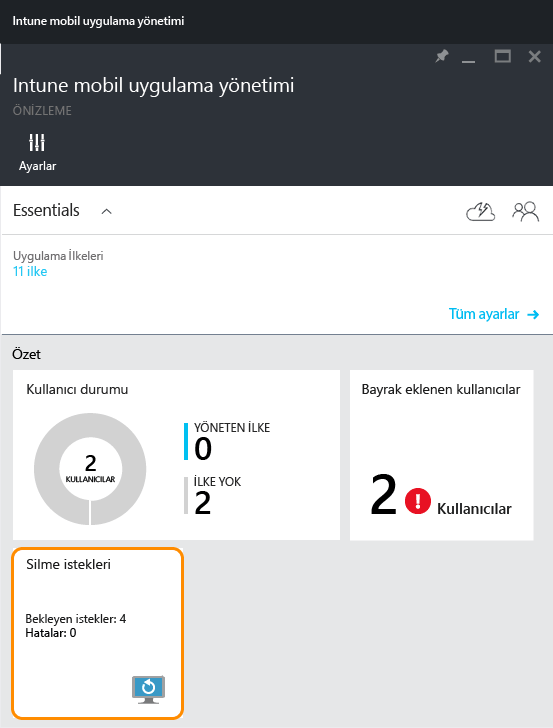
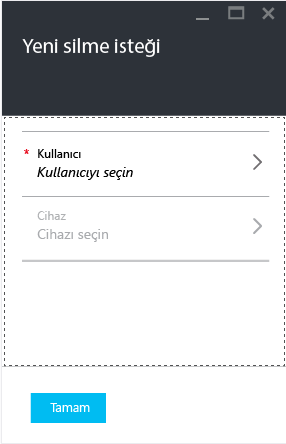
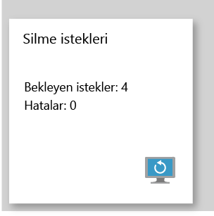

# Microsoft Intune ile yönetilen şirket uygulama verilerini silme
Cihaz kaybolduğunda veya çalındığında ya da çalışan şirketten ayrıldığında, şirket uygulama verilerinin cihazdan kaldırıldığından emin olmak istersiniz. Öte yandan, özellikle de çalışanın kendi cihazından kişisel verilerin kaldırılmasını istemeyebilirsiniz.

Şirket uygulama verilerini seçmeli kaldırmak için, bu konunun **Temizleme isteğe oluşturma** bölümünde açıklanan adımları kullanarak bir temizleme isteği oluşturun.  İstek tamamlandıktan sonra, uygulama cihaz üzerinde ilk kez çalıştığında şirket verileri uygulamadan kaldırılır.
>[!NOTE]
> Uygulamadan yerel adres defterine doğrudan eşitlenen kişiler kaldırılır. Yerel adres defterinden başka bir dış kaynağa eşitlenen kişiler silinemez. Şu anda bu özellik yalnızca Microsoft Outlook uygulaması için geçerlidir.

## Temizleme isteği oluşturma

1.  **Intune Mobil uygulama yönetimi** dikey penceresinde **Temizleme istekleri** kutucuğunu seçin.

    

2.  **Yeni silme istekleri**’ni seçin.

    

3.  **Yeni temizleme isteği** dikey penceresinde **Kullanıcı**’yı seçerek **Kullanıcı** dikey penceresini açın ve uygulama verilerini temizlemek istediğiniz kullanıcıyı seçin.

4.  **Cihaz**’ı seçin.  Bu, seçili kullanıcıyla ilişkili tüm cihazları listeleyen **Cihaz** dikey penceresini açar.  Silmek istediğiniz cihazı seçin.

5.  Şimdi **Yeni temizleme isteği** dikey penceresine geri dönersiniz. Temizleme isteğinde bulunmak için **Tamam**’ı seçin. Hizmet, cihazdaki korunan her uygulama için ayrı bir silme isteği oluşturur ve bu istekleri izler.

## Silme isteklerinizi izleme
 **Intune mobil uygulama yönetimi** dikey penceresindeki **Silme isteği** kutucuğunda bir özet rapor bulunur.  Bu rapor, genel durumu görüntüler ve bekleyen isteklerin ve hataların sayısını belirtir. Aşağıda açıklanan adımları izleyerek daha fazla ayrıntıya ulaşabilirsiniz:

1.  **Intune mobil uygulama yönetimi** dikey penceresinde **Temizleme isteği** kutucuğunu seçerek **Temizleme isteği** dikey penceresini açın.

2.   **Silme isteği** dikey penceresinde, isteklerinizin kullanıcılara göre gruplandırılmış listesini görebilirsiniz.  Sistem, cihazda çalışan her korumalı uygulama için bir silme isteği oluşturduğundan, bir kullanıcı için birden çok istek görebilirsiniz.  Durum, silme isteğinin **bekliyor**, **başarısız**veya **başarılı** olup olmadığını gösterir.

### Ayrıca bkz:
[Mobil uygulama yönetimi ilkelerini kullanarak uygulama verilerini koruma ](protect-app-data-using-mobile-app-management-policies-with-microsoft-intune.md)

[Azure portalını kullanma](azure-portal-for-microsoft-intune-mam-policies.md)

<!--HONumber=Jun16_HO4-->

