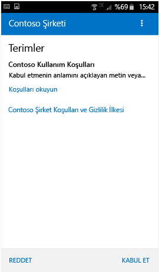
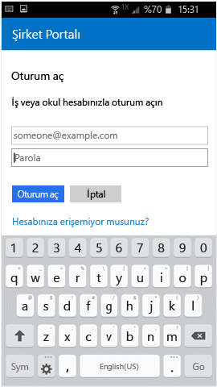
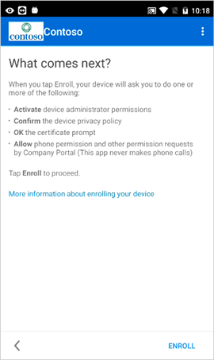

# Android cihazınızı Intune’a kaydetme

Şirketinizde veya okulunuzda Microsoft Intune kullanılıyorsa, şirket e-postasına, dosyalarına ve diğer kaynaklarına erişmek için Android cihazlarınızı kaydedebilirsiniz. Cihazlarınızı kaydettiğinizde, BT departmanınız bu iş veya okul kaynaklarını yönetebilir, bunların güvenli kalmasını sağlayabilir ve size işlerinizi tamamlamak için tercih ettiğiniz cihazı kullanma özgürlüğünü tanıyabilir. Kayıt hakkında daha fazla bilgi edinmek için, bkz. [Şirket Portalı uygulamasını yüklediğimde ve cihazımı kaydettiğimde ne olur?](what-happens-if-you-install-the-Company-Portal-app-and-enroll-your-device-in-intune-android.md)

<iframe src="https://channel9.msdn.com/Series/IntuneEnrollment/Android-Enrollment/player" width="960" height="540" allowFullScreen frameBorder="0"></iframe>

Bu kayıt yönergeleri, yerel ve Samsung KNOX Android cihazlara yöneliktir. Samsung KNOX, bazı Samsung cihazlarının yerel Android tarafından sağlanan korumanın dışında ek koruma sağlamak için kullandığı bir güvenlik türüdür. Samsung KNOX cihazınız olup olmadığını denetlemek için **Ayarlar** > **Telefon hakkında** kısmına gidin. Bu listede "KNOX sürümü" ifadesini görmüyorsanız yerel bir Android cihazına sahipsinizdir.

Kaydetme öncesinde veya sonrasında cihazı nasıl kullandığınızı en iyi şekilde açıklayan bir kategoriyi seçmeniz istenebilir. BT yöneticiniz bu kategoriyi erişiminiz olan uygulamaları denetlemek için kullanır.

Cihazınızı Intune’a kaydetmeye çalışırken bir hata alırsanız [BT yöneticinize kayıt hataları gönderebilirsiniz](send-enrollment-errors-to-your-it-admin-android.md).

**Android cihazınızı kaydetmek için:**

1.  [Google Play](http://play.google.com/store/apps/details?id=com.microsoft.windowsintune.companyportal)’den ücretsiz Intune Şirket Portalı uygulamasını yükleyin.

2.  Microsoft Intune Şirket Portalı uygulamasını açın.

3.  Şirket Portalı’ndaki **Hoş Geldiniz** ekranında **Oturum aç**’a dokunun ve ardından iş veya okul hesabınızla oturum açın.

       

4.  BT yöneticiniz şirket hüküm ve koşullarını ayarladıysa, koşulları kabul etmek için **KABUL ET**’e dokunun.

    

5.  İş veya okul hesabınızla parolanızı kullanarak Şirket Portalı uygulamasına oturum açıp **Oturum aç**’a dokunun.

    

6.  **Şirket Erişimi Kurulumu** ekranında **BAŞLA**’ya dokunun.

    

7.  **Cihazınızı neden kaydetmelisiniz?** ekranında, cihazınızı kaydettiğinizde neler yapabileceğinizi okuyun ve sonra **DEVAM**’a dokunun.

    

8.  BT yöneticinizin cihazınızda neleri görebileceğini ve neleri göremeyeceğini içeren listeyi gözden geçirip **DEVAM**’a dokunun.

    

9.  **Sıradaki** ekranında kayıt sırasında ne olduğunu okuyun ve ardından **KAYDET**’e dokunun.

    

10.  Android 6.0 veya üzeri kullanıyorsanız, bu adımı uygulayın. Aksi halde, sonraki adıma geçin.

    BT yöneticiniz belirli ilkeleri ayarladıysa, aşağıdaki iletileri görebilirsiniz:
    -    **Şirket Portalı’nın telefon çağrıları yapmasına ve çağrıları yönetmesine izin verilsin mi?**

        

    Bu iletiyi görürseniz, **İZİN VER**’e dokunun. İZİN VER’e dokunmak güvenlidir, çünkü **Microsoft hiçbir zaman telefon çağrısı yapmaz veya telefon çağrılarınızı yönetmez**! İleti metni Google’ın kontrolündedir ve Microsoft bunu değiştiremez. Erişime izin verdiğinizde, tüm yaptığınız cihazınızın uluslararası mobil cihaz kodunu (IMEI) Intune'a göndermesine izin vermektir. IMEI, seri numarası gibi, bir mobil cihazı benzersiz şekilde tanımlayan bir numaradır.

    Erişimi reddederseniz Şirket Portalı’nda oturum açtığınız sonraki durumda ileti yeniden görünür, ancak **Bir daha sorma** kutusuna dokunarak gelecekteki iletileri kapatabilirsiniz. Daha sonra erişime izin vermeye karar verirseniz, **Ayarlar** &gt; **Uygulamalar** &gt; **Şirket Portalı** &gt; **İzinler** &gt; **Telefon** giderek izni açın.

    -    **Şirket Portalı’nın, kişilerinize erişmesine izin verilsin mi?**

        

    Bu iletiyi görürseniz, **İZİN VER**’e dokunun. İZİN VER’e dokunmak güvenlidir, çünkü **Microsoft kişilerinize hiçbir zaman erişmez!** İleti metni Google’ın kontrolündedir ve Microsoft bunu değiştiremez. Erişim izni verdiğinizde Şirket Portalı uygulamasının yalnızca iş hesabınızı oluşturmasına, kullanmasına ve yönetmesine izin verilir.

    Erişimi reddederseniz Şirket Portalı’nda oturum açtığınız sonraki durumda ileti yeniden görünür, ancak **Bir daha sorma** kutusuna dokunarak gelecekteki iletileri kapatabilirsiniz. Daha sonra erişime izin vermeye karar verirseniz, **Ayarlar** &gt; **Uygulamalar** &gt; **Şirket Portalı** &gt; **İzinler** &gt; **Telefon** giderek izni açın.

11.  **Cihaz yöneticisini etkinleştir** ekranında **Etkinleştir**’e dokunun.

    

12.  Yönergeleri izleyerek PIN’i veya parolayı girin. Bu cihazda zaten bir PIN veya parola ayarladıysanız, bu ekranı görmezsiniz ya da yeni bir PIN veya parola girmeniz gerekmez.

    

13.  Bir Samsung KNOX cihazı kullanıyorsanız **Onayla**’ya dokunduğunuzda cihazınızın kaydedildiğini belirten bir ileti görürsünüz. Yerel bir Android cihaz kullanıyorsanız cihazınızın kaydedildiğini gösteren alttaki ekranı fark etmeniz yeterlidir.

    

    Bu ekran, cihazınızın kaydedilmekte olduğunu gösterir.

    

14. **Şirket Erişimi Kurulumu** ekranı görüntülendiğinde **DEVAM**’a dokunun. Cihazınızın uyumsuz olduğunu belirten bir ileti görürseniz sorunu düzeltmek için yönergeleri izleyin ve sonra **DEVAM**’a dokunun.

      

11. **Şirket Erişimi Kurulumu tamamlandı** ekranında **BİTTİ**’ye dokunun. Cihazınız artık kaydedilmiştir.

    

Şirket uygulamalarını yüklemeyi denemeden önce **Ayarlar** &gt; **Güvenlik**’e gidin ve **Bilinmeyen kaynaklar** seçeneğini açın. Uygulamaları yüklemeyi denemeden önce bu seçeneği açmazsanız "Yükleme engellendi. Güvenlik nedeniyle cihazınız bilinmeyen kaynaklardan gelen uygulamaların yüklenmesini engelleyecek şekilde ayarlanmış." iletisini görürsünüz. Hata iletişim kutusunda **Ayarlar** öğesine dokunarak **Bilinmeyen kaynaklar** seçeneğine gidin.

> [!Note]
> Kuruluşunuzda telekomünikasyon gider yönetimi yazılımı kullanılıyorsa, cihazınız tam olarak kaydedilmeden önce tamamlamanız gereken ek birkaç adım vardır. Daha fazla bilgiyi [burada](enroll-your-device-with-telecom-expense-management-android.md) bulabilirsiniz.

Bu bilgiler yardımcı olmadı mı? BT yöneticinize başvurun (iletişim bilgileri için [Şirket Portalı web sitesine](http://portal.manage.microsoft.com) bakın) veya wintunedroidfbk@microsoft.com adresinden Microsoft Android ekibine yazın.

