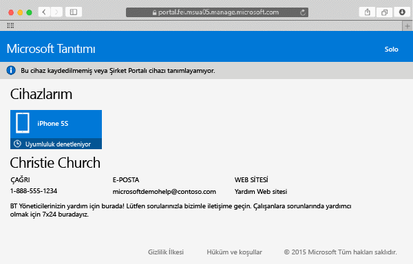
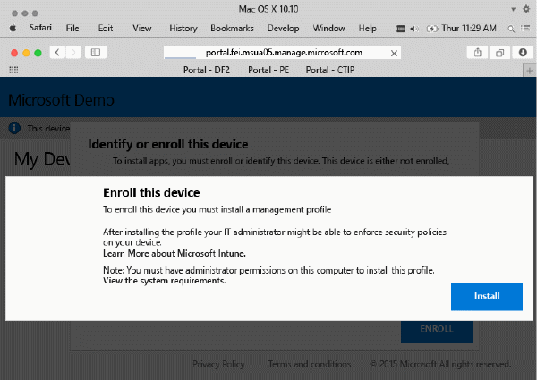
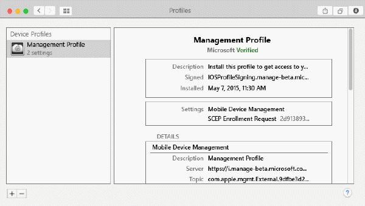

# Mac OS X cihazınızı Intune’a kaydetme

Mac OS X cihazınızı Intune’a kaydettiğinizde, şirket ağına, iş e-postanıza ve iş dosyalarınıza erişebilirsiniz. Ayrıca, şirket uygulamalarını alabilirsiniz. Cihazınızı kaydettiğinizde neler olduğu hakkında daha fazla bilgi için, bkz. [Şirket Portalı uygulamasını yüklediğinizde ve cihazınızı Intune’a kaydettiğinizde ne olur?](what-happens-if-you-install-the-company-portal-app-and-enroll-your-device-in-intune-ios.md)

iOS cihazı kaydetmeye çalışıyorsanız, bkz. [iOS cihazınızı Intune'a kaydetme](enroll-your-device-in-intune-ios.md).

Mac OS X cihazınızı kaydetmek için

1.  Bir Safari tarayıcı kullanarak [Şirket Portalı web sitesini](https://portal.manage.microsoft.com) açın ve bildirim çubuğuna dokunun.

2.  **Bu cihaz kaydedilmemiş veya Şirket Portalı cihazı tanımlayamıyor** öğesine dokunun.

    

3.  Cihazınızı kaydetmeye başlamak için **Yükle**’ye dokunun.

    

4.  **Yönetim Profilini Yükle** iletişim kutusunda **Yükle**’ye dokunun. Kimlik bilgilerinizi girmenizi isteyen bir iletişim kutusu görüntülenirse kullanıcı adı ve parolanızı girin ve ardından **Devam** &gt; **Yükle**’ye dokunun.

    

    Kaydetmeyi bitirdikten sonra bir **Yönetim Profili** sayfası profilinizin doğrulandığını gösterir.

    

Bu bilgiler yardımcı olmadı mı? BT yöneticinize başvurun. Kişi bilgileri için [Şirket Portalı Web sitesine](http://portal.manage.microsoft.com) bakın.

<!--HONumber=Oct16_HO2-->

