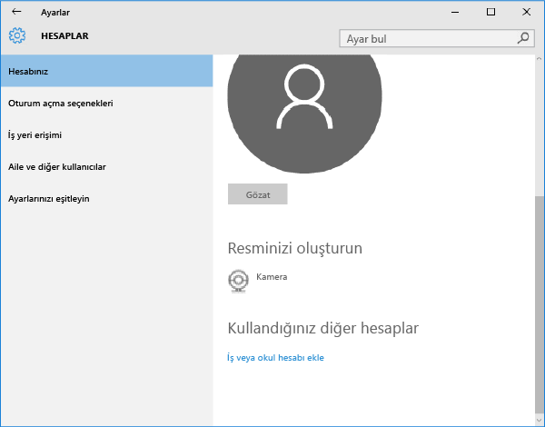

---
# required metadata

title: Windows 10 Mobile veya Windows 10 masaüstü cihazınızı Intune'a kaydetme| Microsoft Intune
description:
keywords:
author: Staciebarker
manager: jeffgilb
ms.date: 04/28/2016
ms.topic: article
ms.prod:
ms.service: microsoft-intune
ms.technology:
ms.assetid: 36250832-c6fd-4e8d-b681-de735023ebc3

# optional metadata

#ROBOTS:
#audience:
#ms.devlang:
ms.reviewer: jeffgilb
ms.suite: ems
#ms.tgt_pltfrm:
#ms.custom:

---

# Windows 10 Mobile veya Windows 10 masaüstü cihazınızı Intune'a kaydetme

Şirketinizde veya okulunuzda Microsoft Intune kullanılıyorsa, şirket e-postasına, dosyalarına ve diğer kaynaklarına erişmek için cihazlarınızı kaydedebilirsiniz. Cihazlarınızın kaydedilmesi kuruluşunuzda şirket verilerinin güvenli tutulabilmesini sağlar. Kayıt hakkında daha fazla bilgi edinmek için bkz. [Şirket Portalı uygulamasını yüklerseniz ve cihazınızı Intune’a kaydederseniz ne olur?](what-happens-if-you-install-the-company-portal-app-and-enroll-your-device-in-intune-windows.md)

ve [BT yöneticiniz cihazınızda neleri görebilir ve neleri göremez](what-can-your-it-administrator-see-when-you-enroll-your-device-in-intune-windows.md)

1.  Windows 10 Mobile veya Windows 10 masaüstü cihazınızı kaydetmek için:

    

2.  settings-accounts

    

3.  your-account

    

4.  add-work-school-account

    

sign-in

-   Yukarıdaki adımları izlemenize rağmen iş veya okul e-postanıza, dosyalarınıza ve diğer verilerinize erişemiyorsanız, **Hesaplar**’a dönün ve **İş erişimi**’ne dokunun İş veya okul hesabınızı görüyorsanız, tebrikler.

-   Bağlandınız.

İş veya okul hesabınızı görmüyorsanız **Bağlan**’a dokunun ve ardından iş veya okul kimlik bilgilerinizle oturum açın. Ayrıca sizinle ve rolünüzle ilgili olan şirket uygulamalarını kolayca belirleyip edinmenizi sağlayan Şirket Portalı uygulamasını yüklemenizi öneririz. Şirketinizin Intune’u nasıl yapılandırdığına bağlı olarak, Şirket Portalı uygulaması kayıt sürecinizin parçası olarak yüklenmiş olabilir. Uygulamaya sahip olup olmadığınızı denetlemek için uygulama listenizde **Şirket Portalı**’nı arayın.

1.  Uygulama listenizde Şirket Portalı’nı görmüyorsanız, yüklemek için aşağıdaki adımları izleyin.

2.  **Başlat** &gt; **Mağaza**’ya dokunun

3.  **Ara**’ya dokunun ve **şirket portalı** yazın

4.  Sonuçlar listesinde **Şirket Portalı** &gt; **Yükle**’ye dokunun **Yükle** veya **Ücretsiz**’e dokunun.

### Gösterilen seçenek, şirketinizin uygulamayı nasıl yapılandırdığına bağlıdır.
[Ayrıca bkz.](enroll-your-device-in-intune-windows.md) 
[Windows cihazınızı Intune'a kaydetme](using-your-windows-device-with-intune.md)

<!--HONumber=May16_HO2-->

