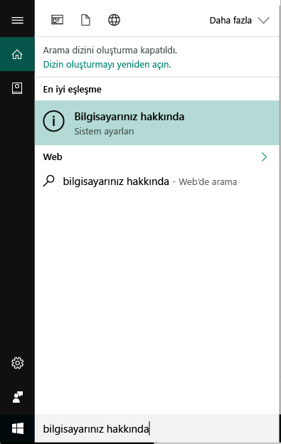
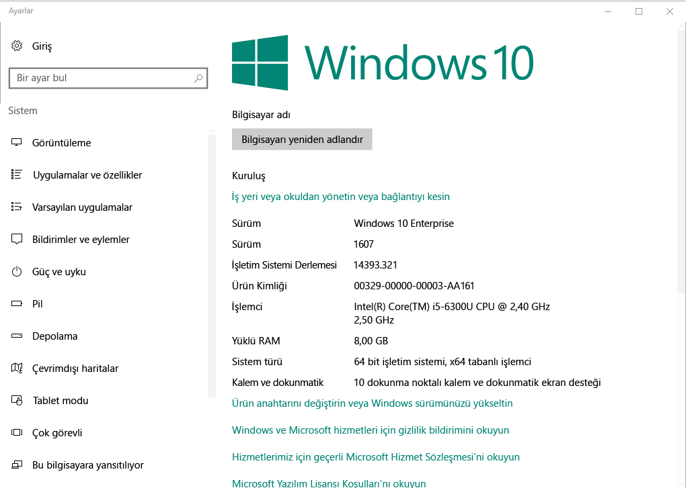

# Windows 10 cihazlarınızı Intune'a kaydetme

Windows 10 cihazlarınızı Microsoft Intune'a kaydederek e-postalar, dosyalar ve diğer kaynaklar gibi kuruluşunuzun güvenli verilerine erişebilirsiniz. Bu durum hem Windows 10 masaüstü hem de Windows 10 Mobile cihazlar için geçerlidir. Cihazlarınızı kaydetmeniz hem sizin hem de kuruluşunuz için güvenli erişim sağlamanıza ve iş verilerinizi kişisel verilerinizden ayırmanıza yardımcı olur.

Daha fazla bilgi edinmek istiyor musunuz? [Cihazınızı Intune'a kaydettiğinizde](what-happens-if-you-install-the-company-portal-app-and-enroll-your-device-in-intune-windows.md) neler olacağını ve [cihazınızdaki bilgilerin](what-info-can-your-company-see-when-you-enroll-your-device-in-intune.md) nasıl etkileneceğini öğrenin.

## Windows 10 masaüstü cihazları
1.    __Başlat__'a gidin.

 .

2. __Arama çubuğuna__ "bilgisayarınız hakkında" yazın ve __Bilgisayarınız hakkında__'yı seçin.

 

2.    __Ayarlar__ sayfasında bilgisayarınızda yüklü olan Windows 10 sürümü hakkındaki bilgileri göreceksiniz. Bu listede __Sürüm__'ü bulun.

 

3.    Sürümünüz __1607__ ise [bu adımlara](enroll-your-w10-device-access-work-or-school.md) geçin. Sürümünüz __1511 veya daha düşükse__, [bu adımlarla](enroll-your-w10-device-your-account.md) devam edin.

## Windows 10 Mobile cihazları

1.    __Başlat__ sayfasında __Tüm uygulamalar__ listesini kaydırın ve __Ayarlar__ uygulamasını seçin.
2.    __Sistem__'e ve ardından __Hakkında__'ya dokunun.
3.    __Cihaz bilgileri__ bölümünde __Daha fazla bilgi__'ye dokunun. Cihazınız hakkındaki bilgilerin listesini göreceksiniz. Bu listede __Sürüm__'ü bulun.
4.    Sürümünüz __1607__ ise [bu adımlara](enroll-your-w10-device-access-work-or-school.md) geçin. Sürümünüz __1511 veya daha düşükse__, [bu adımlarla](enroll-your-w10-device-your-account.md) devam edin.

Bu bilgiler yardımcı olmadı mı? BT yöneticinize başvurun. Kişi bilgileri için [Şirket Portalı Web sitesine](http://portal.manage.microsoft.com) bakın.

