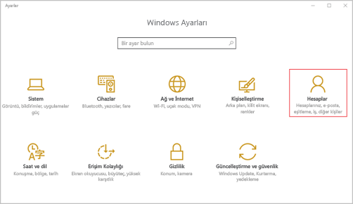
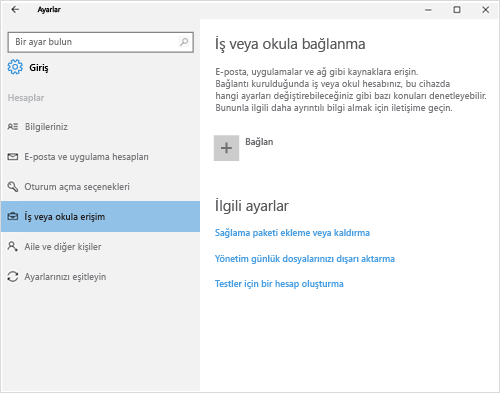
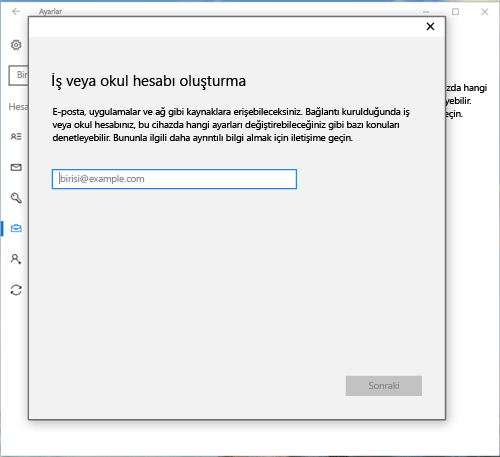
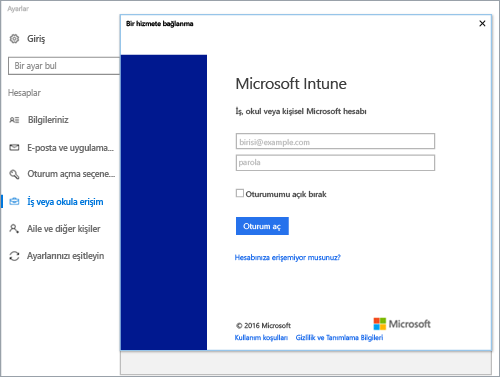
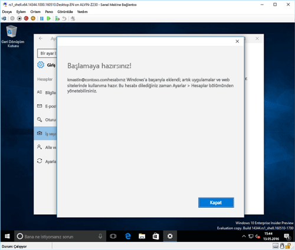
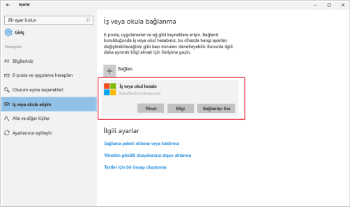
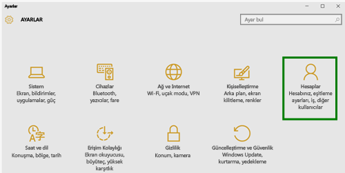
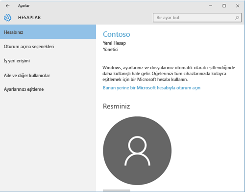
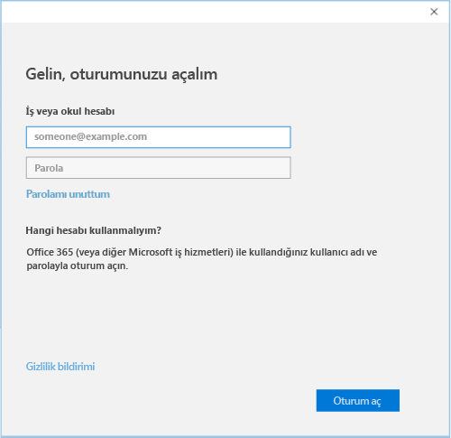

# Windows 10 Mobile veya Windows 10 masaüstü cihazınızı Intune'a kaydetme

Şirketinizde veya okulunuzda Microsoft Intune kullanılıyorsa, şirket e-postasına, dosyalarına ve diğer kaynaklarına erişmek için cihazlarınızı kaydedebilirsiniz. Cihazlarınızın kaydedilmesi kuruluşunuzda şirket verilerinin güvenli tutulabilmesini sağlar. Kayıt hakkında daha fazla bilgi edinmek için bkz. [Şirket Portalı uygulamasını yüklerseniz ve cihazınızı Intune’a kaydederseniz ne olur?](what-happens-if-you-install-the-company-portal-app-and-enroll-your-device-in-intune-windows.md) ve [BT yöneticinizin cihazınızda görebilecekleri ve göremeyecekleri](what-can-your-it-administrator-see-when-you-enroll-your-device-in-intune-windows.md).

Windows 10 Mobile veya Windows 10 masaüstü cihazınızı kaydetmek için:

1.  Windows **Ayarları**’na gidin, sonra **Hesaplar**’a dokunun.

    

2.  Sonraki iki ekrana bakarak kendi cihazınızda gördüğünüze benzeyeni bulun. Cihazınızda gördüğünüz ekrana uyan adımları uygulayın.

    Bu ekranı görürseniz, [İşe veya okula Erişim seçeneğini görüyorsanız izlenecek adımlar](#steps-to-follow-if-you-see-access-work-or-school) kısmındaki yönergeleri izleyin.

    

    Bu ekranı görürseniz, [Hesabınızı görüyorsanız uygulanacak adımlar](#steps-to-follow-if-you-see-your-account) bölümündeki adımları uygulayın.

    

## İşe veya okula erişim seçeneğini görüyorsanız izlenecek adımlar

1.  **İşe veya okula erişim**’e tıklayın.

    

2.  İş veya okul e-posta adresinizi girin ve sonra **İleri**’ye dokunun.

    

3. İş veya okul hesabınız ile Intune’da oturum açın.

    

    Şirketinizin veya okulunuzun cihazını kaydettiğini belirten bir mesaj görürsünüz.

4. **Tamamen hazırsınız!** ekranını gördüğünüzde **Kapat**’a dokunun. İşlem tamamlandı.

  

5. Bağlantınızın doğru olup olmadığını bir kez daha kontrol etmek isterseniz, artık iş veya okul hesabınızın listelenmesi gereken **Ayarlar**’a geri dönün.

    

Önceki adımları uygulamanıza rağmen iş veya okul e-posta hesabınıza ve dosyalarınıza erişemiyorsanız, [İşe veya okula erişim görüyorsanız izlenecek sorun giderme adımları](troubleshoot-your-windows-10-device-windows.md#troubleshooting-steps-to-follow-if-you-see-access-work-or-school) bölümündeki adımları uygulayın.

## Hesabınızı görüyorsanız uygulanacak adımlar

1.  Windows **Ayarlar**’ına gidin ve ardından **Hesaplar**’a dokunun.

    

2.  **Hesabınız**’a dokunun.

    

3.  **İş veya okul hesabı ekle**’ye dokunun.

    

4.  İş veya okul kimlik bilgilerinizle oturum açın.

    

Yukarıdaki adımları uygulamanıza rağmen iş veya okul e-posta adresinize, dosyalarınıza veya diğer verilerinize erişemiyorsanız, [Hesabınızı görüyorsanız izlenecek sorun giderme adımları](troubleshoot-your-windows-10-device-windows.md#troubleshooting-steps-to-follow-if-you-see-your-account) bölümündeki yönergeleri deneyin.

Ayrıca sizinle ve rolünüzle ilgili olan şirket uygulamalarını kolayca belirleyip edinmenizi sağlayan Şirket Portalı uygulamasını yüklemenizi öneririz. Şirketinizin Intune’u nasıl yapılandırdığına göre, Şirket Portalı uygulaması kayıt sürecinizin parçası olarak yüklenmiş olabilir.

Uygulamanın sizde olup olmadığını doğrulamak için uygulama listenizde **Şirket Portalı**’nı arayın. Uygulama listenizde Şirket Portalı’nı görmüyorsanız, yüklemek için aşağıdaki adımları izleyin.

1.  **Başlat** &gt; **Mağaza**’ya dokunun.

2.  **Ara**’ya dokunun, sonra **şirket portalı** yazın.

3.  Sonuçlar listesinde **Şirket Portalı** &gt; **Yükle**’ye dokunun.

4.  **Yükle** veya **Ücretsiz**’e dokunun. Gösterilen seçenek, şirketinizin uygulamayı nasıl yapılandırdığına bağlıdır.

Bu bilgiler yardımcı olmadı mı? BT yöneticinize başvurun. Kişi bilgileri için [Şirket Portalı Web sitesine](http://portal.manage.microsoft.com) bakın.

<!--HONumber=Sep16_HO3-->

