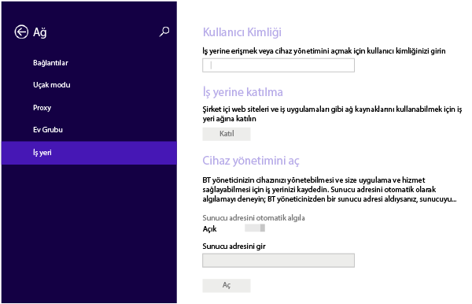
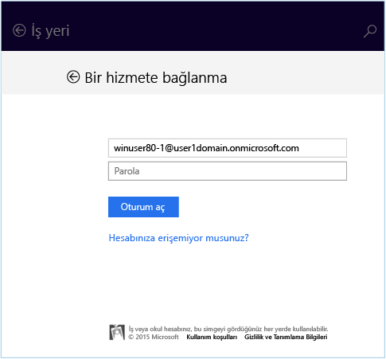
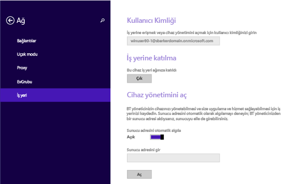
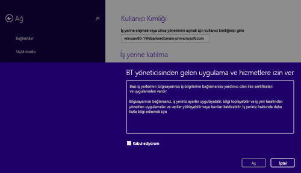
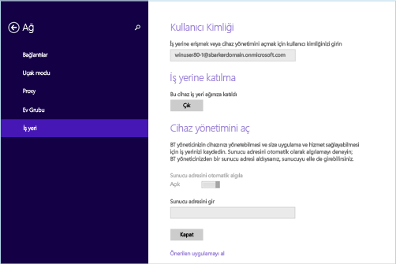

# Windows 8.1 veya Windows RT 8.1 cihazınızı Intune’a kaydetme

Şirketinizde veya okulunuzda Microsoft Intune kullanılıyorsa, şirket e-postasına, dosyalarına ve diğer kaynaklarına erişmek için cihazlarınızı kaydedebilirsiniz. Cihazlarınızı kaydettiğinizde, kuruluşunuz şirket verilerini güvenli tutabilir. Kayıt hakkında daha fazla bilgi edinmek için bkz. [Şirket Portalı uygulamasını yüklerseniz ve cihazınızı Intune’a kaydederseniz ne olur?](what-happens-if-you-install-the-company-portal-app-and-enroll-your-device-in-intune-windows.md) ve [BT yöneticinizin cihazınızda görebilecekleri ve göremeyecekleri](what-can-your-it-administrator-see-when-you-enroll-your-device-in-intune-windows.md).

Windows 8.1 veya Windows RT 8.1 cihazınızı kaydetmek için:

1.  Cihazda **Ayarlar** &gt; **Bilgisayar Ayarları** &gt; **Ağ** &gt; **İş yeri**’ne dokunun.

    

2.  Gerekirse, Kullanıcı Kimliği için iş veya okul e-postanızı girin ve **Katıl**’a dokunun.

    Kullanıcı kimliğiniz gerekmiyorsa, bu cihazda oturum açarken girdiğiniz e-posta adresi kullanılır.

3.  İş veya okul e-postanızın parolasını girin.

    

4.  **Cihaz yönetimini aç** altında **Aç**’a dokunun.

    

5.  **BT yöneticisinden gelen uygulama ve hizmetlere izin ver** iletişim kutusunda **Kabul ediyorum** kutusunu işaretleyin ve ardından **Aç**’a dokunun.

    

    Başarıyla kaydolduktan sonra aşağıdaki ekranı görürsünüz.

    

Ayrıca sizinle ve rolünüzle ilgili olan şirket uygulamalarını kolayca belirleyip edinmenizi sağlayan Şirket Portalı uygulamasını yüklemenizi öneririz. Şirketinizin Intune’u nasıl ayarladığına bağlı olarak, Şirket Portalı uygulaması kayıt sürecinizin parçası olarak yüklenmiş olabilir. Uygulamaya sahip olup olmadığınızı denetlemek için uygulama listenizde **Şirket Portalı**’nı arayın. Uygulama listenizde Şirket Portalı’nı görmüyorsanız, yüklemek için aşağıdaki adımları izleyin.

1.  **Başlat** &gt; **Mağaza**’ya dokunun.

2.  **Ara**’ya dokunun, sonra **şirket portalı** yazın.

3.  Sonuçlar listesinde **Şirket Portalı**’na dokunun.

4.  **Yükle** veya **Ücretsiz**’e dokunun. Gösterilen seçenek, şirketinizin uygulamayı nasıl ayarladığına bağlıdır.

Bu bilgiler yardımcı olmadı mı? BT yöneticinize başvurun. Kişi bilgileri için [Şirket Portalı Web sitesine](http://portal.manage.microsoft.com) bakın.

<!--HONumber=Oct16_HO2-->

