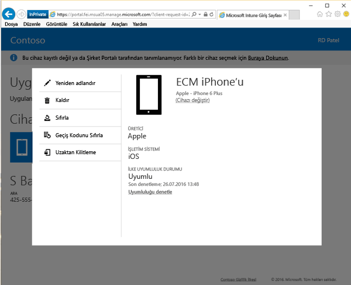

# Şirket Portalı web sitesinden bir cihazı uzaktan kilitleme

Cihazınız kaybolduysa veya çalındıysa, [Şirket Portalı web sitesindeki](http://portal.manage.microsoft.com) Uzaktan Kilitleme seçeneğini kullanarak cihazı kilitleyebilirsiniz. Uzaktan Kilitleme, aşağıdaki cihaz türleri için çalışır:

Platform  |Destek ayrıntıları  
---------|---------
Android | Desteklenir       
iOS | Desteklenir
Windows 10 Mobile | Yalnızca telefonda bir parola grubu varsa desteklenir     
Windows 10 Masaüstü | Desteklenmez  
Windows Phone 8.1 | Yalnızca telefonda bir parola grubu varsa desteklenir
Windows Phone 8.0 | Desteklenmez
Bilgisayar (Windows 8.0 ve öncesi) | Desteklenmez       
Bilgisayar (Windows 8.1) | Desteklenmez

 
Cihazınızı kilitlemek için Uzaktan Kilitleme kullanmak için:

1.  [Şirket Portalı web sitesinde,](http://portal.manage.microsoft.com) kilitlemek istediğiniz cihazın adına dokunun.

2.  **Uzaktan Kilitleme**’ye dokunun.

    

3.  Cihazınızı kilitlemek üzere olduğunuzu belirten uyarı iletisini okuyun, sonra Şirket Portal web sitesine cihazınızı kilitlemeyi denetmek için **Uzaktan Kilitleme**’ye dokunun.

    **Uzaktan Kilitleme**’ye dokunduğunuzda, "Uzaktan kilitleme bekliyor" durumu görünür.  Uzaktan Kilitleme başarılı olduğunda, durum "Uzaktan kilitleme için başarılı." olarak değişir.

    Uzaktan Kilitleme durumu üç yerde görüntülenir:

    * Web sitesinin bildirimler alanı.
    * Cihaz için Ayrıntılar sayfası.
    * Sayfanın Cihazlarım bölümünde cihaz adını gösteren parça.

    "Uzaktan Kilitleme başarısız oldu" bildirimi görürseniz, birkaç dakika bekleyin ve ardından cihazınızı kilitlemeyi yeniden deneyin. Yeniden denemek üzere dokunduğunuzda, durum tekrar "Uzaktan kilitleme bekliyor." olarak değişir.

    Yeniden deneme işe yaramazsa, yardım için BT yöneticinizle irtibata geçin. Cihazınızı bulursanız ve Uzaktan Kilitleme kullandıktan sonra onun kilidini açmak istiyorsanız, tek yapmanız gereken geçiş kodunu girmektir.

Bu bilgiler yardımcı olmadı mı? BT yöneticinize başvurun. Kişi bilgileri için [Şirket Portalı Web sitesine](http://portal.manage.microsoft.com) bakın.

<!--HONumber=Aug16_HO5-->

