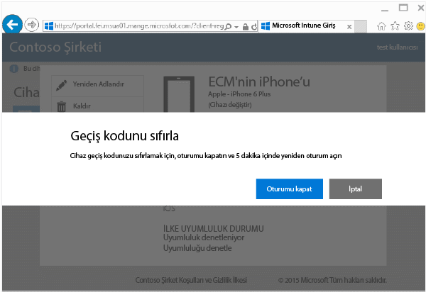
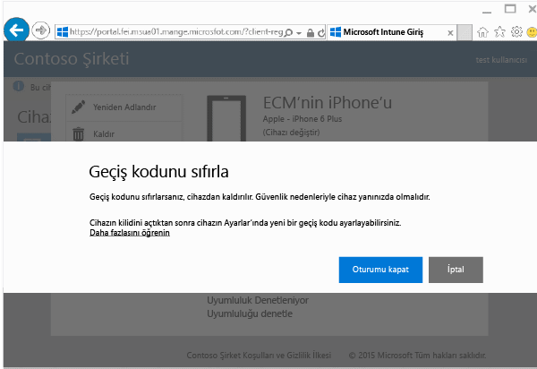

---
# required metadata

title: Şirket Portalı web sitesinden cihaz geçiş kodunuzu sıfırlama | Microsoft Intune
description:
keywords:
author: Staciebarker
manager: jeffgilb
ms.date: 04/28/2016
ms.topic: article
ms.prod:
ms.service: microsoft-intune
ms.technology:
ms.assetid: 4fa3255b-9d1e-42d5-bd8b-70963dcf2d86

# optional metadata

#ROBOTS:
#audience:
#ms.devlang:
ms.reviewer: jeffgilb
ms.suite: ems
#ms.tgt_pltfrm:
#ms.custom:

---

# Şirket Portalı web sitesinden cihaz geçiş kodunuzu sıfırlama

Intune’a kaydettiğiniz bir cihazın PIN kodunu veya parolasını kaybederseniz, sıfırlamak için [Şirket Portalı web sitesini](http://portal.manage.microsoft.com) kullanabilirsiniz. Şirket Portalı web sitesi, Intune’a kaydettiğiniz bilgisayarları ve cihazları yönetmek ve Şirket Portalı uygulamasını kullanırken gerçekleştirebileceğiniz görevlerin çoğunu yapmak için kullanabileceğiniz bir web sayfasıdır.

> [!NOTE] BT yöneticinizin Intune’u nasıl yapılandırdığına bağlı olarak, Şirket Portalı web sitesinde Parolayı Sıfırla düğmesini görmeyebilirsiniz. Windows 8.1 ve Windows RT cihazlarında Geçiş Kodu Sıfırlama desteklenmez.

Geçiş kodunuzu sıfırlamak için:

1.  [Şirket Portalı web sitesini](http://portal.manage.microsoft.com) açın ve geçiş kodunu sıfırlamak istediğiniz cihaza dokunun.

2.  **Geçiş Kodunu Sıfırla**’ya dokunun.

    

3.  **Oturumu kapat**’a dokunun ve ardından iş veya okul kimlik bilgilerinizi kullanarak yeniden oturum açın. Beş dakika içinde yeniden oturum açmanız gerekir.

    

4.  **Geçiş Kodunu Sıfırla**’ya dokunun.

    

    Geçiş Kodu Sıfırlama işleminin cihazınızda nasıl çalıştığını görmek için tabloyu gözden geçirin.

    |Platform|Support|
    |------------|-----------|
    |Android|Yeni, geçici, alfasayısal bir geçiş kodu oluşturur.|
    |iOS|Geçiş kodu cihazdan kaldırılır ve yeni bir geçici geçiş kodu oluşturulmaz. Touch ID kullanıyorsanız, cihazınızda bunu yeniden ayarlamanız gerekir çünkü geçiş kodunuzu sıfırladığınızda o da kaldırılır.|
    |Windows 10 (yalnızca mobil cihazlar)|Yeni, geçici, alfasayısal bir geçiş kodu oluşturur. Windows Hello desteklenir.|
    |Windows Phone 8.1|Yeni, geçici, sayısal bir geçiş kodu oluşturur.|
    Cihazınızın kilidini açtıktan sonra, cihazda **Ayarlar**’a giderek yeni bir geçiş kodu ayarlayabilirsiniz.

5.  Cihazınızın kilidini açın ve cihazda **Ayarlar**’a giderek yeni bir geçiş kodu ayarlayın veya geçici geçiş kodunu değiştirin.

    Parolanızın başarıyla sıfırlandığını onaylayan bir bildirim görmek için, Şirket Portalı web sitesinin sağ üst kısmındaki bildirim bayrağına tıklayın.

### Ayrıca bkz.
[Intune Şirket Portalı web sitesini kullanma](using-the-intune-company-portal-website.md)

<!--HONumber=May16_HO2-->

