# Cihazınızı el ile eşitleme
Uygulama yüklemeniz fazla uzun sürüyorsa, Windows cihazınızı el ile eşitlemek için aşağıdaki yönergeleri izleyin. Bu işlem, yüklemenin hızlanmasına yardımcı olabilir. Yalnızca listelenen sürümler desteklenir. Yukarıdaki "Bu Makalede" bölümünde gösterilen ve sahip olduğunuz cihaz türüyle eşleşen bağlantıyı kullanın:

* [Windows 10 Mobile](#windows-10-mobile)
* [Windows 10 Masaüstü](#windows-10-desktop)
* [Windows Phone 8.1](#windows-phone-8-1)

## Windows 10 Mobile
Yavaş çalışan bir uygulama yüklemesini hızlandırmak amacıyla Windows 10 Mobile cihazınızı el ile eşitlemek için:

1. **Tüm uygulamalar** > **Ayarlar** > **Hesaplar**’a gidin.

    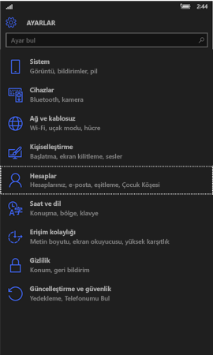
    
2. **İş yeri erişimi**’ne dokunun.

    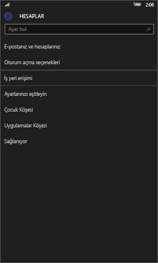
    
3. **Cihaz yönetimine kaydol**’un altında, aşağıda gösterildiği gibi şirketinizin adına dokunun.

    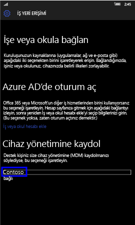
    
4. **Eşitle** simgesine dokunun.

    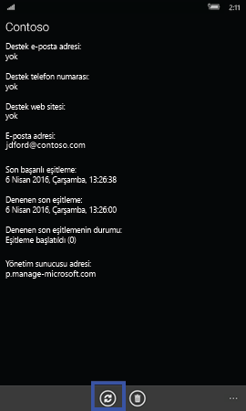
    
    Ekranın en üstünde “Hesabınızı senkronize ediyoruz” iletisi görüntülenir. Cihazınızın eşitlenmesi bitene kadar Eşitle düğmesi gri gösterilir.

## Windows 10 masaüstü
Yavaş çalışan bir uygulama yüklemesini hızlandırmak amacıyla Windows 10 masaüstü cihazınızı el ile eşitlemek için:

1. Aşağıda gösterildiği gibi **Başlat** düğmesini seçin ve sonra da **Ayarlar**’ı seçin.

    
    
2. **Ayarlar** sayfasında **Hesaplar**’ı seçin.
 
    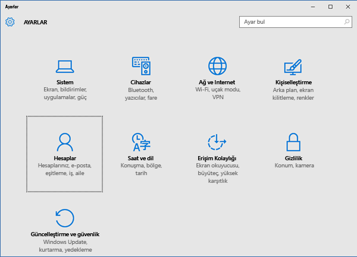
    
3. **Hesaplar** sayfasında **İş yeri erişimi**’ni seçin.
    
    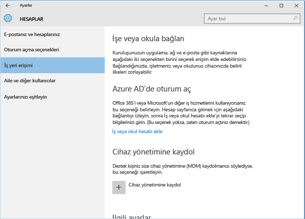
    
4. **Cihaz yönetimine kaydol** bölümünün altında, aşağıda mavi vurguyla gösterildiği gibi şirketinizin adına tıklayın.
    
    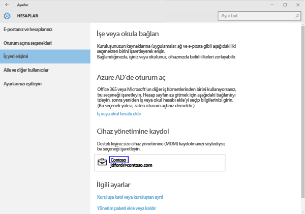
   
5. **Eşitle** düğmesini seçin.
    
    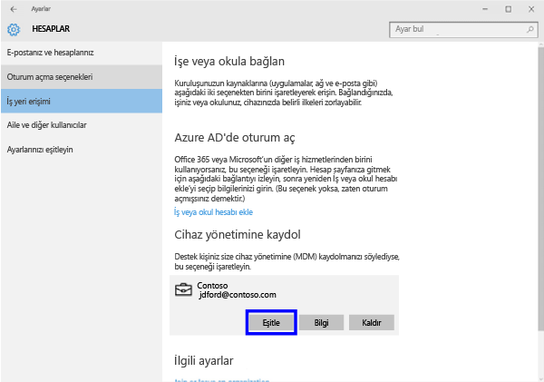
   
   Eşitleme işlemi tamamlanana kadar düğme gri gösterilir.

## Windows Phone 8.1
Yavaş çalışan bir uygulama yüklemesini hızlandırmak amacıyla Windows Phone 8.1 cihazınızı el ile eşitlemek için:

1. **Tüm uygulamalar** > **Ayarlar** > **çalışma alanı**’na gidin.

    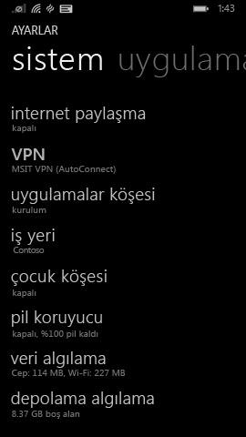
    
2. Aşağıda mavi vurguyla gösterildiği gibi şirketinizin adına dokunun.

    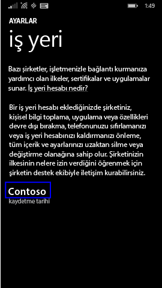
   
3. **Eşitle** simgesine dokunun.

    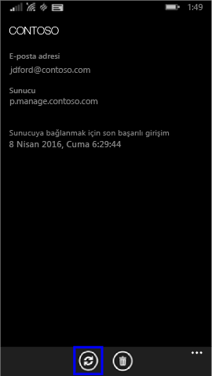
    
   Cihazınızın eşitlenmesi bitene kadar, ekranın en üstünde “Hesabınızı senkronize ediyoruz” iletisi görüntülenir.

Bu bilgiler yardımcı olmadı mı? BT yöneticinize başvurun. Kişi bilgileri için [Şirket Portalı Web sitesine](http://portal.manage.microsoft.com) bakın.

### Ayrıca bkz.
[Windows cihazınızı Intune ile kullanma](using-your-windows-device-with-intune.md)

<!--HONumber=Jun16_HO4-->

