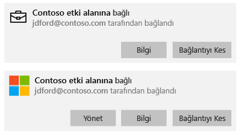
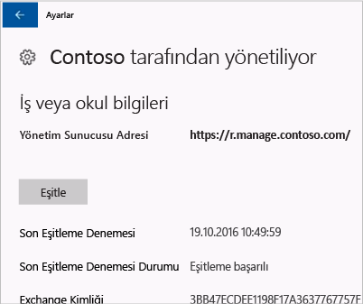

# Windows cihazınızı el ile eşitleme
Uygulamanızın yüklenmesi çok uzun sürerse, Windows cihazınızı el ile eşitlemeyi deneyebilirsiniz. El ile eşitleme, yükleme hızını artırmaya yardımcı olabilir.

Yalnızca aşağıdaki sürümler desteklenir. Sahip olduğunuz cihazın türüyle eşleşen yönergeleri kullanın.

* [Windows 10 Mobile](#windows-10-mobile)
* [Windows 10 masaüstü](#windows-10-desktop)
* [Windows Phone 8.1](#windows-phone-8-1)

## Windows 10 Mobile
Yavaş çalışan bir uygulama yüklemesini hızlandırmak amacıyla Windows 10 Mobile cihazınızı el ile eşitlemek için:

1. **Tüm uygulamalar** > **Ayarlar** > **Hesaplar**’a gidin.

    

2. **İş yeri erişimi**’ni seçin.

    

3. **Cihaz yönetimine kaydol**’un altında, şirketinizin adını seçin.

    

4. **Eşitle** simgesini seçin.

    

    Ekranın en üstünde “Hesabınızı eşitliyoruz” iletisi görüntülenir. Cihazınızın eşitlenmesi bitene kadar **Eşitle** düğmesi gri gösterilir.

## Windows 10 masaüstü
Birden fazla Windows 10 sürümü olduğundan iki grup adım vardır. Hangi adımları kullanacağınızı anlamak için ekran görüntülerine bakın ve cihazınızda gördüğünüze benzeyen ekran görüntüsündeki adımları uygulayın. 

1. **Başlat** düğmesini ve ardından **Ayarlar**’ı seçin.

    

2. **Ayarlar** sayfasında **Hesaplar**’ı seçin.

    

3. Sonraki iki ekrana bakarak kendi cihazınızda gördüğünüze benzeyeni bulun. Cihazınızda gördüğünüz ekrana uyan adımları uygulayın.

    “İşe veya okula erişim” ekranını görürseniz, [İşe veya okula Erişim seçeneğini görüyorsanız izlenecek adımlar](#steps-to-follow-if-you-see-access-work-or-school) kısmındaki yönergeleri izleyin.

    

    “İşe erişim” ekranını görürseniz, [İşe erişim seçeneğini görüyorsanız izlenecek adımlar](#steps-to-follow-if-you-see-your-account) kısmındaki adımları izleyin.

     

### İşe veya okula erişim seçeneğini görüyorsanız izlenecek adımlar

1. **Hesaplar** sayfasında **İşe veya okula erişim**’i seçin.

    

2. İş veya okul hesabınızı seçin. BT yöneticinizin yaptığı ayarlara bağlı olarak, aşağıda gösterilen örneğe benzeyen iki hesap görebilirsiniz. Bir hesabın yanında bir evrak çantası, diğerinin yanında ise Microsoft logosu var. 

    - Evrak çantası olan hesabı görürseniz bunu seçin ve altındaki **Bilgi** düğmesini bulun. 
    - Yalnızca Microsoft logosu olan hesabı görürseniz hesabı seçin ve altındaki **Bilgi** düğmesini bulun.

    

3. **Bilgi** düğmesini seçin. Aşağıdaki örneğe benzer bir iletişim kutusu açılır.

    

4. **Eşitle** düğmesini seçin. Cihazınız Intune'la eşitlenir.

### İşe erişim görüyorsanız uygulanacak adımlar
    
1. **Hesaplar** sayfasında **İş yeri erişimi**’ni seçin.

    

2. **Cihaz yönetimine kaydol** bölümünün altında şirketinizin adını seçin.

    

3. **Eşitle** düğmesini seçin.

    

   Eşitleme işlemi tamamlanana kadar düğme gri gösterilir.

## Windows Phone 8.1
Yavaş çalışan bir uygulama yüklemesini hızlandırmak amacıyla Windows Phone 8.1 cihazınızı el ile eşitlemek için:

1. **Tüm uygulamalar** > **Ayarlar** > **çalışma alanı**’na gidin.

    

2. Şirketinizin adını seçin.

    

3. **Eşitle** simgesini seçin.

    

   Cihazınızın eşitlenmesi bitene kadar, ekranın en üstünde “Hesabınızı eşitliyoruz” iletisi görüntülenir.

Bu bilgiler yardımcı olmadı mı? BT yöneticinize başvurun. Kişi bilgileri için [Şirket Portalı Web sitesine](http://portal.manage.microsoft.com) bakın.

<!--HONumber=Oct16_HO3-->

