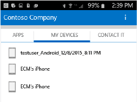

# Android cihazınızın Intune kaydını silme

Android cihazınızın Intune kaydını sildiğinizde cihazınız şirket kaynaklarına bir daha erişemez.  Kaydı sildiğinizde ne olacağı hakkında daha fazla bilgi için bkz. [Cihazınızı Intune’dan kaldırdığınızda ne olur?](what-happens-if-you-unenroll-your-device-from-intune-android.md).

Cihazınızın Intune kaydını silmek ve Şirket Portalı uygulamasını kaldırmak için aşağıdaki adımları izleyin veya bu videoyu izleyin:

<iframe width="675" height="379" src="https://www.youtube.com/embed/K-Vi7lNfaMk" frameborder="0" allowfullscreen></iframe>

1.  Şirket Portalı uygulamasında oturum açın.

2.  **CİHAZLARIM**’a dokunun ve ardından kaydını silmek istediğiniz cihazı seçin.

    

3.  Çöp kutusu simgesine dokunun.

    

    Uyarı sayfasında cihazınızın kaydını silmek için **Tamam** öğesine dokunun.

    

Bu bilgiler yardımcı olmadı mı? BT yöneticinize başvurun (iletişim bilgileri için [Şirket Portalı web sitesine](http://portal.manage.microsoft.com) bakın) veya wintunedroidfbk@microsoft.com adresinden Microsoft Android ekibine yazın.

### Ayrıca bkz.
[Android cihazınızı Intune ile kullanma](using-your-android-device-with-intune.md)

<!--HONumber=Jul16_HO4-->

