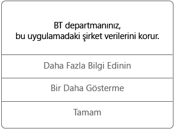

# Android cihazınızdaki yönetilen uygulamaları kullanma

Yönetilen uygulamalar, BT yöneticinizin ilgili uygulamada erişebildiğiniz şirket verilerini korumak üzere yapılandırabildiği uygulamalardır. Android cihazınızdaki yönetilen bir uygulamada bulunan şirket verilerine eriştiğinizde uygulamanın beklediğinizden biraz farklı çalıştığını fark edebilirsiniz. Örneğin, korunan şirket verilerini kopyalayıp yapıştıramayabilir veya bu verileri belirli konumlara kaydedemeyebilirsiniz.

Ayrıca, günlük görevlerinizi yapmanıza imkan tanırken şirket verilerinizi korumayı sürdürmek için cihazınızda farklı yönetilen uygulamalar birlikte çalışabilir. Örneğin, yönetilen bir uygulamada bir şirket dosyası açarsanız ve bu dosyayı görüntülemek için başka bir yönetilen uygulama gerekli olursa, dosyayı görüntülemenizi sağlayan yönetilen uygulama otomatik olarak açılır. Gerekli bir uygulama kullanılabilir değilse, belge açma veya yönetilen bir belgeden bir web bağlantısına erişme gibi bazı eylemler gerçekleştirilemeyebilir.

Yönetilen bir uygulamadaki şirket verilerine eriştiğinizde, açmakta olduğunuz uygulamanın yönetildiğini bildiren aşağıdaki gibi bir ileti görürsünüz.

## Yönetilen uygulamaları nasıl edinirim?
Yönetilen uygulamaları birkaç farklı yöntemle edinebilirsiniz:

-   Cihazınız Microsoft Intune’a kaydolduğunda uygulamayı Şirket Portalı uygulamasından veya Şirket Portalı web sitesinden yükleyebilirsiniz ya da uygulama BT yöneticiniz tarafından cihazınıza yüklenebilir. Kayıt hakkında daha fazla bilgi edinmek için bkz. [Cihazınızı Intune’a kaydetme](enroll-your-device-in-Intune-android.md).

-   Bir uygulamayı Play Store’dan yükleyin ve ardından Intune tarafından yönetilen şirket kullanıcı hesabınızla oturum açın.

## BT yöneticim bir uygulamada neyi yönetebilir?
BT yöneticinizin bir uygulamada yönetebileceği ve cihazınızdaki şirket verileriyle etkileşimlerinizi etkileyebilecek seçeneklerin bazı örnekleri aşağıda verilmiştir:

-   Belirli web sitelerine erişim

-   Uygulamalar arasında veri aktarımları

-   Dosyaları kaydetme

-   Kopyalama ve yapıştırma işlemleri

-   PIN erişimi gereksinimleri

-   Şirket kimlik bilgilerini kullanarak oturum açma

-   Buluta yedekleme özelliği

-   Ekran görüntüleri alma özelliği

-   Veri şifreleme gereksinimleri

BT bölümünüzün yönetebileceği bazı ortak uygulamalar şunlardır:

-   Intune Yönetilen Tarayıcı

-   Intune image Viewer

-   Intune PDF Görüntüleyicisi

-   Intune AV player

-   Microsoft Word, Excel, PowerPoint

Cihazınızdaki yönetilen uygulamalar hakkında daha fazla bilgi için BT yöneticinizle iletişim kurun. Kişi bilgileri için [Şirket Portalı Web sitesine](http://portal.manage.microsoft.com) bakın.

### Ayrıca bkz.
[Android cihazınızı Intune ile kullanma](using-your-android-device-with-intune.md)

<!--HONumber=Jul16_HO3-->

