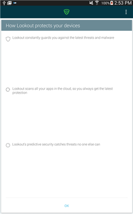
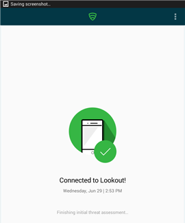
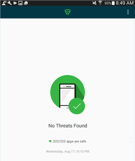

# Lookout for Work uygulamasını yüklemeniz gerekiyor

İşinize erişebilmeniz için önce BT yöneticinizin Lookout for Work uygulamasını yüklemenizi sağlaması gerekir. Bu uygulama olası güvenlik tehditlerini bularak cihazınızın korunmasına yardımcı olur.

Yükleme ile ilgili sorun yaşıyorsanız, bu konunun sonundaki sorun giderme adımlarını deneyin.

**Yapmanız gerekenler:**

1.    Bildirimler çubuğunu açmak için ekranın en üstünden aşağı doğru sürükleyin ve ardından **Gerekli uygulama – Play Store’dan Lookout for Work’ü Yükle**’ye tıklayın.

    

    Play Store’da Lookout for Work yükleme sayfasına gelirsiniz.

2.    Lookout for Work’ü yükleyin ve Lookout for Work uygulamasının cihazınıza erişmesine izin vermek için **KABUL ET**’e dokunun.

    

3. Lookout for Work’ü açın ve **ETKİNLEŞTİR**’e dokunun.

    

4. **Azure Active Directory ile oturum açın** seçeneğine dokunun ve ardından iş veya okul e-postası ve dosyalarına erişirken kullandığınız hesabı girin.

    

5. İş veya okul e-postasına ve dosyalarına erişirken kullandığınız hesabı seçin ve ardından **HESAP EKLE**’ye dokunun.

    

6. Lookout for Work’e oturumunuzu açma ve profilinizi okuma izni vermek için **Kabul Et**’e dokunun.

    

    Lookout for Work’ün Lookout Security Cloud’a bağlandığını gösteren bir ekran görüntülenir.

7. Lookout’un cihazınızı nasıl koruduğunu anlatan öğeleri gözden geçirin ve ardından **Tamam**’a dokunun.

    

    Aşağıdaki ekranı gördüğünüzde, Lookout ayarlanmış ve bağlanmış demektir.

    

    Lookout for Work, cihazınızdaki güvenlik tehditlerini hemen denetlemeye başlar. Hiçbir tehdit bulunmazsa, aşağıdaki ekranı görürsünüz.

    

    Şirket Portalı’ndaki Cihaz Ayrıntıları ekranı, artık şirketinizin güvenlik gereksinimlerine uyduğunuzu gösterir.

    

    Lookout for Work cihazınızda güvenlik tehdidi bulursa, sorunun nasıl çözüleceğini gösteren yönergeleri görürsünüz.

**Yükleme çalışmazsa**

Bazen yükleme işlemleri kontrol edemeyeceğiniz teknik sorunlar nedeniyle başarısız olabilir. Bu durumda, Lookout for Work’ü el ile Play Store’dan yüklemeyi deneyin: [https://play.google.com/store/apps/details?id=com.lookout.enterprise](https://play.google.com/store/apps/details?id=com.lookout.enterprise)

Bu bilgiler yardımcı olmadı mı? BT yöneticinize başvurun. Kişi bilgileri için [Şirket Portalı Web sitesine](http://portal.manage.microsoft.com) bakın.

