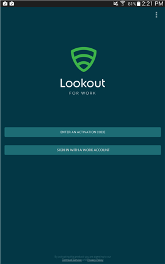

# Lookout for Work uygulamasını yüklemeniz istendi

Çalışmanıza erişebilmeniz için önce BT yöneticinizin Lookout for Work uygulamasını yüklemenizi sağlaması gerekir. Bu uygulama olası güvenlik tehditlerini bularak cihazınızın korunmasına yardımcı olur.

**Yapmanız gerekenler:**

1.  Bildirimler çubuğunu açmak için ekranın en üstünden aşağı doğru sürükleyin ve ardından **Gerekli uygulama – Play Store’dan Lookout for Work’ü Yükle**’ye tıklayın.

    

    Play Store’da Lookout for Work yükleme sayfasına gelirsiniz.

2.  Lookout for Work’ü yükleyin ve Lookout for Work uygulamasının cihazınıza erişmesine izin vermek için **KABUL ET**’e dokunun.

    

3. Lookout for Work’ü açın ve **Etkinleştir**’e dokunun.

    

4. **İş hesabınızla oturum açın** seçeneğine dokunun ve iş veya okul e-postasına ve dosyalarına erişirken kullandığınız hesabı girin.

    

5. İş veya okul e-postasına ve dosyalarına erişirken kullandığınız hesabı seçin ve ardından **HESAP EKLE**’ye dokunun.

    

6. Lookout for Work’e oturumunuzu açma ve profilinizi okuma izni vermek için **Kabul Et**’e dokunun.

    

    Lookout for Work’ün Lookout Security Cloud’a bağlandığını gösteren bir ekran görüntülenir.

7. Lookout’un cihazınızı nasıl koruduğunu anlatan öğeleri gözden geçirin ve ardından **Tamam**’a dokunun.

    

    Aşağıdaki ekranı gördüğünüzde, bu Lookout’un artık ayarlandığı ve bağlandığı anlamına gelir.

    

    Lookout for Work, hemen cihazınızdaki güvenlik tehditlerini denetlemeye başlar. Hiçbir tehdit bulunmazsa, aşağıdaki ekranı görürsünüz.

    

    Şirket Portalı’ndaki Cihaz Ayrıntıları ekranı, artık şirketinizin güvenlik gereksinimlerine uyduğunuzu gösterir.

    

    Lookout for Work cihazınızda güvenlik tehdidi bulursa, sorunun nasıl çözüleceğini gösteren yönergeleri görürsünüz.

Bu bilgiler yardımcı olmadı mı? BT yöneticinize başvurun. Kişi bilgileri için [Şirket Portalı Web sitesine](http://portal.manage.microsoft.com) bakın.

<!--HONumber=Sep16_HO2-->

