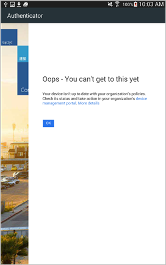

# Lookout for Work’ün bulduğu bir tehdidi gidermeniz gerekiyor

Lookout for Work cihazınızda potansiyel bir tehdit buldu ve şirket veya okul e-postanıza, uygulamalarınıza ve dosyalarınıza tekrar erişim kazanmak için sorunu düzeltmeniz gerekiyor. Gördüğünüz ileti şuna benzeyebilir: 

Bu sorunu çözmek için Lookout for Work uygulamasını açın ve uygulamada gösterilen yönergeleri izleyin.

## Kayıtlı cihazınızın e-postaya veya dosyalara erişmesi engellenirse göreceğiniz ileti

Kayıtlı cihazınızda bir virüs veya başka bir güvenlik tehdidi varsa ve şirket e-postanıza veya dosyalarınıza erişmeyi denerseniz, aşağıdaki gibi bir ileti görebilirsiniz:

Sorunu düzeltmek için yönergeler göreceğiniz [Şirket Portalı web sitesine](http://portal.manage.microsoft.com) gitmek için **cihaz yönetim portalına** dokunun.

## Lookout for Work’ün tehdit olarak gördüğü bir uygulama örneği

Lookout for Work’ün tehdit olarak gördüğü bir uygulama yüklediyseniz aşağıdakine benzer bir ekran görürsünüz:

Buna benzer bir şey görürseniz, ekranın en üstünde gösterilen uygulama adına dokunun ve tehdidi kaldırmak için yönergeleri izleyin.

Uygulamayı kaldırdıktan sonra e-postanıza veya diğer şirket ya da okul verilerinize hemen erişim elde edersiniz. Uygulamayı kaldırma isteğini yoksayarsanız, uygulamayı kaldırana kadar şirket e-postanıza ve verilerinize erişiminizi kaybedersiniz.

Bu bilgiler yardımcı olmadı mı? BT yöneticinize başvurun. Kişi bilgileri için [Şirket Portalı Web sitesine](http://portal.manage.microsoft.com) bakın.

<!--HONumber=Oct16_HO3-->

