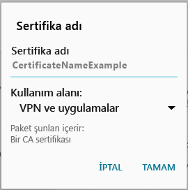

# Cihazınızda gerekli bir sertifika eksik

## Cihazınızda, çoğunlukla telefonunuzda yüklü olarak gelen bir sertifika eksik
Android cihazınız Intune’a kayıtlı değilse ve genellikle telefonunuzda yüklü olarak gelen sertifika, cihazınızda bulunmuyorsa, Android Şirket Portalı uygulamasında oturum açamazsınız. Oturum açmaya çalıştığınızda şu iletiyi görürsünüz:

Bu sorunu düzeltmek ve gerekli sertifikayı edinmek için:

1.  Bir tarayıcıda bu [Digicert sertifika sayfasına](https://www.digicert.com/digicert-root-certificates.htm) gidin.

2.  Baltimore CyberTrust Kök sertifikasını (https://www.digicert.com/CACerts/BaltimoreCyberTrustRoot.crt) bulun ve indirin.

3.  Bildirimlerinizi açmak için ekranın üst kısmından aşağıya doğru çekin ve bildirim listesinde **BaltimoreCyberTrustRoot.crt**’ye dokunun.

4.  **Sertifikayı Adlandır** iletişim kutusunda varsayılan sertifika adını kabul edin.

5. **Kimlik Bilgisi Kullanımı**’nın **VPN ve uygulamalar için kullanılır** olarak ayarlandığından emin olun ve **Tamam**’a dokunun.

    

6. Web tarayıcısını ve Şirket Portalı uygulamasını kapatın.

7. Şirket Portalı uygulamasını yeniden açın. Artık Şirket Portalı uygulamasında oturum açabilmeniz gerekir. Yardıma ihtiyacınız olursa BT yöneticinizle iletişime geçin.

## Cihazınızda, BT yöneticinizin gerekli hale getirdiği bir sertifika eksik
Android cihazınız Intune’a kayıtlı değilse ve BT yöneticiniz tarafından gerekli olduğu belirtilen bir sertifika cihazınızda bulunmuyorsa, Android Şirket Portalı uygulamasında oturum açamazsınız. Oturum açmaya çalıştığınızda şu iletiyi görürsünüz:

>[!NOTE]
> Zaten bir "eksik sertifika" iletisi gördüyseniz ve [Cihazınızda, genelde telefonunuzda yüklü olarak gelen bir sertifika eksik](#your-device-is-missing-a-certificate-that-usually-comes-installed-on-your-phone) altında verilen adımları izlediyseniz sorun yoktur. O, burada belirtilenden farklı bir ileti ve farklı bir sertifikadır; dolasıyla devam edin ve eksik sertifikayı almak için bu bölümdeki adımları izleyin.

Bu sorunu düzeltmek ve gerekli sertifikayı almak için uygulamanız gereken iki temel adım vardır:

- Bir şirket veya okul bilgisayarına bakarak eksik sertifikayı belirleyin.
- Cihazınızı kullanarak eksik sertifikayı İnternet’ten indirin.

### Bir şirket veya okul bilgisayarına bakarak eksik sertifikayı belirleme

1. Bir bilgisayarda Internet Explorer’ı açın. Bu amaçla kullanabileceğiniz bir bilgisayarınız yoksa, BT yöneticinize başvurun. BT yöneticinizin iletişim bilgileri için [Şirket Portalı web sitesine](http://portal.manage.microsoft.com) bakın.

2. [Şirket Portalı web sitesine](http://portal.manage.microsoft.com) gidin ve iş veya okul kimlik bilgilerinizle oturum açın.

3. Tarayıcı adres çubuğunun sağ ucunda, aşağıdaki ekran görüntüsünde gösterildiği gibi asma kilide benzeyen simgeyi seçin.

    

    Asma kilit simgesini görmüyorsanız, durun ve BT yöneticinize başvurun. Kilit simgesi güvenli oturum açtığınız anlamına gelir; dolayısıyla bu simgeyi görmüyorsanız devam etmemelisiniz.

4. **Sertifikaları görüntüle**’yi seçin.

    

5. **Sertifika** iletişim kutusunda **Sertifika yolu** sekmesini seçin ve ardından İnternet’ten almanız gereken sertifikayı belirleyin. Size gereken sertifikanın adı, önceki örnek ekran görüntüsünde vurgulanan sertifikayla aynı konumda olacaktır.

### Eksik sertifikayı Android mobil cihazınıza indirme ve yükleme

1. Bing veya Google gibi bir arama motoru kullanarak, önceki bölümde belirlediğiniz eksik sertifikanın adını arayın. Sertifika, “.crt” veya “.pem” gibi farklı "uzantılarla" bitiyor olabilir.

2. Web sitesinden kök sertifikayı indirin.

3. Sertifika indirildikten sonra, cihazınızda en üstten aşağı doğru sürükleyerek bildirimlerinizi açın ve bildirimler listesinde sertifikanın adına dokunun.

4. Aşağıdaki ekran görüntüsünde gösterilen **Sertifikayı Adlandır** iletişim kutusunda varsayılan sertifika adını kabul edin.

5. **Kimlik Bilgisi Kullanımı**’nın **VPN ve uygulamalar için kullanılır** olarak ayarlandığından emin olun ve **Tamam**’a dokunun.

    

6. Şirket Portalı uygulamasını kapatın.

7. Şirket Portalı uygulamasını yeniden açın. Artık Şirket Portalı uygulamasında oturum açabilmeniz gerekir. Yardıma ihtiyacınız olursa BT yöneticinizle iletişime geçin.

Az önce gösterilenle aynı "eksik sertifika" iletisini görüyorsanız ve yordamı zaten izlediyseniz, büyük olasılıkla BT yöneticinizin yüklemenize yardımcı olması gereken bir sertifika daha vardır. BT yöneticinize başvurun ve sorunu düzeltmeye yönelik adımları içeren [Android sertifika sorunları](/intune/troubleshoot/troubleshoot-device-enrollment-in-intune#android-certificate-issues) bağlantısını verin.

<!--HONumber=Dec16_HO2-->

