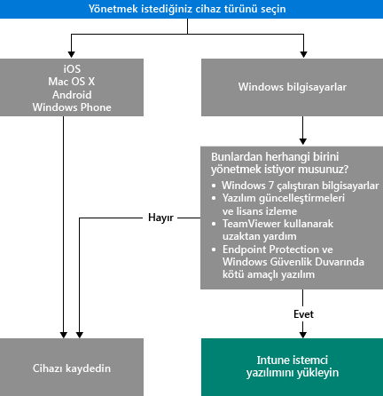

# Cihazların nasıl yönetileceğini seçme

Intune’un sunduğu uygulama yönetimi ve cihaz ayarlarının denetlenmesi gibi pek çok özellikten yararlanmak için cihazlarınızın *yönetilmesi* gerekir. Cihazları nasıl yönettiğiniz, kullanmak istediğiniz Intune özelliklerine bağlıdır.
Bu konu, gereksinimlerinizi karşılayan yöntemi seçmenize yardımcı olur.

iOS, Mac OS X, Android veya Windows Phone çalıştıran cihazları yönetmek için bunları *kaydetmeniz* gerekir.

Windows bilgisayarları yönetmek için iki seçeneğiniz vardır:

1. Cihazı kaydetme **veya**
2. *Intune yazılım istemcisini* yükleme.

## Kullanılacak yönteme karar verme
Cihazlarınızın nasıl yönetileceğine karar vermek için bu karar akışını kullanın.

Tam işlevsellik için Windows bilgisayarları kaydedin. Ancak, Intune yazılım istemcisi aşağıdaki durumlarda gereksinimlerinize daha uygun olabilir:

- Bilgisayar Windows 7 çalıştırıyorsa
- Windows yazılım güncelleştirmelerini ve lisans kullanımını yönetmek istiyorsanız
- Endpoint Protection ve Windows Güvenlik Duvarı ile kötü amaçlı yazılımı yönetmek istiyorsanız
- TeamViewer yazılımını kullanan kullanıcılara uzaktan yardım sağlamak istiyorsanız

Her yöntem ile elde edeceğiniz yönetim özelliklerinin ayrıntılı bir listesi için bkz. [Mobil cihaz yönetim özellikleri](mobile-device-management-capabilities-in-microsoft-intune.md) ve [Intune PC yazılım istemcisi özellikleri](windows-pc-management-capabilities-in-microsoft-intune.md).
Intune’un desteklediği cihazlar ve bilgisayarlar hakkında bilgi için bkz. [Desteklenen mobil cihazlar ve bilgisayarlar](/intune/get-started/supported-mobile-devices-and-computers)

## Exchange ActiveSync yönetimi
Cihazı kaydetmeye veya Intune yazılım istemcisini yüklemeye ek olarak cihazları [Exchange ActiveSync](/intune/deploy-use/mobile-device-management-with-exchange-activesync-and-microsoft-intune) ile de yönetebilirsiniz. Bu yöntem, Exchange Server’a bağlanmak için Şirket İçi Bağlayıcı’yı yüklemenizi veya yerleşik Hizmetten Hizmete Bağlayıcısı’nı kullanmanızı gerektirir.
Cihazları yönetmek için üçüncü seçenek olmasına rağmen, diğer yöntemler ile karşılaştırıldığında sınırlı sayıda yönetim özelliği sunar.

## Sonraki adımlar

- [Mobil cihazların nasıl kaydedileceğini belirleme](/intune/get-started/choose-how-to-enroll-devices1)
- [Intune bilgisayar istemci yazılımıyla Windows bilgisayarlarını yönetme](/intune/deploy-use/manage-windows-pcs-with-microsoft-intune)

- [Microsoft Intune ile Exchange ActiveSync mobil cihaz yönetimi](/intune/deploy-use/mobile-device-management-with-exchange-activesync-and-microsoft-intune).

<!--HONumber=Nov16_HO1-->

