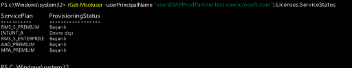

# Intune lisanslarını PowerShell kullanarak yönetme
Kullanıcıların Intune hizmetini kullanmak veya cihazlarını yönetime kaydetmek üzere oturum açabilmeleri için, öncelikle [Intune lisanslarını yönetme](start-with-a-paid-subscription-to-microsoft-intune-step-4.md) bölümünde açıklandığı gibi her bir kullanıcıya Intune aboneliğiniz için bir lisans atamanız gerekir. Ancak, Microsoft Enterprise Mobility + Security kullanan kuruluşların, yalnızca EMS paketinde Azure Active Directory Premium veya Intune hizmetleri gerektiren kullanıcıları olabilir. [Azure Active Directory PowerShell cmdlet’lerini](https://msdn.microsoft.com/library/jj151815.aspx) kullanarak hizmetlerin birini veya bir alt kümesini atayabilirsiniz.

EMS hizmetlerinin kullanıcı lisanslarını seçmeli atamak için, [Windows PowerShell için Azure Active Directory Modülü](https://msdn.microsoft.com/library/jj151815.aspx#bkmk_installmodule)’nün yüklü olduğu bilgisayarda bir yönetici olarak PowerShell’i açın. PowerShell’i yerel bilgisayara veya ADFS sunucusuna yükleyebilirsiniz.

Yalnızca istenen hizmet planları için geçerli olan yeni bir lisans SKU tanımı oluşturmalısınız. Bunu yapmak için, uygulamak istemediğiniz planları devre dışı bırakın. Örneğin, Intune lisansı atamayan bir lisans SKU tanımı oluşturabilirsiniz. Kullanılabilen hizmetlerin listesini görmek için şunu yazın:

    (Get-MsolAccountSku | Where {$_.SkuPartNumber -eq "EMS"}).ServiceStatus

Intune hizmet planını hariç tutmak için aşağıdaki komutu çalıştırabilirsiniz. Güvenlik grubunun tamamına yayılmak için aynı yöntemi kullanabileceğiniz gibi, daha ayrıntılı filtreler de kullanabilirsiniz.

**Örnek 1** Komut satırında yeni bir kullanıcı oluşturun ve lisansın Intune bölümünü etkinleştirmeden bir EMS lisansı atayın:

    Connect-MsolService

    New-MsolUser -DisplayName “Test User” -FirstName FName -LastName LName -UserPrincipalName user@<TenantName>.onmicrosoft.com –Department DName -UsageLocation US

    $CustomEMS = New-MsolLicenseOptions -AccountSkuId "<TenantName>:EMS" -DisabledPlans INTUNE_A
    Set-MsolUserLicense -UserPrincipalName user@<TenantName>.onmicrosoft.com -AddLicenses <TenantName>:EMS -LicenseOptions $CustomEMS

Şununla doğrulayın:

    (Get-MsolUser -UserPrincipalName "user@<TenantName>.onmicrosoft.com").Licenses.ServiceStatus

**Örnek 2** Zaten lisans atanmış bir kullanıcı için EMS lisansının Intune bölümünü devre dışı bırakın:

    Connect-MsolService

    Set-MsolUserLicense -UserPrincipalName user@<TenantName>.onmicrosoft.com -RemoveLicenses IAPProdPartnerTest:EMS

    $CustomEMS = New-MsolLicenseOptions -AccountSkuId "<TenantName>:EMS" -DisabledPlans INTUNE_A
    Set-MsolUserLicense -UserPrincipalName user@<TenantName>.onmicrosoft.com -AddLicenses <TenantName>:EMS -LicenseOptions $CustomEMS

Şununla doğrulayın:

    (Get-MsolUser -UserPrincipalName "user@<TenantName>.onmicrosoft.com" .Licenses.ServiceStatus

### Sonraki adımlar
Tebrikler! *Intune hızlı başlangıç kılavuzunun* 4. adımını tamamladınız.
>[!div class="step-by-step"]

>[&larr;**Kullanıcıları Intune ile eşitleme**](.\start-with-a-paid-subscription-to-microsoft-intune-step-2.md) [**Kullanıcıları ve cihazları düzenleme**&rarr;](.\start-with-a-paid-subscription-to-microsoft-intune-step-5.md)  

<!--HONumber=Nov16_HO4-->

