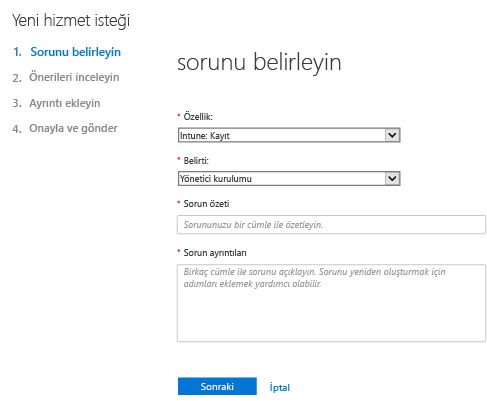
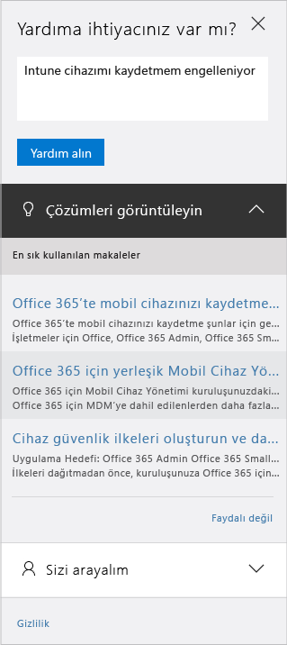

# Yöneticiler için Microsoft Intune desteği

[!INCLUDE[classic-portal](../includes/classic-portal.md)]

Microsoft, Intune için genel teknik, satış öncesi, faturalandırma ve abonelik desteği sağlar. Hem ücretli hem de deneme abonelikleri için çevrimiçi ve telefonla destek mevcuttur. İngilizce ve Japonca dillerinde çevrimiçi teknik destek kullanılabilir. Telefon desteği ve çevrimiçi faturalandırma desteği, ek dillerde mevcuttur.

Intune ve Configuration Manager ile kullanıldığında Intune için destek ücretsizdir. Premier Destek müşterilerinden yordam soruları (örneğin bir Intune özelliğinin nasıl yapılandırılacağı) için ücret alınır.

## Destek bileti açmadan yardım alma

Bir destek bileti oluşturmadan önce, yanıt aramak ve bilgi edinmek için aşağıdaki kaynaklara göz atın. Ek olarak, [Microsoft Intune için genel sorun giderme ipuçlarını](https://docs.microsoft.com/intune/troubleshoot/general-troubleshooting-tips-for-microsoft-intune) da inceleyebilirsiniz.

### Microsoft Intune TechNet forumları

Microsoft teknik uzmanlarına soru sorun veya bir tartışma başlatın! Arama yapabileceğiniz [Microsoft Intune TechNet Forumu’nda](https://social.technet.microsoft.com/Forums/home), sorunlarla ilgili yanıtlara ve bilgilere ulaşabilirsiniz.

### Microsoft Intune UserVoice ürün geri bildirimi sitesi

Intune’u daha da geliştirmek için Microsoft’un neler yapabileceğine ilişkin görüşleriniz mi var? Microsoft Intune [UserVoice](https://microsoftintune.uservoice.com/forums/291681-ideas) geri bildirim sitesine görüşlerinizi ekleyerek bize bildirin. Buradan ayrıca, diğerlerinin UserVoice’a eklediği görüşlere oy verebilirsiniz. 

## Çevrimiçi destek bileti oluşturma

Kendi kendine yardım kaynaklarını kullanarak yanıt bulamadığınız sorunlarınız için çevrimiçi destek bileti oluşturabilirsiniz.

Size daha iyi hizmet verebilmemiz için **lütfen her destek biletinde yalnızca bir soruna yer verin**. Bunu istememizin nedeni:

- Yardım sağlayan destek mühendisleri belirli alanlarda uzmanlaşmıştır. Dolayısıyla tek bir sorun belirttiğinizde, sorununuz konusunda uzman olan doğru kişiyi bulmak daha kolay olacaktır.
- Mühendislik ekipleri, sorunların en çok görüldüğü ürün alanlarında çalışmaya öncelik verebilir.
- Zorlu sorunları doğru kaynağa yönlendirmek daha kolaydır.

Destek bileti oluşturmadan önce lütfen [destek olayının tanımına](#definition-of-a-support-incident) göz atın.

**Çevrimiçi destek bileti oluşturmak için**:

1.  Intune kimlik bilgilerinizle [Office 365 yönetim merkezi](https://portal.office.com)’nde oturum açın.
    >[!NOTE]
    >
    >Premier Destek müşterileri, [Premier destek sayfası](https://support.microsoft.com/en-us/premier/contacts) üzerinden bir Intune destek bileti açabilir.

2.  **Yönetici** kutucuğunu seçin.
3.  Bileti açmak için solda **Destek** altından **Destek**'i seçin.

    

    >[!NOTE]
    >  100 veya daha az lisans içeren bir O365 hesabına sahip olan veya daha önce sahip olmuş müşteriler bu iletiyi görür. Bunu görürseniz, bkz. [Alternatif yöntemlerle bir destek bileti oluşturma](#create-a-support-ticket-with-alternate-methods).

    > 

    -   Faturalama, lisans ve hesap sorunları için **Faturalama ve ürün bilgileri**’ni seçin.

    -   Diğer tüm Intune sorunları için **Mobil cihaz yönetimi**’ni seçin.

    > [!NOTE]
    > Kategorilerin tümünü görmek için listenin en sonunda **diğer** öğesini seçmeniz gerekebilir.

3.  İsteğinizi açmak için yönergeleri izleyin.

### Alternatif yöntemlerle bir destek bileti oluşturma

Destek sayfanız aşağıdaki gibi görünüyorsa bu yordamı izleyin:

1. **Yardıma ihtiyacım var** öğesini seçin.
2. Metin kutusuna sorununuzun açıklamasını girin ve ardından **Yardım al**'ı seçin.

    

3. Önerilen çevrimiçi kaynakları inceleyin veya Microsoft Destek'ten bir çağrı almak için **Sizi arayalım** seçeneğini belirleyin.

## Telefon desteği alma
Ülke ve bölgeye göre destek telefon numaralarını, destek saatlerini ve her bölgede desteklenen dilleri gösteren liste için bkz. [Microsoft Intune için yardımlı telefon desteği ile iletişim kurun](contact-assisted-phone-support-for-microsoft-intune.md).

## Destek isteklerinizi izleme
1.  Intune kimlik bilgilerinizle [Office 365 yönetim merkezi](https://portal.office.com)’nde oturum açın.
2.  **Yönetici** kutucuğunu seçin.
3.  Solda **Destek**'in altından **Hizmet istekleri**'ni seçin. Ardından, isteklerinizi gözden geçirebilirsiniz.

Destek taleplerine ilk yanıtımız, sorunun önem derecesine bağlıdır. Önem derecesi en yüksek sorunlarda, Profesyonel müşterilerine ilk yanıtı iki saat içinde veririz. Premier Destek müşterileri için yanıt, destek sözleşmenize göre farklılık gösterecektir. Bunlar, aşağıdakilerin söz konusu olduğu durumlardır:

- Bir veya daha fazla hizmet erişilemez veya kullanılamaz durumda.
- Üretim, işlemler veya dağıtım son tarihlerini ciddi bir şekilde etkilenir veya üretim veya karlılık üzerinde ciddi bir etkisi olacaktır.
- Birden çok kullanıcı ve hizmet etkilenir.

Orta önem derecesindeki sorunlarda, Profesyonel müşterilerine ilk yanıtı dört saat içinde veririz. Premier Destek müşterileri için yanıt, destek sözleşmenize göre farklılık gösterecektir.  Bunlar, aşağıdakilerin söz konusu olduğu durumlardır:

- Hizmet kullanılıyor ancak her zamanki gibi çalışmıyor.
- Durum orta düzeyde iş etkisine sahiptir ve iş saatleri boyunca ele alınabilir.
- Tek bir kullanıcı, müşteri veya hizmet kısmen etkilenir.

Diğer sorunlarda, Profesyonel müşterileri için ilk yanıtı sekiz saat içinde veririz. Premier Destek müşterileri için yanıt, destek sözleşmenize göre farklılık gösterecektir.  Bunlar, aşağıdakilerin söz konusu olduğu durumlardır:

- Durum en düşük seviyede iş etkisine sahiptir.
- Sorun önemlidir ancak müşteri için acil, önemli bir hizmet ya da üretkenlik etkisi yoktur.
- Tek bir kullanıcı kısmi kesinti yaşar, ancak kabul edilebilir bir çözüm yok.

> [!NOTE]
> **Microsoft System Center Configuration Manager** veya **Microsoft System Center Endpoint Protection kullanıyorsanız:** Configuration Manager veya Endpoint Protection ile ilgili teknik destek için iş ortağınızla iletişim kurun veya [Microsoft System Center Configuration Manager ve System Center Endpoint Protection Çözüm Merkezi](http://www.microsoft.com/en-us/server-cloud/products/system-center-2012-r2/resources.aspx)'ni ziyaret ederek zengin yardım malzemelerini bulun. Ayrıca, çevrimiçi ya da telefon üzerinden destek isteği açma seçeneği de sunar.
>
> System Center Configuration Manager veya System Center Endpoint Protection için teknik destek, ödeme gerektirir ya da var olan lisansınızdan veya Premier Destek sözleşmelerinden düşülür.

## Toplu lisanslama için destek bulun
Daha önce Microsoft'tan bir toplu lisanslama programı kapsamında lisans atın aldıysanız destek için aşağıdaki kaynakları kullanın:

-   Lisanslar ve anahtarları bulmayla ilgili destek için bkz. [Toplu Lisanslama Hizmet Merkezi](http://go.microsoft.com/fwlink/p/?LinkID=282016).

-   Faturalama soruları için bkz. [Faturalama ve abonelik yönetimi desteği](http://support.microsoft.com/oas/default.aspx?prid=15371).

-   Toplu lisanslama hakkında genel bilgi için bkz. [Toplu lisanslama](http://go.microsoft.com/fwlink/p/?LinkID=282015).

## Destek olayının tanımı

Destek olayı, tek bir destek sorunu ve bu sorunu çözmek için gereken çalışma olarak tanımlanır. Bir destek sorunu, alt sorunlara ayrılamaz. Alt sorunlar mevcutsa, her alt sorun ayrı bir olay olarak değerlendirilir. Mevcut bir sorunu çözmek için birden çok kişi ve çevrimdışı araştırma gerekebilir. Çözüm sunmak için harcanan süre, ücretlendirmenize yansıtılmaz.

Microsoft Intune ve Office 365 için Mobil Cihaz Yönetimi aboneliklerine “onarım” desteği dahildir, bu nedenle ek destek olayları açıldığında hiçbir zaman ek ücret uygulanmaz.

Bir destek mühendisi sizden ek sorunlar için ek destek olayları açmanızı isterse, bunun herkes için daha yararlı bir çözüm olacağını lütfen unutmayın. Anlayışınız ve sizlere birinci sınıf destek hizmeti sunmamıza yardımcı olduğunuz için teşekkürler!

Olay başına uygulanan ücretler ve önem derecesi düzeyleri için bkz. [Profesyonel Destek Seçenekleri](https://support.microsoft.com/gp/offerprophone).

<!--HONumber=Jan17_HO4-->

