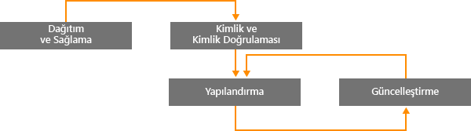
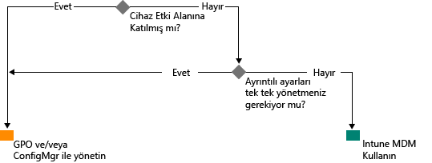

# Microsoft Intune ile Modern Windows yönetimi yolu

Kişisel cihazların iş için kullanılması ve ofis dışında görev yapan çalışanlar, kuruluşların cihazları yönetme şeklini değiştirmektedir. Bazı kuruluşların belirli bölümleri cihazlar üzerinde derinlemesine, ayrıntılı denetimler gerektirse de, diğer kuruluşlar modern iş gücünü destekleyen hafif, senaryo tabanlı yönetimi benimsemektedir.

Windows 10, Windows’un kuruluşlar için en iyi yönetilen işletim sistemini sunma geleneğini sürdürüyor. Windows, Grup İlkesi, Active Directory ve System Center Configuration Manager gibi teknolojilerle derin yönetilebilirlik ve güvenlik için destek sağlar. Ayrıca Microsoft Enterprise Mobility Suite (EMS) gibi bulut tabanlı cihaz yönetimi çözümleri kullanan basitleştirilmiş, modern yönetime yönelik "mobil ve bulut öncelikli" bir yaklaşım sunar. Hizmet olarak Windows aracılığıyla sunulan geleceğin Windows yenilikleri Microsoft Intune, Azure Active Directory, Azure Rights Management Hizmeti, Office 365 ve İş İçin Windows Mağazası gibi hızla değişen bulut hizmetleriyle tamamlanır.

BT kuruluşları, yenilikten faydalanma fırsatları ve tasarruflarla daha fazla esnekliğe sahip olu. Bu belge, Windows 10’u dağıtma ve yönetme stratejileri hakkında yönergeler sunar. Ayrıca, Microsoft’un cihaz yönetimi araçları hakkındaki stratejik düşüncesine ilişkin bilgiler sağlar. Yönetimin temelleri ve bunları farklı cihazlara nasıl uygulamak istediğiniz hakkında düşündüğünüzde cihaz yaşam döngüsünün dört aşamasını göz önünde bulundurun:

## Geliştirme ve sağlama

Karmaşık BT işlemleri gerektiren geleneksel İşletim Sistemi dağıtımının aksine, modern cihaz yönetimi “sıra dışı yönetimin” kapılarını aralar. BT departmanı yeni cihazları yeniden görüntüleme olmadan tamamen yapılandırılmış, tamamen yönetilen cihazlara dönüştürmek ister.  Dinamik sağlama, Microsoft Intune gibi bulut tabanlı cihaz yönetimi hizmetleri sayesinde her zamankinden daha kolaydır. Ayrıca, Windows Görüntüleme ve Yapılandırma Tasarımcısı (ICD) ile oluşturulan bağımsız sağlama paketleri de oluşturabilirsiniz. Kuruluşların System Center Configuration Manager kullanarak özel görüntüler dağıtabilmesi için geleneksel görüntüleme tekniklerini desteklemeye de devam edeceğiz.

## Kimlik ve Kimlik Doğrulama

Windows 10 ve Azure Active Directory gibi hizmetler bulut tabanlı kimlik, kimlik doğrulama ve yönetim için yeni olanaklar sağlar. KCG ve CYOD gibi senaryolar, kullanıcıların şirket kaynaklarına ve uygulamalarına nasıl eriştiğini kuruluşların yeniden düşünmesine olanak sağlamaktadır. Kullanıcı ve cihaz yönetimini şu iki kategoride düşünebilirsiniz:

- Office 365 gibi SaaS uygulamaları için mobil kullanıcılar tarafından kullanılan şirket cihazları (CYOD) veya kişisel (KCG) cihazlar.

  Windows 10, çalışanların kendi sağladıkları cihazlara olanak tanır. Azure AD Join ile şirket cihazlarında şirket erişimi kolayca ayarlanabilir. Benzer şekilde, yeni ve basitleştirilmiş bir KCG deneyimi, kullanıcıların iş hesaplarını Windows’a eklemesine ve iş kaynaklarına kişisel cihazlarından erişmesine olanak sağlar. Azure AD Join ve otomatik Intune MDM kaydı, [kolay bir adımla](https://blogs.technet.microsoft.com/ad/2015/08/14/windows-10-azure-ad-and-microsoft-intune-automatic-mdm-enrollment-powered-by-the-cloud/) cihazları şirket tarafından yönetilen duruma getirir ve bunu tamamen buluttan yapar. Azure AD Join ayrıca geçici personel, iş ortakları veya diğer yarı zamanlı çalışanlar için de harika bir çözümdür. Bu hesaplar şirket içi AD etki alanından ayrı tutulabilir ancak gerekli şirket kaynaklarına yine de erişebilirler.
- Kimlik doğrulaması gerektiren veya şirket içinde çok hassas veya gizli kaynaklara erişen geleneksel uygulamalar ve kaynaklar kullanan etki alanına katılmış bilgisayarlar ve tabletler

  Şirket içi Active Directory etki alanına katılan Windows 10 cihazlar Azure AD’ye otomatik olarak kaydedilir; böylece kullanıcılar bulutta ve şirket içi kaynaklarda her yerden çoklu oturum açma, ayarların kurumsal dolaşımı, İş için Microsoft Passport ve Windows Hello gibi ek Windows 10 deneyimlerinden faydalanabilirler. Etki alanına katılmış bilgisayar ve tabletler System Center Configuration Manager istemcisi veya Grup İlkesi ile yönetilmeye devam edecektir.

Kuruluşunuzdaki rolleri gözden geçirin. Etki Alanına Katılım gerektiren kullanıcıları veya cihazları tanımlayın veya diğerlerini Azure AD’ye geçirmeyi düşünün. Windows 10 ve Azure AD’nin cihazlar ve senaryoların bir bileşimiyle iş kaynaklarına erişimi nasıl en iyi hale getirdiği hakkında daha fazla bilgi için [bu makaleyi](https://azure.microsoft.com/en-us/documentation/articles/active-directory-azureadjoin-windows10-devices/) okuyabilirsiniz.

Genelleştirilmiş bir karar ağacı aşağıdaki gibi görünebilir. Bazı durumlarda istisnalar geçerli olacaktır.

## Ayarlar ve Yapılandırma

Yapılandırma gereksinimleri; gereken yönetim düzeyi, yönetilen cihazlar ve veriler, sektör gereklilikleri gibi unsurların tümü tarafından belirlenebilir. Bu arada, çalışanlar BT departmanının kendi cihazlarına katı ilkeler uygulamasından dolayı daha fazla kaygı duymakta, ancak yine de şirket e-posta ve belgelerine erişmek istemektedirler. Windows 10, ortak bir MDM katmanı aracılığıyla bilgisayarlar, tabletler ve telefonlar arasında tutarlı yapılandırma kümeleri sağlar. MDM yaklaşımı, her olası ayarı göstermeden yöneticinin amacını karşılayan ayarlar gerektirir. Buna karşılık, Grup İlkesi, yöneticinin bireysel olarak denetlediği hassas ayarları gösterir. MDM’in yararlarından bir diğeri yöneticilerin daha hafif ve daha verimli araçlarla daha kapsamlı gizlilik, güvenlik ve uygulama yönetimi ayarları uygulamasına olanak tanımasıdır. Bu, MDM’i sürekli hareket halinde olan cihazlar için en iyi seçenek haline getirir.

Birçok kuruluşun, Internet Explorer'ın yapılandırılabilir 1500 Grup İlkesi ayarları veya belirli Windows Güvenlik duvarı kuralları gibi etki alanına katılmış bilgisayarları hâlâ ayrıntılı düzeyde yönetmesi gerekir. Bu durumlarda, Grup İlkesi ve System Center Configuration Manager harika yönetim seçenekleri olmaya devam etmektedir. Grup İlkesi, Windows tabanlı araçlar kullanarak şirket ağına bağlanan etki alanına katılan Windows bilgisayarları ve tabletleri ayrıntılı olarak yapılandırmak için en iyi yoldur. Microsoft, Windows’un her yeni sürümünde Grup İlkesi ayarları eklemeyi sürdürür. Güçlü yazılım dağıtımı ile ayrıntılı yapılandırma için Windows güncelleştirmeleri, işletim sistemi dağıtımı içinse Configuration Manager önerilen çözüm olmayı sürdürür.

## Windows cihazları güncelleştirme

Hizmet olarak Windows sayesinde BT kuruluşlarının artık her yeni Windows sürümü ile karmaşık görüntüleme (sil ve yükle) işlemleri gerçekleştirmesi gerektirmez. Geçerli dalda (CB) ya da iş için geçerli dalda (CBB), cihazlar en son özellik ve kalite güncelleştirmelerini basit (genellikle otomatik) düzeltme işlemleri ile alır. Intune ile MDM, Windows güncelleştirmelerini kuruluştaki istemci bilgisayarlarına uygulamak için araçlar sağlar. Configuration Manager, bu güncelleştirmelerin bakım pencereleri ve otomatik dağıtım kuralları gibi zengin yönetim ve izleme özelliklerine olanak tanır.

## Özet

Kuruluşunuzda modern cihaz yönetimine giden yolu düşündüğünüzde, yolculuğunuza başlamak için atabileceğiniz adımları göz önünde bulundurun.

1. **Bazı yatırımları bugünden yapabilirsiniz.** Hangi geleneksel cihaz yönetimi bileşenlerini elinizde tutmalı, hangilerini modernleştirmelisiniz? Özel görüntülemeyi en aza indirmek, ayarlar yönetimini yeniden değerlendirmek ya da kimlik doğrulaması ve uyumluluğunu yeniden değerlendirmek gibi konuların hangisine eğilirseniz eğilin, avantajları anında edinirsiniz.

2. **Ortamınızdaki farklı kullanım durumlarını değerlendirin.** Daha hafif, basitleştirilmiş yönetimin fayda sağlayacağı cihaz grupları mevcut mu? Örneğin KCG cihazları, bulut tabanlı yönetim için olağan adaylardır. Daha sıkı düzenlemelere tabi verileri işleyen kullanıcılarda veya cihazlarda kimlik doğrulaması için şirket içi AD etki alanı gerekebilir. Configuration Manager ve EMS farklı cihazları iş ihtiyaçlarınıza en uygun olacak şekilde hedeflerken size modern yönetim senaryolarını uygulama esnekliği sağlar. Seçim sizin.

## Bundan Sonra Yapılması Gerekenler

- **Ortamınızdaki yönetim gereksinimlerini değerlendirin.** Kişilere, kişilerin hareketliliklerine, cihazlara ve cihazların eriştikleri verilere bağlı olarak tüm ihtiyaçlarınızı tek bir çözüm karşılamayabilir.
- **Gereksinimleri dikkate alın.** Windows 10, Configuration Manager ve Enterprise Mobility Suite ile her senaryo için görüntülemeyi, kimlik doğrulamayı, ayarları ve yönetim araçlarını işleme esnekliğine sahip olursunuz.
- **Küçük adımlar atın.** Modern cihaz yönetimine geçişin bir gecede olması gerekmez.
- **Mevcut yatırımlarınızı en iyi duruma getirin.** Şirket içi yönetimden modern bulut tabanlı yönetime geçiş yolunda Configuration Manager ve Intune’un esnek, karma mimarisinden yararlanın. Bulut-kimlik/MDM modelinde ek özellikler kullanılabilir hale geldikçe, Microsoft geleneksel yönetimden modern yönetime net bir geçiş yolu sağlamaya odaklanmıştır.

<!--HONumber=Sep16_HO2-->

